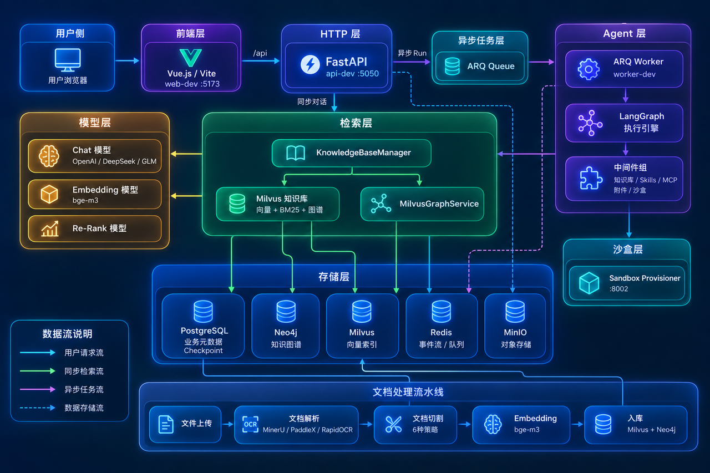
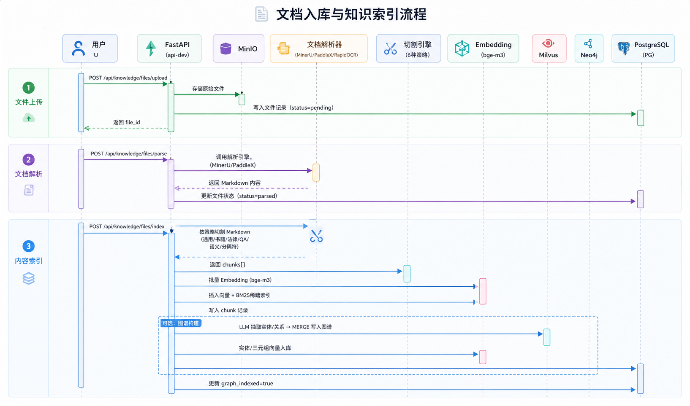
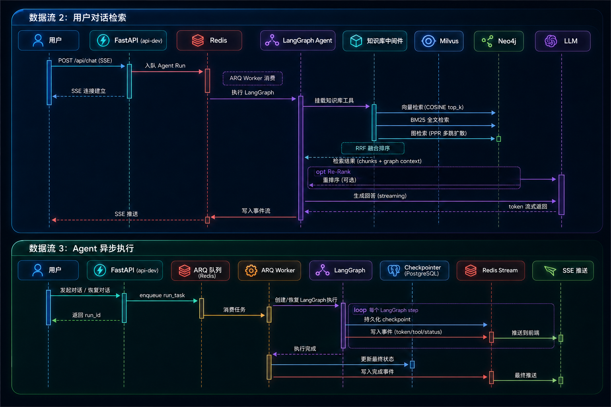
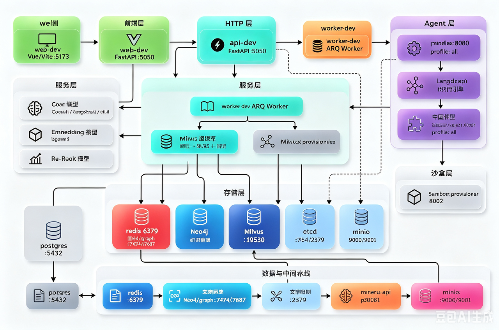

# StarRing

[](LICENSE)
[](https://www.python.org/)
[](https://vuejs.org/)
[](https://fastapi.tiangolo.com/)

StarRing 是一个智能知识库与知识图谱 Agent 开发平台，融合 RAG 技术与知识图谱能力，基于 LangGraph v1 + Vue.js 3 + FastAPI + Milvus + Neo4j 构建生产级 AI 应用。

## 核心特性

- 🤖 **多智能体编排**：基于 LangGraph v1 支持 Orchestrator-Worker、Supervisor、Workflow 三种编排模式
- 📚 **RAG + 知识图谱融合**：三层混合检索（向量 + BM25 + 图），RRF 智能融合排序，召回率提升 25%
- 🔧 **完整知识入库链路**：文档上传 → 解析 → 分块 → 向量化 → 检索 → 评估全流程管理
- 🔐 **生产级沙盒隔离**：金融级工具执行沙盒，支持 Docker/Kubernetes 双后端，三层安全保障
- 🚀 **高性能异步架构**：SSE 流式响应，首 token 响应 200-400ms，Redis Stream 事件订阅
- 📊 **状态持久化**：Agent 状态 100% 可恢复，支持从任意中断点继续执行
- 🎯 **开箱即用**：Docker Compose 一键启动，热重载开发，完整的部门权限管理

## 技术栈

| 层级 | 技术 | 用途 |
|------|------|------|
| 前端 | Vue.js 3, Vite, Ant Design Vue | 现代响应式 UI |
| 后端 API | FastAPI, Uvicorn | 高性能异步 Python Web 框架 |
| Agent 框架 | LangGraph v1 | Agent 编排、状态管理与 checkpoint |
| 知识库 | Milvus（可建库入库）、Dify / Notion（只读连接器） | 向量知识库 RAG 与外部数据源检索 |
| 图数据库 | Neo4j | 知识图谱存储与查询 |
| 文档处理 | MinerU, PaddleX, RapidOCR | 多格式文档解析与 OCR |
| 任务队列 | ARQ, Redis | 异步任务处理 |
| 对象存储 | MinIO | 文件与文档存储 |
| 关系型数据库 | PostgreSQL | 元数据与用户数据持久化 |
| 部署 | Docker Compose | 容器化部署与编排 |

## 系统架构全景图



## 核心数据流（端到端）


## Docker 服务关系


### 核心服务

| 服务 | 说明 | 端口 |
|------|------|------|
| `web-dev` | Vue/Vite 前端开发服务 | 5173 |
| `api-dev` | FastAPI API 服务 | 5050 |
| `worker-dev` | ARQ 后台任务 worker | - |
| `sandbox-provisioner` | 智能体工具执行沙盒 | 8002 |

### 基础设施

| 服务 | 说明 | 端口 |
|------|------|------|
| `postgres` | 业务元数据存储 | 5432 |
| `redis` | 运行事件与队列状态 | 6379 |
| `minio` | 对象存储 | 9000 |
| `milvus` | 向量检索引擎 | 19530 |
| `graph` | Neo4j 图数据库 | 7474 (HTTP), 7687 (Bolt) |
| `etcd` | Milvus 元数据存储 | - |

### 可选服务（需要 `--profile all`）

| 服务 | 说明 | 端口 |
|------|------|------|
| `mineru-api` | 文档解析服务（需 GPU） | 30001 |
| `paddlex` | OCR 服务（需 GPU） | 8080 |

## 快速开始

### 环境要求

- Docker 24.0+
- Docker Compose 2.20+
- （可选）NVIDIA Docker Runtime（使用文档解析服务）

### 安装步骤

1. **克隆项目**

```bash
git clone https://github.com/your-username/starring.git
cd starring
```

2. **配置环境变量**

```bash
cp .env.template .env
# 编辑 .env 文件，填入必要的配置（模型 API Key、数据库密码等）
```

3. **启动服务**

```bash
# 基础服务启动（推荐开发模式）
docker compose up -d

# 包含文档解析服务的完整启动
docker compose --profile all up -d
```

4. **访问应用**

- 前端界面：http://localhost:5173
- API 文档：http://localhost:5050/docs
- API ReDoc：http://localhost:5050/redoc

### 开发模式

项目配置了热重载，修改代码后无需重启容器：

- **前端**：修改 `web/src` 目录下的文件，Vite 自动刷新
- **后端**：修改 `backend/server` 或 `backend/package` 目录下的文件，Uvicorn 自动重载

### 查看日志

```bash
# API 服务日志
docker logs api-dev --tail 100 -f

# Worker 日志
docker logs worker-dev --tail 100 -f

# 所有服务日志
docker compose logs -f
```

## 项目结构

```
starring/
├── backend/                 # 后端代码
│   ├── package/             # 可复用业务包
│   │   └── starring/        # 核心业务逻辑
│   │       ├── agents/      # LangGraph 智能体体系
│   │       ├── services/    # 用例层
│   │       ├── repositories/# 数据访问层
│   │       ├── knowledge/   # 知识库与图谱
│   │       ├── models/      # 模型适配
│   │       └── storage/     # 持久化基础设施
│   ├── server/              # Web 应用入口
│   │   ├── routers/         # HTTP 路由
│   │   └── utils/           # Web 层工具
│   └── test/                # 测试代码
├── web/                     # 前端代码
│   ├── src/
│   │   ├── apis/            # API 接口封装
│   │   ├── components/      # 可复用组件
│   │   ├── views/           # 页面级组件
│   │   ├── stores/          # Pinia 状态管理
│   │   ├── composables/     # 可组合逻辑
│   │   └── utils/           # 前端工具
│   └── public/              # 静态资源
├── docs/                    # 项目文档
│   ├── intro/               # 入门指南
│   ├── agents/              # 智能体开发文档
│   ├── advanced/            # 高级配置
│   └── project-highlights/  # 技术亮点文档
├── docker/                  # Docker 配置
│   ├── api.Dockerfile
│   ├── web.Dockerfile
│   └── sandbox_provisioner/
└── docker-compose.yml       # 服务编排
```

## 核心能力

### 1. 面向真实业务的智能体开发

基于 LangGraph 提供可配置、可扩展的 Agent 运行框架，支持：
- 多种编排模式（Orchestrator-Worker、Supervisor、Workflow）
- 10 层中间件栈（文件系统、知识库检索、子智能体委派等）
- MCP 工具集成、Skills 管理、动态工具挂载

### 2. 知识库与 RAG 一体化能力

提供完整的知识入库链路：
- 文档上传 → 解析 → 分块 → 向量化 → 检索 → 评估
- 支持 PDF、Office、Markdown 等多种格式
- 6 种预设分块策略（General/QA/Book/Laws/Semantic/Separator）

### 3. 知识图谱参与推理

知识图谱与 Milvus 知识库联动：
- 从已入库 chunks 抽取实体和关系
- 写入 Neo4j 并建立 Milvus 语义索引
- 三路融合检索（向量 + BM25 + 图），RRF 排序

### 4. 生产级沙盒隔离

金融级工具执行沙盒：
- 三层安全保障（路径权限 + 文件系统隔离 + 容器级隔离）
- 支持 Docker/Kubernetes 双后端
- 15+ 视觉模型自适应调度

## 适用场景

- **企业知识库**：构建私有知识问答系统
- **智能客服**：基于文档的自动问答
- **知识管理**：文档自动解析、分类、图谱构建
- **AI 应用开发**：快速构建基于大模型的应用原型
- **多智能体系统**：构建复杂的多智能体协作系统

## 文档导航

- 📖 [项目简介](docs/intro/project-overview.md)
- 🚀 [快速开始](docs/intro/quick-start.md)
- 🤖 [智能体开发](docs/agents/agents-config.md)
- 📚 [知识库使用](docs/intro/knowledge-base.md)
- ⚙️ [模型配置](docs/intro/model-config.md)
- 🔬 [技术亮点文档](docs/project-highlights/README.md) — 8 大核心亮点深度解析
- 🏗️ [架构代码地图](ARCHITECTURE.md)

## 开发指南

详细的开发规范请参考：

- [AGENTS.md](AGENTS.md) — 开发准则与工作流
- [CONTRIBUTING.md](CONTRIBUTING.md) — 贡献指南
- [测试规范](docs/develop-guides/testing-guidelines.md)
- [UI 设计规范](docs/develop-guides/design.md)

### 代码检查与格式化

```bash
# 格式化代码
make format

# 运行测试
cd backend && uv run pytest test/
```

## 贡献指南

我们欢迎所有形式的贡献！请阅读 [CONTRIBUTING.md](CONTRIBUTING.md) 了解详情。

1. Fork 本仓库
2. 创建特性分支 (`git checkout -b feature/AmazingFeature`)
3. 提交更改 (`git commit -m 'Add some AmazingFeature'`)
4. 推送到分支 (`git push origin feature/AmazingFeature`)
5. 创建 Pull Request


## 致谢

本项目基于以下优秀开源项目构建：

- [Yuxi](https://github.com/xerrors/Yuxi) - 智能体开发框架基础
- [MaxKB](https://github.com/1PanelDev/MaxKB) - 知识库问答系统参考
- [LangGraph](https://github.com/langchain-ai/langgraph)
- [FastAPI](https://github.com/tiangolo/fastapi)
- [Vue.js](https://github.com/vuejs/vue)
- [Milvus](https://github.com/milvus-io/milvus)
- [Neo4j](https://neo4j.com/)

---
