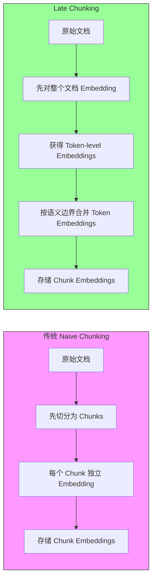
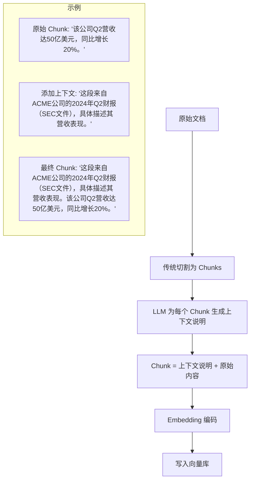
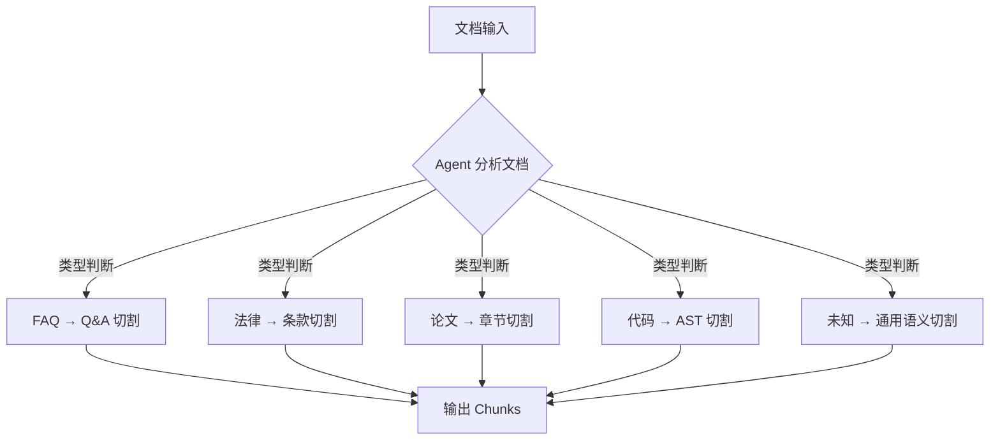
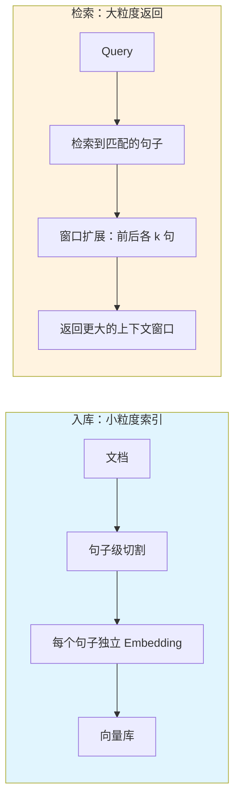
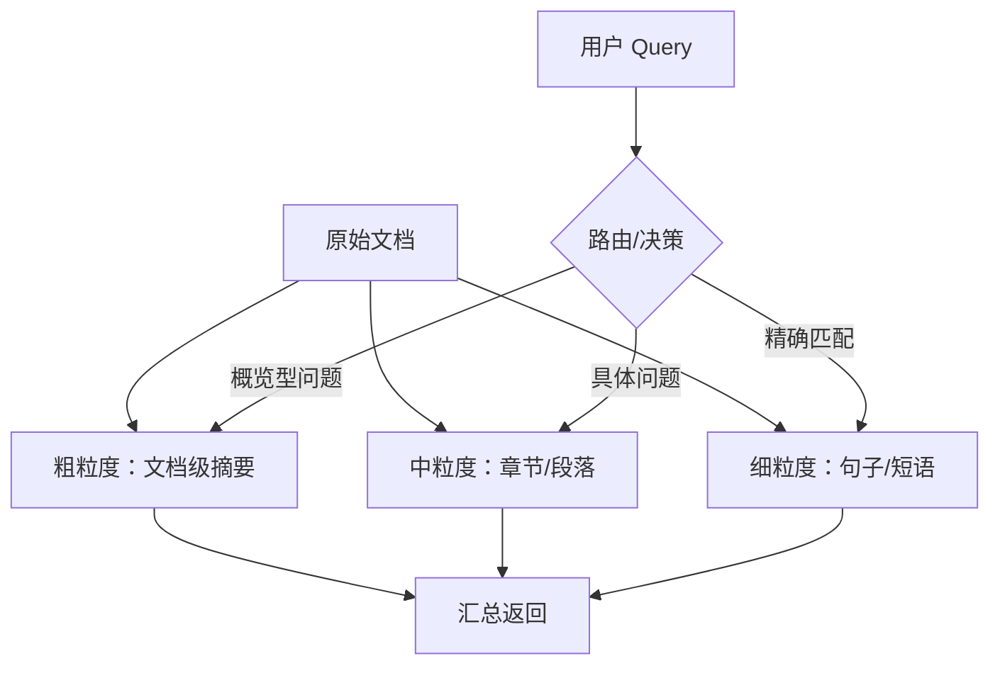

# 01-文档切割最佳实践

> 文档切割（Chunking）是 RAG 系统的起点，切割质量直接决定后续检索和生成的"天花板"。
> 本文梳理 2024-2025 年行业前沿的切割方案，并与 StarRing 当前实现进行对比。

## 目录

- [一、Late Chunking（Jina AI）](#一late-chunkingjina-ai)
- [二、Contextual Retrieval（Anthropic）](#二contextual-retrievalanthropic)
- [三、Agentic Chunking](#三agentic-chunking)
- [四、Sentence Window Retrieval](#四sentence-window-retrieval)
- [五、多粒度索引](#五多粒度索引)
- [六、对比 StarRing 现状](#六对比-starring-现状)
- [七、优化建议](#七优化建议)

---

## 一、Late Chunking（Jina AI）

### 1.1 提出背景

**出处**：Jina AI，论文 [arxiv 2409.04701](https://arxiv.org/abs/2409.04701)，2024 年 9 月。

传统 RAG 的切割流程是"先切分、再 Embedding"（Naive Chunking）。这种做法有一个根本性问题：**每个 chunk 独立编码，无法感知文档级上下文**。比如一个 chunks 中提到"该公司"，embedding 模型无法知道"该公司"指的是文档标题中的"阿里巴巴集团"。

### 1.2 核心思想

Late Chunking 的关键思路是 **先对整个文档做 Embedding，再按语义边界切分**。具体流程：



**关键优势**：每个 chunk 的 embedding 包含了其原始文档的全局上下文信息，使得 chunk 即使被单独检索出来，其向量表示也比传统方案更准确。

### 1.3 技术要点

```python
# 概念示例：Late Chunking 的核心逻辑
def late_chunking(document: str, model):
    """
    Late Chunking 流程：
    1. 整篇文档一起编码，获取 token-level embeddings
    2. 在 embedding 空间中按语义边界切分
    3. 每个 chunk embedding = 其 token embeddings 的池化
    """
    # Step 1: 整篇文档编码
    token_embeddings = model.encode(document, return_tokens=True)
    # shape: [num_tokens, embedding_dim]

    # Step 2: 按语义边界定位切分点（通过句子边界或相似度变化检测）
    boundaries = detect_semantic_boundaries(token_embeddings)

    # Step 3: 按边界对 token embeddings 做池化
    chunk_embeddings = []
    for start, end in boundaries:
        chunk_emb = mean_pool(token_embeddings[start:end])
        chunk_embeddings.append(chunk_emb)

    return chunk_embeddings
```

**Jina 的实验结果**（BeIR 基准测试）：
- Naive Chunking NDCG@10：0.48
- Late Chunking NDCG@10：0.56（**提升约 17%**）
- 长文档场景提升更明显，可达 15-25%

### 1.4 适用场景

- 长文档（>10 页）的知识库构建
- 专业领域文档（法律合同、技术手册）
- 需要跨 Chunk 上下文理解的场景

---

## 二、Contextual Retrieval（Anthropic）

### 2.1 提出背景

**出处**：Anthropic，2024 年 9 月官方博客发布。

Anthropic 发现传统 RAG 的一个核心痛点：**chunk 脱离原始上下文后语义不完整**。例如，一个 FAQ 页面中某条回答单独出现时，读者不知道它回答的是哪个问题；一份财报中某段数字单独出现时，读者不知道它属于"Q2 收入"还是"全年成本"。

### 2.2 核心思想

**为每个 chunk 前置一段 LLM 生成的上下文说明**，使其即使脱离原文也能被正确理解。



### 2.3 实验数据

Anthropic 在内部数据集上的实验结果（检索失败率越低越好）：

| 方案 | 检索失败率 | 相对提升 |
|------|-----------|----------|
| Baseline（传统 Embedding） | 5.7% | - |
| + Contextual Embeddings | 2.9% | ↓49% |
| + Contextual BM25 | 2.3% | ↓60% |
| + Contextual Embeddings + Contextual BM25 + Reranker | **1.9%** | **↓67%** |

**关键启示**：Contextual BM25 的叠加效果甚至超过了单独加 Contextual Embeddings——说明上下文增强不仅有利于语义检索，还能让关键词检索命中更准。

### 2.4 实现要点

```python
# Anthropic Contextual Retrieval 的 Prompt 模板
CONTEXTUAL_CHUNK_PROMPT = """<document>
{document_content}
</document>

Here is the chunk we want to situate within the whole document:
<chunk>
{chunk_content}
</chunk>

Please give a short succinct context to situate this chunk within the overall document
for the purposes of improving search retrieval of the chunk.
Answer only with the succinct context and nothing else."""


async def generate_chunk_context(chunk: str, document: str, llm) -> str:
    """为 chunk 生成上下文说明"""
    prompt = CONTEXTUAL_CHUNK_PROMPT.format(
        document_content=document,
        chunk_content=chunk,
    )
    context = await llm.generate(prompt)
    return context.strip()


def build_contextual_chunk(original_chunk: str, context: str) -> str:
    """将上下文说明与原始 chunk 合并"""
    return f"{context}\n\n{original_chunk}"
```

### 2.5 成本估算

- 按 Anthropic 的报告，每 1M token 的上下文生成成本约 $1-2（使用 Claude 3 Haiku 等低成本模型）
- 对于 100 万份文档（每份 100 个 chunk），额外成本约 $100-200
- 相比检索质量的大幅提升，投入产出比极高

---

## 三、Agentic Chunking

### 3.1 提出背景

**出处**：LangChain / LlamaIndex 社区实践，2024 年兴起。

传统切割策略是"预设的"——工程师预先选择一种策略（按长度、按分隔符、按语义），对所有文档一视同仁。但不同文档的最佳切割方式可能完全不同：FAQ 应该按 Q&A 对切，法律文档应该按条款切，技术文档应该按章节切。

### 3.2 核心思想

**用 Agent 动态决定每篇文档的切割策略**：Agent 先读取文档内容，判断文档类型和结构，然后决定最佳切割方式。



### 3.3 实现思路

```python
class AgenticChunker:
    """Agentic Chunking：用 Agent 动态决定切割策略"""

    async def chunk(self, document: str, llm) -> list[str]:
        # Step 1: Agent 分析文档类型和结构
        analysis = await llm.analyze(
            prompt="分析以下文档的类型、结构和最佳切割方式",
            document=document,
            max_tokens=200,
        )

        # Step 2: 根据分析结果选择切割策略
        strategy = self._select_strategy(analysis)

        # Step 3: 执行切割
        chunks = strategy.chunk(document)

        # Step 4: Agent 评估切割质量，必要时调整
        eval_result = await llm.evaluate(
            prompt="评估以下切割结果的质量",
            chunks=chunks,
        )

        if eval_result["needs_adjustment"]:
            chunks = strategy.adjust(chunks, eval_result["suggestions"])

        return chunks
```

### 3.4 适用场景

- 混合文档类型的知识库（同时包含 FAQ、API 文档、设计文档等）
- 需要自动化文档处理的场景
- 文档结构不规范、难以用预设规则覆盖的情况

---

## 四、Sentence Window Retrieval

### 4.1 提出背景

**出处**：LlamaIndex 提出并内置支持，2024 年。

传统 RAG 中，为了检索精度会使用小粒度 chunk（如句子级），但小 chunk 缺乏上下文，LLM 难以基于它生成完整回答。**检索小块、返回大块** 是解决这个矛盾的有效方案。

### 4.2 核心思想



**核心参数**：
- `chunk_size`：索引粒度（如 128 tokens/句）
- `window_size`：窗口扩展大小（如前后各 1 句，则返回 3 句的上下文）
- `window_metadata_key`：窗口信息存储字段

### 4.3 实现示例

```python
class SentenceWindowRetriever:
    def __init__(self, chunk_size: int = 128, window_size: int = 2):
        self.chunk_size = chunk_size
        self.window_size = window_size

    def build_index(self, document: str, embed_model) -> list[dict]:
        """用小粒度构建索引"""
        sentences = self._split_to_sentences(document)
        chunks = []
        for i, sentence in enumerate(sentences):
            # 记录窗口信息
            window_start = max(0, i - self.window_size)
            window_end = min(len(sentences), i + self.window_size + 1)
            chunk = {
                "content": sentence,                    # 仅用句子做索引
                "embedding": embed_model.encode(sentence),
                "window_text": " ".join(sentences[window_start:window_end]),  # 保留窗口上下文
                "sentence_index": i,
            }
            chunks.append(chunk)
        return chunks

    def retrieve(self, query: str, top_k: int = 5) -> list[str]:
        """检索时返回完整窗口"""
        hits = self._search(query, top_k)
        # 返回窗口文本而非单句
        return [hit["window_text"] for hit in hits]
```

### 4.4 优势

- 检索精度高（小粒度索引，精确匹配）
- 生成质量好（大窗口上下文，LLM 有充分背景信息）
- 实现简单，容易集成

---

## 五、多粒度索引

### 5.1 提出背景

**出处**：学术研究与工业实践，多篇论文提及，2023-2024 年。

不同查询需要的检索粒度不同："中国 GDP 是多少？"只需要一句话，"总结本文的论点"需要整篇文档的摘要。"多粒度索引"同时建立多层次的索引体系。

### 5.2 核心思想



### 5.3 实现

```python
class MultiGranularIndex:
    """多粒度索引：文档级 + 段落级 + 句子级"""

    def __init__(self, embed_model):
        self.embed_model = embed_model
        self.doc_index = []      # 文档级：摘要
        self.para_index = []     # 段落级：~512 tokens
        self.sent_index = []     # 句子级：~128 tokens

    def build(self, document: str):
        # 文档级：LLM 生成摘要
        summary = self._generate_summary(document)
        self.doc_index.append({
            "content": summary,
            "embedding": self.embed_model.encode(summary),
            "type": "document",
        })

        # 段落级
        for para in self._split_paragraphs(document):
            self.para_index.append({
                "content": para,
                "embedding": self.embed_model.encode(para),
                "type": "paragraph",
            })

        # 句子级
        for sent in self._split_sentences(document):
            self.sent_index.append({
                "content": sent,
                "embedding": self.embed_model.encode(sent),
                "type": "sentence",
            })

    async def retrieve(self, query: str, top_k: int = 10) -> list[dict]:
        """根据查询类型选择合适的粒度"""
        query_type = await self._classify_query(query)
        if query_type == "overview":
            return self._search(query, self.doc_index, top_k)
        elif query_type == "specific":
            return self._search(query, self.para_index, top_k)
        else:
            return self._search(query, self.sent_index, top_k)
```

---

## 六、对比 StarRing 现状

### 6.1 StarRing 当前能力

| 特性 | StarRing 现状 | 对应文档 |
|------|-------------|----------|
| 分块策略 | 6 种预设策略：General/QA/Book/Laws/Semantic/Separator | [技术细节文档-01](../技术细节文档/01-文档切割策略.md) |
| 符号切割 | 标题层级感知、分隔符切割、Token 硬切保护 | `chunking/ragflow_like/` |
| 语义切割 | Embedding 聚类 + Markdown AST 解析 | `chunking/ragflow_like/parsers/semantic.py` |
| Token 计数 | 近似计数算法，比 tiktoken 快 10 倍 | `chunking/ragflow_like/nlp.py` |
| 重叠控制 | 支持 overlapped_percent 参数 | `chunking/ragflow_like/parsers/general.py` |

### 6.2 差距分析

| 行业最佳实践 | StarRing 现状 | 差距 |
|-------------|-------------|------|
| **Late Chunking** | 传统"先切后 Embed"方案 | 未实现，chunk embedding 不含文档全局上下文 |
| **Contextual Retrieval** | 无上下文前置生成 | 未实现，chunk 脱离原文后可能语义不完整 |
| **Agentic Chunking** | 用户手动选择预设策略 | 未实现，无法根据文档内容自动选择最佳策略 |
| **Sentence Window** | 不支持 | 检索粒度和返回粒度相同 |
| **多粒度索引** | 单一粒度索引 | 未实现多层级索引体系 |

---

## 七、优化建议

### 7.1 P0（高优先）- Contextual Retrieval 集成

- **投入**：约 3-5 天开发，增加一个独立的 LLM 调用为每个 chunk 生成上下文
- **收益**：检索失败率可降低 49-67%（参考 Anthropic 数据）
- **实现**：在 `_split_text_into_chunks` 之后、`_embed_and_store_chunks` 之前插入上下文生成步骤
- **成本**：使用低价 LLM（如 Qwen-Turbo），额外 Token 消耗可控

### 7.2 P1（中优先）- Late Chunking 探索

- **投入**：约 1-2 周调研与实验
- **收益**：长文档检索精度提升 15-20%
- **关键挑战**：需要长上下文 Embedding 模型支持（>8K tokens），与当前 batch embedding 流程需要适配

### 7.3 P2（低优先）- Agentic Chunking 与多粒度索引

- **投入**：约 1-2 周
- **收益**：用户体验提升（免配置），多类型文档混合场景效果更好
- **关键挑战**：Agent 调用增加延时和成本，需要平衡"自动化"与"可控性"

---

> **参考来源**：
> - Jina AI Late Chunking：[arxiv 2409.04701](https://arxiv.org/abs/2409.04701)
> - Anthropic Contextual Retrieval：[Introducing Contextual Retrieval](https://www.anthropic.com/news/contextual-retrieval)，2024
> - LlamaIndex Sentence Window：[官方文档](https://docs.llamaindex.ai/en/stable/examples/node_postprocessor/SentenceWindowNodeParser/)
