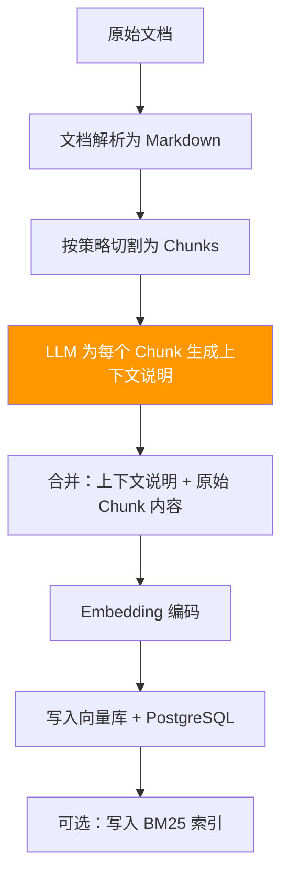
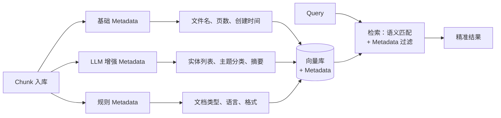

# 02-RAG 入库流程最佳实践

> RAG 入库流程是决定检索质量的关键环节——入库时的每一步处理都会在后续检索中被放大。
> 本文梳理行业前沿的入库增强方案，并与 StarRing 当前流程进行对比。

## 目录

- [一、Contextual Retrieval 入库增强（Anthropic）](#一contextual-retrieval-入库增强anthropic)
- [二、RAPTOR 递归摘要树](#二raptor-递归摘要树)
- [三、Metadata 富化](#三metadata-富化)
- [四、对比 StarRing 现状](#四对比-starring-现状)
- [五、优化建议](#五优化建议)

---

## 一、Contextual Retrieval 入库增强（Anthropic）

### 1.1 流程概览

**出处**：Anthropic，2024 年官方博客。

在文档切割 → Embedding 的中间，插入一个 **上下文前置生成** 步骤：



### 1.2 上下文生成策略

#### 方案 A：全文档上下文（精度最高，成本高）

```python
async def generate_document_context(chunk: str, full_document: str, llm) -> str:
    """基于完整文档生成上下文"""
    prompt = f"""<document>
{full_document}
</document>

Here is the chunk we want to situate:
<chunk>
{chunk}
</chunk>

Give a short context (1-3 sentences) that situates this chunk within the document."""
    return await llm.generate(prompt)
```

#### 方案 B：邻近上下文（折中方案，成本适中）

```python
async def generate_neighbor_context(chunk: str, prev_chunk: str, next_chunk: str, llm) -> str:
    """基于相邻 chunk 生成上下文"""
    prompt = f"""Previous chunk: {prev_chunk[:500]}
Current chunk: {chunk}
Next chunk: {next_chunk[:500]}

Briefly describe what this chunk is about in context (1-2 sentences)."""
    return await llm.generate(prompt)
```

#### 方案 C：结构化文档上下文（成本最低）

```python
def generate_structural_context(chunk: str, title_path: list[str], section: str) -> str:
    """基于文档结构生成上下文（无需 LLM）"""
    titles = " > ".join(title_path)
    return f"本文档章节「{titles}」中关于「{section}」部分的内容。"
```

### 1.3 实验效果

Anthropic 的实验数据（再次引用，与 01 文档角度不同）：

| 方案 | 检索失败率 | 降低幅度 |
|------|-----------|----------|
| Baseline Embedding | 5.7% | - |
| + Contextual Embeddings | 2.9% | ↓49% |
| + Contextual BM25 | 2.3% | ↓60% |
| + Re-Ranker | **1.9%** | **↓67%** |

### 1.4 成本效益分析

| 策略 | 每 1M chunk 成本 | 精度提升 | 推荐场景 |
|------|-----------------|----------|---------|
| 全文档上下文 | ~$3-5 | ↑49-67% | 高价值文档（法律、金融） |
| 邻近上下文 | ~$1-2 | ↑30-40% | 通用知识库 |
| 结构化上下文 | $0 | ↑10-15% | 层级清晰的文档 |

---

## 二、RAPTOR 递归摘要树

### 2.1 提出背景

**出处**：Microsoft / Stanford，论文 "RAPTOR: Recursive Abstractive Processing for Tree-Organized Retrieval"，2024 年。

传统 RAG 的扁平索引结构在处理"总结性问题"（如"本文的主要观点是什么？"）时力不从心。RAPTOR 通过建立**树形层级索引**解决这个问题。

### 2.2 核心架构

```mermaid
flowchart TD
    subgraph Layer3["Layer 3: 根节点摘要"]
        R[全文摘要<br/>'本文探讨了AI在医疗<br/>领域的三大应用方向...'"]
    end

    subgraph Layer2["Layer 2: 主题摘要"]
        T1["主题摘要 1<br/>'影像诊断中的AI...'"]
        T2["主题摘要 2<br/>'药物研发中的AI...'"]
    end

    subgraph Layer1["Layer 1: 原始 Chunks"]
        C1[Chunk 1] --- C2[Chunk 2] --- C3[Chunk 3] --- C4[Chunk 4] --- C5[Chunk 5] --- C6[Chunk 6]
    end

    R --> T1
    R --> T2
    T1 --> C1
    T1 --> C2
    T1 --> C3
    T2 --> C4
    T2 --> C5
    T2 --> C6

    style Layer3 fill:#e8f5e9
    style Layer2 fill:#fff3e0
    style Layer1 fill:#e3f2fd
```

**构建流程**：
1. 将文档切割为初始 chunks（叶子节点）
2. 对相邻 chunks 分组（每组 3-5 个），用 LLM 生成摘要（上层节点）
3. 对上层摘要节点再次分组、生成更高层摘要
4. 递归直到根节点（全文摘要）
5. 所有层级的节点都 embedding 后存入向量库

### 2.3 检索策略

RAPTOR 支持两种检索模式：

| 模式 | 方法 | 适用场景 |
|------|------|----------|
| **Tree Traversal** | 从顶层开始，逐层下钻，选每层最相关的 top-k 节点 | 需要高层次理解的问题 |
| **Collapsed Tree** | 将所有层级节点扁平化，直接向量检索 | 需要细节的具体问题 |

```python
class RAPTORRetriever:
    def tree_traversal_search(self, query: str, top_k: int = 3) -> list[str]:
        """自上而下的树遍历检索"""
        current_nodes = self.root_nodes
        results = []

        for layer in range(self.max_depth):
            # 在当前层的所有节点中检索
            scored = [(node, self._similarity(query, node)) for node in current_nodes]
            scored.sort(key=lambda x: x[1], reverse=True)

            # 取 top-k，进入下一层
            top_nodes = [node for node, _ in scored[:top_k]]
            results.extend(top_nodes)

            # 下钻到子节点
            current_nodes = []
            for node in top_nodes:
                current_nodes.extend(node.children)

        return results

    def collapsed_search(self, query: str, top_k: int = 5) -> list[str]:
        """扁平化检索（所有层级统一向量检索）"""
        all_nodes = self._get_all_nodes()  # 所有层级节点扁平化
        return self._vector_search(query, all_nodes, top_k)
```

### 2.4 实验效果

- 在 NarrativeQA 等总结性问答数据集上，RAPTOR 的 F1 比传统方案提升 **15-20%**
- 多跳推理任务（需要跨段落综合信息）提升约 **12%**
- 成本：文档体积增加约 20-30%（摘要节点）

---

## 三、Metadata 富化

### 3.1 提出背景

**出处**：Azure Databricks AI Search 优化指南，2024 年。

单纯的向量检索无法利用文档的结构化信息（如来源、日期、类型），而 metadata 过滤可以在检索时大幅缩小候选集，提升精度。

### 3.2 核心思想



### 3.3 Azure Databricks 实验数据

| 方案 | 检索精度（Precision@5） | 提升 |
|------|----------------------|------|
| 纯向量检索 | 73.3% | - |
| + 元数据过滤 | 82.5% | **↑9.2%** |

### 3.4 Metadata 提取方案

```python
from dataclasses import dataclass, field
from typing import Any

@dataclass
class ChunkMetadata:
    """增强的 Chunk Metadata"""
    # 基础信息
    source_file: str
    chunk_index: int
    page_number: int | None = None

    # LLM 增强
    entities: list[str] = field(default_factory=list)        # 提取的实体
    topics: list[str] = field(default_factory=list)          # 主题分类
    summary: str = ""                                         # 一句话摘要
    language: str = "zh"                                      # 语言

    # 规则提取
    doc_type: str = ""                                        # 文档类型
    section_title: str = ""                                   # 章节标题
    has_table: bool = False
    has_code: bool = False


async def enrich_chunk_metadata(chunk: str, llm) -> ChunkMetadata:
    """使用 LLM 富化 chunk metadata"""
    prompt = f"""分析以下文本，提取元数据并以 JSON 格式返回：
{{
    "entities": ["实体1", "实体2"],
    "topics": ["主题1"],
    "summary": "一句话摘要",
    "language": "zh/en"
}}

文本：{chunk[:2000]}"""
    result = await llm.generate_json(prompt)
    return ChunkMetadata(
        entities=result["entities"],
        topics=result["topics"],
        summary=result["summary"],
        language=result["language"],
    )
```

### 3.5 Metadata 驱动的检索过滤

```python
async def metadata_filtered_search(
    query: str,
    filters: dict,  # {"doc_type": "contract", "entities": ["公司A"], "topics": ["财务"]}
    top_k: int = 10,
):
    """结合 metadata 过滤的检索"""
    # Step 1: 构建 Milvus 过滤表达式
    filter_expr = build_filter_expression(filters)
    # 例如: 'doc_type == "contract" && entities in ["公司A"]'

    # Step 2: 带过滤条件的向量检索
    results = collection.search(
        data=query_embedding,
        anns_field="embedding",
        param={"metric_type": "COSINE"},
        limit=top_k,
        expr=filter_expr,  # metadata 过滤
    )
    return results
```

---

## 四、对比 StarRing 现状

### 4.1 StarRing 当前入库流程

```
文档上传 → Parser 解析(Markdown) → Chunking(6种策略) → Embedding → Milvus + PostgreSQL 双写
```

现有能力：
- 完整的 Parser 层：`backend/package/starring/knowledge/parser/unified.py`
- 6 种分块策略：`backend/package/starring/knowledge/chunking/ragflow_like/`
- Milvus + PostgreSQL 双写：`backend/package/starring/knowledge/implementations/milvus.py`
- 图谱数据同步：chunk 入库后触发图谱抽取和 Neo4j 写入

### 4.2 差距分析

| 行业最佳实践 | StarRing 现状 | 差距 |
|-------------|-------------|------|
| **Contextual Retrieval** | 无 | 未对 chunk 做上下文增强，检索可能因上下文缺失而失败 |
| **RAPTOR** | 无 | 仅扁平索引，无法高效回答总结性问题 |
| **Metadata 富化** | 基础元数据（file_id, chunk_index, 位置信息） | 未做实体提取、主题分类等 LLM 增强 metadata |
| **层级摘要** | 无 | 无文档级或主题级摘要节点 |

### 4.3 现有优势（值得保留）

- **参数优先级策略**：request > file > kb 的三级配置覆盖，设计合理
- **近似 Token 计数**：比 tiktoken 快 10 倍且无额外依赖
- **双写可靠性**：Milvus + PostgreSQL 双写，任一失败则回滚

---

## 五、优化建议

### 5.1 P0（高优先）—— 轻量级 Contextual Retrieval

采用 **方案 C：结构化上下文**，零 LLM 成本即可获得部分收益：

```python
# 在 chunk_markdown 中增强（利用现有的 title_stack）
def enhance_chunk_with_structural_context(chunk: str, title_path: list[str]) -> str:
    """为 chunk 添加结构化上下文前缀"""
    if not title_path:
        return chunk
    context = " > ".join(t.strip() for t in title_path if t.strip())
    return f"[{context}]\n{chunk}"
```

### 5.2 P1（中优先）—— Full Contextual Retrieval

在结构化上下文基础上，对**高价值文档**启用 LLM 上下文生成：

```python
# 在 index_file 流程中插入
async def index_file_with_context(self, kb_id, file_id, ...):
    chunks = self._split_text_into_chunks(...)

    # 新增：高价值文档启用 LLM 上下文
    if params.get("enable_contextual_retrieval"):
        document = await self._read_markdown_from_minio(...)
        contexts = await self._generate_chunk_contexts(chunks, document)
        chunks = [f"{ctx}\n\n{chunk['content']}" for ctx, chunk in zip(contexts, chunks)]

    await self._embed_and_store_chunks(...)
```

### 5.3 P2（中优先）—— Metadata 富化

- 利用现有的图谱抽取结果（实体列表）作为 metadata 来源
- 在 PostgreSQL 的 `knowledge_chunks` 表中已有 `ent_ids`、`tags` 字段，可充分利用
- 增强 Milvus 集合 schema，添加 metadata 字段支持过滤查询

### 5.4 P3（低优先）—— RAPTOR

- RAPTOR 新增存储和检索成本较高（摘要节点 + 层级管理）
- 适合在用户反馈"总结类问题回答不好"时再考虑

---

> **参考来源**：
> - Anthropic Contextual Retrieval：[官方博客](https://www.anthropic.com/news/contextual-retrieval)，2024
> - RAPTOR：[论文](https://arxiv.org/abs/2401.18059)，Microsoft/Stanford 2024
> - Azure Databricks AI Search：[优化指南](https://www.databricks.com/blog/ai-search-guide)，2024
