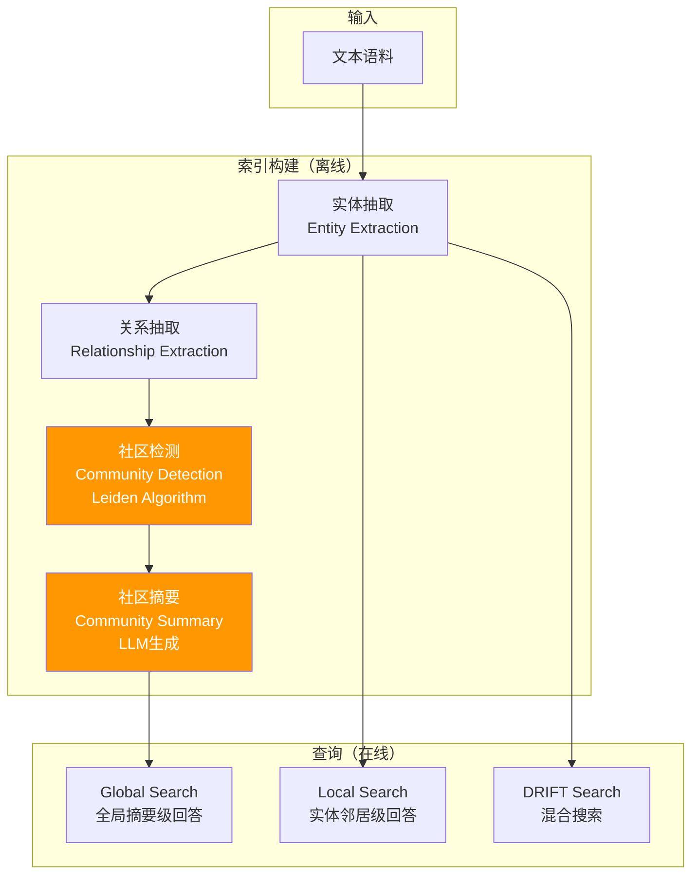
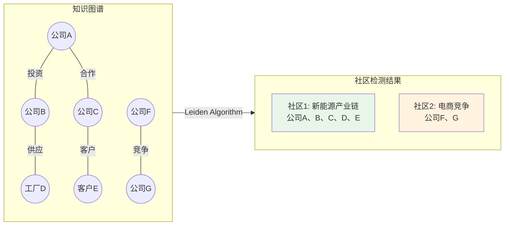
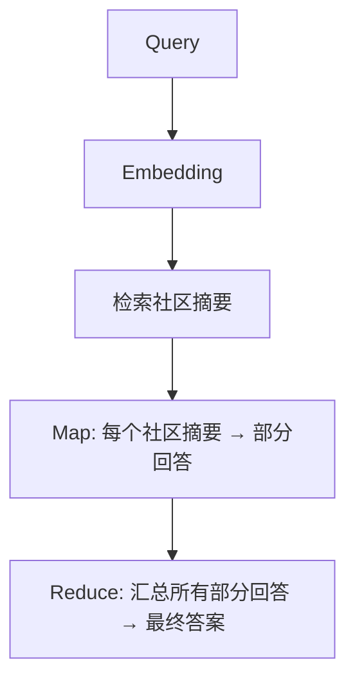

# 03-知识图谱增强 RAG 最佳实践

> 当传统向量检索在"连接点"类问题上表现不佳时，知识图谱增强 RAG（GraphRAG）提供了结构化的解决方案。
> 本文梳理 Microsoft GraphRAG 的核心方法论，并与 StarRing 现有的图谱方案进行对比。

## 目录

- [一、Microsoft GraphRAG 概述](#一microsoft-graphrag-概述)
- [二、GraphRAG Pipeline](#二graphrag-pipeline)
- [三、GraphRAG 查询模式](#三graphrag-查询模式)
- [四、实体归一化](#四实体归一化)
- [五、对比 StarRing 现状](#五对比-starring-现状)
- [六、优化建议](#六优化建议)

---

## 一、Microsoft GraphRAG 概述

### 1.1 提出背景

**出处**：Microsoft Research，项目 [microsoft/graphrag](https://github.com/microsoft/graphrag)，2024 年 7 月开源。

传统 RAG 擅长"点上检索"（如"奔驰 C 级的油耗是多少？"），但在**"连接点上"的问题**上表现很差。例如：

> "找出所有投资了新能源领域的、总部在加州的、员工超过 1000 人的公司"

这类问题需要跨越多篇文档、通过共享属性关联不同实体——这正是图数据库的优势。

### 1.2 核心思想



### 1.3 实验数据

Microsoft 在 U.S. Case Law 数据集上的对比实验：

| 检索方式 | Recall@5 | 提升幅度 |
|----------|----------|----------|
| 纯向量检索（Baseline RAG） | 40% | - |
| GraphRAG（向量 + 图） | 70% | **↑75%** |

---

## 二、GraphRAG Pipeline

### 2.1 Step 1：实体与关系抽取

GraphRAG 使用 LLM 从文本中提取三元组：

```python
GRAPH_EXTRACTION_PROMPT = """从以下文本中提取实体和关系，返回 JSON：

{
  "entities": [
    {"name": "实体名", "type": "类型", "description": "简短描述"}
  ],
  "relationships": [
    {"source": "源实体名", "target": "目标实体名", "description": "关系描述"}
  ]
}

文本：
{text}"""
```

### 2.2 Step 2：社区检测（Community Detection）

这是 GraphRAG 的核心创新。使用 **Leiden 算法** 对实体关系图进行社区检测：



```python
def detect_communities(graph: nx.Graph) -> dict:
    """Leiden 社区检测"""
    import leidenalg
    import igraph as ig

    # 转换为 igraph
    g = ig.Graph.from_networkx(graph)
    # Leiden 算法分区
    partition = leidenalg.find_partition(
        g,
        leidenalg.ModularityVertexPartition
    )

    # 构建社区映射
    communities = {}
    for community_id, node_indices in enumerate(partition):
        entities = [graph.nodes[idx]["name"] for idx in node_indices]
        communities[f"community_{community_id}"] = entities

    return communities
```

### 2.3 Step 3：社区摘要（Community Summary）

对每个检测出的社区，用 LLM 生成摘要：

```python
COMMUNITY_SUMMARY_PROMPT = """你正在为一组密切相关的实体生成社区报告。

实体列表：
{entities}

关系列表：
{relationships}

请生成一份包含以下内容的社区报告：
1. 这个社区的核心主题（1 句话）
2. 主要实体及其角色
3. 关键关系和分析洞察"""
```

这些社区摘要被 embedding 后存入向量库，用于 Global Search。

---

## 三、GraphRAG 查询模式

### 3.1 Global Search（全局搜索）

**适用场景**：宏观问题，如"整个语料库的主要主题是什么？"



```python
async def global_search(query: str, community_summaries: list[str], llm):
    """GraphRAG Global Search 流程"""
    # Step 1: 召回相关社区摘要
    relevant_communities = await vector_search(query, community_summaries, top_k=5)

    # Step 2: Map - 每个社区生成部分回答
    partial_answers = []
    for summary in relevant_communities:
        answer = await llm.generate(f"""
        基于以下社区摘要，回答这个问题：{query}

        社区摘要：{summary}

        请提供简洁的部分回答。
        """)
        partial_answers.append(answer)

    # Step 3: Reduce - 汇总所有部分回答
    final_answer = await llm.generate(f"""
    基于以下部分回答，生成最终的综合回答：

    问题：{query}

    部分回答：
    {chr(10).join(f"- {a}" for a in partial_answers)}

    请生成一个综合的、连贯的最终回答。
    """)

    return final_answer
```

### 3.2 Local Search（局部搜索）

**适用场景**：具体实体相关问题，如"XX 公司和哪些企业有合作关系？"

```python
async def local_search(query: str, entity_name: str, graph: nx.Graph, llm):
    """GraphRAG Local Search 流程"""
    # Step 1: 定位实体节点
    entity = graph.nodes[entity_name]

    # Step 2: 获取 k-hop 邻居
    neighbors = list(nx.single_source_shortest_path_length(
        graph, entity_name, cutoff=2
    ).keys())

    # Step 3: 收集邻居信息
    context = []
    for neighbor in neighbors:
        node_data = graph.nodes[neighbor]
        edges = graph[entity_name].get(neighbor, {})
        context.append(f"- {neighbor}: {edges}")

    # Step 4: 基于邻居上下文生成答案
    answer = await llm.generate(f"""
    基于以下实体信息回答问题。

    问题：{query}
    实体：{entity_name}

    关联实体：
    {chr(10).join(context)}

    请基于以上信息回答。
    """)
    return answer
```

### 3.3 DRIFT Search（混合搜索）

**适用场景**：综合型问题，需要同时利用实体上下文和社区上下文

DRIFT Search 结合了 Local Search 的实体精确性和 Global Search 的主题宏观性：

```python
async def drift_search(query: str, graph: nx.Graph, community_summaries: list[str], llm):
    """DRIFT Search：实体 + 社区混合"""
    # Step 1: 先从 Query 中提取实体
    entity_results = await extract_and_search_entities(query, graph)

    # Step 2: 同时搜索相关社区
    community_results = await global_search(query, community_summaries, llm)

    # Step 3: 融合两种结果
    return await llm.generate(f"""
    综合以下两个来源的信息，回答问题。

    问题：{query}

    实体上下文：{entity_results}
    社区上下文：{community_results}
    """)
```

---

## 四、实体归一化

### 4.1 问题

同一实体的不同名称导致图谱分裂：
- "PostgreSQL" = "Postgres" = "PG"
- "阿里巴巴" = "阿里" = "Alibaba"
- "New York" = "NYC" = "纽约"

### 4.2 行业方案

```python
class EntityNormalizer:
    """多策略实体归一化"""

    def __init__(self):
        self.alias_map: dict[str, str] = {}          # 别名映射
        self.embedding_index: dict[str, list] = {}   # 向量索引

    def normalize(self, entity_name: str) -> str:
        # 策略1: 精确别名匹配
        if entity_name.lower() in self.alias_map:
            return self.alias_map[entity_name.lower()]

        # 策略2: 向量相似度匹配
        candidates = self._embedding_search(entity_name, top_k=3)
        if candidates and candidates[0]["score"] > 0.92:
            return candidates[0]["canonical_name"]

        # 策略3: 同义词规则（如缩写展开）
        canonical = self._apply_synonym_rules(entity_name)
        if canonical:
            return canonical

        # 无法归一化，使用原始名称
        return entity_name

    def _apply_synonym_rules(self, name: str) -> str | None:
        """规则化的同义词处理"""
        rules = [
            (r'\bNYC\b', 'New York'),
            (r'\bSF\b', 'San Francisco'),
            (r'\bPG\b(?!\d)', 'PostgreSQL'),
        ]
        for pattern, replacement in rules:
            if re.search(pattern, name):
                return replacement
        return None
```

---

## 五、对比 StarRing 现状

### 5.1 StarRing 当前能力

| 特性 | StarRing 现状 | 实现位置 |
|------|-------------|----------|
| 实体抽取 | LLM 结构化抽取，Schema 约束 | `knowledge/graphs/extractors/llm.py` |
| 关系抽取 | 支持自定义关系类型 | 同上 |
| 图谱存储 | Neo4j（图结构）+ Milvus（向量索引） | `storage/neo4j/` + `knowledge/graphs/milvus_graph_vector_store.py` |
| 图检索 | PPR（Personalized PageRank）扩散检索 | `knowledge/graphs/milvus_graph_service.py` |
| 融合机制 | RRF 融合向量 + 图检索结果 | `implementations/milvus.py` |
| 实体归一化 | 别名映射 + Embedding 相似度 | `knowledge/graphs/normalizer.py` |

### 5.2 差距分析

| 行业最佳实践 | StarRing 现状 | 差距 |
|-------------|-------------|------|
| **社区检测（Community Detection）** | 无 | StarRing 使用 PPR 做图检索，但未对图做社区划分 |
| **社区摘要（Community Summary）** | 无 | 无上层摘要层，无法回答"主题概览"类问题 |
| **Global Search** | 无 | 不支持全局语料主题理解 |
| **Leiden 算法集成** | 无 | 仅用 PPR 基于随机游走排序 |
| **实体归一化** | 有基础实现 | 规则覆盖有限，未集成外部知识库 |
| **GraphRAG Pipeline** | 仅抽取 + 检索，无社区层 | 缺失社区检测和摘要生成的关键环节 |

### 5.3 StarRing 优势（值得保留）

- **PPR 图检索**：轻量且有效，适合需要精确实体关联的场景
- **RRF 融合**：向量 + 图检索结果的无缝融合
- **Schema 约束**：用户可自定义实体类型，控制图谱质量

---

## 六、优化建议

### 6.1 P1（中优先）—— 社区检测与摘要（GraphRAG Lite）

在现有 Neo4j + PPR 基础上，增加社区检测能力：

```python
# 基于现有 Neo4j 图谱做社区检测
def build_community_index(kb_id: str, neo4j_session):
    """从 Neo4j 图谱构建社区索引"""

    # Step 1: 从 Neo4j 导出子图到 NetworkX
    graph = export_neo4j_subgraph(neo4j_session, kb_id)

    # Step 2: Leiden 社区检测
    communities = detect_communities(graph)

    # Step 3: LLM 生成社区摘要
    summaries = {}
    for com_id, entities in communities.items():
        # 获取社区内的关系
        relationships = get_community_relationships(graph, entities)
        summary = llm_generate_community_summary(entities, relationships)
        summaries[com_id] = summary

    # Step 4: 存储社区信息
    store_communities(kb_id, communities, summaries)
    return communities, summaries
```

**收益预估**：复杂关联问题（"总结新能源领域的投资趋势"）的回答质量提升显著。

### 6.2 P2（中优先）—— Global Search 支持

在社区摘要的基础上，增加 Global Search 查询模式，让 Agent 根据问题类型自动选择 Local/Global 搜索。

### 6.3 P2（中优先）—— 实体归一化增强

- 增加常见实体的预定义别名表
- 集成 Wikidata/Wikipedia 实体链接
- 利用现有 Embedding 进行语义归一化

---

> **参考来源**：
> - Microsoft GraphRAG：[GitHub](https://github.com/microsoft/graphrag)，[官方博客](https://www.microsoft.com/en-us/research/blog/graphrag-unlocking-llm-discovery-on-narrative-private-data/)，2024
> - Leiden Algorithm：[论文](https://www.nature.com/articles/s41598-019-41695-z)，Traag et al. 2019
