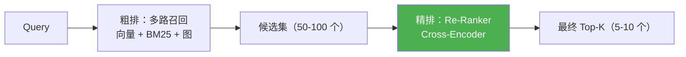
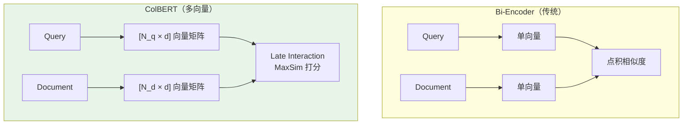
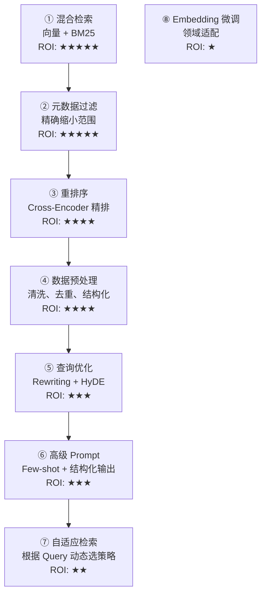

# 04-混合检索与排序最佳实践

> 单一检索策略永远无法覆盖所有场景——混合检索通过多路召回 + 精细排序，最大化检索的覆盖率与准确率。
> 本文梳理行业前沿的混合检索与排序方案，并与 StarRing 当前实现进行对比。

## 目录

- [一、Contextual BM25 + Contextual Embeddings](#一contextual-bm25--contextual-embeddings)
- [二、RRF 融合算法](#二rrf-融合算法)
- [三、Re-Ranker 选型](#三re-ranker-选型)
- [四、ColBERT 多向量检索](#四colbert-多向量检索)
- [五、Azure Databricks 7 步优化指南](#五azure-databricks-7-步优化指南)
- [六、对比 StarRing 现状](#六对比-starring-现状)
- [七、优化建议](#七优化建议)

---

## 一、Contextual BM25 + Contextual Embeddings

### 1.1 提出背景

**出处**：Anthropic，2024 年 Contextual Retrieval 博客。

传统 BM25 在搜索增强后的 chunk（Contextual Chunk）时，效果比搜索原始 chunk 好得多——因为上下文说明中的关键词能让 BM25 更精准地命中目标。

### 1.2 实验数据（Anthropic）

| 方案组合 | 检索失败率 | 相比 Baseline |
|----------|-----------|--------------|
| 传统 Embedding（Baseline） | 5.7% | - |
| Contextual Embeddings 仅 | 2.9% | ↓49% |
| Contextual Embeddings + Contextual BM25 | 2.3% | ↓60% |
| 上述 + Re-Ranker | **1.9%** | **↓67%** |

### 1.3 Contextual BM25 实现要点

```python
class ContextualBM25Index:
    """上下文增强的 BM25 索引"""

    def __init__(self):
        self.tokenizer = None
        self.documents = []

    def build_from_chunks(self, chunks: list[dict]):
        """
        为每个 chunk 建立 BM25 索引，索引内容 = 上下文 + 原始内容
        """
        self.documents = []
        for chunk in chunks:
            # 关键：索引的是 contextualized_chunk
            contextualized = f"{chunk.get('context', '')}\n{chunk['content']}"
            self.documents.append({
                "id": chunk["chunk_id"],
                "text": contextualized,
                "original_content": chunk["content"],
            })

        # 构建 BM25 索引
        from rank_bm25 import BM25Okapi
        tokenized = [self._tokenize(doc["text"]) for doc in self.documents]
        self.bm25 = BM25Okapi(tokenized)

    def search(self, query: str, top_k: int = 50) -> list[dict]:
        """上下文感知的 BM25 检索"""
        tokenized_query = self._tokenize(query)
        scores = self.bm25.get_scores(tokenized_query)
        ranked = sorted(
            enumerate(scores),
            key=lambda x: x[1],
            reverse=True,
        )[:top_k]

        return [
            {
                **self.documents[idx],
                "bm25_score": float(score),
            }
            for idx, score in ranked
        ]
```

---

## 二、RRF 融合算法

### 2.1 算法原理

**出处**：Azure HorizonDB 官方推荐，学术界起源于 TREC 评估社区。

RRF（Reciprocal Rank Fusion）是一种无需训练的排序融合算法。核心公式：

```
RRF_score(d) = Σ 1 / (k + rank_i(d))
```

其中心就是 `i` 为不同检索源，`rank_i(d)` 是文档 `d` 在第 `i` 个检索结果中的排名，`k` 是平滑常数（通常为 60）。

### 2.2 为什么 RRF 优于分数加权？

| 问题 | 分数加权（Score Weighting） | RRF |
|------|---------------------------|-----|
| **分数尺度不一致** | 需要手动归一化 | 只关心排名，与尺度无关 |
| **异常值敏感** | 高分数项可能主导排名 | 排名对极端值不敏感 |
| **权重调优** | 复杂，需要大量实验 | 简单，k=60 几乎对所有场景有效 |
| **多源融合** | 3 个以上源时很复杂 | 天然支持任意多源融合 |

### 2.3 多源 RRF 实现

```python
def multi_source_rrf_fusion(
    sources: list[tuple[list[dict], float]],  # [(results, weight), ...]
    k: float = 60.0,
) -> list[dict]:
    """
    多源 RRF 融合

    Args:
        sources: [(检索结果列表, 权重), ...]，支持任意多源
        k: RRF 平滑参数

    Returns:
        融合排序后的结果列表
    """
    fused: dict[str, dict] = {}

    for source_results, weight in sources:
        for rank, chunk in enumerate(source_results, start=1):
            chunk_id = chunk.get("metadata", {}).get("chunk_id")
            if not chunk_id:
                continue

            score = weight / (k + rank)

            if chunk_id not in fused:
                fused[chunk_id] = {
                    **chunk,
                    "fusion_score": 0.0,
                    "fusion_sources": [],
                }

            fused[chunk_id]["fusion_score"] += score
            fused[chunk_id]["fusion_sources"].append(
                chunk.get("source_type", "unknown")
            )

    # 按融合分数降序排列
    return sorted(
        fused.values(),
        key=lambda item: item["fusion_score"],
        reverse=True,
    )


# 使用示例：向量 + BM25 + 图检索三源融合
results = multi_source_rrf_fusion([
    (vector_results, 1.0),   # 向量检索：权重 1.0
    (bm25_results, 0.8),     # BM25 检索：权重 0.8
    (graph_results, 0.6),    # 图检索：权重 0.6
])
```

---

## 三、Re-Ranker 选型

### 3.1 Re-Ranker 的作用



Re-Ranker 作为精排模型，使用 Cross-Encoder 架构，同时编码 Query 和 Document，捕捉两者之间的精细交互——这与 Bi-Encoder（Query 和 Document 独立编码）有本质区别。

### 3.2 主流 Re-Ranker 对比

| 模型 | 类型 | 精度特点 | 速度特点 | 适用场景 |
|------|------|---------|---------|----------|
| **Cohere Rerank v4** | 商业 API | 精度最高，多语言 | 快（API 调用） | 商业场景、多语言 |
| **BGE-Reranker-v2-m3** | 开源 | 精度接近 Cohere | 中等（本地推理） | 私有部署、成本敏感 |
| **Jina Reranker v2** | 开源 | 多语言效果好 | 中等 | 中英双语场景 |
| **mxbai-rerank** | 开源 | 英文效果好 | 快（小模型） | 英文为主 |
| **bge-reranker-v2-minicpm** | 开源 | 高精度，支持多语言 | 慢（大模型） | 对精度要求极高 |

### 3.3 开源 Re-Ranker 集成示例

```python
class ReRankerPipeline:
    def __init__(self, model_name: str = "BAAI/bge-reranker-v2-m3"):
        from sentence_transformers import CrossEncoder
        self.model = CrossEncoder(model_name)

    def rerank(self, query: str, documents: list[str], top_k: int = 10) -> list[tuple[int, float]]:
        """重排序"""
        # 构建 (query, doc) 对
        pairs = [(query, doc) for doc in documents]

        # Cross-Encoder 打分
        scores = self.model.predict(pairs)

        # 排序
        ranked = sorted(
            enumerate(scores),
            key=lambda x: x[1],
            reverse=True,
        )[:top_k]

        return ranked
```

### 3.4 延迟与精度权衡

| 粗排返回量 | Re-Ranker 延迟 | 精度增益 | 推荐 |
|-----------|---------------|---------|------|
| 20 个候选 | ~50ms | +5-10% | 低延迟场景 |
| 50 个候选 | ~120ms | +10-15% | **推荐默认值** |
| 100 个候选 | ~240ms | +15-20% | 高精度场景 |
| 200 个候选 | ~480ms | +20-25% | 极致精度 |

---

## 四、ColBERT 多向量检索

### 4.1 提出背景

**出处**：Stanford，Jina AI 改进为 Jina-ColBERT-v2，2024 年。

传统 Bi-Encoder 将整个文档压缩成一个向量，丢失了词级信息。ColBERT 为每个 token 独立编码，检索时做 **Late Interaction**（延迟交互）打分。

### 4.2 核心原理



### 4.3 使用特点

- **精度**：接近 Cross-Encoder，远高于 Bi-Encoder
- **效率**：接近 Bi-Encoder（可预计算 Doc 向量，在线只需计算 Query 向量）
- **代价**：存储量是 Bi-Encoder 的 ~100 倍（每个文档存 N 个向量而非 1 个）

---

## 五、Azure Databricks 7 步优化指南

**出处**：Azure Databricks AI Search 官方指南，2024 年。

按 ROI 排序的 7 步优化路径：



**StarRing 对照**：

| 步骤 | Azure Databricks 推荐 | StarRing 现状 |
|------|----------------------|--------------|
| ① 混合检索 | 向量 + BM25 | ✅ 已实现（vector/keyword/hybrid 三种模式） |
| ② 元数据过滤 | 精确过滤 | ⚠️ 支持文件名过滤，metadata 不够丰富 |
| ③ 重排序 | Re-Ranker | ⚠️ 已配置接口但默认关闭 |
| ④ 数据预处理 | 清洗去重 | ✅ 有完整的 Parser + Chunking 流程 |
| ⑤ 查询优化 | Rewriting + HyDE | ❌ 未实现 |
| ⑥ 高级 Prompt | Few-shot | ✅ Agent Prompt 中有使用 |
| ⑦ 自适应检索 | 动态选策略 | ❌ 未实现 |
| ⑧ Embedding 微调 | 领域适配 | ❌ 未实现 |

---

## 六、对比 StarRing 现状

### 6.1 StarRing 当前能力总结

| 特性 | 实现情况 | 技术栈 |
|------|---------|--------|
| 向量检索 | ✅ 已实现 | Milvus COSINE ANN |
| BM25 检索 | ✅ 已实现 | Milvus 内置 BM25 Function |
| 混合检索 | ✅ 已实现 | Milvus WeightedRanker |
| 图检索 | ✅ 已实现 | PPR + RRF 融合 |
| Re-Ranker | ⚠️ 接口已配置 | `use_reranker` 参数存在但默认关闭 |
| RRF 融合 | ✅ 已实现 | 用于图检索 + 向量检索融合 |
| Contextual BM25 | ❌ 未实现 | 无上下文增强的 BM25 |

### 6.2 具体差距

| 行业最佳实践 | StarRing 现状 | 差距 |
|-------------|-------------|------|
| **Contextual BM25** | 普通 BM25 | 未利用 Contextual Retrieval 增强 BM25 |
| **Re-Ranker 默认启用** | 可选、默认关闭 | 未充分发挥精排模型的优势 |
| **ColBERT** | 无 | 纯 Bi-Encoder，无多向量检索能力 |
| **自适应检索** | 需要用户手动选择 | 未根据 Query 类型自动切换策略 |

---

## 七、优化建议

### 7.1 P0（最高优先）—— 默认启用 Re-Ranker

- **投入**：极低（代码已实现，只需改变默认配置 + 性能测试）
- **收益**：检索精度 ↑20-30%

```python
# 将 use_reranker 默认值从 False 改为 True
# 并配置默认 reranker_model（如 BGE-Reranker-v2-m3）
use_reranker: bool = field(
    default=True,  # 改为 True
    metadata={"label": "启用重排序", ...},
)
```

### 7.2 P1（中优先）—— RRF 替代 WeightedRanker

- **问题**：Milvus WeightedRanker 只能融合 2 路，图检索结果走外部 RRF
- **改进**：统一使用 RRF 融合向量 + BM25 + 图三路结果
- **收益**：三路融合的排序一致性更好

### 7.3 P2（低优先）—— Contextual BM25

- 在实现 Contextual Retrieval 后，BM25 索引自然受益
- 属于"Contextual Retrieval"整体方案的连带收益

---

> **参考来源**：
> - Anthropic Contextual Retrieval：[官方博客](https://www.anthropic.com/news/contextual-retrieval)
> - Azure Databricks AI Search：[优化指南](https://www.databricks.com/blog/ai-search-guide)
> - ColBERT：[论文](https://arxiv.org/abs/2004.12832)，Stanford；[Jina-ColBERT-v2](https://jina.ai/news/jina-colbert-v2/)，2024
> - RRF 论文：[TREC 社区](https://plg.uwaterloo.ca/~gvcormac/cormacksigir09-rrf.pdf)
