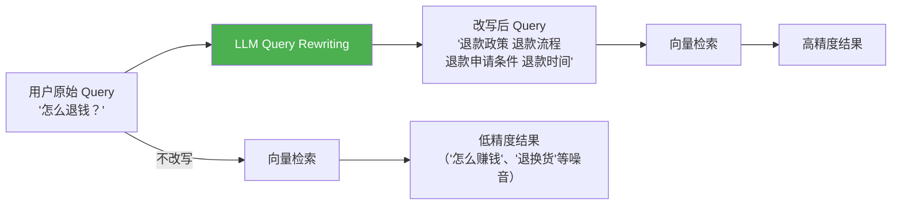
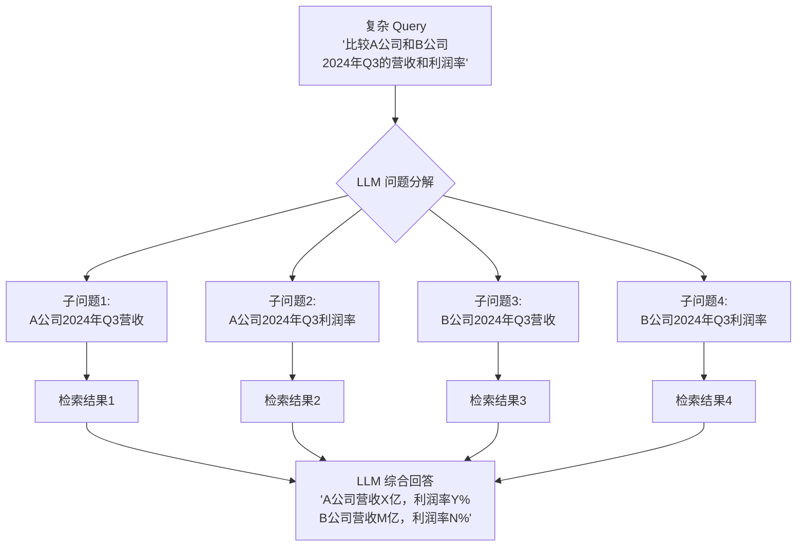
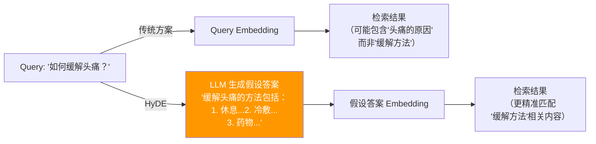
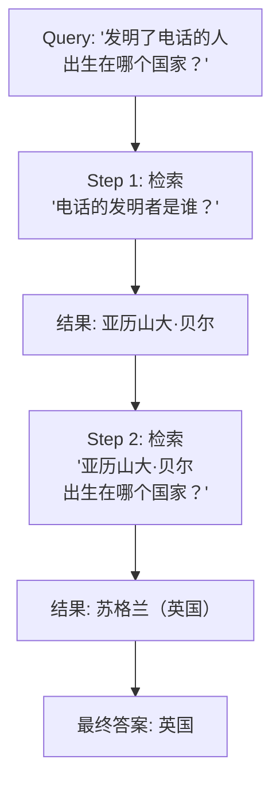

# 05-查询优化最佳实践

> 检索质量的上限不仅取决于入库质量，更取决于查询质量——同样的知识库，
> 不同的查询方式可能产生截然不同的检索结果。本文梳理查询端优化的行业最佳实践。

## 目录

- [一、Query Rewriting（查询改写）](#一query-rewriting查询改写)
- [二、Query Decomposition（问题分解）](#二query-decomposition问题分解)
- [三、HyDE（假设文档嵌入）](#三hyde假设文档嵌入)
- [四、Multi-hop Retrieval（多跳检索）](#四multi-hop-retrieval多跳检索)
- [五、对比 StarRing 现状](#五对比-starring-现状)
- [六、优化建议](#六优化建议)

---

## 一、Query Rewriting（查询改写）

### 1.1 为什么需要查询改写？

用户的自然语言 Query 往往不适合直接用于检索：

| 用户原始 Query | 改写后（更适合检索） | 改写原因 |
|---------------|-------------------|----------|
| "怎么退钱？" | "退款政策 退款流程 退款条件" | 口语化 → 关键词化 |
| "上次说的那个功能" | "用户权限管理功能 多角色访问控制" | 模糊指代 → 明确术语 |
| "它比对手好在哪？" | "产品A 竞争优势 竞品对比" | 无主语 → 补全主语 |
| "帮我总结一下" | "文档摘要 核心观点 关键结论" | 无目标 → 明确意图 |

### 1.2 行业方案

**出处**：大厂普遍使用（Google、Bing 搜索引擎的 Query Understanding 是典型代表），RAG 领域的标准实践。



### 1.3 实现

```python
QUERY_REWRITE_PROMPT = """将以下用户问题改写为更适合检索的查询语句。

要求：
1. 展开缩写和口语化表达
2. 补充领域专业术语
3. 生成2-3个关键词版本
4. 保持原意，不要添加无关信息

用户问题：{query}

请返回 JSON：
{{
    "rewritten": "改写后的主查询",
    "keywords": ["关键词1", "关键词2", "关键词3"],
    "explanation": "改写思路（可选）"
}}"""


async def rewrite_query(query: str, llm) -> dict:
    """使用 LLM 改写查询"""
    prompt = QUERY_REWRITE_PROMPT.format(query=query)
    result = await llm.generate_json(prompt)
    return result


async def enhanced_search(query: str, llm, collection, top_k: int = 10):
    """增强搜索：Query Rewriting + 多关键词检索"""
    rewrite_result = await rewrite_query(query, llm)

    # 用改写后的 query 做向量检索
    rewritten = rewrite_result["rewritten"]
    vector_results = await vector_search(rewritten, collection, top_k)

    # 用多关键词做 BM25 检索
    keywords = " ".join(rewrite_result["keywords"])
    bm25_results = await bm25_search(keywords, collection, top_k)

    # RRF 融合
    return rrf_fusion([vector_results, bm25_results])
```

### 1.4 效果

- 召回率提升 10-15%（实验数据参考 LlamaIndex 报告）
- 对口语化程度高的用户 Query 提升尤其明显
- 成本：每次 LLM 改写约 200-500 tokens（低价模型即可）

---

## 二、Query Decomposition（问题分解）

### 2.1 核心思想

**出处**：学术研究 + LangChain/LlamaIndex 实践，2023-2024 年。

复杂问题通常包含多个子问题，整体检索很难找到覆盖所有方面的文档。问题分解将复杂问题拆成独立子问题，分别检索后再综合。



### 2.2 实现

```python
DECOMPOSE_PROMPT = """将以下复杂问题分解为独立的子问题，每个子问题可以单独检索回答。

复杂问题：{query}

要求：
1. 每个子问题应独立、明确、可检索
2. 子问题之间无重叠
3. 数量控制在 2-5 个

返回 JSON：
{{
    "sub_queries": ["子问题1", "子问题2", ...],
    "reasoning": "分解思路"
}}"""


SYNTHESIZE_PROMPT = """基于以下子问题的检索结果，生成综合回答。

原始问题：{query}

子问题及检索结果：
{sub_results}

请生成一个连贯的、综合的回答。"""


async def decompose_and_search(query: str, llm, retriever):
    """问题分解 + 分别检索 + 综合回答"""
    # Step 1: 分解问题
    decompose_result = await llm.generate_json(
        DECOMPOSE_PROMPT.format(query=query)
    )
    sub_queries = decompose_result["sub_queries"]

    # Step 2: 分别检索
    sub_results = []
    for sub_q in sub_queries:
        docs = await retriever.search(sub_q)
        sub_results.append({
            "query": sub_q,
            "documents": docs,
        })

    # Step 3: 综合回答
    sub_results_text = "\n\n".join(
        f"子问题: {r['query']}\n"
        f"检索结果: {r['documents']}"
        for r in sub_results
    )

    final_answer = await llm.generate(
        SYNTHESIZE_PROMPT.format(
            query=query,
            sub_results=sub_results_text,
        )
    )

    return final_answer
```

### 2.3 适用场景

- 对比分析类问题（"A vs B"）
- 多条件查询（"满足 X 且 Y 且 Z 的..."）
- "先查再算"类问题（"统计去年每个季度的增长率"）
- 时间跨度大的问题（"过去五年的趋势"）

---

## 三、HyDE（假设文档嵌入）

### 3.1 核心思想

**出处**：Gao et al.，论文 "Precise Zero-Shot Dense Retrieval without Relevance Labels"，2022 年。

HyDE（Hypothetical Document Embeddings）的核心理念是：**让 LLM 先编造一个假设性答案，然后用这个答案（而非原始问题）去做向量检索**。

直觉：假设性答案和真实文档在 embedding 空间中更接近，因为它们在语言风格和结构上相似。



### 3.2 实现

```python
HYDE_PROMPT = """请针对以下问题，写一段假设性的回答。即使你不确定答案，也请编造一个合理的回答。

问题：{query}

请写一段 3-5 句的假设性回答。"""


async def hyde_retrieval(query: str, llm, retriever) -> list[dict]:
    """HyDE 检索流程"""
    # Step 1: LLM 生成假设答案
    hyde_prompt = HYDE_PROMPT.format(query=query)
    hypothetical_answer = await llm.generate(hyde_prompt)

    # Step 2: 用假设答案做向量检索（而非原始 query）
    results = await retriever.search(hypothetical_answer)

    return results
```

### 3.3 效果与局限

| 场景 | HyDE 效果 | 原因 |
|------|----------|------|
| 事实型问题 | ✅ 好 | 假设答案接近真实文档风格 |
| 观点型问题 | ⚠️ 一般 | 假设答案可能存在偏见 |
| 需要精确匹配的问题 | ❌ 差 | 假设答案可能引入无关信息 |
| 代码/公式查询 | ❌ 差 | LLM 生成的代码可能与实际不一致 |

**推荐用法**：HyDE 作为检索辅助手段之一，与原始 Query 检索结果通过 RRF 融合。

---

## 四、Multi-hop Retrieval（多跳检索）

### 4.1 核心思想

**出处**：HotpotQA 等数据集驱动的研究，LangGraph/LlamaIndex 内置支持，2023-2024 年。

多跳检索不是一次性检索，而是**分步检索 + 逐步挖掘**：第一步检索结果中的信息可能引出第二步的新查询。



### 4.2 实现（LangGraph 风格）

```python
from typing import TypedDict

class MultiHopState(TypedDict):
    query: str
    retrieved_docs: list[str]
    current_answer: str
    hop: int
    final_answer: str


def build_multi_hop_graph(retriever, llm):
    """使用 LangGraph 构建多跳检索图"""
    from langgraph.graph import StateGraph, END

    graph = StateGraph(MultiHopState)

    async def retrieve_node(state: MultiHopState) -> MultiHopState:
        """检索节点"""
        if state["hop"] == 0:
            docs = await retriever.search(state["query"])
        else:
            # 后续 hops 基于上一轮的答案生成新查询
            new_query = await llm.generate(
                f"基于以下信息，生成下一步检索查询：{state['current_answer']}"
            )
            docs = await retriever.search(new_query)

        return {
            **state,
            "retrieved_docs": docs,
            "hop": state["hop"] + 1,
        }

    async def reason_node(state: MultiHopState) -> MultiHopState:
        """推理节点：判断是否需要继续"""
        answer = await llm.generate(
            f"问题: {state['query']}\n"
            f"检索结果: {state['retrieved_docs']}\n"
            f"请提取有用信息，如果信息足够则给出最终答案，"
            f"否则说明还需要什么信息。"
        )
        return {**state, "current_answer": answer}

    def should_continue(state: MultiHopState) -> str:
        """判断是否继续多跳"""
        if state["hop"] >= 3 or "最终答案" in state["current_answer"]:
            return "end"
        return "continue"

    graph.add_node("retrieve", retrieve_node)
    graph.add_node("reason", reason_node)
    graph.set_entry_point("retrieve")
    graph.add_edge("retrieve", "reason")
    graph.add_conditional_edges("reason", should_continue, {
        "continue": "retrieve",
        "end": END,
    })

    return graph.compile()
```

---

## 五、对比 StarRing 现状

### 5.1 StarRing 当前能力

| 特性 | StarRing 现状 | 实现位置 |
|------|-------------|----------|
| Agent 多步推理 | ✅ 基于 LangGraph | `agents/buildin/` |
| 对话上下文传递 | ✅ 多轮对话历史保留 | `services/chat_service.py` |
| Query Rewriting | ❌ 无专门的查询改写模块 | - |
| HyDE | ❌ 未实现 | - |
| Query Decomposition | ❌ 未实现（依赖 Agent 隐式分解） | - |
| Multi-hop | ⚠️ Agent 层面支持但非显式设计 | `agents/buildin/subagent/graph.py` |

### 5.2 差距分析

| 行业最佳实践 | StarRing 现状 | 差距 |
|-------------|-------------|------|
| **Query Rewriting** | 无 | 用户口语化 Query 直接用原始文本检索，召回率低 |
| **HyDE** | 无 | 未利用假设答案增强检索信号 |
| **Query Decomposition** | Agent 隐式分解 | 缺乏系统性的分解-检索-综合流程 |
| **Multi-hop** | Agent 层面支持 | 非显式流程，难以保证跳数控制和信息追溯 |

---

## 六、优化建议

### 6.1 P2（中优先）—— Query Rewriting 模块

投入最小、收益最确定。在检索前增加一个轻量的 Query Rewriting 步骤：

```python
# 在 aquery 方法中插入
async def aquery(self, query_text: str, kb_id: str, **kwargs):
    # 新增：Query Rewriting
    rewritten = await self._rewrite_query(query_text)
    search_query = rewritten["rewritten"]

    # 原有检索逻辑...
    results = await self._search(search_query, kb_id, **kwargs)
```

### 6.2 P2（中优先）—— HyDE 作为可选增强

- 在 `MilvusRetrievalConfig` 中增加 `use_hyde` 参数
- HyDE 结果与原始 Query 结果通过 RRF 融合
- 优先对事实型问题启用

### 6.3 P3（低优先）—— Query Decomposition

- 当检测到对比类、多条件类 Query 时自动启用
- 对简单 Query 不做分解（避免不必要的 LLM 调用）

---

> **参考来源**：
> - HyDE：[论文](https://arxiv.org/abs/2212.10496)，Gao et al. 2022
> - LangChain Query Transformation：[官方文档](https://python.langchain.com/docs/how_to/#qa-with-rag)
> - LlamaIndex Query Transformations：[官方文档](https://docs.llamaindex.ai/en/stable/optimizing/advanced_retrieval/query_transformations/)
