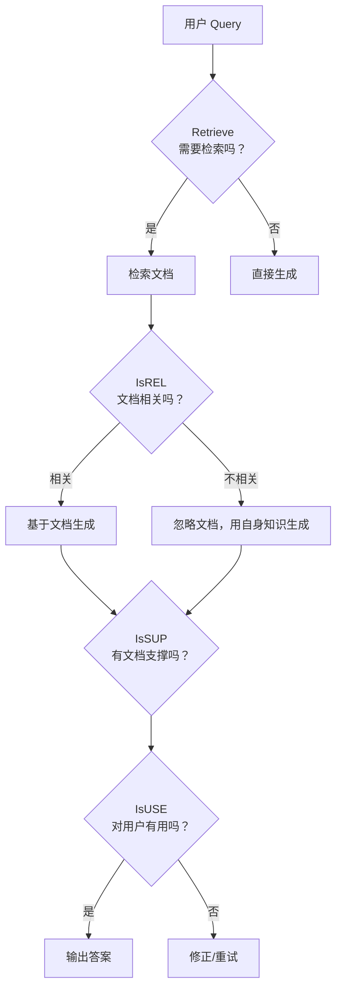
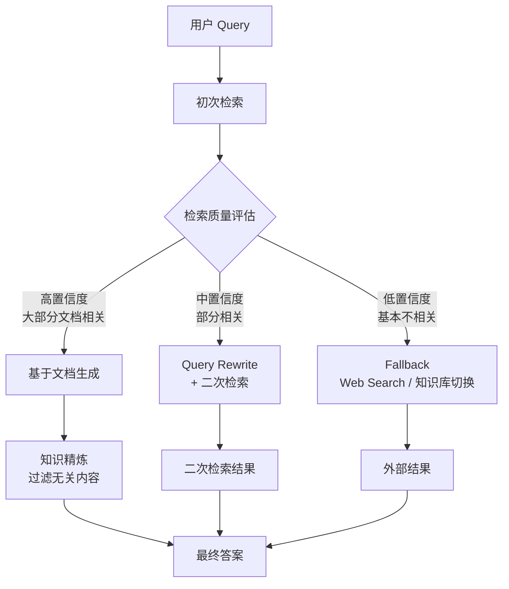
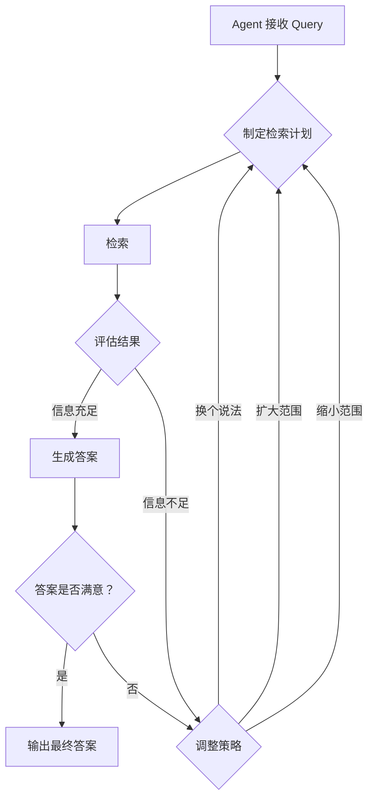
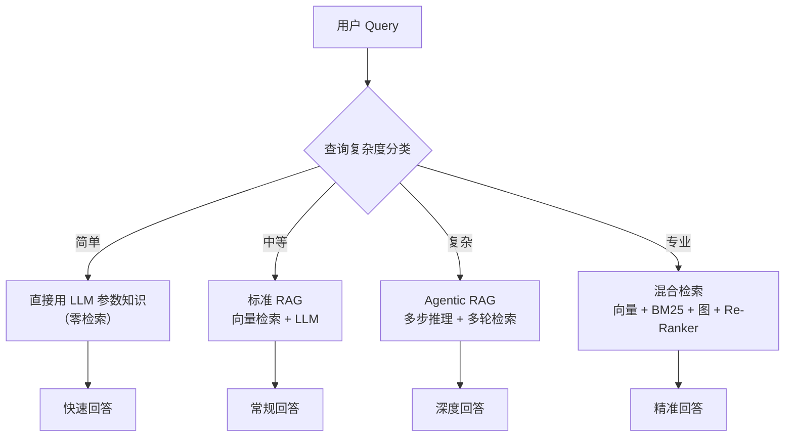

# 06-高级 RAG 模式最佳实践

> 基础 RAG（Retrieve → Generate）已是最小可行范式。在它之上，行业演进出了 Self-RAG、
> CRAG、Agentic RAG 等高级模式，通过引入"自我反思""纠错""自适应"等能力，大幅提升回答质量。
> 本文梳理这些高级模式，并与 StarRing 现有的 Agent 架构进行对比。

## 目录

- [一、Self-RAG](#一self-rag)
- [二、Corrective RAG（CRAG）](#二corrective-ragcrag)
- [三、Agentic RAG](#三agentic-rag)
- [四、Adaptive RAG](#四adaptive-rag)
- [五、ReflectiveRAG（Amazon 2026）](#五reflectiverag-amazon-2026)
- [六、对比 StarRing 现状](#六对比-starring-现状)
- [七、优化建议](#七优化建议)

---

## 一、Self-RAG

### 1.1 提出背景

**出处**：Asai et al.，论文 "Self-RAG: Learning to Retrieve, Generate, and Critique through Self-Reflection"，2023 年（ICLR 2024 Spotlight）。

传统 RAG 无条件检索（每次查询都检索），即使 LLM 自身就能回答的问题也去检索，既浪费资源又可能引入噪声。Self-RAG 让模型**自主决定**何时检索、检索结果是否相关、生成内容是否有依据。

### 1.2 核心机制：反思 Token

Self-RAG 在生成过程中产出特殊的 **反思 Token**（Reflection Tokens）：



**4 种反思 Token**：

| Token | 含义 | 判断内容 |
|-------|------|----------|
| `Retrieve` | 是否需要检索 | 问题是否能用参数知识回答 |
| `IsREL` | 是否相关 | 检索到的文档是否与问题相关 |
| `IsSUP` | 是否有支撑 | 生成的内容是否有检索文档支撑 |
| `IsUSE` | 是否有用 | 回答对用户是否有帮助 |

### 1.3 用 Prompt 工程模拟 Self-RAG

虽然原始 Self-RAG 需要微调，但可以用 Prompt 工程近似实现：

```python
SELF_RAG_PROMPT = """你是一个具备自我反思能力的 RAG 系统。请按以下流程处理问题：

步骤 1: 判断是否需要检索
- 如果问题涉及事实、数据、专业知识，需要检索
- 如果是简单常识或你已经知道的内容，可以跳过检索

步骤 2: 如果检索了，评估检索结果
- 判断每篇文档是否与问题相关
- 标记不相关的文档

步骤 3: 生成回答
- 基于相关文档生成回答
- 对每个关键陈述，标记是否有文档支撑

步骤 4: 自我评估
- 回答是否有用？是否解决了用户问题？
- 如果不够好，说明需要改进的方向

问题：{query}

检索文档：{documents}

请按上述流程处理，并标注每个阶段的决策。"""


async def self_rag_query(query: str, retriever, llm) -> dict:
    """Prompt 工程模拟 Self-RAG"""
    # Step 1: 判断是否需要检索
    need_retrieval = await llm.generate(
        f"以下问题是否需要检索外部知识才能准确回答？只回答'是'或'否'。\n问题：{query}"
    )

    if "否" in need_retrieval:
        answer = await llm.generate(f"直接用你的知识回答：{query}")
        return {"answer": answer, "retrieved": False}

    # Step 2: 检索并评估
    docs = await retriever.search(query, top_k=5)
    relevance = await llm.generate(f"""
    评估以下文档与问题"{query}"的相关性。
    对每篇文档标记"相关"或"不相关"。

    文档：
    {_format_docs(docs)}
    """)

    # Step 3: 基于相关文档生成
    relevant_docs = _filter_relevant(docs, relevance)
    answer = await llm.generate(f"""
    基于以下相关文档回答问题。

    文档：{_format_docs(relevant_docs)}
    问题：{query}

    对回答中的每个关键陈述，用[有支撑]或[推断]标记。""")

    return {
        "answer": answer,
        "retrieved": True,
        "docs_used": len(relevant_docs),
    }
```

### 1.4 效果

- 在不必要检索的问题上减少约 40% 的检索调用
- 回答质量（忠实度）提升约 10-15%
- 原文需要微调，Prompt 模拟可获约 60-70% 的效果

---

## 二、Corrective RAG（CRAG）

### 2.1 提出背景

**出处**：Yan et al.，论文 "Corrective Retrieval Augmented Generation"，2024 年。

CRAG 在 Self-RAG 基础上增加了**检索质量评估 + 自动纠错**机制：



### 2.2 核心组件

```python
class CRAGPipeline:
    """Corrective RAG Pipeline"""

    def __init__(self, retriever, llm, web_search=None):
        self.retriever = retriever
        self.llm = llm
        self.web_search = web_search

    async def run(self, query: str) -> dict:
        # Step 1: 初次检索
        docs = await self.retriever.search(query, top_k=10)

        # Step 2: 检索质量评估（CRAG 的核心）
        confidence, relevant_docs = await self._evaluate_retrieval(query, docs)

        if confidence == "high":
            # 高置信度：直接使用，做知识精炼
            refined = await self._refine_knowledge(query, relevant_docs)
            answer = await self._generate(query, refined)

        elif confidence == "medium":
            # 中置信度：Query Rewrite + 二次检索
            rewritten = await self._rewrite_query(query)
            more_docs = await self.retriever.search(rewritten, top_k=5)
            all_docs = relevant_docs + more_docs
            refined = await self._refine_knowledge(query, all_docs)
            answer = await self._generate(query, refined)

        else:  # low
            # 低置信度：Fallback to Web Search
            if self.web_search:
                web_docs = await self.web_search(query)
                answer = await self._generate(query, web_docs)
            else:
                answer = await self.llm.generate(
                    f"检索未找到相关信息，请基于你的知识回答：{query}"
                )

        return {"answer": answer, "confidence": confidence}

    async def _evaluate_retrieval(self, query: str, docs: list[dict]) -> tuple[str, list[dict]]:
        """评估检索质量，返回置信度和相关文档"""
        eval_prompt = f"""评估以下检索结果对问题的覆盖程度。

问题：{query}

检索文档：
{_format_docs(docs)}

请评估：
1. 有多少文档与问题相关？
2. 相关信息是否足够回答这个问题？

返回 JSON：
{{"confidence": "high|medium|low", "relevant_indices": [0, 2, 5], "reasoning": "..."}}"""

        result = await self.llm.generate_json(eval_prompt)
        confidence = result["confidence"]
        relevant = [docs[i] for i in result.get("relevant_indices", [])]

        return confidence, relevant
```

### 2.3 效果

- CRAG 论文报告：相比标准 RAG，准确率提升 5-10pp
- Fallback 机制使"完全无法回答"的问题转化率提升 30%+

---

## 三、Agentic RAG

### 3.1 提出背景

**出处**：LangGraph 官方示例 + 社区实践，2024 年。

Agentic RAG 用 Agent 控制检索全流程，实现**多轮检索-评估-修正循环**：



### 3.2 关键特点

| 特点 | 传统 RAG | Agentic RAG |
|------|---------|------------|
| 检索次数 | 1 次 | 多次，根据反馈调整 |
| 检索策略 | 固定 | Agent 动态决定 |
| 停止条件 | 无条件 | 信息充足或达到最大轮次 |
| 工具使用 | 仅向量库 | 可调用多种工具（web、数据库、API） |
| 错误处理 | 返回空结果 | 自动 fallback 或修正 |

---

## 四、Adaptive RAG

### 4.1 提出背景

**出处**：学术研究 + 工业实践，2024 年。

不是所有 Query 都需要复杂的 RAG 流程。Adaptive RAG 根据查询复杂度动态选择策略：



### 4.2 复杂度分类

```python
async def classify_query_complexity(query: str, llm) -> str:
    """将查询分为简单/中等/复杂/专业"""
    prompt = f"""分析以下查询的复杂度，分类为 simple/medium/complex/specialized：

分类标准：
- simple：常识性问题，LLM 可直接回答（如"什么是AI？"）
- medium：需要检索但范围明确（如"公司的退款政策是什么？"）
- complex：需要多步推理或多文档综合（如"比较A和B的Q3财报"）
- specialized：需要精确匹配的专业术语（如"请找出关于GDPR第17条的内容"）

查询：{query}

只返回分类标签。"""
    result = await llm.generate(prompt)
    return result.strip().lower()
```

---

## 五、ReflectiveRAG（Amazon 2026）

### 5.1 提出背景

**出处**：Amazon AGI，EACL 2026 论文。

ReflectiveRAG 是融合 Self-RAG 和 CRAG 思路的最新成果，核心是两个机制：

1. **Self-Reflective Retrieval**：模型自我评估检索是否需要、检索结果是否充分
2. **Contrastive Noise Removal**：通过对比学习过滤检索噪声

### 5.2 实验数据

| 指标 | 提升 |
|------|------|
| Exact Match (EM) | +2.7pp |
| F1 Score | +2.5pp |
| 证据冗余 | ↓30.88% |
| 额外延迟 | 仅 +18ms |

### 5.3 关键洞察

- "证据冗余减少 30.88%" 说明模型能更精准地定位关键信息，而非堆砌大量相关但不必要的上下文
- "+18ms 延迟" 表明自我反思机制的额外计算代价极低

---

## 六、对比 StarRing 现状

### 6.1 StarRing 当前能力

| 特性 | StarRing 现状 |
|------|-------------|
| Agent 架构 | ✅ LangGraph 多 Agent，支持多步推理 |
| 检索模式 | ✅ vector / keyword / hybrid + 图检索 |
| 检索质量评估 | ❌ 无显式的检索质量评估 |
| CRAG Fallback | ❌ 检索失败无自动 fallback |
| 自适应策略 | ❌ 不区分 Query 复杂度，使用固定策略 |
| Self-RAG 反思 | ❌ 无反思 Token 机制 |

### 6.2 差距分析

| 行业最佳实践 | StarRing 现状 | 差距 |
|-------------|-------------|------|
| **Self-RAG** | 无反思机制 | Agent 不判断是否需要检索或检索结果是否相关 |
| **CRAG** | 无纠错机制 | 检索质量差时不会自动 rewrite 或 fallback |
| **Agentic RAG** | 部分具备（LangGraph Agent） | 缺少显式的"检索-评估-修正"闭环 |
| **Adaptive RAG** | 无 | 不区分查询复杂度 |
| **ReflectiveRAG** | 无 | 论文 2026 年，最前沿 |

### 6.3 StarRing 优势

- LangGraph Agent 架构天然支持多步推理，为 Agentic RAG 提供了良好的基础
- 多路召回已实现，可直接在此基础上增加评估与修正逻辑

---

## 七、优化建议

### 7.1 P1（中优先）—— 内置检索质量评估（CRAG Lite）

在 Agent 检索节点后增加评估步骤：

```python
# 在现有 Agent 的检索节点中增加质量评估
async def retrieve_with_evaluation(query: str, retriever, llm):
    docs = await retriever.search(query, top_k=10)
    evaluation = await evaluate_retrieval_quality(query, docs, llm)

    if evaluation["confidence"] == "low":
        # Fallback: 尝试图检索或调整参数
        docs = await retriever.search(query, top_k=20, mode="hybrid")

    return docs, evaluation
```

### 7.2 P1（中优先）—— Adaptive RAG 路由

在接收 Query 时增加复杂度判断，自动选择检索策略：

- 简单 → 零检索（用 LLM 自身知识）
- 中等 → 标准向量检索
- 复杂 → 混合检索 + Re-Ranker + 多步推理

### 7.3 P2（低优先）—— Self-RAG 反思 Prompt

- 在生成 Prompt 中增加"是否有文档支撑"的标注要求
- 利用现有 LangGraph Agent 的评估节点（如 Supervisor）实现反思闭环

---

> **参考来源**：
> - Self-RAG：[论文](https://arxiv.org/abs/2310.11511)，Asai et al. 2023
> - CRAG：[论文](https://arxiv.org/abs/2401.15884)，Yan et al. 2024
> - ReflectiveRAG：EACL 2026，Amazon AGI
> - LangGraph Agentic RAG：[官方文档](https://langchain-ai.github.io/langgraph/tutorials/rag/langgraph_agentic_rag/)
