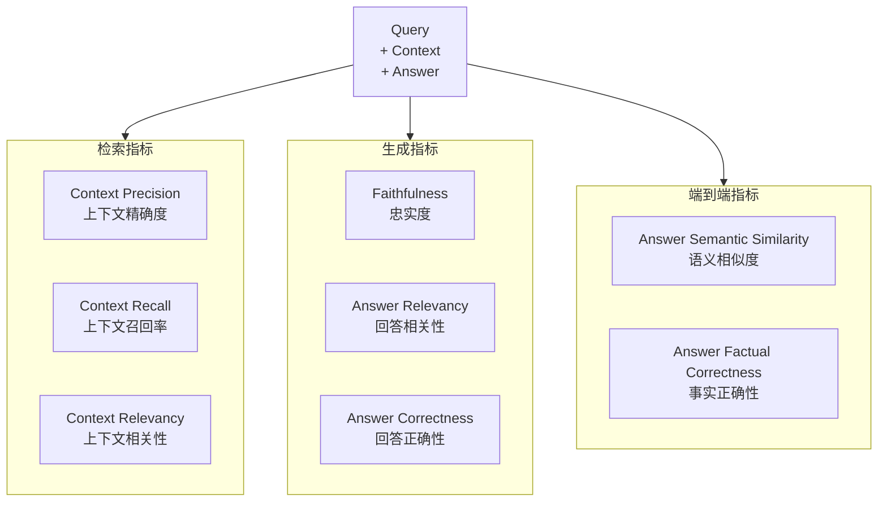
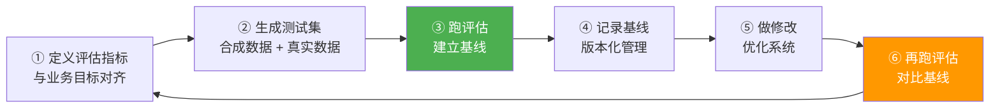

# 07-RAG 评估体系最佳实践

> "如果你不能度量它，你就不能改进它。" —— RAG 系统的评估是持续优化的前提。
> 本文梳理行业标准的 RAG 评估框架和指标体系，并与 StarRing 现有测试体系进行对比。

## 目录

- [一、RAGAS 评估框架](#一ragas-评估框架)
- [二、检索指标详解](#二检索指标详解)
- [三、生成指标详解](#三生成指标详解)
- [四、噪声敏感度与鲁棒性](#四噪声敏感度与鲁棒性)
- [五、评估流水线](#五评估流水线)
- [六、对比 StarRing 现状](#六对比-starring-现状)
- [七、优化建议](#七优化建议)

---

## 一、RAGAS 评估框架

### 1.1 提出背景

**出处**：RAGAS（RAG Assessment），开源项目 [explodinggradients/ragas](https://github.com/explodinggradients/ragas)，2023-2024 年，是目前 RAG 评估领域事实上的标准框架。

### 1.2 核心指标体系



### 1.3 快速集成

```python
from ragas import evaluate
from ragas.metrics import (
    context_precision,
    context_recall,
    faithfulness,
    answer_relevancy,
)
from datasets import Dataset


def evaluate_rag_system(
    queries: list[str],
    contexts: list[list[str]],
    answers: list[str],
    ground_truths: list[str] | None = None,
):
    """使用 RAGAS 评估 RAG 系统"""
    data = {
        "question": queries,
        "contexts": contexts,
        "answer": answers,
    }
    if ground_truths:
        data["ground_truth"] = ground_truths

    dataset = Dataset.from_dict(data)
    metrics = [
        context_precision,
        context_recall,
        faithfulness,
        answer_relevancy,
    ]

    result = evaluate(dataset, metrics=metrics)
    return result
```

---

## 二、检索指标详解

### 2.1 Hit Rate（命中率）

最基本的检索指标：返回结果中至少有一个相关文档的比例。

```python
def hit_rate(queries: list[str], retrieved_docs: list[list[dict]],
             relevance_labels: list[list[bool]]) -> float:
    """计算 Hit Rate"""
    hits = 0
    for docs, labels in zip(retrieved_docs, relevance_labels):
        if any(labels[i] for i in range(min(len(docs), len(labels)))):
            hits += 1
    return hits / len(queries)
```

### 2.2 MRR（Mean Reciprocal Rank）

考虑第一个相关文档的排名位置：

```python
def mean_reciprocal_rank(rankings: list[list[int]]) -> float:
    """
    MRR = mean(1 / rank_of_first_relevant)
    rankings: 每个查询的相关文档排名列表
    """
    reciprocal_ranks = []
    for query_ranks in rankings:
        for rank in query_ranks:
            reciprocal_ranks.append(1.0 / rank)
            break  # 只取第一个
        else:
            reciprocal_ranks.append(0.0)  # 无相关文档
    return sum(reciprocal_ranks) / len(reciprocal_ranks)
```

### 2.3 NDCG@k（Normalized Discounted Cumulative Gain）

考虑排序位置的折扣累积增益：

```python
def ndcg_at_k(scores: list[list[float]], k: int = 10) -> float:
    """NDCG@k：考虑位置权重的排序质量"""
    dcg_at_k = []
    for query_scores in scores:
        # DCG
        dcg = sum(
            (2**rel - 1) / math.log2(i + 2)
            for i, rel in enumerate(query_scores[:k])
        )
        # IDCG（理想排序的 DCG）
        ideal_scores = sorted(query_scores, reverse=True)[:k]
        idcg = sum(
            (2**rel - 1) / math.log2(i + 2)
            for i, rel in enumerate(ideal_scores)
        )
        dcg_at_k.append(dcg / idcg if idcg > 0 else 0.0)

    return sum(dcg_at_k) / len(dcg_at_k)
```

### 2.4 Context Precision / Recall / Relevancy（RAGAS 定义）

| 指标 | 定义 | 测量方式 |
|------|------|----------|
| **Context Precision** | 检索到的上下文中，相关 chunk 的比例 | LLM 判断每个 chunk 是否相关 |
| **Context Recall** | ground truth 需要的信息中，被检索到的比例 | 将 ground truth 拆为独立陈述，逐一对比 |
| **Context Relevancy** | 检索到的内容中，不冗余的比例 | LLM 判断是否有无关或重复内容 |

---

## 三、生成指标详解

### 3.1 Faithfulness（忠实度）—— 最重要的指标

**定义**：生成的答案是否完全基于检索到的上下文，而不包含"幻觉"。

RAGAS 的做法：将生成的答案拆解为独立的陈述（claims），逐一判断每个陈述是否能从检索上下文中推断出来。

```python
async def evaluate_faithfulness(
    answer: str,
    contexts: list[str],
    llm,
) -> float:
    """评估答案忠实度"""
    # Step 1: 将答案拆解为独立陈述
    claims = await _extract_claims(answer, llm)

    # Step 2: 逐一判断每个陈述是否有上下文支撑
    supported = 0
    for claim in claims:
        is_supported = await _check_claim_support(claim, contexts, llm)
        if is_supported:
            supported += 1

    faithfulness = supported / len(claims) if claims else 0.0
    return faithfulness


async def _check_claim_support(claim: str, contexts: list[str], llm) -> bool:
    """检查单个陈述是否被上下文支撑"""
    prompt = f"""判断以下陈述是否能从给定上下文中推断出来。

上下文：
{chr(10).join(contexts)}

陈述：{claim}

只回答"是"或"否"。"""
    response = await llm.generate(prompt)
    return "是" in response
```

### 3.2 Answer Relevancy（回答相关性）

**定义**：回答是否切题，是否包含了与问题无关的信息。

### 3.3 Context Utilization（上下文利用率）

**定义**：检索到的上下文中，真正被用于生成答案的比例。

```python
def context_utilization(answer: str, contexts: list[str]) -> float:
    """简单计算上下文利用率"""
    used_count = 0
    for ctx in contexts:
        # 检查答案中是否引用了该上下文的关键信息
        if _has_text_overlap(answer, ctx):
            used_count += 1
    return used_count / len(contexts) if contexts else 0.0
```

---

## 四、噪声敏感度与鲁棒性

### 4.1 Noise Sensitivity

**定义**：在检索结果中添加无关文档后，Faithfulness 的下降程度。

```python
async def evaluate_noise_sensitivity(
    query: str,
    relevant_contexts: list[str],
    noise_contexts: list[str],
    llm,
    generator,
):
    """评估噪声敏感度"""
    # 纯净环境下的 faithfulness
    clean_answer = await generator(query, relevant_contexts)
    clean_faith = await evaluate_faithfulness(clean_answer, relevant_contexts, llm)

    # 添加噪声后的 faithfulness
    noisy_contexts = relevant_contexts + noise_contexts
    noisy_answer = await generator(query, noisy_contexts)
    noisy_faith = await evaluate_faithfulness(noisy_answer, noisy_contexts, llm)

    # 噪声敏感度 = faithfulness 下降程度
    noise_sensitivity = clean_faith - noisy_faith
    return {
        "clean_faithfulness": clean_faith,
        "noisy_faithfulness": noisy_faith,
        "noise_sensitivity": noise_sensitivity,
    }
```

---

## 五、评估流水线

### 5.1 Azure Databricks 推荐的评估流程



### 5.2 合成测试集生成

**核心理念**：不追求完美的标注，但需要可重复的度量方式。

```python
async def generate_synthetic_test_set(
    documents: list[str],
    num_questions: int = 100,
    llm,
) -> list[dict]:
    """从知识库文档中自动生成测试问题"""
    test_set = []

    for doc in documents[:num_questions]:
        prompt = f"""基于以下文档，生成一个可以通过检索该文档来回答的问题。
同时提供标准答案。

文档：
{doc}

返回 JSON：
{{
    "question": "生成的问题",
    "answer": "标准答案",
    "question_type": "factual|reasoning|comparison"
}}"""

        result = await llm.generate_json(prompt)
        test_set.append({
            **result,
            "source_document": doc[:200],
        })

    return test_set
```

### 5.3 评估结果基线化

```python
class RAGBaseline:
    """RAG 评估基线管理系统"""

    def __init__(self, db_path: str = "rag_eval_baselines.db"):
        self.db_path = db_path

    def record_baseline(self, version: str, metrics: dict, config: dict):
        """记录一次评估基线"""
        record = {
            "version": version,
            "timestamp": datetime.now().isoformat(),
            "metrics": metrics,  # {"faithfulness": 0.92, "hit_rate": 0.85, ...}
            "config": config,    # {"chunk_size": 512, "retrieval_mode": "hybrid", ...}
        }
        self._save(record)

    def compare_with_baseline(self, current_metrics: dict, baseline_version: str) -> dict:
        """对比当前评估结果与基线"""
        baseline = self._load(baseline_version)
        comparison = {}
        for metric, value in current_metrics.items():
            baseline_value = baseline["metrics"].get(metric, 0)
            comparison[metric] = {
                "current": value,
                "baseline": baseline_value,
                "delta": value - baseline_value,
                "pct_change": (value - baseline_value) / baseline_value * 100 if baseline_value else 0,
            }
        return comparison
```

---

## 六、对比 StarRing 现状

### 6.1 StarRing 当前测试体系

| 测试类型 | 实现情况 | 位置 |
|----------|---------|------|
| 单元测试 | ✅ | `backend/test/unit/` |
| 集成测试 | ✅ | `backend/test/integration/` |
| RAG 评估工具 | ⚠️ 有基础代码 | `backend/package/starring/knowledge/eval/` |
| RAGAS 集成 | ❌ | 未使用 RAGAS 框架 |
| 自动化评估流水线 | ❌ | 无自动化的"基线 → 修改 → 再评估"闭环 |
| 合成测试集 | ⚠️ 有 benchmark_generation | `backend/package/starring/knowledge/eval/benchmark_generation.py` |

### 6.2 差距分析

| 行业最佳实践 | StarRing 现状 | 差距 |
|-------------|-------------|------|
| **标准化指标** | 有基础 metrics 代码 | 未覆盖 RAGAS 全部指标（Faithfulness、Context Precision 等） |
| **自动评估** | 手动测试为主 | 无自动化评估 pipeline |
| **基线对比** | 无 | 无法量化每次优化的效果 |
| **合成数据** | 有生成方向 | 未形成完整的测试集 |

---

## 七、优化建议

### 7.1 P1（中优先）—— 集成 RAGAS 评估

- 投入：1-2 天（RAGAS 安装 + 适配接口）
- 收益：获得行业标准的 Faithfulness、Context Precision 等指标

```python
# 在 eval/evaluator.py 中增加 RAGAS 评估
from ragas import evaluate
from ragas.metrics import faithfulness, context_precision, context_recall

async def evaluate_with_ragas(questions, contexts, answers, ground_truths=None):
    dataset = Dataset.from_dict({
        "question": questions,
        "contexts": contexts,
        "answer": answers,
        "ground_truth": ground_truths or [""] * len(questions),
    })
    return evaluate(dataset, metrics=[
        faithfulness, context_precision, context_recall,
    ])
```

### 7.2 P1（中优先）—— 建立评估基线

- 生成约 200 个合成测试问题
- 运行首次评估，记录基线
- 每次优化后重新评估对比

### 7.3 P2（低优先）—— CI 集成

- 将 RAG 评估集成到 CI/CD pipeline
- PR 合并前自动检测检索质量是否下降

---

> **参考来源**：
> - RAGAS：[GitHub](https://github.com/explodinggradients/ragas)，[官方文档](https://docs.ragas.io/)
> - Azure Databricks AI Search 评估指南，2024
> - IBM RAG Evaluation：[博客](https://research.ibm.com/blog/retrieval-augmented-generation-RAG)
