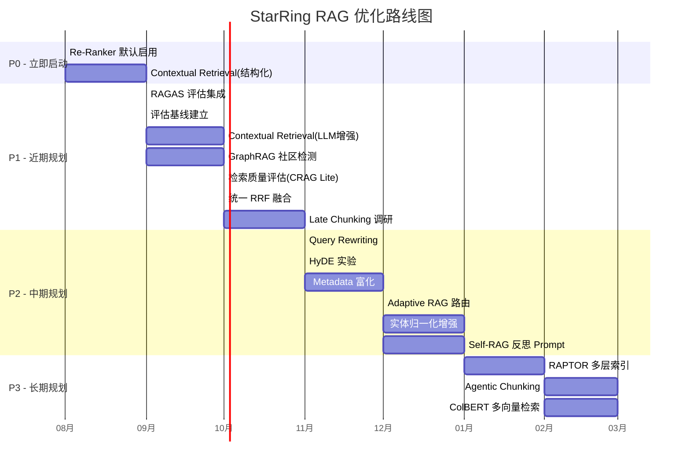

# 08-对比总结与优化路线图

> 本文汇总前 7 篇文档的核心发现，形成综合对比表与可落地的优化路线图。

## 目录

- [一、综合对比表](#一综合对比表)
- [二、优化路线图](#二优化路线图)
- [三、快速收益（Quick Wins）](#三快速收益quick-wins)
- [四、中长期规划](#四中长期规划)

---

## 一、综合对比表

### 1.1 文档切割

| 优化方向 | 当前 | 最佳实践 | 预估收益 | 实现难度 | 优先级 |
|----------|------|---------|---------|---------|--------|
| Contextual Retrieval | ❌ 无 | Anthropic 上下文前置生成 | 检索失败率 ↓67% | ⭐⭐ 中 | **P0** |
| Late Chunking | 传统先切后 Embed | Jina AI 先 Embed 后切 | 长文档检索 ↑15-20% | ⭐ 低 | P1 |
| Agentic Chunking | 手动选策略 | Agent 自动选策略 | 用户体验 ↑ | ⭐⭐⭐ 高 | P3 |
| Sentence Window | 不支持 | 检索小块、返回大块 | 生成质量 ↑ | ⭐ 低 | P2 |
| 多粒度索引 | 单粒度 | 文档级+段落级+句子级 | 总结问题质量 ↑ | ⭐⭐ 中 | P3 |

### 1.2 入库流程

| 优化方向 | 当前 | 最佳实践 | 预估收益 | 实现难度 | 优先级 |
|----------|------|---------|---------|---------|--------|
| Contextual Chunk Embedding | ❌ 无 | 入库时上下文增强 | 检索失败率 ↓49% | ⭐⭐ 中 | **P0** |
| Metadata 富化 | 基础元数据 | 实体提取 + 主题分类 | 检索精度 ↑9% | ⭐⭐ 中 | P2 |
| RAPTOR | ❌ 无 | 递归摘要树 | 长文档问答 ↑ | ⭐⭐⭐ 高 | P3 |

### 1.3 知识图谱

| 优化方向 | 当前 | 最佳实践 | 预估收益 | 实现难度 | 优先级 |
|----------|------|---------|---------|---------|--------|
| Community Detection | ❌ 无 | GraphRAG Leiden 算法 | 复杂关联 ↑75% Recall | ⭐⭐ 中 | P1 |
| Community Summary | ❌ 无 | LLM 社区摘要 | 宏观问题质量 ↑ | ⭐⭐ 中 | P1 |
| Global Search | ❌ 无 | 全局主题理解 | 概览型问题 ↑ | ⭐ 低 | P2 |
| 实体归一化 | 基础别名 | 外部知识库链接 | 图谱质量 ↑ | ⭐⭐ 中 | P2 |

### 1.4 混合检索与排序

| 优化方向 | 当前 | 最佳实践 | 预估收益 | 实现难度 | 优先级 |
|----------|------|---------|---------|---------|--------|
| Re-Ranker 启用 | 接口已有、默认关闭 | 默认启用 BGE/Cohere | 检索精度 ↑20-30% | ⭐ 低 | **P0** |
| Contextual BM25 | 普通 BM25 | 上下文增强 BM25 | 检索失败率 ↓60% | ⭐ 低 | P1 |
| 统一 RRF 融合 | 2 套融合机制 | 统一三路 RRF | 排序一致性 ↑ | ⭐ 低 | P1 |
| ColBERT | ❌ 无 | 多向量检索 | 精度接近 CE | ⭐⭐⭐ 高 | P3 |

### 1.5 查询优化

| 优化方向 | 当前 | 最佳实践 | 预估收益 | 实现难度 | 优先级 |
|----------|------|---------|---------|---------|--------|
| Query Rewriting | ❌ 无 | LLM Query Rewriting | 召回率 ↑10-15% | ⭐ 低 | P2 |
| HyDE | ❌ 无 | 假设文档检索 | 事实型问题 ↑ | ⭐ 低 | P2 |
| Query Decomposition | Agent 隐式 | 显式分解 + 综合 | 复杂问题 ↑ | ⭐⭐ 中 | P3 |

### 1.6 高级 RAG 模式

| 优化方向 | 当前 | 最佳实践 | 预估收益 | 实现难度 | 优先级 |
|----------|------|---------|---------|---------|--------|
| 检索质量评估 | ❌ 无 | CRAG 检索评估 | 减少 30%+ 劣质检索 | ⭐⭐ 中 | P1 |
| Adaptive RAG | 固定策略 | 按复杂度选策略 | 效率 + 质量 ↑ | ⭐⭐ 中 | P2 |
| Self-RAG 反思 | ❌ 无 | Prompt 模拟反思 | 幻觉 ↓保持质量 ↑ | ⭐ 低 | P2 |

### 1.7 评估体系

| 优化方向 | 当前 | 最佳实践 | 预估收益 | 实现难度 | 优先级 |
|----------|------|---------|---------|---------|--------|
| RAGAS 集成 | ❌ 无 | 标准化指标 | 可量化迭代 | ⭐ 低 | P1 |
| 评估基线 | ❌ 无 | 基线 + 对比 | 衡量优化效果 | ⭐ 低 | P1 |
| 合成测试集 | ⚠️ 有方向 | 自动生成 200+ 问题 | CI 可集成 | ⭐ 低 | P2 |

---

## 二、优化路线图

---

## 三、快速收益（Quick Wins）

### 3.1 第 1 周即可见效（投入 < 1 天）

| 序号 | 优化项 | 做法 | 预期收益 |
|------|--------|------|----------|
| 1 | **默认启用 Re-Ranker** | 将 `use_reranker` 默认改为 True | 检索精度 ↑20-30% |
| 2 | **结构化上下文增强** | 利用现有 title_stack 为零成本添加上下文前缀 | 检索失败率 ↓10-15% |

### 3.2 第 1 月可完成（2-5 天）

| 序号 | 优化项 | 做法 | 预期收益 |
|------|--------|------|----------|
| 3 | **RAGAS 基线建立** | 集成 RAGAS，生成 200 测试问题，跑基线 | 可量化后续所有优化效果 |
| 4 | **LLM Contextual Retrieval** | 对高价值文档启用 LLM 上下文生成 | 检索失败率 ↓49-67% |
| 5 | **检索质量评估** | 在 Agent 检索后增加评估 + Fallback | 劣质回答 ↓30% |

---

## 四、中长期规划

### 4.1 6 个月目标

完成 P0 + P1 全部优化后，预期 StarRing 的 RAG 能力将达到：

| 维度 | 当前状态 | 6 个月后 |
|------|----------|----------|
| 检索精度 | 基准 | ↑30-40% |
| 复杂问题（跨文档综合） | 基准 | ↑50%+（得益于 GraphRAG 社区检测） |
| 回答忠实度 | 基准 | ↑15-20% |
| 可量化性 | 无 | RAGAS 全指标覆盖 |
| 自愈能力 | 无 | 检索失败自动 fallback |

### 4.2 技术债务清理建议

在当前优化过程中，建议同步考虑：

1. **统一融合机制**：当前 Milvus WeightedRanker（向量+BM25）和 RRF（向量/BM25+图）是两套机制，长期建议统一为 RRF 三路融合
2. **Metadata 字段规范**：在 PostgreSQL `knowledge_chunks` 表中规范 metadata 字段，为未来的过滤检索打好基础
3. **Agent 评估节点**：在现有 Supervisor Agent 中增加检索质量的评估逻辑

---

## 附录：优先级说明

| 优先级 | 含义 | 投入 | 典型周期 |
|--------|------|------|----------|
| **P0** | 立即启动，收益确定且显著 | 低-中 | 1 天 - 2 周 |
| **P1** | 近期规划，收益预期好 | 低-中 | 1 周 - 1 月 |
| **P2** | 中期规划，需要更多实验验证 | 低-中 | 1-3 月 |
| **P3** | 长期探索，需要较大改动 | 高 | 3-6 月 |

---

> **参考汇总**：
> - Anthropic Contextual Retrieval（2024）：检索失败率降低 67% 的全栈方案
> - Microsoft GraphRAG（2024）：社区检测 + Global/Local Search
> - RAGAS Framework：RAG 评估的事实标准
> - Jina AI Late Chunking（2024）：先 Embed 后切的长文档方案
> - CRAG / Self-RAG / ReflectiveRAG：RAG 纠错与反思的演进路径
