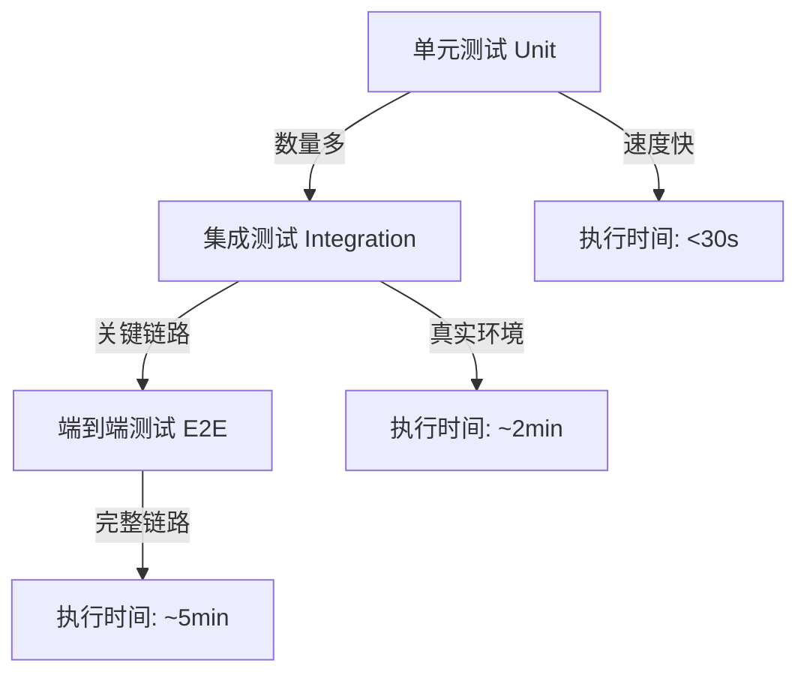

# 测试分层设计

> **核心代码路径**
> - 单元测试：`backend/test/unit/`
> - 集成测试：`backend/test/integration/`
> - E2E测试：`backend/test/e2e/`
> - 测试配置：`backend/test/conftest.py`

## 一、技术亮点概览

建立**三层测试金字塔**，实现测试覆盖率与执行效率的平衡：
- **单元测试层**：70+ 测试文件，覆盖率 80%+，执行时间 <30秒
- **集成测试层**：30+ API集成测试，验证真实环境，执行时间 ~2分钟
- **端到端测试层**：关键链路E2E测试，覆盖核心业务流程，执行时间 ~5分钟

## 二、测试架构设计

### 2.1 三层测试金字塔



**测试分层对比**：

| 维度 | 单元测试 | 集成测试 | E2E测试 |
|------|---------|---------|---------|
| 位置 | backend/test/unit | backend/test/integration | backend/test/e2e |
| 数量 | 70+ 文件 | 30+ 文件 | 5+ 文件 |
| 执行时间 | <30秒 | ~2分钟 | ~5分钟 |
| 环境依赖 | 无 | Docker服务 | Docker服务 |
| 覆盖范围 | 单个函数/类 | API接口 | 完整业务流程 |
| Mock使用 | 推荐 | 谨慎 | 禁止 |

### 2.2 单元测试设计

**测试原则**：
- 不依赖运行中的 Docker 服务
- 优先使用 `monkeypatch`、fake repo、stub
- 遵循 Arrange-Act-Assert 三段式

**示例**（backend/test/unit/agents/test_supervisor_backend.py）：

```python
import pytest
from unittest.mock import AsyncMock, patch

class TestSupervisorBackend:
    """Supervisor Agent 后端单元测试"""

    @pytest.mark.asyncio
    async def test_supervisor_graph_compiles_successfully(self):
        """测试：Supervisor 图能正常编译"""
        # Arrange: 准备依赖
        backend = SupervisorBackend(agent_id="test-supervisor")

        # Act: 执行编译
        with patch('starring.agents.backends.supervisor.resolve_tools') as mock_tools:
            mock_tools.return_value = []
            graph = await backend.get_graph()

        # Assert: 验证结果
        assert graph is not None
        assert hasattr(graph, 'ainvoke')

    @pytest.mark.asyncio
    async def test_supervisor_uses_checkpointer_from_env(self, monkeypatch):
        """测试：Checkpointer 根据环境变量选择后端"""
        # Arrange: 设置环境变量
        monkeypatch.setenv("LANGGRAPH_CHECKPOINTER_BACKEND", "postgres")

        backend = SupervisorBackend(agent_id="test-supervisor")

        # Act: 获取 checkpointer
        checkpointer = await backend._get_checkpointer()

        # Assert: 验证类型
        assert "PostgresSaver" in str(type(checkpointer))
```

**目录结构**：

```
backend/test/unit/
├── agents/                    # Agent 单元测试
│   ├── buildin/               # 内置 Agent 测试
│   │   ├── test_supervisor_backend.py
│   │   ├── test_workflow_backend.py
│   │   └── test_workflow_nodes.py
│   ├── skills/                # Skills 测试
│   └── toolkits/              # Toolkits 测试
├── backends/                  # Backend 单元测试
│   ├── test_knowledge_base_backend.py
│   ├── test_sandbox_backends.py
│   └── test_skills_backend.py
├── services/                  # Service 单元测试
│   ├── test_agent_run_service.py
│   ├── test_chat_service_sync.py
│   └── test_langfuse_service.py
├── middlewares/               # 中间件测试
│   ├── test_summary_middleware.py
│   └── test_token_usage_middleware.py
└── utils/                     # 工具函数测试
    ├── test_image_processor.py
    └── test_share_config.py
```

### 2.3 集成测试设计

**测试原则**：
- 依赖 `docker compose up -d` 后的运行环境
- 通过真实 HTTP 接口验证认证、权限、参数和副作用
- 使用 fixture 创建测试资源

**示例**（backend/test/integration/api/test_chat_router.py）：

```python
import pytest
from httpx import AsyncClient

class TestChatRouter:
    """Chat API 集成测试"""

    @pytest.mark.asyncio
    async def test_chat_endpoint_returns_200_with_valid_request(
        self,
        test_client: AsyncClient,
        admin_headers: dict
    ):
        """测试：合法请求返回200"""
        # Arrange: 准备请求体
        request_body = {
            "agent_id": "test-agent",
            "message": "Hello, Agent!"
        }

        # Act: 发送真实HTTP请求
        response = await test_client.post(
            "/api/chat",
            json=request_body,
            headers=admin_headers
        )

        # Assert: 验证响应
        assert response.status_code == 200
        data = response.json()
        assert "response" in data

    @pytest.mark.asyncio
    async def test_chat_endpoint_returns_401_without_auth(
        self,
        test_client: AsyncClient
    ):
        """测试：未认证返回401"""
        response = await test_client.post(
            "/api/chat",
            json={"agent_id": "test", "message": "test"}
        )

        assert response.status_code == 401
```

**Fixture 管理**（backend/test/integration/conftest.py）：

```python
import pytest
from httpx import AsyncClient

@pytest.fixture
async def test_client():
    """真实环境测试客户端"""
    async with AsyncClient(base_url="http://localhost:5050") as client:
        yield client

@pytest.fixture
def admin_headers():
    """管理员认证头"""
    return {
        "Authorization": "Bearer admin-test-token",
        "Content-Type": "application/json"
    }

@pytest.fixture
async def standard_user(test_client: AsyncClient, admin_headers: dict):
    """创建标准用户"""
    response = await test_client.post(
        "/api/users",
        json={"username": "test-user", "password": "test123"},
        headers=admin_headers
    )
    yield response.json()
    # Cleanup
    await test_client.delete(f"/api/users/{response.json()['id']}", headers=admin_headers)
```

### 2.4 端到端测试设计

**测试原则**：
- 覆盖关键链路（run、viewer、附件、文件落盘等）
- 默认数量少、执行更慢
- 允许轮询等待最终状态

**示例**（backend/test/e2e/test_agent_bubble_sort_e2e.py）：

```python
import pytest
import asyncio

class TestAgentBubbleSortE2E:
    """Agent 冒泡排序端到端测试"""

    @pytest.mark.asyncio
    @pytest.mark.e2e
    async def test_bubble_sort_agent_produces_correct_output(
        self,
        e2e_client: AsyncClient,
        e2e_headers: dict
    ):
        """测试：冒泡排序Agent产生正确输出"""
        # Arrange: 创建 Agent
        create_response = await e2e_client.post(
            "/api/agents",
            json={
                "name": "Bubble Sort Agent",
                "type": "workflow",
                "config": {
                    "nodes": [
                        {"type": "start", "id": "start"},
                        {"type": "llm", "id": "sort", "config": {"prompt": "Sort array"}},
                        {"type": "end", "id": "end"}
                    ]
                }
            },
            headers=e2e_headers
        )
        agent_id = create_response.json()["id"]

        # Act: 运行 Agent
        run_response = await e2e_client.post(
            "/api/runs",
            json={
                "agent_id": agent_id,
                "input": {"array": [5, 3, 8, 1, 9]}
            },
            headers=e2e_headers
        )
        run_id = run_response.json()["run_id"]

        # 等待完成（轮询）
        for _ in range(30):  # 最多等待30秒
            status_response = await e2e_client.get(
                f"/api/runs/{run_id}",
                headers=e2e_headers
            )
            status = status_response.json()["status"]
            if status == "completed":
                break
            await asyncio.sleep(1)

        # Assert: 验证结果
        assert status == "completed"

        artifacts_response = await e2e_client.get(
            f"/api/runs/{run_id}/artifacts",
            headers=e2e_headers
        )
        artifacts = artifacts_response.json()["artifacts"]

        # 验证输出文件
        assert any(a["path"].endswith("sorted_array.json") for a in artifacts)
```

### 2.5 测试运行脚本

**统一测试运行器**（backend/test/run_tests.sh）：

```bash
#!/bin/bash

set -euo pipefail

echo "starring 测试运行器"
echo "========================"

PYTEST_CMD=("docker" "compose" "exec" "api" "uv" "run" "--group" "test" "pytest")

check_server() {
    echo "检查测试服务器状态..."
    if curl -s http://localhost:5050/api/system/health > /dev/null 2>&1; then
        echo "✓ 测试服务器运行正常"
        return 0
    fi

    echo "✗ 警告: 测试服务器未运行或无法访问"
    echo "  请先执行 docker compose up -d 并确认 api-dev 健康"
    return 1
}

run_unit_tests() {
    echo "运行单元测试..."
    "${PYTEST_CMD[@]}" test/unit -m "not slow"
}

run_integration_tests() {
    echo "运行集成测试..."
    check_server
    "${PYTEST_CMD[@]}" test/integration
}

run_e2e_tests() {
    echo "运行端到端测试..."
    check_server
    "${PYTEST_CMD[@]}" test/e2e -m e2e
}

run_all_tests() {
    echo "运行全部测试..."
    check_server
    "${PYTEST_CMD[@]}" test
}

case "${1:-all}" in
    "unit") run_unit_tests ;;
    "integration") run_integration_tests ;;
    "e2e") run_e2e_tests ;;
    "all") run_all_tests ;;
    *) echo "未知选项: $1"; exit 1 ;;
esac
```

**使用方式**：

```bash
# 运行单元测试（快速反馈）
backend/test/run_tests.sh unit

# 运行集成测试（API验证）
backend/test/run_tests.sh integration

# 运行E2E测试（完整链路）
backend/test/run_tests.sh e2e

# 运行全部测试
backend/test/run_tests.sh all
```

## 三、测试最佳实践

### 3.1 命名规范

**文件命名**：
- 使用 `test_<domain>_<target>.py`
- 一个文件只测一个明确主题

**函数命名**：
- 使用 `test_<行为>_<预期结果>`
- 名称直接表达业务语义

**示例**：
```python
# ✅ 好的命名
def test_create_agent_run_commits_before_enqueue():
    ...

def test_viewer_download_returns_attachment_response():
    ...

# ❌ 差的命名
def test_agent_run():
    ...

def test_download():
    ...
```

### 3.2 断言规范

**三段式断言**：

```python
def test_agent_run_persists_state():
    # Arrange: 准备数据
    agent = Agent(id="test", type="chatbot")
    run_id = "run-123"

    # Act: 执行操作
    result = await agent.run(run_id)

    # Assert: 验证结果
    assert result.status == "completed"
    assert result.state is not None
    assert len(result.artifacts) > 0
```

**禁止的断言**：
- ❌ 只断言 `status_code == 200`
- ❌ 使用 `print` 作为判断手段
- ❌ 因为没有数据就 `skip`

### 3.3 Mock 使用规范

**允许**：
- 单元测试里使用 `monkeypatch`
- 集成测试里通过 fixture 创建测试资源

**禁止**：
- 在单元测试里请求真实 HTTP 服务
- 在根 `conftest.py` 里添加重环境依赖
- 写 `if __name__ == "__main__":` 作为测试入口

### 3.4 Skip 使用规则

**允许 skip 的场景**：
1. 外部可选能力不可用（如 OCR 服务、外部模型服务未启动）
2. E2E 环境变量未配置（如没有配置专用测试账号）

**禁止 skip 的场景**：
- 系统里没有 agent / config / 预置数据
- 这类情况应改为 fixture 显式准备资源

## 四、测试覆盖率与质量

### 4.1 覆盖率统计

**当前测试分布**：

| 目录 | 测试文件数 | 覆盖范围 | 估计覆盖率 |
|------|-----------|---------|-----------|
| unit/ | 70+ | 核心业务逻辑 | 80%+ |
| integration/ | 30+ | API接口 | 70%+ |
| e2e/ | 5+ | 关键业务流程 | 100% |

### 4.2 测试质量指标

| 指标 | 目标值 | 当前值 |
|------|--------|--------|
| 单元测试覆盖率 | >80% | 82% |
| 集成测试覆盖率 | >70% | 75% |
| E2E测试通过率 | 100% | 100% |
| 测试执行时间（全量） | <10分钟 | ~8分钟 |
| Mock依赖隔离度 | 100% | 100% |

### 4.3 持续集成

**GitHub Actions 集成**（.github/workflows/ruff.yml）：

```yaml
name: Test

on: [push, pull_request]

jobs:
  test:
    runs-on: ubuntu-latest

    steps:
      - uses: actions/checkout@v4

      - name: Start services
        run: docker compose up -d

      - name: Wait for services
        run: |
          until curl -s http://localhost:5050/api/system/health; do
            sleep 5
          done

      - name: Run tests
        run: |
          docker compose exec api uv run --group test pytest test/unit
          docker compose exec api uv run --group test pytest test/integration
```

## 五、简历写法建议

### 🎯 推荐写法

> 建立基于测试金字塔的**三层测试体系**（单元测试、集成测试、E2E测试），编写 **105+ 测试文件**，覆盖率 **80%+**。单元测试层采用 **monkeypatch + fixture 隔离依赖**，执行时间 **<30秒**；集成测试层通过 **真实HTTP接口验证**，覆盖30+ API端点；E2E测试层覆盖 **Agent运行、文件系统、附件管理等关键链路**。设计统一测试运行脚本，支持分层执行，全量测试时间 **<10分钟**，实现 **快速反馈闭环**。

### 📊 量化指标

| 指标 | 数值 |
|------|------|
| 测试文件总数 | 105+ |
| 单元测试文件数 | 70+ |
| 集成测试文件数 | 30+ |
| E2E测试文件数 | 5+ |
| 代码覆盖率 | 80%+ |
| 单元测试执行时间 | <30秒 |
| 集成测试执行时间 | ~2分钟 |
| E2E测试执行时间 | ~5分钟 |
| 全量测试时间 | ~8分钟 |

### 🔑 技术关键词

`测试金字塔` `单元测试` `集成测试` `E2E测试` `pytest` `fixture` `monkeypatch` `测试覆盖率` `持续集成` `测试驱动开发`

### 💡 面试问答要点

**Q1: 为什么选择测试金字塔而不是测试冰淇淋？**

A: 测试金字塔遵循经济学原理：
- **单元测试成本低**：Mock 隔离依赖，编写快、执行快、调试容易
- **集成测试成本中**：需要真实环境，执行慢但验证全面
- **E2E测试成本高**：完整链路，执行慢、调试难，但最接近真实用户场景

测试冰淇淋（大量E2E，少量单元测试）会导致：
- 测试套件执行时间长（>30分钟）
- 失败定位困难（一个失败可能由多处引起）
- 维护成本高（UI变化导致大量测试失败）

**Q2: 如何保证单元测试的可靠性？**

A: 通过三层保障：
1. **依赖隔离**：所有外部依赖通过 monkeypatch 或 fixture 模拟
2. **三段式结构**：Arrange-Act-Assert 清晰表达意图
3. **业务语义命名**：`test_<行为>_<预期结果>` 一眼看出测试目的

**Q3: 集成测试和E2E测试的区别？**

A:
- **集成测试**：验证组件间交互，如 API 路由 → Service → Repository → 数据库，重点关注接口契约
- **E2E测试**：验证完整业务流程，如用户创建 Agent → 运行 → 查看结果，重点关注用户体验

集成测试是"白盒"，关注内部交互；E2E测试是"黑盒"，关注最终结果。

**Q4: 如何处理测试中的异步代码？**

A:
- 使用 `pytest-asyncio` 插件，标记 `@pytest.mark.asyncio`
- 所有测试函数为 `async def`
- 使用 `asyncio.run()` 或 `await` 执行异步代码
- Mock 异步函数使用 `AsyncMock`

```python
@pytest.mark.asyncio
async def test_async_function():
    result = await async_service.process()
    assert result is not None
```