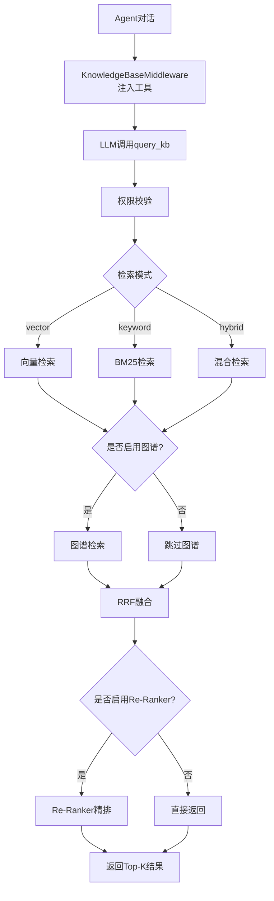

# 知识库查询与RAG检索链路追踪

> **链路概览**：Agent对话 → KnowledgeBaseMiddleware注入工具 → query_kb工具调用 → 权限校验 → Milvus多路召回（向量/BM25/混合）→ 图谱增强检索（可选）→ RRF融合排序 → Re-Ranker精排（可选）→ 结果返回

## 一、完整链路追踪

### 1.1 Agent对话触发知识库查询

**触发点**：Agent对话时，LLM决定调用知识库工具

**代码路径**：
- 中间件注入：`backend/package/starring/agents/middlewares/knowledge_base.py`
- 工具定义：`backend/package/starring/agents/toolkits/kbs/tools.py`

**关键入口方法**（`knowledge_base.py:9-25`）：

```python
class KnowledgeBaseMiddleware(AgentMiddleware):
    """知识库中间件 - 提供通用知识库工具"""

    def __init__(self):
        super().__init__()
        # 预加载通用知识库工具
        self.kb_tools = get_common_kb_tools()
        self.tools = self.kb_tools
        logger.debug(f"Initialized KnowledgeBaseMiddleware with {len(self.kb_tools)} tools")
```

**工具列表**（`tools.py:360-370`）：

```python
def get_common_kb_tools() -> list:
    """获取通用知识库工具列表

    返回 5 个通用工具：
    - list_kbs: 列出用户可访问的知识库
    - get_mindmap: 获取指定知识库的思维导图
    - query_kb: 在指定知识库中检索
    - find_kb_document: 在指定文件内定位关键词或正则模式
    - open_kb_document: 按 file_id 分段打开知识库文档
    """
    return [list_kbs, get_mindmap, query_kb, find_kb_document, open_kb_document]
```

**设计亮点**：
- 中间件模式：通过`AgentMiddleware`自动注入工具，无需手动绑定
- 工具预加载：启动时加载所有工具，减少运行时开销
- 统一接口：所有知识库工具遵循相同的输入输出Schema

### 1.2 query_kb工具调用

**触发点**：LLM决定查询知识库内容

**代码路径**：`backend/package/starring/agents/toolkits/kbs/tools.py:203-243`

**关键入口方法**：

```python
@tool(category="knowledge", tags=["知识库"], args_schema=QueryKBInput)
async def query_kb(kb_id: str, query_text: str, file_name: str | None = None, runtime: ToolRuntime = None) -> Any:
    """在指定知识库中检索内容

    当用户需要查询具体内容时使用此工具。kb_id 是知识库资源 ID，也就是 kb_id；返回结果中的
    file_id 可继续用于 find_kb_document 或 open_kb_document。
    """
    if not kb_id:
        return "请提供 kb_id"
    if not query_text:
        return "请提供查询内容"

    # 获取知识库实例和检索器
    knowledge_base = _get_knowledge_base()
    retrievers = knowledge_base.get_retrievers()
    
    # 权限校验：解析当前会话可见的知识库
    visible_kbs = await _resolve_visible_knowledge_bases_for_query(runtime)
    target_info, target_kb_id, target_error = _find_query_target(
        kb_id=kb_id,
        retrievers=retrievers,
        visible_kbs=visible_kbs,
    )
    if target_error:
        return target_error

    try:
        retriever = target_info["retriever"]
        kwargs = {}
        if file_name:
            kwargs["file_name"] = file_name

        # 调用检索器（异步或同步）
        if inspect.iscoroutinefunction(retriever):
            result = await retriever(query_text, **kwargs)
        else:
            result = retriever(query_text, **kwargs)

        # 构建标准化输出
        if isinstance(result, dict) and result.get("kb_id") == target_kb_id and isinstance(result.get("results"), list):
            return SearchOutputSchema(**result).model_dump()
        return KnowledgeBase.build_search_output(target_kb_id, result)

    except Exception as e:
        logger.error(f"检索失败: {e}")
        return f"检索失败: {str(e)}"
```

**输入Schema**（`schemas.py:6-14`）：

```python
class SearchInputSchema(BaseModel):
    kb_id: str = Field(description="知识库资源 ID")
    query_text: str = Field(description="查询文本")
    file_name: str | None = Field(default=None, description="可选的文件名过滤")
```

**输出Schema**（`schemas.py:15-23`）：

```python
class SearchOutputSchema(BaseModel):
    kb_id: str
    results: list[dict]
    total: int = Field(description="结果总数")
```

**关键流程**：
1. **参数校验**：检查`kb_id`和`query_text`是否为空
2. **权限校验**：通过`_resolve_visible_knowledge_bases_for_query`解析当前用户可见的知识库
3. **目标定位**：通过`_find_query_target`验证`kb_id`是否在可见列表中
4. **检索器调用**：调用`retriever(query_text, **kwargs)`执行实际检索
5. **结果封装**：通过`KnowledgeBase.build_search_output`构建标准化输出

### 1.3 权限校验与可见知识库解析

**代码路径**：`backend/package/starring/agents/toolkits/kbs/tools.py:162-180` 和 `backend/package/starring/agents/backends/knowledge_base_backend.py:6-22`

**关键方法**（`tools.py:162-180`）：

```python
async def _resolve_visible_knowledge_bases_for_query(runtime: ToolRuntime | None) -> list[dict[str, Any]]:
    if runtime is None:
        return []

    context = getattr(runtime, "context", None)
    if context is None:
        return []

    # 优先从缓存读取
    visible_kbs = getattr(context, "_visible_knowledge_bases", None)
    if isinstance(visible_kbs, list):
        return visible_kbs

    try:
        from starring.agents.backends.knowledge_base_backend import resolve_visible_knowledge_bases_for_context

        return await resolve_visible_knowledge_bases_for_context(context)
    except Exception as exc:
        logger.warning(f"解析会话可见知识库失败: {exc}")
        return []
```

**权限解析逻辑**（`knowledge_base_backend.py:6-22`）：

```python
async def resolve_visible_knowledge_bases_for_context(context) -> list[dict[str, Any]]:
    from starring import knowledge_base

    uid = getattr(context, "uid", None)
    if not uid:
        setattr(context, "_visible_knowledge_bases", [])
        return []

    # 根据用户权限获取知识库列表
    result = await knowledge_base.get_databases_by_uid(str(uid))
    databases = result.get("databases") or []
    
    # 过滤当前会话启用的知识库
    enabled_knowledges = getattr(context, "knowledges", None)
    if enabled_knowledges is not None:
        enabled_ids = {str(value).strip() for value in enabled_knowledges if str(value).strip()}
        databases = [db for db in databases if str(db.get("kb_id") or "").strip() in enabled_ids]

    # 缓存到context，避免重复查询
    setattr(context, "_visible_knowledge_bases", databases)
    return databases
```

**权限校验流程**：
1. **用户身份提取**：从`runtime.context.uid`获取当前用户ID
2. **权限过滤**：调用`knowledge_base.get_databases_by_uid`获取用户有权访问的知识库
3. **会话过滤**：根据`context.knowledges`过滤当前会话启用的知识库
4. **结果缓存**：将结果缓存到`context._visible_knowledge_bases`，避免重复查询

**设计亮点**：
- **双层过滤**：先按用户权限过滤，再按会话启用状态过滤
- **缓存优化**：首次查询后缓存结果，后续工具调用直接读取
- **防御性编程**：异常时返回空列表，避免阻断对话流程

### 1.4 检索器获取与调用

**代码路径**：`backend/package/starring/knowledge/base.py:1527-1550` 和 `backend/package/starring/knowledge/manager.py:709-718`

**检索器构建**（`base.py:1527-1550`）：

```python
def get_retrievers(self) -> dict[str, dict[str, Any]]:
    """构建并返回知识库检索器字典"""
    retrievers = {}
    for kb_id, db_info in self.databases_meta.items():
        # 创建检索器闭包
        async def retriever(query_text: str, **kwargs):
            return await self.aquery(query_text, kb_id, agent_call=True, **kwargs)
        
        retrievers[kb_id] = {
            "name": db_info.get("name"),
            "retriever": retriever,
            "metadata": db_info,
        }
    return retrievers
```

**管理器汇总**（`manager.py:709-718`）：

```python
def get_retrievers(self) -> dict[str, dict[str, Any]]:
    """汇总所有KB实例的检索器"""
    all_retrievers = {}
    for kb_type, kb_instance in self.kb_instances.items():
        retrievers = kb_instance.get_retrievers()
        all_retrievers.update(retrievers)
    return all_retrievers
```

**检索器结构**：

```python
{
    "kb_id_1": {
        "name": "知识库名称",
        "retriever": <async function>,  # 闭包，绑定kb_id
        "metadata": {...}  # 知识库元数据
    },
    "kb_id_2": {...}
}
```

**设计亮点**：
- **闭包封装**：每个检索器是一个闭包，绑定了`kb_id`，调用时只需传入`query_text`
- **统一管理**：`KnowledgeBaseManager`汇总所有KB实例的检索器，提供统一接口
- **元数据携带**：检索器携带知识库元数据，便于后续权限校验和参数读取

### 1.5 Milvus多路召回

**代码路径**：`backend/package/starring/knowledge/implementations/milvus.py:890-1076`

**关键入口方法**：

```python
async def aquery(self, query_text: str, kb_id: str, agent_call: bool = False, **kwargs) -> list[dict]:
    """异步查询知识库"""
    collection = await self._get_milvus_collection(kb_id)
    if not collection:
        raise ValueError(f"Database {kb_id} not found")

    # 合并查询参数：kwargs（临时参数）优先级高于 query_params（持久化参数）
    query_params = self._get_query_params(kb_id)
    merged_kwargs = {**query_params, **kwargs}

    try:
        # 解析查询参数
        final_top_k = int(merged_kwargs.get("final_top_k", 10))
        final_top_k = max(final_top_k, 1)
        similarity_threshold = float(merged_kwargs.get("similarity_threshold", 0.2))
        metric_type = VECTOR_METRIC_TYPE
        include_distances = bool(merged_kwargs.get("include_distances", True))
        search_mode = str(merged_kwargs.get("search_mode", "vector")).lower()
        if search_mode not in {"vector", "keyword", "hybrid"}:
            search_mode = "vector"

        use_reranker = bool(merged_kwargs.get("use_reranker", False))
        use_graph_retrieval = bool(merged_kwargs.get("use_graph_retrieval", False))
        
        # 确定召回数量
        if use_reranker or use_graph_retrieval:
            recall_top_k = int(merged_kwargs.get("recall_top_k", 50))
            recall_top_k = max(recall_top_k, final_top_k)
        else:
            recall_top_k = final_top_k

        # 构建文件名过滤表达式
        file_expr = self._build_file_name_expr(kb_id, merged_kwargs.get("file_name"))
        if file_expr:
            logger.debug(f"Using filter expression: {file_expr}")

        output_fields = ["content", "chunk_id", "file_id", "chunk_index"]
        retrieved_chunks: list[dict] = []
        
        # 根据search_mode执行不同检索策略
        if search_mode == "vector":
            # 向量检索逻辑...
        elif search_mode == "keyword":
            # BM25检索逻辑...
        else:
            # 混合检索逻辑...

        # 图谱增强检索（可选）
        if use_graph_retrieval:
            graph_chunks = await self._retrieve_graph_chunks(query_text, kb_id, retrieved_chunks, merged_kwargs)
            if graph_chunks:
                graph_weight = float(merged_kwargs.get("graph_weight", 1.0))
                retrieved_chunks = self._fuse_chunk_rankings(retrieved_chunks, graph_chunks, graph_weight)

        if not retrieved_chunks:
            return []

        # Re-Ranker精排（可选）
        if not use_reranker:
            return retrieved_chunks[:final_top_k]

        # 使用重排序模型
        reranker_model = merged_kwargs.get("reranker_model")
        if not reranker_model:
            raise ValueError("Reranker model must be specified when use_reranker=True.")

        try:
            from starring.models.rerank import get_reranker

            reranker = get_reranker(reranker_model)
            try:
                rerank_start = time.time()
                documents_text = [chunk["content"] for chunk in retrieved_chunks]
                rerank_scores = await reranker.acompute_score([query_text, documents_text], normalize=True)

                for chunk, rerank_score in zip(retrieved_chunks, rerank_scores):
                    chunk["rerank_score"] = float(rerank_score)

                retrieved_chunks.sort(
                    key=lambda item: item.get("rerank_score", item.get("score", 0.0)), reverse=True
                )
                elapsed = time.time() - rerank_start
                logger.info(f"Reranking completed for {kb_id} in {elapsed:.3f}s with model {reranker_model}")
            finally:
                await reranker.aclose()

        except Exception as exc:
            logger.error(f"Reranking failed: {exc}, falling back to vector scores")

        return retrieved_chunks[:final_top_k]

    except Exception as e:
        logger.error(f"Milvus query error: {e}, {traceback.format_exc()}")
        return []
```

**参数合并策略**：
- `query_params`：知识库持久化的查询配置（如search_mode、final_top_k）
- `kwargs`：本次查询的临时参数，优先级更高
- 合并后：`merged_kwargs = {**query_params, **kwargs}`

**设计亮点**：
- **参数优先级**：临时参数覆盖持久化配置，灵活适应不同查询场景
- **防御性编程**：异常时返回空列表，避免阻断对话流程
- **日志追踪**：关键步骤记录日志，便于调试和性能分析

### 1.6 向量检索模式（search_mode="vector"）

**代码路径**：`backend/package/starring/knowledge/implementations/milvus.py:927-954`

**流程**：
```
Query → Embedding编码 → Milvus ANN Search → 相似度过滤 → 结果返回
```

**关键代码**：

```python
# Embedding编码
embedding_model_spec = self.databases_meta[kb_id].get("embedding_model_spec")
embedding_function = self._get_embedding_function(embedding_model_spec, sync=True)
query_embedding = await _run_milvus_query_io(embedding_function, [query_text])

# Milvus向量检索
search_params = {"metric_type": metric_type, "params": {"nprobe": 10}}

results = await _run_milvus_query_io(
    collection.search,
    data=query_embedding,
    anns_field="embedding",
    param=search_params,
    limit=recall_top_k,
    expr=file_expr,  # 文件名过滤表达式
    output_fields=output_fields,
)

# 相似度过滤
for hit in results[0]:
    similarity = hit.distance if metric_type == VECTOR_METRIC_TYPE else 1 / (1 + hit.distance)
    if similarity < similarity_threshold:
        continue
    retrieved_chunks.append(self._build_chunk_from_hit(hit, similarity, include_distances))
```

**关键参数**：
- `recall_top_k`：召回数量（默认10，启用Re-Ranker或图谱检索时为50）
- `similarity_threshold`：相似度阈值（默认0.2，低于此值的结果被过滤）
- `metric_type`：向量度量类型（COSINE）
- `nprobe`：ANN搜索参数，控制搜索精度和速度的平衡

**Embedding函数获取**（`milvus.py:477-484`）：

```python
def _get_embedding_function(self, embedding_model_spec: str, *, sync: bool = False):
    """获取 embedding 编码函数。sync=True 返回同步版本，否则返回异步版本。"""
    from starring.models.embed import select_embedding_model

    model = select_embedding_model(embedding_model_spec)
    batch_size = int(getattr(model, "batch_size", 40) or 40)
    method = model.batch_encode if sync else model.abatch_encode
    return partial(method, batch_size=batch_size)
```

**特点**：
- 支持多种Embedding模型（通过`embedding_model_spec`指定）
- 通过`_run_milvus_query_io`异步执行，避免阻塞事件循环
- 使用`asyncio.to_thread`将同步Embedding调用转为异步

### 1.7 BM25全文检索模式（search_mode="keyword"）

**代码路径**：`backend/package/starring/knowledge/implementations/milvus.py:956-981`

**流程**：
```
Query → Milvus BM25 Search（稀疏向量）→ 结果返回
```

**关键代码**：

```python
bm25_top_k = int(merged_kwargs.get("bm25_top_k", recall_top_k))
bm25_top_k = max(bm25_top_k, 1)
bm25_drop_ratio_search = float(merged_kwargs.get("bm25_drop_ratio_search", 0.0))
bm25_search_params = {
    "metric_type": "BM25",
    "params": {"drop_ratio_search": bm25_drop_ratio_search},
}

results = await _run_milvus_query_io(
    collection.search,
    data=[query_text],  # 直接传入文本，无需Embedding
    anns_field=CONTENT_SPARSE_FIELD,
    param=bm25_search_params,
    limit=bm25_top_k,
    expr=file_expr,
    output_fields=output_fields,
)

if results and len(results) > 0 and len(results[0]) > 0:
    for hit in results[0]:
        retrieved_chunks.append(
            self._build_chunk_from_hit(hit, hit.distance, include_distances, score_field="bm25_score")
        )
```

**关键特性**：
- 使用Milvus内置BM25 Function（`FunctionType.BM25`）
- 无需外部BM25引擎（如Elasticsearch）
- 支持中文分词（`analyzer_params: {"type": "chinese"}`）
- `drop_ratio_search`：控制BM25检索时丢弃低分稀疏项的比例，数值越大检索越快但可能降低召回

**设计亮点**：
- **统一存储**：向量和BM25索引都在Milvus中管理，简化架构
- **中文优化**：内置中文分词器，适配中文场景
- **性能调优**：`drop_ratio_search`参数允许用户根据场景调整检索速度

### 1.8 混合检索模式（search_mode="hybrid"）

**代码路径**：`backend/package/starring/knowledge/implementations/milvus.py:982-1026`

**流程**：
```
Query → Embedding + BM25双路召回 → Milvus WeightedRanker融合 → 结果返回
```

**关键代码**：

```python
# 向量检索请求
vector_request = AnnSearchRequest(
    data=query_embedding,
    anns_field="embedding",
    param={"metric_type": metric_type, "params": {"nprobe": 10}},
    limit=recall_top_k,
    expr=file_expr,
)

# BM25检索请求
bm25_request = AnnSearchRequest(
    data=[query_text],
    anns_field=CONTENT_SPARSE_FIELD,
    param={
        "metric_type": "BM25",
        "params": {"drop_ratio_search": bm25_drop_ratio_search},
    },
    limit=bm25_top_k,
    expr=file_expr,
)

# Milvus内置WeightedRanker融合
results = await _run_milvus_query_io(
    collection.hybrid_search,
    reqs=[vector_request, bm25_request],
    rerank=WeightedRanker(vector_weight, bm25_weight),  # 默认0.7:0.3
    limit=recall_top_k,
    output_fields=output_fields,
)

if results and len(results) > 0 and len(results[0]) > 0:
    for hit in results[0]:
        score = float(hit.distance or 0.0)
        if score < similarity_threshold:
            continue
        retrieved_chunks.append(
            self._build_chunk_from_hit(hit, score, include_distances, score_field="hybrid_score")
        )
```

**融合策略**：
- 使用Milvus内置`WeightedRanker`
- 权重可配置：`vector_weight`（默认0.7）、`bm25_weight`（默认0.3）
- 仅支持两路融合（向量+BM25）

**设计亮点**：
- **原生融合**：利用Milvus内置融合器，避免应用层二次排序
- **权重可调**：用户可根据场景调整向量和BM25的权重比例
- **性能优化**：融合在Milvus内部完成，减少网络传输

### 1.9 图谱增强检索（use_graph_retrieval=True）

**代码路径**：`backend/package/starring/knowledge/implementations/milvus.py:1027-1031` 和 `milvus.py:1077-1135`

**触发条件**：
- 配置参数`use_graph_retrieval=True`
- 知识库已构建图谱（Neo4j + Milvus图谱向量存储）

#### 1.9.1 图谱检索流程

**入口**：`milvus.py:1077-1135`

```python
async def _retrieve_graph_chunks(
    self,
    query_text: str,
    kb_id: str,
    base_chunks: list[dict],
    query_params: dict[str, Any],
) -> list[dict]:
    try:
        from starring.knowledge.graphs.milvus_graph_service import MilvusGraphService
        from starring.knowledge.graphs.milvus_graph_vector_store import MilvusGraphVectorStore

        embedding_model_spec = self.databases_meta[kb_id].get("embedding_model_spec")
        if not embedding_model_spec:
            return []

        # 解析图谱检索参数
        entity_top_k = max(int(query_params.get("graph_entity_top_k", 10)), 1)
        triple_top_k = max(int(query_params.get("graph_triple_top_k", 10)), 1)
        graph_top_k = max(int(query_params.get("graph_top_k", 20)), 1)
        graph_max_nodes = max(int(query_params.get("graph_max_nodes", 10000)), 1)

        # ① 初始化图谱向量存储
        vector_store = await _run_milvus_query_io(MilvusGraphVectorStore)
        
        # ② 并行执行实体召回和三元组召回
        entity_hits, triple_hits = await asyncio.gather(
            vector_store.search_entities(
                kb_id=kb_id,
                query_text=query_text,
                embedding_model_spec=embedding_model_spec,
                top_k=entity_top_k,
            ),
            vector_store.search_triples(
                kb_id=kb_id,
                query_text=query_text,
                embedding_model_spec=embedding_model_spec,
                top_k=triple_top_k,
            ),
        )
        
        # ③ 构建种子节点权重
        seed_weights = await self._build_graph_seed_weights(kb_id, base_chunks, entity_hits, triple_hits)
        if not seed_weights:
            return []

        # ④ PPR扩散检索
        graph_service = MilvusGraphService()
        graph_scores = await graph_service.query_and_rank_chunks_by_ppr(
            kb_id,
            seed_weights,
            max_nodes=graph_max_nodes,
            top_k=graph_top_k,
            damping=float(query_params.get("ppr_damping", 0.85)),
        )
        if not graph_scores:
            return []

        # ⑤ 从PostgreSQL获取Chunk内容
        chunks = await KnowledgeChunkRepository().list_by_chunk_ids([chunk_id for chunk_id, _ in graph_scores])
        score_by_chunk_id = dict(graph_scores)
        return [
            self._build_chunk_from_record(chunk, score_by_chunk_id[chunk.chunk_id], score_field="graph_score")
            for chunk in chunks
        ]
    except Exception as exc:
        logger.error(f"Graph retrieval failed for {kb_id}: {exc}")
        return []
```

**关键步骤**：
1. **实体召回**：通过向量检索找到与Query相关的实体（默认10个）
2. **三元组召回**：通过向量检索找到与Query相关的三元组（默认10个）
3. **种子权重构建**：综合实体、三元组、基础Chunk的权重，构建PPR种子节点
4. **PPR扩散**：从种子节点出发，沿图谱路径扩散，计算每个Chunk的PPR得分
5. **结果返回**：按PPR得分降序返回Top-K个Chunk

**设计亮点**：
- **并行召回**：实体和三元组召回并行执行，减少延迟
- **多源种子**：种子权重综合了3路来源，提升召回质量
- **PPR算法**：利用Personalized PageRank实现语义扩散，捕获长尾知识

#### 1.9.2 种子节点权重构建

**代码路径**：`milvus.py:1137-1173`

**权重来源**：
1. **实体召回**（权重1.0）：直接命中的实体
2. **三元组召回**（权重0.8）：三元组的source/target实体
3. **Chunk关联**（权重0.3）：已召回Chunk中提取的实体

**关键代码**：

```python
async def _build_graph_seed_weights(
    self,
    kb_id: str,
    base_chunks: list[dict],
    entity_hits: list[dict[str, Any]],
    triple_hits: list[dict[str, Any]],
) -> dict[str, float]:
    seed_weights: dict[str, float] = {}

    def add_seed(entity_id: str | None, score: float, weight: float) -> None:
        if not entity_id:
            return
        seed_weights[entity_id] = seed_weights.get(entity_id, 0.0) + max(float(score or 0.0), 0.0) * weight

    # 实体召回：权重1.0
    for hit in entity_hits:
        add_seed(hit.get("id"), hit.get("score", 0.0), 1.0)

    # 三元组召回：权重0.8
    for hit in triple_hits:
        score = float(hit.get("score") or 0.0)
        add_seed(hit.get("source_id"), score, 0.8)
        add_seed(hit.get("target_id"), score, 0.8)

    # Chunk关联：权重0.3
    chunk_scores = {
        chunk.get("metadata", {}).get("chunk_id"): float(chunk.get("score") or 0.0)
        for chunk in base_chunks
        if chunk.get("metadata", {}).get("chunk_id")
    }
    if chunk_scores:
        chunks = await KnowledgeChunkRepository().list_by_chunk_ids(list(chunk_scores))
        for chunk in chunks:
            for entity_id in chunk.ent_ids or []:
                add_seed(entity_id, chunk_scores.get(chunk.chunk_id, 0.0), 0.3)

    # 归一化权重
    total = sum(seed_weights.values())
    if total <= 0:
        return {}
    return {entity_id: weight / total for entity_id, weight in seed_weights.items()}
```

**设计亮点**：
- **多源融合**：综合3路来源，避免单一来源的偏差
- **权重衰减**：实体召回（1.0）> 三元组（0.8）> Chunk关联（0.3），体现直接命中的重要性
- **归一化**：确保种子权重之和为1，避免PPR算法偏差

#### 1.9.3 PPR扩散算法

**代码路径**：`backend/package/starring/knowledge/graphs/milvus_graph_service.py:710-779`

**算法原理**：
```
Personalized PageRank（PPR）：从种子节点出发，沿图谱路径扩散，计算每个Chunk节点的得分
```

**关键步骤**：
1. 从Neo4j查询种子节点的2-hop子图（最多`graph_max_nodes`个节点）
2. 使用igraph构建图结构
3. 设置种子节点的reset概率（归一化后的权重）
4. 执行`graph.personalized_pagerank()`计算每个节点的PPR得分
5. 筛选Chunk节点，按PPR得分降序返回

**关键代码**：

```python
@staticmethod
def rank_chunks_by_ppr(
    subgraph: dict[str, Any],
    seed_weights: dict[str, float],
    *,
    top_k: int,
    damping: float,
) -> list[tuple[str, float]]:
    import igraph as ig

    # 构建图
    node_ids = [node["id"] for node in nodes]
    index_by_id = {node_id: index for index, node_id in enumerate(node_ids)}
    edge_indices = [
        (index_by_id[edge["source_id"]], index_by_id[edge["target_id"]])
        for edge in edges
        if edge.get("source_id") in index_by_id and edge.get("target_id") in index_by_id
    ]
    graph = ig.Graph(n=len(nodes), edges=edge_indices, directed=False)

    # 设置reset概率（种子节点权重归一化）
    reset = [0.0] * len(nodes)
    for index, node in enumerate(nodes):
        entity_id = properties.get("entity_id")
        if entity_id in seed_weights:
            reset[index] = seed_weights[entity_id]

    reset_total = sum(reset)
    reset = [value / reset_total for value in reset]

    # PPR计算
    scores = graph.personalized_pagerank(damping=min(max(damping, 0.1), 0.99), reset=reset)

    # 筛选Chunk节点
    ranked = sorted(
        ((chunk_id, float(scores[index])) for index, chunk_id in chunk_node_indexes),
        key=lambda item: item[1],
        reverse=True,
    )
    return ranked[:top_k]
```

**关键参数**：
- `damping`：阻尼系数（默认0.85），控制随机跳转的概率
- `graph_max_nodes`：子图最大节点数（默认10000），限制PPR计算规模
- `graph_top_k`：返回的Chunk数量（默认20）

**设计亮点**：
- **2-hop扩散**：从种子节点出发，最多扩散2跳，捕获间接关联
- **igraph优化**：使用igraph库高效计算PPR，避免手动实现
- **Chunk过滤**：只返回Chunk节点，排除实体节点

### 1.10 RRF融合排序

**代码路径**：`backend/package/starring/knowledge/implementations/milvus.py:1187-1216`

**触发场景**：仅当启用图检索时，融合基础检索结果与图谱检索结果

**算法**：Reciprocal Rank Fusion（RRF）

**公式**：
```
RRF_score(chunk) = Σ weight_i / (k + rank_i(chunk))
```
- `k`：平滑常数（默认60.0）
- `rank_i(chunk)`：chunk在第i个检索结果中的排名
- `weight_i`：第i路检索的权重

**关键代码**：

```python
def _fuse_chunk_rankings(
    self,
    base_chunks: list[dict],
    graph_chunks: list[dict],
    graph_weight: float,
) -> list[dict]:
    fused: dict[str, dict[str, Any]] = {}
    rrf_k = 60.0

    def merge_chunk(chunk: dict, rank: int, weight: float, source: str) -> None:
        chunk_id = chunk.get("metadata", {}).get("chunk_id")
        if not chunk_id:
            return
        score = weight / (rrf_k + rank)  # RRF公式
        existing = fused.get(chunk_id)
        if existing is None:
            existing = {**chunk, "fusion_score": 0.0, "fusion_sources": []}
            fused[chunk_id] = existing
        existing["fusion_score"] += score
        existing["score"] = existing["fusion_score"]
        existing["fusion_sources"].append(source)
        if source == "graph" and "graph_score" in chunk:
            existing["graph_score"] = chunk["graph_score"]

    # 基础检索结果（权重1.0）
    for rank, chunk in enumerate(base_chunks, start=1):
        merge_chunk(chunk, rank, 1.0, "chunk")

    # 图谱检索结果（权重graph_weight）
    for rank, chunk in enumerate(graph_chunks, start=1):
        merge_chunk(chunk, rank, max(graph_weight, 0.0), "graph")

    return sorted(fused.values(), key=lambda item: item.get("fusion_score", 0.0), reverse=True)
```

**融合结果**：
- 每个Chunk包含`fusion_score`（融合分数）和`fusion_sources`（来源标记）
- 相同Chunk在多路结果中出现时，分数累加
- 最终按`fusion_score`降序排列

**设计亮点**：
- **排名融合**：只关心排名，与分数尺度无关，避免不同检索策略的分数不一致问题
- **多源标记**：`fusion_sources`记录Chunk来源，便于调试和分析
- **去重合并**：相同Chunk在多路结果中出现时，自动合并并累加分数

### 1.11 Re-Ranker精排

**代码路径**：`backend/package/starring/knowledge/implementations/milvus.py:1039-1071`

**触发条件**：
- 配置参数`use_reranker=True`
- 指定`reranker_model`（如`BAAI/bge-reranker-v2-m3`）

**流程**：
```
候选Chunks（recall_top_k）→ Re-Ranker精排 → final_top_k个结果
```

**关键代码**：

```python
try:
    from starring.models.rerank import get_reranker

    reranker = get_reranker(reranker_model)
    try:
        rerank_start = time.time()
        # 构建文档文本列表
        documents_text = [chunk["content"] for chunk in retrieved_chunks]
        # Cross-Encoder打分
        rerank_scores = await reranker.acompute_score([query_text, documents_text], normalize=True)

        # 添加rerank_score并重排序
        for chunk, rerank_score in zip(retrieved_chunks, rerank_scores):
            chunk["rerank_score"] = float(rerank_score)

        retrieved_chunks.sort(
            key=lambda item: item.get("rerank_score", item.get("score", 0.0)), reverse=True
        )
        elapsed = time.time() - rerank_start
        logger.info(f"Reranking completed for {kb_id} in {elapsed:.3f}s with model {reranker_model}")
    finally:
        await reranker.aclose()

except Exception as exc:
    logger.error(f"Reranking failed: {exc}, falling back to vector scores")
```

**特点**：
- 支持多种Re-Ranker模型（通过`reranker_model`参数指定）
- 使用Cross-Encoder架构，同时编码Query和Document
- 分数归一化（`normalize=True`）
- 失败时降级为原始分数

**设计亮点**：
- **精排优化**：在粗排基础上进一步筛选，提升Top-K质量
- **模型可插拔**：通过`get_reranker`工厂方法支持多种模型
- **异常降级**：Re-Ranker失败时回退到原始分数，保证可用性

### 1.12 结果返回

**代码路径**：`backend/package/starring/knowledge/implementations/milvus.py:1070-1071`

**最终处理**：
- 按分数降序排列
- 截取`final_top_k`个结果（默认10）
- 返回格式：

```python
[
    {
        "content": "文档内容...",
        "metadata": {
            "source": "文件名",
            "chunk_id": "chunk_xxx",
            "file_id": "file_xxx",
            "chunk_index": 0
        },
        "score": 0.95,
        "distance": 0.05,  # 可选
        "bm25_score": 12.3,  # BM25模式
        "hybrid_score": 0.85,  # 混合检索模式
        "graph_score": 0.78,  # 图谱检索模式
        "rerank_score": 0.92,  # Re-Ranker模式
        "fusion_score": 0.88,  # RRF融合模式
        "fusion_sources": ["chunk", "graph"]  # 来源标记
    }
]
```

## 二、其他知识库工具

### 2.1 list_kbs：列出用户可访问的知识库

**代码路径**：`backend/package/starring/agents/toolkits/kbs/tools.py:39-83`

**功能**：返回当前用户基于权限可访问的知识库列表

**关键代码**：

```python
@tool(category="knowledge", tags=["知识库"], args_schema=ListKBsInput)
async def list_kbs(dummy: str, runtime: ToolRuntime) -> str:
    """列出当前用户可访问的知识库列表"""
    # 从 runtime.context 获取用户信息
    runtime_context = runtime.context
    uid = getattr(runtime_context, "uid", None)
    if not uid:
        return "无法获取用户信息"

    enabled_kb_names = getattr(runtime_context, "knowledges", None)

    try:
        from starring.agents.backends.knowledge_base_backend import resolve_visible_knowledge_bases_for_context

        available_kbs = await resolve_visible_knowledge_bases_for_context(runtime_context)
    except Exception as e:
        logger.error(f"获取用户知识库列表失败: {e}")
        return f"获取知识库列表失败: {str(e)}"

    all_kb_names = [kb["name"] for kb in available_kbs]

    if not available_kbs:
        return "当前没有可访问的知识库"

    # 格式化输出（包含名称和描述）
    kb_list = []
    for kb in available_kbs:
        name = kb.get("name", "")
        desc = kb.get("description") or "无描述"
        kb_list.append({"kb_id": kb.get("kb_id"), "name": name, "description": desc})

    return kb_list
```

**使用场景**：Agent在对话开始时，先调用`list_kbs`了解用户可访问哪些知识库

### 2.2 get_mindmap：获取知识库思维导图

**代码路径**：`backend/package/starring/agents/toolkits/kbs/tools.py:92-154`

**功能**：返回知识库的思维导图层级结构，帮助用户了解知识库整体架构

**关键代码**：

```python
@tool(category="knowledge", tags=["知识库"], args_schema=GetMindmapInput)
async def get_mindmap(kb_name: str, runtime: ToolRuntime) -> str:
    """获取指定知识库的思维导图结构"""
    if not kb_name:
        return "请提供知识库名称"

    # 获取所有检索器
    knowledge_base = _get_knowledge_base()
    retrievers = knowledge_base.get_retrievers()

    # 查找对应的知识库
    target_kb_id = None
    target_info = None
    for kb_id, info in retrievers.items():
        if info["name"] == kb_name:
            target_kb_id = kb_id
            target_info = info
            break

    if not target_kb_id:
        return f"知识库 '{kb_name}' 不存在"

    try:
        from starring.repositories.knowledge_base_repository import KnowledgeBaseRepository

        kb_repo = KnowledgeBaseRepository()
        kb = await kb_repo.get_by_kb_id(target_kb_id)

        if kb is None:
            return f"知识库 {target_info['name']} 不存在"

        mindmap_data = kb.mindmap

        if not mindmap_data:
            return f"知识库 {target_info['name']} 还没有生成思维导图。"

        # 将思维导图数据转换为文本格式
        def mindmap_to_text(node, level=0):
            """递归将思维导图JSON转换为层级文本"""
            indent = "  " * level
            text = f"{indent}- {node.get('content', '')}\n"
            for child in node.get("children", []):
                text += mindmap_to_text(child, level + 1)
            return text

        mindmap_text = f"知识库 {target_info['name']} 的思维导图结构：\n\n"
        mindmap_text += mindmap_to_text(mindmap_data)

        return mindmap_text

    except Exception as e:
        logger.error(f"获取思维导图失败: {e}")
        return f"获取思维导图失败: {str(e)}"
```

**使用场景**：Agent在查询前，先调用`get_mindmap`了解知识库结构，定位相关文档

### 2.3 find_kb_document：文件内关键词定位

**代码路径**：`backend/package/starring/agents/toolkits/kbs/tools.py:301-357`

**功能**：在已知文件内定位关键词或正则模式

**关键代码**：

```python
@tool(category="knowledge", tags=["知识库"], args_schema=FindKBDocumentInput)
async def find_kb_document(
    kb_id: str,
    file_id: str,
    patterns: list[str],
    use_regex: bool = False,
    case_sensitive: bool = False,
    max_windows: int = 5,
    window_size: int = 80,
    runtime: ToolRuntime = None,
) -> dict[str, Any] | str:
    """在已知知识库文件内做关键词或正则定位"""
    # 权限校验...
    
    try:
        result = await knowledge_base.find_file_content(
            normalized_kb_id,
            normalized_file_id,
            patterns,
            use_regex=use_regex,
            case_sensitive=case_sensitive,
            max_windows=max_windows,
            window_size=window_size,
        )
        return FindOutputSchema(kb_id=normalized_kb_id, file_id=normalized_file_id, **result).model_dump()
    except Exception as e:
        logger.error(f"知识库文档内检索失败: {e}")
        return f"知识库文档内检索失败: {str(e)}"
```

**使用场景**：`query_kb`返回候选文件后，使用`find_kb_document`在文件内精确定位关键信息

### 2.4 open_kb_document：分段打开文档

**代码路径**：`backend/package/starring/agents/toolkits/kbs/tools.py:246-298`

**功能**：按行窗口打开知识库文档原文，查看上下文

**关键代码**：

```python
@tool(category="knowledge", tags=["知识库"], args_schema=OpenKBDocumentInput)
async def open_kb_document(
    kb_id: str,
    file_id: str,
    line: int | None = None,
    offset: int | None = None,
    window_size: int = 1800,
    runtime: ToolRuntime = None,
) -> dict[str, Any] | str:
    """按行窗口打开知识库文档原文"""
    # 权限校验...
    
    try:
        start_offset = int(line) - 1 if line is not None else int(offset or 0)
        window = await knowledge_base.open_file_content(
            normalized_kb_id,
            normalized_file_id,
            offset=start_offset,
            limit=window_size,
        )
        return OpenOutputSchema(kb_id=normalized_kb_id, file_id=normalized_file_id, **window).model_dump()

    except Exception as e:
        logger.error(f"打开知识库文档失败: {e}")
        return f"打开知识库文档失败: {str(e)}"
```

**使用场景**：`query_kb`返回的片段不足以回答问题时，使用`open_kb_document`查看完整上下文

## 三、设计亮点

### 3.1 多模式检索策略

**亮点**：支持三种检索模式，适应不同场景：

| 模式 | 适用场景 | 优势 | 代码位置 |
|------|---------|------|---------|
| **向量检索** | 语义相似查询 | 理解同义词、改写 | `milvus.py:927-954` |
| **BM25检索** | 精确关键词查询 | 快速、可解释 | `milvus.py:956-981` |
| **混合检索** | 综合查询 | 结合语义+关键词 | `milvus.py:982-1026` |

**实现优势**：
- 通过Milvus统一管理向量索引和BM25索引，无需额外Elasticsearch
- 中文分词内置支持（`analyzer_params: {"type": "chinese"}`）

### 3.2 图谱增强检索

**亮点**：融合知识图谱的PPR扩散检索，提升长尾知识召回

**架构**：
```
Neo4j（图谱存储）+ Milvus（图谱向量索引）+ igraph（PPR计算）
```

**核心优势**：
1. **语义扩散**：从查询相关的实体出发，沿图谱路径发现相关概念
2. **多跳关联**：通过2-hop子图捕获间接关联
3. **权重融合**：种子节点权重综合了实体召回、三元组召回、Chunk关联三路来源

**代码位置**：
- PPR算法：`milvus_graph_service.py:710-779`
- 种子权重构建：`milvus.py:1137-1173`

### 3.3 RRF融合排序

**亮点**：采用Reciprocal Rank Fusion算法，避免分数尺度不一致问题

**对比传统分数加权**：

| 维度 | 分数加权 | RRF |
|------|---------|-----|
| 分数尺度 | 需要归一化 | 只关心排名，与尺度无关 |
| 异常值 | 高分项可能主导 | 排名对极端值不敏感 |
| 参数调优 | 复杂，需大量实验 | 简单，k=60几乎通用 |
| 多源融合 | 3路以上很复杂 | 天然支持任意多源 |

**代码位置**：`milvus.py:1187-1216`

### 3.4 异步查询优化

**亮点**：通过`asyncio.to_thread`将Milvus同步API转为异步，避免阻塞事件循环

**实现**：

```python
async def _run_milvus_query_io(func, /, *args, **kwargs):
    semaphore = _get_milvus_query_offload_semaphore()
    await semaphore.acquire()
    task = asyncio.create_task(asyncio.to_thread(func, *args, **kwargs))

    def release_capacity(completed_task: asyncio.Task):
        semaphore.release()
        if completed_task.cancelled():
            return
        completed_task.exception()

    task.add_done_callback(release_capacity)
    return await asyncio.shield(task)
```

**优势**：
- 通过信号量限制并发Milvus查询（默认8个）
- 支持任务取消（`asyncio.shield`保护）
- 自动释放资源（回调函数）

**代码位置**：`milvus.py:67-79`

### 3.5 中间件模式

**亮点**：通过`AgentMiddleware`自动注入知识库工具，无需手动绑定

**架构**：
```
Agent → KnowledgeBaseMiddleware → [list_kbs, get_mindmap, query_kb, find_kb_document, open_kb_document]
```

**优势**：
- **解耦**：Agent无需感知知识库工具的具体实现
- **可扩展**：新增工具只需在`get_common_kb_tools`中添加
- **统一接口**：所有工具遵循相同的输入输出Schema

**代码位置**：`knowledge_base.py:9-25`

### 3.6 权限校验机制

**亮点**：双层过滤确保用户只能访问有权访问的知识库

**流程**：
```
用户请求 → 权限过滤（get_databases_by_uid）→ 会话过滤（context.knowledges）→ 可见知识库列表
```

**优势**：
- **安全性**：基于用户角色和部门过滤
- **灵活性**：支持会话级别启用/禁用知识库
- **性能优化**：首次查询后缓存结果

**代码位置**：`knowledge_base_backend.py:6-22`

## 四、主要功能

### 4.1 检索模式配置

**配置路径**：`MilvusRetrievalConfig`（`milvus.py:83-262`）

**核心参数**：

| 参数 | 类型 | 默认值 | 说明 |
|------|------|--------|------|
| `search_mode` | str | "vector" | 检索模式（vector/keyword/hybrid） |
| `final_top_k` | int | 10 | 最终返回Chunk数量 |
| `similarity_threshold` | float | 0.0 | 相似度阈值 |
| `bm25_top_k` | int | 50 | BM25召回数量 |
| `vector_weight` | float | 0.7 | 混合检索中向量权重 |
| `bm25_weight` | float | 0.3 | 混合检索中BM25权重 |
| `use_graph_retrieval` | bool | False | 启用图谱检索 |
| `graph_weight` | float | 1.0 | 图谱检索融合权重 |
| `use_reranker` | bool | False | 启用Re-Ranker |
| `reranker_model` | str | "" | Re-Ranker模型名称 |
| `recall_top_k` | int | 50 | Re-Ranker前召回数量 |

### 4.2 文件名过滤

**实现**：通过Milvus表达式过滤特定文件的Chunks

**代码位置**：`milvus.py:625-641`

**示例**：

```python
# 单个文件
file_expr = 'file_id == "file_xxx"'

# 多个文件
file_expr = 'file_id in ["file_a", "file_b", "file_c"]'
```

### 4.3 相似度阈值过滤

**实现**：过滤低于阈值的结果，避免低质量召回

**代码位置**：`milvus.py:906`（参数）、`milvus.py:947-950`（过滤逻辑）

### 4.4 结果排序策略

**排序优先级**：
1. **Re-Ranker模式**：按`rerank_score`降序
2. **RRF融合模式**：按`fusion_score`降序
3. **单路检索模式**：按`score`降序

## 五、可改进之处

### 5.1 RRF融合策略不统一

**问题**：
- 混合检索使用Milvus `WeightedRanker`（仅支持两路）
- 图谱检索使用外部RRF融合
- 缺乏统一的多路融合机制

**改进建议**：
- 统一使用RRF融合向量、BM25、图谱三路结果
- 扩展`_fuse_chunk_rankings`方法，支持任意多路融合

**代码位置**：`milvus.py:982-1026`（混合检索）、`milvus.py:1187-1216`（RRF融合）

### 5.2 Re-Ranker默认关闭

**问题**：
- Re-Ranker默认`use_reranker=False`
- 用户需要手动配置`reranker_model`
- 精排能力未充分利用

**改进建议**：
- 将`use_reranker`默认值改为`True`
- 配置默认`reranker_model`（如`BAAI/bge-reranker-v2-m3`）
- 增加自动模型选择逻辑

**代码位置**：`milvus.py:237-240`

### 5.3 缺少Contextual BM25

**问题**：
- 当前BM25索引的是原始Chunk内容
- 未利用Contextual Retrieval增强BM25效果

**改进建议**：
- 在Chunk入库时，生成上下文增强文本（`context + content`）
- BM25索引增强后的文本
- 参考：Anthropic Contextual Retrieval（检索失败率降低60%）

**代码位置**：`milvus.py:397-446`（集合创建）、`milvus.py:538-577`（Chunk插入）

### 5.4 无查询重写机制

**问题**：
- 用户查询直接用于检索，未经过改写
- 口语化查询、模糊查询召回效果差

**改进建议**：
- 增加Query Rewriting模块
- 支持HyDE（Hypothetical Document Embeddings）
- 支持多查询扩展

**代码位置**：`milvus.py:890`（查询入口）

### 5.5 图谱检索性能瓶颈

**问题**：
- PPR计算依赖igraph，需加载整个子图到内存
- 子图节点数上限`graph_max_nodes=10000`可能成为瓶颈
- Neo4j查询可能成为慢点

**改进建议**：
- 增加子图缓存机制（LRU Cache）
- 优化Neo4j查询（增加索引、限制返回字段）
- 支持增量PPR计算（避免重复加载子图）

**代码位置**：`milvus_graph_service.py:710-779`

### 5.6 缺少检索结果去重

**问题**：
- 相同内容的Chunk可能在不同文件中重复
- 当前仅按`chunk_id`去重，未考虑内容相似性

**改进建议**：
- 增加基于内容的去重逻辑（如SimHash、MinHash）
- 在RRF融合阶段处理相似内容

**代码位置**：`milvus.py:1187-1216`（RRF融合）

### 5.7 Embedding模型固定

**问题**：
- 知识库创建时绑定单一Embedding模型
- 无法动态切换模型或使用多模型检索

**改进建议**：
- 支持查询时指定Embedding模型（需兼容维度）
- 增加多模型融合检索能力

**代码位置**：`milvus.py:928-929`

## 六、代码路径索引

| 模块 | 文件路径 | 职责 |
|------|----------|------|
| 中间件 | `backend/package/starring/agents/middlewares/knowledge_base.py` | 注入知识库工具 |
| 工具定义 | `backend/package/starring/agents/toolkits/kbs/tools.py` | 5个知识库工具实现 |
| 权限解析 | `backend/package/starring/agents/backends/knowledge_base_backend.py` | 解析可见知识库 |
| 检索器构建 | `backend/package/starring/knowledge/base.py:1527-1550` | 构建检索器闭包 |
| 检索器汇总 | `backend/package/starring/knowledge/manager.py:709-718` | 汇总所有KB实例的检索器 |
| 检索入口 | `backend/package/starring/knowledge/implementations/milvus.py:890-1076` | MilvusKB主类，aquery方法 |
| 检索配置 | `backend/package/starring/knowledge/implementations/milvus.py:83-262` | MilvusRetrievalConfig定义 |
| 向量检索 | `backend/package/starring/knowledge/implementations/milvus.py:927-954` | 向量检索逻辑 |
| BM25检索 | `backend/package/starring/knowledge/implementations/milvus.py:956-981` | BM25检索逻辑 |
| 混合检索 | `backend/package/starring/knowledge/implementations/milvus.py:982-1026` | 混合检索逻辑（WeightedRanker） |
| 图谱检索入口 | `backend/package/starring/knowledge/implementations/milvus.py:1077-1135` | 图谱检索流程编排 |
| 种子权重构建 | `backend/package/starring/knowledge/implementations/milvus.py:1137-1173` | 构建PPR种子节点权重 |
| RRF融合 | `backend/package/starring/knowledge/implementations/milvus.py:1187-1216` | RRF融合排序 |
| Re-Ranker | `backend/package/starring/knowledge/implementations/milvus.py:1039-1071` | Re-Ranker精排 |
| 异步查询 | `backend/package/starring/knowledge/implementations/milvus.py:67-79` | 异步Milvus查询封装 |
| 图谱服务 | `backend/package/starring/knowledge/graphs/milvus_graph_service.py` | PPR扩散检索、图谱查询 |
| PPR算法 | `backend/package/starring/knowledge/graphs/milvus_graph_service.py:710-779` | Personalized PageRank实现 |
| 图谱向量存储 | `backend/package/starring/knowledge/graphs/milvus_graph_vector_store.py` | 实体/三元组向量检索 |
| Embedding封装 | `backend/package/starring/models/embed.py` | Embedding模型管理 |
| Re-Ranker封装 | `backend/package/starring/models/rerank.py` | Re-Ranker模型管理 |
| 输入输出Schema | `backend/package/starring/knowledge/schemas.py` | 定义检索/查找/打开的输入输出格式 |

## 七、性能优化建议

### 7.1 检索链路优化



### 7.2 缓存策略建议

| 缓存类型 | 缓存内容 | TTL | 实现位置 |
|---------|---------|-----|---------|
| 可见知识库缓存 | 用户可见知识库列表 | 会话级别 | `context._visible_knowledge_bases` |
| Embedding缓存 | Query Embedding | 5分钟 | Embedding模型层 |
| 子图缓存 | PPR子图结构 | 10分钟 | MilvusGraphService |
| 结果缓存 | 检索结果 | 1小时 | 应用层（Redis） |

### 7.3 监控指标建议

| 指标类型 | 指标名称 | 说明 |
|---------|---------|------|
| **延迟指标** | 检索总延迟 | 从Query到结果的耗时 |
| | Embedding延迟 | Embedding编码耗时 |
| | Milvus查询延迟 | 向量检索耗时 |
| | 图谱检索延迟 | PPR计算耗时 |
| **质量指标** | 召回率 | 相关文档召回比例 |
| | Top-K命中率 | 前K个结果的准确性 |
| **资源指标** | Milvus QPS | 每秒查询数 |
| | Embedding吞吐量 | Embedding编码速度 |
| | 图谱内存占用 | igraph内存使用 |

---

> **参考资料**：
> - Anthropic Contextual Retrieval：[官方博客](https://www.anthropic.com/news/contextual-retrieval)
> - Azure Databricks AI Search：[优化指南](https://www.databricks.com/blog/ai-search-guide)
> - RRF论文：[TREC社区](https://plg.uwaterloo.ca/~gvcormac/cormacksigir09-rrf.pdf)
> - Milvus混合检索：[官方文档](https://milvus.io/docs/hybridsearch.md)
