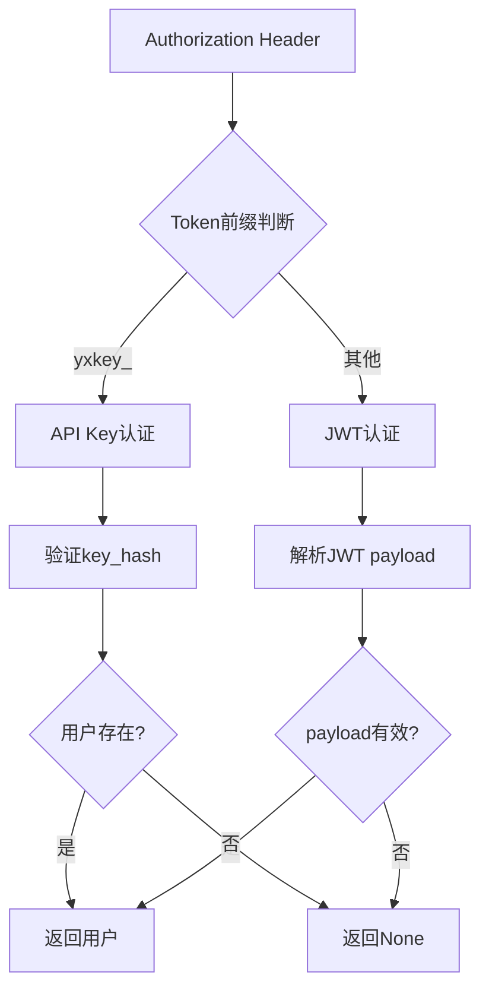
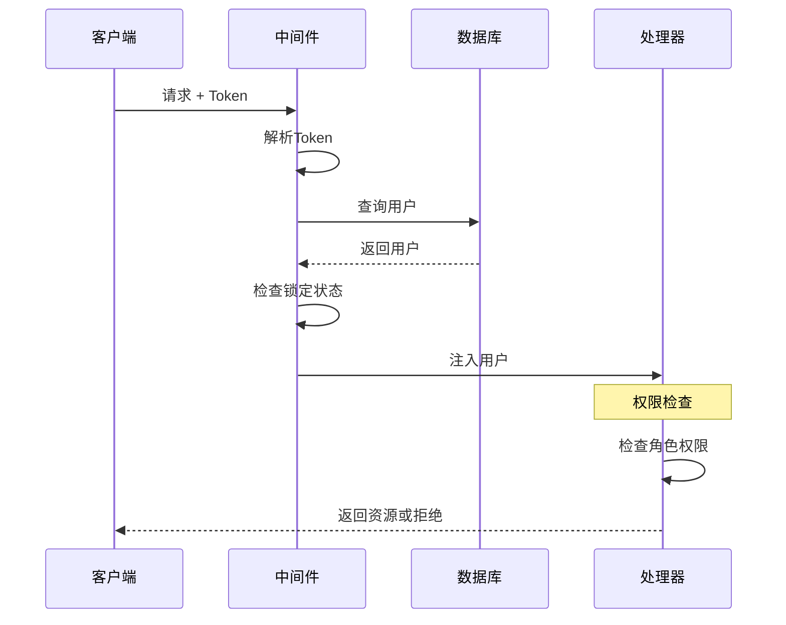
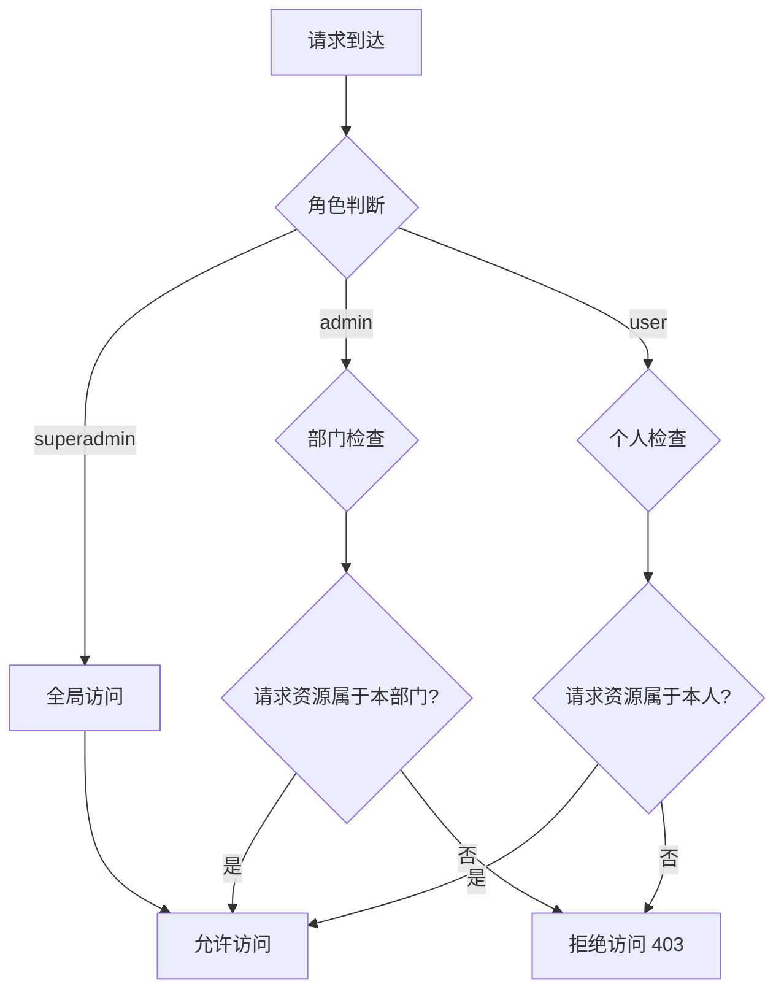
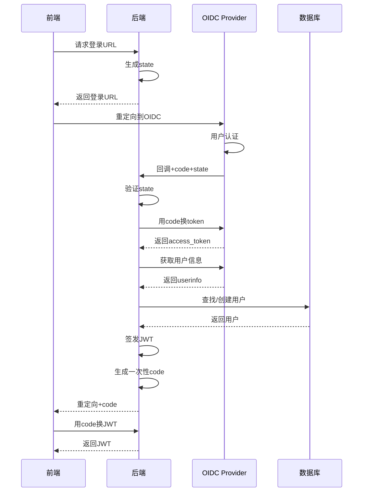
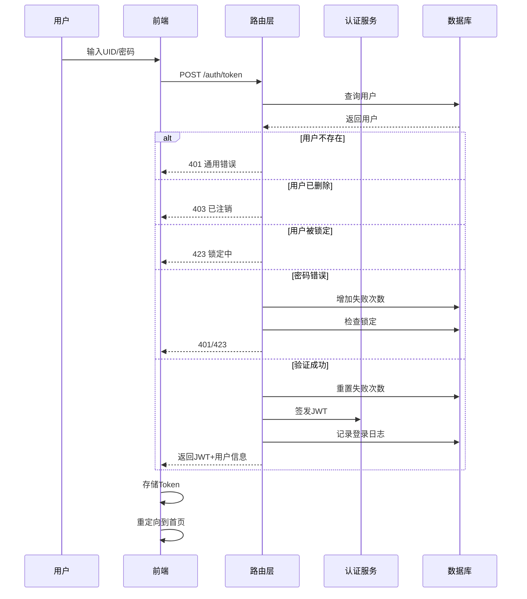
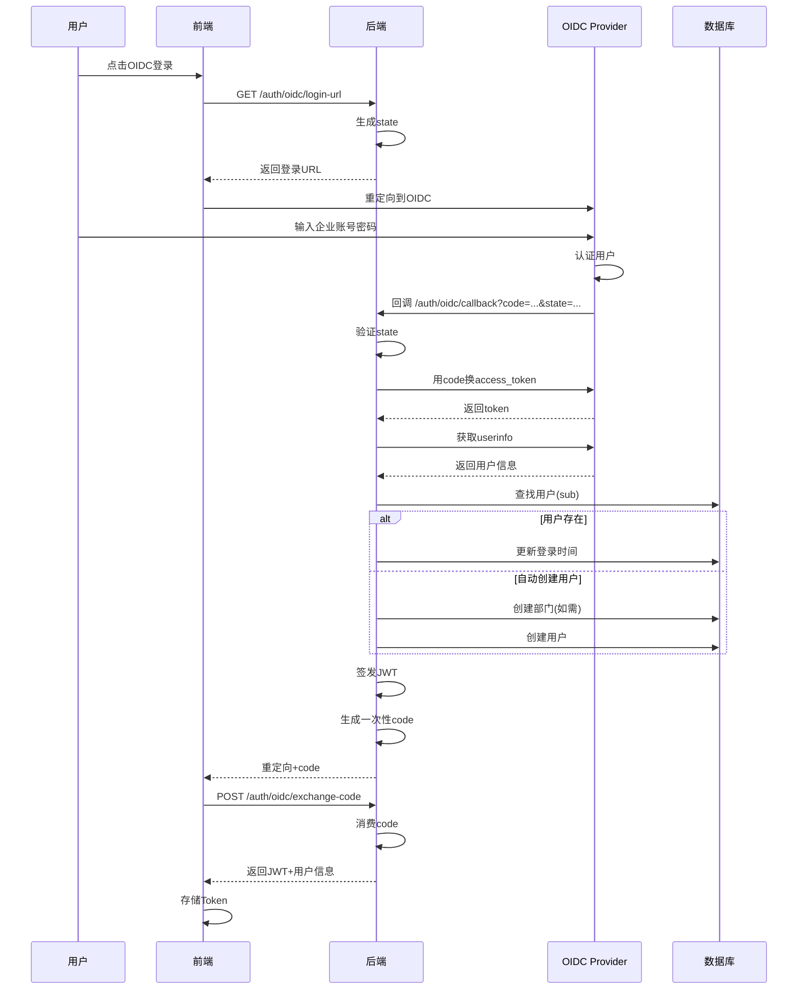
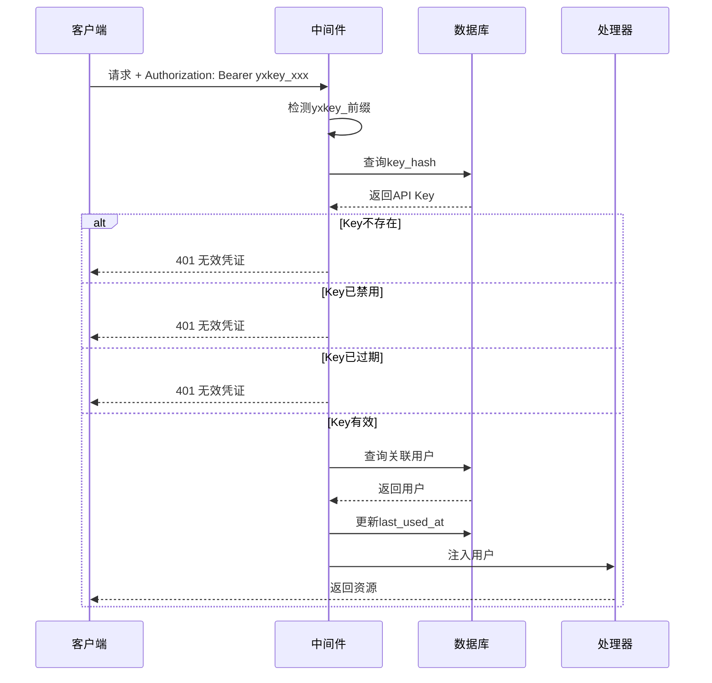

# 用户认证与权限验证链路追踪

> **链路概览**：前端登录请求 → JWT签发/AP Key验证 → Token解析 → RBAC权限检查 → 三级资源隔离 → 资源访问控制

## 一、完整链路追踪

### 1.1 前端登录触发

**用户操作**：用户在 `LoginView.vue` 中输入UID/手机号和密码，点击登录按钮

**代码路径**：
- 前端组件：`web/src/views/LoginView.vue`
- 用户状态管理：`web/src/stores/user.js`
- API封装：`web/src/apis/auth_api.js`

**关键代码**（`LoginView.vue:506-580`）：

```vue
const handleLogin = async () => {
  if (isLocked.value) {
    message.warning(`账户被锁定，请等待 ${formatTime(lockRemainingTime.value)}`)
    return
  }

  if (!ensureAgreementAccepted()) {
    return
  }

  try {
    loading.value = true
    errorMessage.value = ''
    clearLockCountdown()

    // 调用用户store的login方法
    await userStore.login({
      loginId: loginForm.loginId,
      password: loginForm.password
    })

    message.success('登录成功')

    // 根据用户角色决定重定向目标
    const redirectPath = sessionStorage.getItem('redirect') || '/'
    if (redirectPath === '/') {
      await agentStore.initialize()
      router.push('/agent')
    } else {
      router.push(redirectPath)
    }
  } catch (error) {
    console.error('登录失败:', error)

    // 检查是否是锁定错误（HTTP 423）
    if (error.status === 423) {
      // 处理登录锁定逻辑
      let remainingTime = 0
      if (error.headers && error.headers.get) {
        const lockRemainingHeader = error.headers.get('X-Lock-Remaining')
        if (lockRemainingHeader) {
          remainingTime = parseInt(lockRemainingHeader)
        }
      }

      if (remainingTime > 0) {
        startLockCountdown(remainingTime)
        errorMessage.value = `由于多次登录失败，账户已被锁定 ${formatTime(remainingTime)}`
      }
    }
  } finally {
    loading.value = false
  }
}
```

**前端特性**：
- 支持UID或手机号登录
- 账户锁定倒计时显示
- 协议同意验证
- OIDC登录支持

### 1.2 OIDC认证触发

**代码路径**：`web/src/views/LoginView.vue:584-612`

```vue
const handleOIDCLogin = async () => {
  if (!ensureAgreementAccepted()) {
    return
  }

  try {
    oidcLoading.value = true
    errorMessage.value = ''

    // 获取 OIDC 登录 URL
    const response = await authApi.getOIDCLoginUrl()
    if (response.login_url) {
      // 保存当前路径，以便登录后返回
      const redirectPath = sessionStorage.getItem('redirect') || '/'
      sessionStorage.setItem('oidc_redirect', redirectPath)

      // 跳转到 OIDC Provider
      window.location.href = response.login_url
    }
  } catch (error) {
    errorMessage.value = error.message || 'OIDC 登录失败，请重试'
  } finally {
    oidcLoading.value = false
  }
}
```

### 1.3 后端认证路由层

**代码路径**：`backend/server/routers/auth_router.py`

**关键职责**：
- 接收登录请求并验证身份
- 签发JWT令牌或创建API Key
- 用户管理和权限控制

**关键代码**（`auth_router.py:199-291`）：

```python
@auth.post("/token", response_model=Token)
async def login_for_access_token(
    form_data: OAuth2PasswordRequestForm = Depends(),
    db: AsyncSession = Depends(get_db)
):
    # 查找用户 - 支持uid和phone_number登录
    login_identifier = form_data.username

    # 尝试通过uid查找
    result = await db.execute(select(User).filter(User.uid == login_identifier))
    user = result.scalar_one_or_none()

    # 如果通过uid没找到，尝试通过phone_number查找
    if not user:
        result = await db.execute(select(User).filter(User.phone_number == login_identifier))
        user = result.scalar_one_or_none()

    # 用户不存在，返回通用错误（防止用户名枚举攻击）
    if not user:
        raise HTTPException(
            status_code=status.HTTP_401_UNAUTHORIZED,
            detail="登录标识或密码错误",
            headers={"WWW-Authenticate": "Bearer"},
        )

    # 检查用户是否已被删除
    if user.is_deleted:
        raise HTTPException(
            status_code=status.HTTP_403_FORBIDDEN,
            detail="该账户已注销",
        )

    # 检查用户是否处于登录锁定状态
    if user.is_login_locked():
        remaining_time = user.get_remaining_lock_time()
        raise HTTPException(
            status_code=status.HTTP_423_LOCKED,
            detail=f"登录被锁定，请等待 {remaining_time} 秒后再试",
            headers={"WWW-Authenticate": "Bearer", "X-Lock-Remaining": str(remaining_time)},
        )

    # 验证密码
    if not AuthUtils.verify_password(user.password_hash, form_data.password):
        # 密码错误，增加失败次数
        user.increment_failed_login()
        await db.commit()

        # 记录失败操作
        await log_operation(db, user.id, "登录失败", f"密码错误，失败次数: {user.login_failed_count}")

        # 检查是否需要锁定
        if user.is_login_locked():
            remaining_time = user.get_remaining_lock_time()
            raise HTTPException(
                status_code=status.HTTP_423_LOCKED,
                detail=f"由于多次登录失败，账户已被锁定 {remaining_time} 秒",
                headers={"WWW-Authenticate": "Bearer", "X-Lock-Remaining": str(remaining_time)},
            )
        else:
            raise HTTPException(
                status_code=status.HTTP_401_UNAUTHORIZED,
                detail="用户名或密码错误",
            )

    # 登录成功，重置失败计数器
    user.reset_failed_login()
    user.last_login = utc_now_naive()
    await db.commit()

    # 生成访问令牌
    token_data = {"sub": str(user.id)}
    access_token = AuthUtils.create_access_token(token_data)

    # 记录登录操作
    await log_operation(db, user.id, "登录")

    return {
        "access_token": access_token,
        "token_type": "bearer",
        "user_id": user.id,
        "username": user.username,
        "uid": user.uid,
        "role": user.role,
        "department_id": user.department_id,
    }
```

### 1.4 JWT令牌签发

**代码路径**：`backend/package/starring/utils/auth_utils.py`

**关键职责**：
- 生成JWT令牌
- 验证JWT令牌
- 密码哈希与验证

**关键代码**（`auth_utils.py:72-106`）：

```python
JWT_ALGORITHM = "HS256"
JWT_EXPIRATION = 7 * 24 * 60 * 60  # 7天
JWT_AUDIENCE = "starring-know-api"

class AuthUtils:
    @staticmethod
    def create_access_token(data: dict[str, Any], expires_delta: timedelta | None = None) -> str:
        """创建访问令牌"""
        to_encode = data.copy()
        expire = utc_now() + (expires_delta or timedelta(seconds=JWT_EXPIRATION))
        to_encode.update({
            "exp": expire,
            "iss": _get_jwt_issuer(),
            "aud": JWT_AUDIENCE
        })
        return jwt.encode(to_encode, _get_jwt_secret_key(), algorithm=JWT_ALGORITHM)

    @staticmethod
    def verify_access_token(token: str) -> dict[str, Any]:
        """验证访问令牌"""
        try:
            return jwt.decode(
                token,
                _get_jwt_secret_key(),
                algorithms=[JWT_ALGORITHM],
                issuer=_get_jwt_issuer(),
                audience=JWT_AUDIENCE,
                options={"require": ["exp", "sub", "iss", "aud"]},
            )
        except jwt.ExpiredSignatureError:
            raise ValueError("令牌已过期")
        except jwt.InvalidTokenError:
            raise ValueError("无效的令牌")
```

**JWT令牌结构**：
- `sub`: 用户ID
- `exp`: 过期时间（默认7天）
- `iss`: 签发者（格式：`starring-know:{instance_id}`）
- `aud`: 受众（固定：`starring-know-api`）

### 1.5 认证中间件

**代码路径**：`backend/server/utils/auth_middleware.py`

**关键职责**：
- 解析Authorization头
- 验证JWT令牌或API Key
- 注入当前用户到请求上下文

**关键代码**（`auth_middleware.py:62-116`）：

```python
async def get_current_user(
    authorization: str | None = Header(None),
    db: AsyncSession = Depends(get_db),
):
    """获取当前用户（支持JWT和API Key两种认证方式）"""

    if authorization is None:
        return None

    if not authorization.startswith("Bearer "):
        return None

    token = authorization.split("Bearer ")[1]
    if not token:
        return None

    # 根据 token 前缀判断认证方式
    if token.startswith("yxkey_"):
        # API Key 认证
        user, api_key_obj = await _verify_api_key(token, db)
        if user is not None and api_key_obj is not None:
            api_key_obj.last_used_at = utc_now_naive()
            await db.commit()
        return user

    # JWT Token 认证
    try:
        payload = AuthUtils.verify_access_token(token)
        user_id = payload.get("sub")
        if user_id is None:
            raise credentials_exception
    except ValueError as e:
        raise HTTPException(
            status_code=status.HTTP_401_UNAUTHORIZED,
            detail=str(e),
        )

    # 查询用户
    result = await db.execute(select(User).filter(User.id == int(user_id), User.is_deleted == 0))
    user = result.scalar_one_or_none()
    if user is None:
        raise credentials_exception

    # 检查登录锁定状态
    if user.is_login_locked():
        raise HTTPException(
            status_code=status.HTTP_423_LOCKED,
            detail="登录被锁定，请稍后重试",
            headers={"X-Lock-Remaining": str(user.get_remaining_lock_time())},
        )

    return user
```

**双认证机制**：



### 1.6 RBAC权限检查

**代码路径**：`backend/server/utils/auth_middleware.py:118-151`

**三级角色模型**：
- `superadmin`: 超级管理员（全局权限）
- `admin`: 部门管理员（部门权限）
- `user`: 普通用户（个人权限）

**关键代码**：

```python
async def get_required_user(user: User | None = Depends(get_current_user)):
    """获取已登录用户（抛出401如果未登录）"""
    if user is None:
        raise HTTPException(
            status_code=status.HTTP_401_UNAUTHORIZED,
            detail="请登录后再访问",
        )
    if not user.department_id:
        raise HTTPException(
            status_code=status.HTTP_400_BAD_REQUEST,
            detail="当前用户未绑定部门",
        )
    return user


async def get_admin_user(current_user: User = Depends(get_required_user)):
    """获取管理员用户"""
    if current_user.role not in ["admin", "superadmin"]:
        raise HTTPException(
            status_code=status.HTTP_403_FORBIDDEN,
            detail="需要管理员权限",
        )
    return current_user


async def get_superadmin_user(current_user: User = Depends(get_required_user)):
    """获取超级管理员用户"""
    if current_user.role != "superadmin":
        raise HTTPException(
            status_code=status.HTTP_403_FORBIDDEN,
            detail="需要超级管理员权限",
        )
    return current_user
```

**权限检查流程**：



### 1.7 三级资源隔离

**代码路径**：`backend/server/routers/auth_router.py:615-636`

**隔离规则**：
- `superadmin`: 可访问所有部门的用户
- `admin`: 只能访问本部门的用户
- `user`: 只能访问自己的资源

**关键代码**：

```python
@auth.get("/users", response_model=list[UserResponse])
async def read_users(
    skip: int = 0,
    limit: int = 100,
    current_user: User = Depends(get_admin_user),
    db: AsyncSession = Depends(get_db)
):
    user_repo = UserRepository()

    # 部门隔离逻辑
    if current_user.role == "superadmin":
        # 超级管理员可以看到所有用户
        users_with_dept = await user_repo.list_with_department(skip=skip, limit=limit)
    else:
        # 普通管理员只能看到本部门用户
        users_with_dept = await user_repo.list_with_department(
            skip=skip, limit=limit, department_id=current_user.department_id
        )

    users = []
    for user, dept_name in users_with_dept:
        user_dict = user.to_dict()
        user_dict["department_name"] = dept_name
        users.append(user_dict)
    return users
```

**资源访问控制流程**：



### 1.8 OIDC认证流程

**代码路径**：`backend/package/starring/services/oidc_service.py`

**关键特性**：
- 支持标准OIDC协议
- 自动创建用户
- State防CSRF攻击
- 一次性code交换机制

**关键代码**（`oidc_service.py:746-866`）：

```python
async def oidc_callback_handler(code: str, state: str, db, request: Request | None = None):
    """处理 OIDC 回调 - 重定向到前端 Vue 路由"""

    # 验证state参数（防CSRF）
    if not OIDCUtils.verify_state(state):
        return _redirect_to_login_with_error("登录会话已过期，请返回登录页重试")

    # 用授权码交换令牌
    token_response = await OIDCUtils.exchange_code_for_token(code)
    if not token_response:
        return _redirect_to_login_with_error("无法获取访问令牌，请返回登录页重试")

    access_token = token_response.get("access_token")

    # 获取用户信息
    userinfo = await OIDCUtils.get_userinfo(access_token)
    if not userinfo:
        return _redirect_to_login_with_error("无法获取用户信息，请返回登录页重试")

    extracted_info = OIDCUtils.extract_user_info(userinfo)
    sub = extracted_info["sub"]

    # 查找或创建用户
    user = await find_user_by_oidc_sub(db, sub)
    if user:
        await update_oidc_user_login(db, user)
    elif oidc_config.auto_create_user:
        # 从用户信息中获取部门信息
        dept_name = extracted_info.get("department_name")
        dept = await get_or_create_oidc_department(db, dept_name)
        user = await create_oidc_user(db, extracted_info, dept.id if dept else None)
    else:
        return _redirect_to_login_with_error("用户未注册，请联系管理员开通账号")

    # 签发JWT令牌
    token_data = {"sub": str(user.id)}
    jwt_token = AuthUtils.create_access_token(token_data)

    # 生成一次性code，重定向到前端
    exchange_code = OIDCUtils.generate_login_code({
        "access_token": jwt_token,
        "user_id": user.id,
        "username": user.username,
        # ... 其他用户信息
    })
    return _redirect_to_callback(exchange_code)
```

**OIDC认证流程**：



## 二、设计亮点

### 2.1 双认证机制

**亮点**：支持JWT Token和API Key两种认证方式，满足不同场景需求。

| 认证方式 | 使用场景 | 特点 |
|---------|---------|------|
| JWT Token | Web前端、移动端 | 自动续期、用户级权限 |
| API Key | CLI工具、第三方集成 | 长期有效、部门级权限 |

**实现代码**（`auth_middleware.py:83-89`）：

```python
# 根据 token 前缀判断认证方式
if token.startswith("yxkey_"):
    # API Key 认证
    user, api_key_obj = await _verify_api_key(token, db)
else:
    # JWT Token 认证
    payload = AuthUtils.verify_access_token(token)
```

**优势**：
- 单一入口处理两种认证
- 无需修改业务代码
- 前缀快速识别认证类型

### 2.2 RBAC三级权限模型

**亮点**：采用经典的RBAC（基于角色的访问控制）模型，支持三级权限隔离。

**权限矩阵**：

| 操作 | superadmin | admin | user |
|-----|-----------|-------|------|
| 查看所有用户 | ✅ | ❌ | ❌ |
| 查看本部门用户 | ✅ | ✅ | ❌ |
| 创建用户 | ✅ | ✅（仅本部门） | ❌ |
| 删除用户 | ✅ | ✅（仅本部门普通用户） | ❌ |
| 修改用户角色 | ✅ | ❌ | ❌ |
| 模拟用户登录 | ✅ | ❌ | ❌ |

**代码实现**（`auth_router.py:708-731`）：

```python
# 检查权限
if user.role == "superadmin" and current_user.role != "superadmin":
    raise HTTPException(
        status_code=status.HTTP_403_FORBIDDEN,
        detail="只有超级管理员才能修改超级管理员账户",
    )

# 超级管理员账户不能被降级
if user.role == "superadmin" and user_data.role and user_data.role != "superadmin":
    raise HTTPException(
        status_code=status.HTTP_403_FORBIDDEN,
        detail="不能降级超级管理员账户",
    )

# 普通管理员只能修改普通用户
if current_user.role == "admin":
    if user.role != "user":
        raise HTTPException(
            status_code=status.HTTP_403_FORBIDDEN,
            detail="管理员只能修改普通用户账户",
        )
```

**优势**：
- 权限边界清晰
- 防止权限提升攻击
- 易于审计和追溯

### 2.3 登录锁定机制

**亮点**：实现防暴力破解的登录锁定机制，同时提供用户友好的锁定提示。

**核心逻辑**（`models_business.py:107-131`）：

```python
MAX_LOGIN_FAILED_ATTEMPTS = 5
LOGIN_LOCK_DURATION_SECONDS = 300

class User(Base):
    login_failed_count = Column(Integer, nullable=False, default=0)
    last_failed_login = Column(DateTime, nullable=True)
    login_locked_until = Column(DateTime, nullable=True)

    def is_login_locked(self) -> bool:
        """检查用户是否处于登录锁定状态"""
        if self.login_locked_until is None:
            return False
        return utc_now_naive() < self.login_locked_until

    def increment_failed_login(self):
        """增加登录失败计数，并在达到阈值后锁定登录"""
        self.login_failed_count += 1
        self.last_failed_login = utc_now_naive()
        if self.login_failed_count >= MAX_LOGIN_FAILED_ATTEMPTS:
            self.login_locked_until = self.last_failed_login + timedelta(seconds=LOGIN_LOCK_DURATION_SECONDS)

    def reset_failed_login(self):
        """重置登录失败相关字段"""
        self.login_failed_count = 0
        self.last_failed_login = None
        self.login_locked_until = None
```

**前端锁定显示**（`LoginView.vue:551-574`）：

```vue
// 检查是否是锁定错误（HTTP 423）
if (error.status === 423) {
  let remainingTime = 0
  if (error.headers && error.headers.get) {
    const lockRemainingHeader = error.headers.get('X-Lock-Remaining')
    if (lockRemainingHeader) {
      remainingTime = parseInt(lockRemainingHeader)
    }
  }

  if (remainingTime > 0) {
    startLockCountdown(remainingTime)
    errorMessage.value = `由于多次登录失败，账户已被锁定 ${formatTime(remainingTime)}`
  }
}
```

**优势**：
- 有效防止暴力破解
- 用户友好的锁定提示
- 自动解锁机制

### 2.4 OIDC企业级集成

**亮点**：支持标准OIDC协议，实现企业级身份认证集成。

**关键特性**：
- 自动从Discovery端点加载元数据
- State参数防CSRF攻击
- 支持原始用户名模式（不添加oidc前缀）
- 自动创建部门和用户
- 账号绑定防冒用

**账号绑定机制**（`oidc_service.py:542-590`）：

```python
async def _create_oidc_binding_placeholder(db, sub: str, target_user: User) -> None:
    """创建 OIDC sub 绑定占位用户

    在 use_raw_username 模式下，创建占位用户格式: oidc:{sub}:{target_user_id},
    占位用户标记为 is_deleted=1（不参与实际登录），仅用于存储绑定关系，
    防止账号冒用。
    """
    oidc_placeholder_id = f"oidc:{sub}:{target_user.id}"
    # 检查占位用户是否已存在
    result = await db.execute(select(User).filter(User.uid == oidc_placeholder_id))
    if result.scalar_one_or_none():
        return

    # 创建占位用户
    placeholder_user = User(
        username=f"oidc-binding-{sub[:8]}",
        uid=oidc_placeholder_id,
        password_hash=AuthUtils.hash_password(secrets.token_urlsafe(32)),
        role=target_user.role,
        department_id=target_user.department_id,
        is_deleted=1,  # 标记为deleted，不参与实际登录
    )

    db.add(placeholder_user)
    await db.commit()
```

**优势**：
- 无需修改表结构即可实现绑定
- 防止账号冒用攻击
- 支持复杂的企业身份系统

### 2.5 安全最佳实践

**亮点**：遵循多项安全最佳实践，确保认证系统安全可靠。

**实践清单**：

1. **防用户名枚举攻击**（`auth_router.py:214-219`）：
```python
# 用户不存在时返回通用错误信息
if not user:
    raise HTTPException(
        status_code=status.HTTP_401_UNAUTHORIZED,
        detail="登录标识或密码错误",  # 不区分用户不存在和密码错误
    )
```

2. **生产环境强制密钥配置**（`auth_utils.py:37-41`）：
```python
def _get_jwt_secret_key() -> str:
    secret_key = _get_or_create_dev_env("JWT_SECRET_KEY", lambda: secrets.token_hex(32))
    if _is_production_env() and secret_key == PUBLIC_DEFAULT_JWT_SECRET_KEY:
        raise ValueError("JWT_SECRET_KEY 不能使用公开默认密钥，请重新生成随机强密钥")
    return secret_key
```

3. **JWT标准声明验证**（`auth_utils.py:87-88`）：
```python
options={"require": ["exp", "sub", "iss", "aud"]}  # 强制要求所有标准声明
```

4. **Argon2密码哈希**（`auth_utils.py:17`）：
```python
PASSWORD_HASHER = PasswordHasher()  # 使用Argon2算法
```

5. **API Key SHA256哈希存储**（`auth_middleware.py:25`）：
```python
key_hash = hashlib.sha256(key.encode()).hexdigest()  # 不存储原始Key
```

## 三、主要功能

### 3.1 多种认证方式

| 认证方式 | 适用场景 | 优势 |
|---------|---------|------|
| UID + 密码 | 内部用户 | 简单直观 |
| 手机号 + 密码 | 移动端用户 | 易于记忆 |
| OIDC | 企业集成 | 单点登录 |
| API Key | CLI/第三方 | 无需交互 |

### 3.2 用户生命周期管理

- **初始化**: 首次运行创建超级管理员
- **创建**: 管理员创建用户（支持部门分配）
- **更新**: 修改用户信息（权限隔离）
- **删除**: 软删除（保留历史记录）
- **恢复**: OIDC用户恢复（自动）

### 3.3 权限管理

- **三级角色**: superadmin / admin / user
- **部门隔离**: 部门管理员只能管理本部门
- **权限继承**: 用户创建时继承部门权限
- **临时提权**: 超级管理员可模拟用户登录

### 3.4 安全审计

- **登录日志**: 记录所有登录操作
- **操作日志**: 记录关键操作（创建/删除用户等）
- **危险操作标记**: 模拟用户登录等敏感操作特殊标记
- **IP追踪**: 记录操作来源IP

## 四、可改进之处

### 4.1 JWT刷新机制缺失

**问题**：JWT令牌默认有效期7天，无刷新机制。用户活跃期间仍需重新登录。

**改进建议**：
- 实现 `refresh_token` 机制
- 在access_token快过期时自动刷新
- 保持refresh_token有效期较短（如1天）

**代码位置**：`backend/package/starring/utils/auth_utils.py:72-76`

### 4.2 API Key权限粒度不足

**问题**：API Key只能绑定到用户或部门，缺乏更细粒度的权限控制（如只读、特定资源访问）。

**改进建议**：
- 在 `APIKey` 模型中增加 `permissions` 字段（JSON）
- 支持定义API Key可访问的资源范围
- 中间件中验证API Key权限范围

**代码位置**：`backend/package/starring/storage/postgres/models_business.py:664-709`

### 4.3 登录锁定配置固化

**问题**：登录锁定阈值（5次）和锁定时间（300秒）硬编码在模型中，无法动态调整。

**改进建议**：
- 将锁定参数移至环境变量或配置文件
- 支持不同用户角色使用不同的锁定策略
- 提供管理界面动态调整

**代码位置**：`backend/package/starring/storage/postgres/models_business.py:24-25`

### 4.4 OIDC用户名冲突处理不够友好

**问题**：当OIDC用户名冲突时，系统自动添加哈希后缀，但用户无法感知，可能造成困惑。

**改进建议**：
- 在OIDC回调时提示用户用户名已调整
- 提供"首次登录完善信息"流程
- 允许用户自定义用户名（带冲突检测）

**代码位置**：`backend/package/starring/services/oidc_service.py:592-617`

### 4.5 缺少登录地域限制

**问题**：系统未提供IP白名单或地域限制功能，无法防止异地登录风险。

**改进建议**：
- 增加用户级IP白名单配置
- 实现登录地域检测（基于IP地理位置）
- 异地登录时触发二次验证（邮件/短信）

**代码位置**：`backend/server/routers/auth_router.py:199-291`

### 4.6 权限缓存缺失

**问题**：每次请求都需要查询数据库获取用户信息，高频请求下可能成为性能瓶颈。

**改进建议**：
- 在JWT payload中缓存关键权限信息（role、department_id）
- 使用Redis缓存用户权限信息（TTL与JWT同步）
- 用户信息变更时主动失效缓存

**代码位置**：`backend/server/utils/auth_middleware.py:62-116`

## 五、代码路径索引

| 模块 | 文件路径 | 职责 |
|------|----------|------|
| 前端登录 | `web/src/views/LoginView.vue` | 登录界面、OIDC触发、锁定提示 |
| 前端API | `web/src/apis/auth_api.js` | 认证API封装 |
| 认证路由 | `backend/server/routers/auth_router.py` | 登录、用户管理、OIDC路由 |
| 认证中间件 | `backend/server/utils/auth_middleware.py` | JWT/API Key验证、权限检查 |
| JWT工具 | `backend/package/starring/utils/auth_utils.py` | JWT签发、密码哈希 |
| OIDC服务 | `backend/package/starring/services/oidc_service.py` | OIDC认证流程、用户创建 |
| 用户模型 | `backend/package/starring/storage/postgres/models_business.py` | User、Department模型 |
| 用户仓库 | `backend/package/starring/repositories/user_repository.py` | 用户数据访问 |
| 操作日志 | `backend/package/starring/services/operation_log_service.py` | 操作审计日志 |
| API Key模型 | `backend/package/starring/storage/postgres/models_business.py:664-709` | API Key存储 |

## 六、认证流程图

### 6.1 传统登录流程



### 6.2 OIDC认证流程



### 6.3 API Key认证流程



## 七、配置说明

### 7.1 JWT配置

| 环境变量 | 默认值 | 说明 |
|---------|--------|------|
| `JWT_SECRET_KEY` | 开发环境自动生成 | JWT签名密钥（生产必须配置） |
| `STARRING_INSTANCE_ID` | 开发环境自动生成 | 实例ID（用于issuer） |
| `STARRING_ENV` | `development` | 运行环境（production时强制密钥） |

### 7.2 OIDC配置

| 环境变量 | 说明 |
|---------|------|
| `OIDC_ENABLED` | 是否启用OIDC（true/false） |
| `OIDC_ISSUER_URL` | OIDC Provider URL |
| `OIDC_CLIENT_ID` | 客户端ID |
| `OIDC_CLIENT_SECRET` | 客户端密钥 |
| `OIDC_REDIRECT_URI` | 回调URL |
| `OIDC_AUTO_CREATE_USER` | 是否自动创建用户（默认true） |
| `OIDC_DEFAULT_ROLE` | 默认角色（默认user） |
| `OIDC_DEFAULT_DEPARTMENT` | 默认部门（默认OIDC用户） |
| `OIDC_USE_RAW_USERNAME` | 使用原始用户名（不添加oidc前缀） |
| `OIDC_FETCH_DEPARTMENT_INFO` | 从OIDC获取部门信息 |
| `OIDC_FORCE_PROMPT_LOGIN` | 强制重新登录（默认true） |

### 7.3 登录锁定配置

| 参数 | 值 | 说明 |
|------|---|------|
| `MAX_LOGIN_FAILED_ATTEMPTS` | 5 | 最大失败次数 |
| `LOGIN_LOCK_DURATION_SECONDS` | 300 | 锁定时长（秒） |

**注意**：以上参数硬编码在 `models_business.py` 中，暂不支持动态配置。