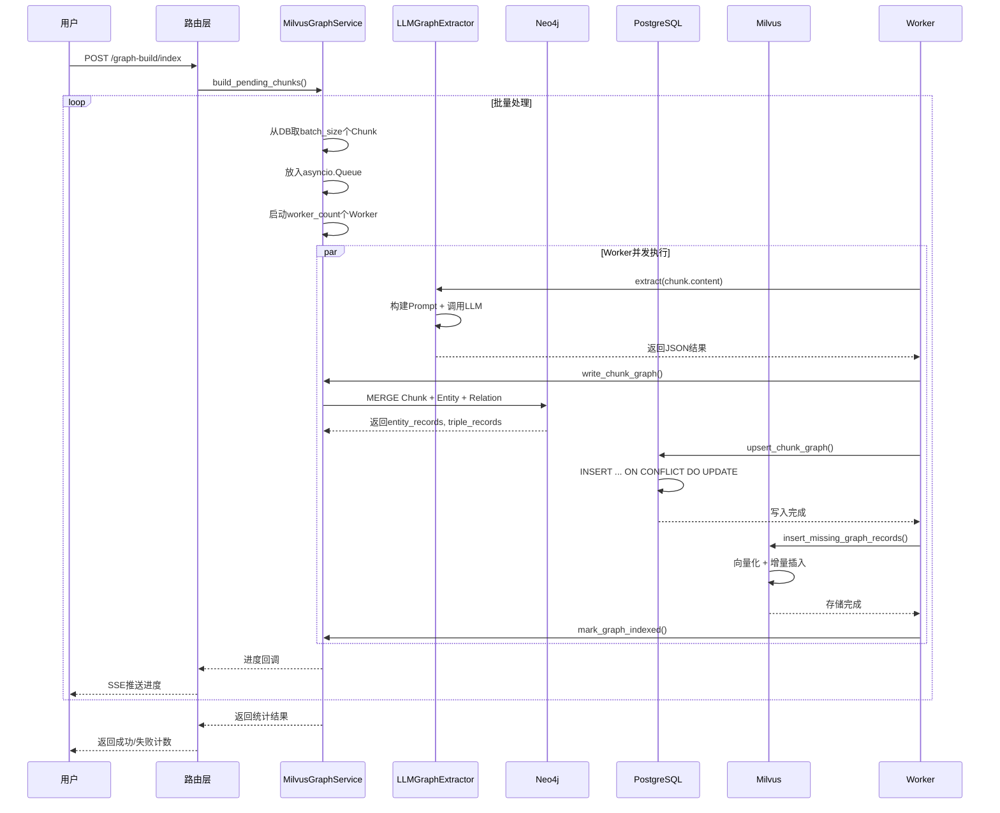
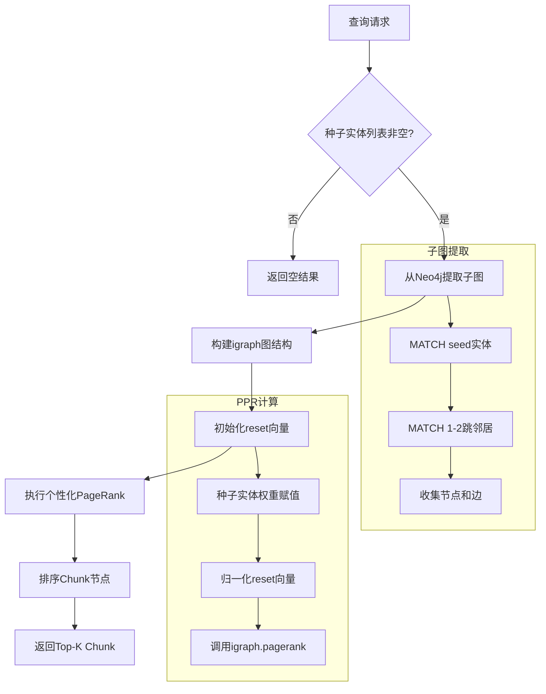
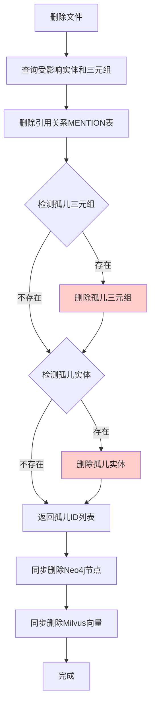

# 图谱构建与查询链路追踪

> **链路概览**：用户配置图谱抽取器 → 触发图谱构建任务 → LLM抽取实体关系 → 写入Neo4j图谱 → 向量化存入Milvus → 元数据存入PostgreSQL → PPR图检索算法

## 一、完整链路追踪

### 1.1 图谱配置触发点

**用户操作**：用户在知识库管理界面配置图谱抽取器（LLM类型、模型、Schema等）

**代码路径**：
- 路由层：`backend/server/routers/knowledge_router.py`
- 服务层：`backend/package/starring/knowledge/graphs/milvus_graph_service.py`

**关键代码**（`knowledge_router.py:501-521`）：

```python
@knowledge.post("/databases/{kb_id}/graph-build/config")
async def configure_graph_build(
    kb_id: str,
    request: ConfigureGraphBuildRequest,
    current_user: User = Depends(get_admin_user),
):
    service = MilvusGraphService()
    config = await service.configure(
        kb_id=kb_id,
        extractor_type=request.extractor_type,
        extractor_options=request.extractor_options,
        created_by=str(current_user.uid),
    )
    return {"config": config}
```

**配置验证**：
- 抽取器类型必须为 "llm"（当前仅支持LLM抽取）
- 不支持自定义完整Prompt，只能通过Schema配置抽取约束
- 配置锁定后只能修改模型、Schema等参数，不能更换抽取器类型

**代码位置**（`milvus_graph_service.py:159-191`）：

```python
async def configure(
    self,
    kb_id: str,
    extractor_type: str,
    extractor_options: dict[str, Any],
    created_by: str,
) -> dict:
    kb = await self._get_milvus_kb(kb_id)
    additional_params = dict(kb.additional_params or {})
    existing_config = additional_params.get(GRAPH_CONFIG_KEY) or {}

    # 抽取器类型锁定验证
    if existing_config.get("locked"):
        existing_extractor_type = (existing_config.get("extractor_type") or "").lower()
        if normalized_extractor_type != existing_extractor_type:
            raise ValueError("图谱抽取器类型已锁定，只能修改模型、Schema 等抽取参数")

    # 验证配置有效性
    GraphExtractorFactory.create(normalized_extractor_type, extractor_options)

    config = {
        "locked": True,
        "extractor_type": normalized_extractor_type,
        "extractor_options": extractor_options or {},
        "created_at": existing_config.get("created_at") or utc_isoformat(),
        "created_by": existing_config.get("created_by") or created_by,
    }

    await self.kb_repo.update(kb_id, {"additional_params": additional_params})
    return config
```

### 1.2 图谱构建触发

**用户操作**：用户点击"构建图谱"按钮，触发批量图谱构建

**代码路径**：`backend/server/routers/knowledge_router.py:523-569`

**关键代码**：

```python
@knowledge.post("/databases/{kb_id}/graph-build/index")
async def index_graph_build(
    kb_id: str,
    request: IndexGraphBuildRequest,
    current_user: User = Depends(get_admin_user),
):
    # 1. 检查是否有正在运行的任务
    if await _has_running_graph_build_task(kb_id):
        raise HTTPException(409, "图谱构建任务正在运行，请勿重复提交")

    # 2. 启动异步任务
    async with TaskerContext() as tasker:
        context = TaskContext(
            task_type=GRAPH_TASK_TYPE,
            payload={"kb_id": kb_id},
            progress_total=100,
        )
        await tasker.start(context)

        service = MilvusGraphService()
        result = await service.build_pending_chunks(
            kb_id,
            batch_size=request.batch_size,
            context=context
        )

    return {"message": "图谱构建完成", "result": result}
```

### 1.3 LLM实体关系抽取

**代码路径**：`backend/package/starring/knowledge/graphs/extractors/llm.py`

**关键职责**：
- 加载LLM模型（支持任意OpenAI兼容模型）
- 构建抽取Prompt（默认模板 + Schema约束）
- 调用LLM获取结构化JSON结果
- 解析并标准化抽取结果

**关键代码**（`llm.py:48-65`）：

```python
async def extract(self, text: str, *, chunk_metadata: dict[str, Any] | None = None) -> dict[str, Any]:
    self.validate_options()

    # 1. 加载模型
    model = select_model(
        model_spec=self.options["model_spec"],
        timeout=60.0,
        model_params=self.options.get("model_params") or {},
    )

    # 2. 构建 Prompt
    prompt = self._build_prompt(text)

    # 3. 调用 LLM
    response = await model.call(prompt, stream=False)

    # 4. 解析 JSON 结果
    parsed = json_repair.loads(response.content if response else "")
    return parsed

def _build_prompt(self, text: str) -> str:
    extraction_prompt = DEFAULT_TRIPLE_EXTRACTION_PROMPT
    schema = str(self.options.get("schema") or "").strip()

    # 添加 Schema 约束
    if schema:
        extraction_prompt = f"{extraction_prompt}\n{SCHEMA_INSTRUCTION.format(schema=schema)}"

    return f"{extraction_prompt}\n\n文本：\n{text}"
```

**默认Prompt模板**（`llm.py:11-23`）：

```python
DEFAULT_TRIPLE_EXTRACTION_PROMPT = """请从下面文本中抽取实体和实体关系，返回严格 JSON，不要输出解释。
JSON 格式：
{
  "relations": [
    {
      "source": {"text": "实体文本", "label": "实体类型", "attributes": [{"text": "属性值", "label": "属性名称"}]},
      "target": {"text": "实体文本", "label": "实体类型", "attributes": [{"text": "属性值", "label": "属性名称"}]},
      "text": "关系显示文本",
      "label": "关系类型"
    }
  ]
}
"""
```

**抽取结果标准化**（`extractors/base.py:24-90`）：

```python
def normalize_extraction_result(result: dict[str, Any], extractor_type: str) -> dict[str, Any]:
    entities = result.get("entities") or []
    relations = result.get("relations") or []

    # 1. 实体去重合并（同名同label合并属性）
    normalized_entities_by_key: dict[tuple[str, str], dict[str, Any]] = {}
    for entity in entities:
        normalized_entity = _normalize_entity(entity)
        key = _entity_key(normalized_entity)  # (normalized_name, label)
        existing = normalized_entities_by_key.get(key)
        if existing is None:
            normalized_entities_by_key[key] = normalized_entity
        else:
            _merge_attributes(existing, normalized_entity)  # 属性取并集

    # 2. 关系标准化
    normalized_relations = []
    for relation in relations:
        source = _normalize_relation_endpoint(relation.get("source"), ...)
        target = _normalize_relation_endpoint(relation.get("target"), ...)
        normalized_relations.append({
            "source": source,
            "target": target,
            "text": str(relation.get("text") or "").strip(),
            "label": str(relation.get("label") or "RELATED_TO").strip(),
        })

    return {
        "entities": list(normalized_entities_by_key.values()),
        "relations": normalized_relations,
        "metadata": {"extractor_type": extractor_type, "schema_version": 1}
    }
```

### 1.4 图谱写入Neo4j

**代码路径**：`backend/package/starring/knowledge/graphs/milvus_graph_service.py:389-473`

**关键职责**：
- 构建图数据payload（实体去重、三元组生成）
- 执行Cypher MERGE操作（Chunk节点、Entity节点、RELATION边）
- 通过写锁串行化并发写入

**关键代码**：

```python
def write_chunk_graph(
    self,
    kb_id: str,
    chunk,
    normalized_result: dict[str, Any],
) -> tuple[list[dict[str, Any]], list[dict[str, Any]]]:
    label = safe_neo4j_label(kb_id)

    # 1. 构建 payload（同一 chunk 内实体去重合并）
    graph_payload = build_graph_payload(normalized_result)
    entities = graph_payload["entities"]
    relations = graph_payload["relations"]

    # 2. 构建 entity/triple 记录（用于 PG 和 Milvus）
    entity_records = self._build_entity_records(kb_id, entities)
    triple_records = self._build_triple_records(kb_id, relations, entity_record_by_local_id, graph_payload)

    # 3. 执行 Neo4j 写入（事务内）
    def query(tx):
        # ① MERGE Chunk 节点
        tx.run(
            cypher_merge_chunk(label),
            chunk_id=chunk.chunk_id,
            file_id=chunk.file_id,
            kb_id=kb_id,
            chunk_index=chunk.chunk_index,
            content_preview=content_preview,
        )

        # ② MERGE Entity 节点 + MENTIONS 边
        for entity in entities:
            entity_record = entity_record_by_local_id[entity["id"]]
            tx.run(
                cypher_merge_entity_mention(label),
                chunk_id=chunk.chunk_id,
                entity_id=entity_record["entity_id"],
                normalized_name=normalize_entity_name(entity["text"]),
                entity_label=entity.get("label") or "Entity",
                name=entity["text"],
                attributes=json.dumps(entity.get("attributes") or []),
            )

        # ③ MERGE Entity→Entity RELATION 边
        for relation in relations:
            source = entity_by_id[relation["source"]]
            target = entity_by_id[relation["target"]]
            triple_id = compute_triple_id(...)
            tx.run(
                cypher_merge_relation(label),
                source_name=normalize_entity_name(source["text"]),
                target_name=normalize_entity_name(target["text"]),
                relation_type=relation.get("label") or "RELATED_TO",
                triple_id=triple_id,
                text=relation["text"],
            )

    neo4j_write(self.driver, query)
    return entity_records, triple_records
```

**实体ID计算**（`graph_utils.py:19-34`）：

```python
def compute_entity_id(kb_id: str, normalized_name: str, label: str) -> str:
    """entity_id = hash(kb_id:normalized_name:label)"""
    return hashstr(f"{kb_id}:{normalized_name}:{label}", length=32)

def compute_triple_id(
    kb_id: str,
    source_normalized_name: str,
    source_label: str,
    relation_type: str,
    target_normalized_name: str,
    target_label: str,
) -> str:
    """triple_id = hash(kb_id:source:label:rel:target:label)"""
    return hashstr(
        f"{kb_id}:{source_normalized_name}:{source_label}:{relation_type}:{target_normalized_name}:{target_label}",
        length=32,
    )
```

**Cypher模板示例**（`graph_utils.py:97-150`）：

```python
def cypher_merge_chunk(db_label: str) -> str:
    return f"""
    MERGE (c:Chunk:MilvusKB:`{db_label}` {{chunk_id: $chunk_id}})
    SET c.file_id = $file_id,
        c.kb_id = $kb_id,
        c.chunk_index = $chunk_index,
        c.content_preview = $content_preview,
        c.start_char_pos = $start_char_pos,
        c.end_char_pos = $end_char_pos
    """

def cypher_merge_entity_mention(db_label: str) -> str:
    return f"""
    MATCH (c:Chunk:MilvusKB:`{db_label}` {{chunk_id: $chunk_id}})
    MERGE (e:Entity:MilvusKB:`{db_label}` {{
        kb_id: $kb_id,
        normalized_name: $normalized_name,
        label: $entity_label
    }})
    SET e.entity_id = $entity_id,
        e.name = $name,
        e.attributes = $attributes
    MERGE (c)-[m:MENTIONS {{chunk_id: $chunk_id, file_id: $file_id, kb_id: $kb_id}}]->(e)
    """

def cypher_merge_relation(db_label: str) -> str:
    return f"""
    MATCH (source:Entity:MilvusKB:`{db_label}` {{
        kb_id: $kb_id,
        normalized_name: $source_name,
        label: $source_label
    }})
    MATCH (target:Entity:MilvusKB:`{db_label}` {{
        kb_id: $kb_id,
        normalized_name: $target_name,
        label: $target_label
    }})
    MERGE (source)-[r:RELATION {{
        kb_id: $kb_id,
        chunk_id: $chunk_id,
        source_name: $source_name,
        target_name: $target_name,
        type: $relation_type
    }}]->(target)
    SET r.triple_id = $triple_id,
        r.text = $text,
        r.file_id = $file_id,
        r.extractor_type = $extractor_type
    """
```

### 1.5 元数据写入PostgreSQL

**代码路径**：`backend/package/starring/repositories/knowledge_graph_repository.py:28-99`

**关键职责**：
- 持久化实体、三元组元数据
- 维护实体-Chunk、三元组-Chunk的引用关系（MENTION表）
- 支持文件删除时的级联清理（孤儿节点检测）

**关键代码**：

```python
async def upsert_chunk_graph(
    self,
    *,
    kb_id: str,
    file_id: str,
    chunk_id: str,
    entities: list[dict[str, Any]],
    triples: list[dict[str, Any]],
) -> None:
    async with pg_manager.get_async_session_context() as session:
        # 1. 插入/更新实体（ON CONFLICT DO UPDATE）
        if entities:
            entity_rows = [{key: value for key, value in entity.items() if key != "content"} for entity in entities]
            entity_stmt = insert(KnowledgeGraphEntity).values(entity_rows)
            await session.execute(
                entity_stmt.on_conflict_do_update(
                    index_elements=["entity_id"],
                    set_={
                        "name": entity_stmt.excluded.name,
                        "attributes": entity_stmt.excluded.attributes,
                        "updated_at": func.now(),
                    },
                )
            )

            # 2. 插入实体引用关系（ON CONFLICT DO NOTHING）
            await session.execute(
                insert(KnowledgeGraphEntityMention)
                .values([
                    {
                        "entity_id": entity["entity_id"],
                        "kb_id": kb_id,
                        "file_id": file_id,
                        "chunk_id": chunk_id,
                    }
                    for entity in entities
                ])
                .on_conflict_do_nothing(index_elements=["entity_id", "chunk_id"])
            )

        # 3. 插入/更新三元组（ON CONFLICT DO UPDATE）
        if triples:
            triple_rows = [
                {key: value for key, value in triple.items() if key not in {"text", "extractor_type"}}
                for triple in triples
            ]
            triple_stmt = insert(KnowledgeGraphTriple).values(triple_rows)
            await session.execute(
                triple_stmt.on_conflict_do_update(
                    index_elements=["triple_id"],
                    set_={
                        "content": triple_stmt.excluded.content,
                        "relation_type": triple_stmt.excluded.relation_type,
                        "updated_at": func.now(),
                    },
                )
            )

            # 4. 插入三元组引用关系（ON CONFLICT DO NOTHING）
            await session.execute(
                insert(KnowledgeGraphTripleMention)
                .values([
                    {
                        "triple_id": triple["triple_id"],
                        "kb_id": kb_id,
                        "file_id": file_id,
                        "chunk_id": chunk_id,
                        "text": triple.get("text"),
                        "extractor_type": triple.get("extractor_type"),
                    }
                    for triple in triples
                ])
                .on_conflict_do_nothing(index_elements=["triple_id", "chunk_id"])
            )
```

**文件删除时的级联清理**（`knowledge_graph_repository.py:101-184`）：

```python
async def delete_file_references(self, file_id: str) -> tuple[list[str], list[str]]:
    """删除文件引用，返回孤儿实体ID和孤儿三元组ID"""
    async with pg_manager.get_async_session_context() as session:
        # 1. 查询受影响的实体和三元组
        affected_entity_ids = list((await session.execute(
            select(KnowledgeGraphEntityMention.entity_id)
            .where(KnowledgeGraphEntityMention.file_id == file_id)
            .distinct()
        )).scalars().all())

        affected_triple_ids = list((await session.execute(
            select(KnowledgeGraphTripleMention.triple_id)
            .where(KnowledgeGraphTripleMention.file_id == file_id)
            .distinct()
        )).scalars().all())

        # 2. 删除引用关系
        await session.execute(
            delete(KnowledgeGraphTripleMention).where(KnowledgeGraphTripleMention.file_id == file_id)
        )
        await session.execute(
            delete(KnowledgeGraphEntityMention).where(KnowledgeGraphEntityMention.file_id == file_id)
        )

        # 3. 检测孤儿三元组（没有任何引用的三元组）
        orphan_triple_ids = []
        if affected_triple_ids:
            triple_has_mentions = exists().where(
                KnowledgeGraphTripleMention.triple_id == KnowledgeGraphTriple.triple_id
            )
            orphan_triple_ids = list((await session.execute(
                select(KnowledgeGraphTriple.triple_id).where(
                    KnowledgeGraphTriple.triple_id.in_(affected_triple_ids),
                    ~triple_has_mentions,
                )
            )).scalars().all())

            if orphan_triple_ids:
                await session.execute(
                    delete(KnowledgeGraphTriple).where(KnowledgeGraphTriple.triple_id.in_(orphan_triple_ids))
                )

        # 4. 检测孤儿实体（没有引用且不参与任何三元组的实体）
        orphan_entity_ids = []
        if affected_entity_ids:
            entity_has_mentions = exists().where(
                KnowledgeGraphEntityMention.entity_id == KnowledgeGraphEntity.entity_id
            )
            entity_has_triples = exists().where(
                or_(
                    KnowledgeGraphTriple.source_entity_id == KnowledgeGraphEntity.entity_id,
                    KnowledgeGraphTriple.target_entity_id == KnowledgeGraphEntity.entity_id,
                )
            )
            orphan_entity_ids = list((await session.execute(
                select(KnowledgeGraphEntity.entity_id).where(
                    KnowledgeGraphEntity.entity_id.in_(affected_entity_ids),
                    ~entity_has_mentions,
                    ~entity_has_triples,
                )
            )).scalars().all())

            if orphan_entity_ids:
                await session.execute(
                    delete(KnowledgeGraphEntity).where(KnowledgeGraphEntity.entity_id.in_(orphan_entity_ids))
                )

        return orphan_entity_ids, orphan_triple_ids
```

### 1.6 向量化存储Milvus

**代码路径**：`backend/package/starring/knowledge/graphs/milvus_graph_vector_store.py:50-89`

**关键职责**：
- 对实体和三元组内容进行向量化
- 存储到Milvus集合（支持向量检索和BM25检索）
- 支持增量插入（避免重复）

**关键代码**：

```python
async def insert_missing_graph_records(
    self,
    *,
    kb_id: str,
    embedding_model_spec: str,
    entities: list[dict[str, Any]],
    triples: list[dict[str, Any]],
) -> None:
    if not entities and not triples:
        return

    # 1. 获取或创建 Collection
    entity_collection = self._get_or_create_entity_collection(kb_id, embedding_info)
    triple_collection = self._get_or_create_triple_collection(kb_id, embedding_info)

    # 2. 查询已存在的 ID（增量插入）
    existing_entity_ids, existing_triple_ids = await asyncio.gather(
        asyncio.to_thread(self._query_existing_ids, entity_collection, entity_ids),
        asyncio.to_thread(self._query_existing_ids, triple_collection, triple_ids),
    )

    # 3. 过滤缺失的记录
    missing_entities = [entity for entity in entities if entity["entity_id"] not in existing_entity_ids]
    missing_triples = [triple for triple in triples if triple["triple_id"] not in existing_triple_ids]

    if not missing_entities and not missing_triples:
        return

    # 4. 批量向量化
    embed = self._get_embedding_function(embedding_model_spec)
    entity_embeddings, triple_embeddings = await asyncio.gather(
        embed([entity["content"] for entity in missing_entities]) if missing_entities else self._empty_embeddings(),
        embed([triple["content"] for triple in missing_triples]) if missing_triples else self._empty_embeddings(),
    )

    # 5. 批量插入
    if missing_entities:
        await asyncio.to_thread(self._insert_entities, entity_collection, missing_entities, entity_embeddings)
    if missing_triples:
        await asyncio.to_thread(self._insert_triples, triple_collection, missing_triples, triple_embeddings)
```

**Collection结构**（`milvus_graph_vector_store.py:218-281`）：

```python
def _get_or_create_entity_collection(self, kb_id: str, embedding_info: Any) -> Collection:
    collection_name = graph_entity_collection_name(kb_id)  # "{kb_id}_entity"
    fields = [
        FieldSchema(name="id", dtype=DataType.VARCHAR, max_length=100, is_primary=True),
        FieldSchema(
            name="content",
            dtype=DataType.VARCHAR,
            max_length=65535,
            enable_analyzer=True,
            analyzer_params=CONTENT_ANALYZER_PARAMS,
        ),
        FieldSchema(name="embedding", dtype=DataType.FLOAT_VECTOR, dim=embedding_info.dimension or 1024),
        FieldSchema(name=CONTENT_SPARSE_FIELD, dtype=DataType.SPARSE_FLOAT_VECTOR),  # BM25 稀疏向量
    ]
    return self._get_or_create_collection(collection_name, fields, embedding_info)

def _get_or_create_triple_collection(self, kb_id: str, embedding_info: Any) -> Collection:
    collection_name = graph_triple_collection_name(kb_id)  # "{kb_id}_triple"
    fields = [
        FieldSchema(name="id", dtype=DataType.VARCHAR, max_length=100, is_primary=True),
        FieldSchema(
            name="content",
            dtype=DataType.VARCHAR,
            max_length=65535,
            enable_analyzer=True,
            analyzer_params=CONTENT_ANALYZER_PARAMS,
        ),
        FieldSchema(name="source_id", dtype=DataType.VARCHAR, max_length=100),
        FieldSchema(name="target_id", dtype=DataType.VARCHAR, max_length=100),
        FieldSchema(name="embedding", dtype=DataType.FLOAT_VECTOR, dim=embedding_info.dimension or 1024),
        FieldSchema(name=CONTENT_SPARSE_FIELD, dtype=DataType.SPARSE_FLOAT_VECTOR),  # BM25 稀疏向量
    ]
    return self._get_or_create_collection(collection_name, fields, embedding_info)
```

**索引创建**（`milvus_graph_vector_store.py:252-281`）：

```python
def _get_or_create_collection(self, collection_name: str, fields: list[FieldSchema], embedding_info: Any) -> Collection:
    # 1. BM25 Function（自动生成稀疏向量）
    bm25_function = Function(
        name="content_bm25",
        input_field_names=["content"],
        output_field_names=[CONTENT_SPARSE_FIELD],
        function_type=FunctionType.BM25,
    )

    # 2. 创建 Collection
    schema = CollectionSchema(
        fields=fields,
        description=f"Knowledge graph collection {collection_name}",
        functions=[bm25_function],
    )
    collection = Collection(name=collection_name, schema=schema)

    # 3. 创建向量索引（IVF_FLAT）
    collection.create_index(
        "embedding",
        {"metric_type": VECTOR_METRIC_TYPE, "index_type": "IVF_FLAT", "params": {"nlist": 1024}}
    )

    # 4. 创建 BM25 稀疏索引
    collection.create_index(
        CONTENT_SPARSE_FIELD,
        {
            "metric_type": "BM25",
            "index_type": "SPARSE_INVERTED_INDEX",
            "params": {"inverted_index_algo": "DAAT_MAXSCORE"},
        },
    )

    return collection
```

### 1.7 批量构建流程编排

**代码路径**：`backend/package/starring/knowledge/graphs/milvus_graph_service.py:193-353`

**关键职责**：
- 从数据库批量读取待处理的Chunk
- 并发调度Worker执行抽取和写入
- 通过写锁串行化Neo4j+PG+Milvus写入
- 进度跟踪和错误处理

**关键代码**：

```python
async def build_pending_chunks(self, kb_id: str, *, batch_size: int, context=None) -> dict[str, Any]:
    kb = await self._get_milvus_kb(kb_id)
    config = self._get_locked_config(kb.additional_params or {})
    extractor_options = self._runtime_extractor_options(config)

    # 1. 创建抽取器实例
    extractor = GraphExtractorFactory.create(config["extractor_type"], extractor_options)

    # 2. 计算并发数
    worker_count = self._get_worker_count(config)

    # 3. 初始化计数器
    total_pending = await self.chunk_repo.count_graph_pending_by_kb_id(kb_id)
    processed = 0
    failed = 0
    failed_chunk_ids: set[str] = set()

    # 4. 创建写锁（串行化 Neo4j + PG + Milvus 写入）
    write_lock = asyncio.Lock()

    # ── 外层循环：逐批处理 ──
    while True:
        if context is not None:
            await context.raise_if_cancelled()

        # 从 DB 取出 batch_size 个 graph_indexed=false 的 chunk
        chunks = await self.chunk_repo.list_graph_pending_by_kb_id(kb_id, batch_size)
        unprocessed = [c for c in chunks if c.chunk_id not in failed_chunk_ids]
        if not unprocessed:
            break

        # 放入 asyncio.Queue
        queue: asyncio.Queue[Any] = asyncio.Queue()
        for chunk in unprocessed:
            queue.put_nowait(chunk)

        # ── 内层 Worker：并发执行 ──
        async def worker() -> None:
            nonlocal processed, failed
            while True:
                try:
                    chunk = queue.get_nowait()
                except asyncio.QueueEmpty:
                    return

                try:
                    # ── ① LLM 抽取 ──
                    extraction_result = await self._get_chunk_extraction_result(kb_id, chunk, extractor)

                    # ── ② 写入 Neo4j + ③ 写入 PostgreSQL + ④ 写入 Milvus ──
                    async with write_lock:  # 串行化写入，避免并发冲突
                        entities, triples = await asyncio.to_thread(
                            self.write_chunk_graph,
                            kb_id,
                            chunk,
                            extraction_result,
                        )

                        await self.graph_repo.upsert_chunk_graph(
                            kb_id=kb_id,
                            file_id=chunk.file_id,
                            chunk_id=chunk.chunk_id,
                            entities=entities,
                            triples=triples,
                        )

                        await self.graph_vector_store.insert_missing_graph_records(
                            kb_id=kb_id,
                            embedding_model_spec=kb.embedding_model_spec,
                            entities=entities,
                            triples=triples,
                        )

                        # ── ⑤ 标记完成 ──
                        await self.chunk_repo.mark_graph_indexed(
                            chunk.chunk_id,
                            ent_ids=[entity["entity_id"] for entity in entities],
                        )

                    processed += 1

                except Exception as exc:
                    logger.error(f"Chunk 图谱构建失败 chunk_id={chunk.chunk_id}: {exc}")
                    failed_chunk_ids.add(chunk.chunk_id)
                    failed += 1

                finally:
                    queue.task_done()

                # 进度回调
                if context is not None:
                    completed = processed + failed
                    progress = 5.0 + min(90.0, completed / max(total_pending, 1) * 90.0)
                    await context.set_progress(progress, f"图谱构建 {completed}/{total_pending}，失败 {failed}")

        # 启动 worker_count 个并发 worker
        workers = [asyncio.create_task(worker()) for _ in range(min(worker_count, len(unprocessed)))]
        try:
            await asyncio.gather(*workers)
        except Exception:
            for task in workers:
                task.cancel()
            await asyncio.gather(*workers, return_exceptions=True)
            raise

    remaining = await self.chunk_repo.count_graph_pending_by_kb_id(kb_id)
    return {"kb_id": kb_id, "success": processed, "failed": failed, "remaining": remaining}
```

**LLM抽取结果缓存**（`milvus_graph_service.py:371-387`）：

```python
async def _get_chunk_extraction_result(self, kb_id: str, chunk, extractor: GraphExtractor) -> dict[str, Any]:
    extractor_type = extractor.extractor_type

    # 检查 chunk.extraction_result 缓存
    if chunk.extraction_result:
        return normalize_extraction_result(chunk.extraction_result, extractor_type)

    # 调用 LLM 抽取
    extraction_result = await extractor.extract(
        chunk.content,
        chunk_metadata={
            "kb_id": kb_id,
            "chunk_id": chunk.chunk_id,
            "file_id": chunk.file_id,
            "chunk_index": chunk.chunk_index,
        },
    )

    # 标准化并缓存
    normalized_result = normalize_extraction_result(extraction_result, extractor_type)
    await self.chunk_repo.update_extraction_result(chunk.chunk_id, normalized_result)
    return normalized_result
```

### 1.8 PPR图检索算法

**代码路径**：`backend/package/starring/knowledge/graphs/milvus_graph_service.py:710-779`

**关键职责**：
- 从Neo4j提取子图（基于种子实体）
- 构建igraph图结构
- 执行个性化PageRank算法
- 排序Chunk节点并返回Top-K

**关键代码**：

```python
async def query_and_rank_chunks_by_ppr(
    self,
    kb_id: str,
    seed_weights: dict[str, float],
    *,
    max_nodes: int,
    top_k: int,
    damping: float,
) -> list[tuple[str, float]]:
    if not seed_weights:
        return []

    # 1. 提取子图（基于种子实体）
    subgraph = await self.query_seed_subgraph(
        kb_id,
        entity_ids=list(seed_weights.keys()),
        max_nodes=max_nodes,
    )

    # 2. 执行 PPR 排序
    return self.rank_chunks_by_ppr(subgraph, seed_weights, top_k=top_k, damping=damping)

@staticmethod
def rank_chunks_by_ppr(
    subgraph: dict[str, Any],
    seed_weights: dict[str, float],
    *,
    top_k: int,
    damping: float,
) -> list[tuple[str, float]]:
    nodes = subgraph.get("nodes") or []
    edges = subgraph.get("edges") or []

    if not nodes:
        return []

    # 1. 构建节点索引
    node_ids = [node["id"] for node in nodes]
    index_by_id = {node_id: index for index, node_id in enumerate(node_ids)}

    # 2. 构建边索引
    edge_indices = [
        (index_by_id[edge["source_id"]], index_by_id[edge["target_id"]])
        for edge in edges
        if edge.get("source_id") in index_by_id and edge.get("target_id") in index_by_id
    ]

    if not edge_indices:
        return []

    # 3. 构建 igraph 图（无向图）
    graph = ig.Graph(n=len(nodes), edges=edge_indices, directed=False)

    # 4. 初始化 reset 向量（种子实体的权重）
    reset = [0.0] * len(nodes)
    chunk_node_indexes: list[tuple[int, str]] = []

    for index, node in enumerate(nodes):
        properties = node.get("properties") or {}

        # 记录 Chunk 节点索引
        if node.get("type") == "Chunk" and properties.get("chunk_id"):
            chunk_node_indexes.append((index, properties["chunk_id"]))
            continue

        # 设置种子实体权重
        entity_id = properties.get("entity_id")
        if entity_id in seed_weights:
            reset[index] = seed_weights[entity_id]

    # 5. 归一化 reset 向量
    reset_total = sum(reset)
    if reset_total <= 0 or not chunk_node_indexes:
        return []

    reset = [value / reset_total for value in reset]

    # 6. 执行个性化 PageRank
    scores = graph.personalized_pagerank(damping=min(max(damping, 0.1), 0.99), reset=reset)

    # 7. 排序 Chunk 节点
    ranked = sorted(
        ((chunk_id, float(scores[index])) for index, chunk_id in chunk_node_indexes),
        key=lambda item: item[1],
        reverse=True,
    )

    return ranked[:top_k]
```

**子图提取Cypher**（`milvus_graph_service.py:657-680`）：

```python
async def query_seed_subgraph(
    self,
    kb_id: str,
    *,
    entity_ids: list[str],
    max_nodes: int,
) -> dict[str, Any]:
    if not entity_ids:
        return {"nodes": [], "edges": []}

    seed_entity_ids = list(dict.fromkeys(entity_ids))
    label = safe_neo4j_label(kb_id)

    cypher = f"""
    MATCH (seed:Entity:MilvusKB:`{label}`)
    WHERE seed.entity_id IN $entity_ids
    MATCH p = (seed)-[*1..2]-(n:MilvusKB:`{label}`)
    WITH p LIMIT $path_limit
    WITH collect(p) AS paths
    UNWIND paths AS node_path
    UNWIND nodes(node_path) AS node
    WITH paths, collect(DISTINCT node) AS graph_nodes
    UNWIND paths AS rel_path
    UNWIND relationships(rel_path) AS rel
    RETURN graph_nodes AS nodes, collect(DISTINCT rel) AS edges
    """

    try:
        return await _run_neo4j_query_io(
            self._query_seed_subgraph_sync,
            kb_id,
            cypher,
            seed_entity_ids,
            max_nodes,
        )
    except Exception as e:
        logger.error(f"Milvus seed subgraph query failed: {e}")
        return {"nodes": [], "edges": []}
```

## 二、设计亮点

### 2.1 三存储协同架构

**亮点**：采用 **Neo4j（图结构）+ Milvus（向量）+ PostgreSQL（元数据）** 三存储协同架构，各司其职：

| 存储系统 | 职责 | 优势 |
|---------|------|------|
| **Neo4j** | 存储图结构（Chunk、Entity、Relation） | 原生图数据库，支持复杂图遍历查询 |
| **Milvus** | 存储向量化内容（entity.content、triple.content） | 高性能向量检索，支持BM25混合检索 |
| **PostgreSQL** | 存储元数据（entity、triple、mention引用） | 强一致性、事务支持、孤儿节点检测 |

**数据一致性保证**：
- 使用写锁串行化三存储写入（避免并发冲突）
- PostgreSQL采用ON CONFLICT语义（INSERT ... ON CONFLICT DO UPDATE/DO NOTHING）
- Milvus采用增量插入（先查询已存在ID，再插入缺失记录）

**代码位置**：`milvus_graph_service.py:292-328`

```python
async with write_lock:  # 串行化写入，保证三存储一致性
    # ① 写入 Neo4j
    entities, triples = await asyncio.to_thread(
        self.write_chunk_graph,
        kb_id,
        chunk,
        extraction_result,
    )

    # ② 写入 PostgreSQL
    await self.graph_repo.upsert_chunk_graph(
        kb_id=kb_id,
        file_id=chunk.file_id,
        chunk_id=chunk.chunk_id,
        entities=entities,
        triples=triples,
    )

    # ③ 写入 Milvus
    await self.graph_vector_store.insert_missing_graph_records(
        kb_id=kb_id,
        embedding_model_spec=kb.embedding_model_spec,
        entities=entities,
        triples=triples,
    )
```

### 2.2 LLM智能抽取

**亮点**：使用大语言模型（LLM）从非结构化文本中抽取实体关系，具有以下优势：

**1. 灵活的Schema配置**：
- 支持自定义实体类型、关系类型、属性结构
- 通过Schema约束指导LLM抽取，而非硬编码规则
- 用户可动态调整Schema，无需修改代码

**代码位置**：`llm.py:60-65`

```python
def _build_prompt(self, text: str) -> str:
    extraction_prompt = DEFAULT_TRIPLE_EXTRACTION_PROMPT
    schema = str(self.options.get("schema") or "").strip()

    # 添加 Schema 约束（用户自定义）
    if schema:
        extraction_prompt = f"{extraction_prompt}\n{SCHEMA_INSTRUCTION.format(schema=schema)}"

    return f"{extraction_prompt}\n\n文本：\n{text}"
```

**2. 智能的实体去重合并**：
- 同名同label实体自动合并（避免重复）
- 属性自动取并集（保留所有属性信息）

**代码位置**：`extractors/base.py:36-74` + `graph_utils.py:45-90`

```python
# extractors/base.py
def add_entity(entity: dict[str, Any], path: str) -> dict[str, Any]:
    normalized_entity = _normalize_entity(entity, path)
    key = _entity_key(normalized_entity)  # (normalized_name, label)
    existing = normalized_entities_by_key.get(key)

    if existing is None:
        normalized_entities_by_key[key] = normalized_entity
    else:
        _merge_attributes(existing, normalized_entity)  # 属性取并集

    return existing

# graph_utils.py
def _merge_attributes(target: dict[str, Any], source: dict[str, Any]) -> None:
    known_attributes = {(attr["text"], attr["label"]) for attr in target.get("attributes") or []}
    for attribute in source.get("attributes") or []:
        attribute_key = (attribute["text"], attribute["label"])
        if attribute_key not in known_attributes:
            target.setdefault("attributes", []).append(attribute)
            known_attributes.add(attribute_key)
```

**3. 抽取结果缓存**：
- LLM抽取结果缓存到Chunk表（避免重复调用）
- 支持增量构建（只处理新增Chunk）

**代码位置**：`milvus_graph_service.py:371-387`

```python
async def _get_chunk_extraction_result(self, kb_id: str, chunk, extractor: GraphExtractor) -> dict[str, Any]:
    extractor_type = extractor.extractor_type

    # 检查缓存
    if chunk.extraction_result:
        return normalize_extraction_result(chunk.extraction_result, extractor_type)

    # 调用 LLM
    extraction_result = await extractor.extract(chunk.content, chunk_metadata={...})

    # 缓存结果
    normalized_result = normalize_extraction_result(extraction_result, extractor_type)
    await self.chunk_repo.update_extraction_result(chunk.chunk_id, normalized_result)
    return normalized_result
```

### 2.3 PPR图检索算法

**亮点**：采用 **个性化PageRank（Personalized PageRank, PPR）** 算法进行子图检索，具有以下优势：

**1. 基于图结构的语义扩散**：
- 不仅匹配种子实体，还扩散到相关联的实体和Chunk
- 充分利用图谱的拓扑结构信息

**2. 个性化权重控制**：
- 种子实体可设置不同权重（反映重要性）
- PageRank分数传播权重（重要实体附近的Chunk得分更高）

**3. 多跳关系传递**：
- 支持1-2跳关系传递（`[*1..2]`）
- 平衡召回率和精确率

**代码位置**：`milvus_graph_service.py:710-779`

```python
@staticmethod
def rank_chunks_by_ppr(
    subgraph: dict[str, Any],
    seed_weights: dict[str, float],
    *,
    top_k: int,
    damping: float,
) -> list[tuple[str, float]]:
    nodes = subgraph.get("nodes") or []
    edges = subgraph.get("edges") or []

    if not nodes:
        return []

    # 1. 构建节点索引
    node_ids = [node["id"] for node in nodes]
    index_by_id = {node_id: index for index, node_id in enumerate(node_ids)}

    # 2. 构建边索引
    edge_indices = [
        (index_by_id[edge["source_id"]], index_by_id[edge["target_id"]])
        for edge in edges
        if edge.get("source_id") in index_by_id and edge.get("target_id") in index_by_id
    ]

    if not edge_indices:
        return []

    # 3. 构建 igraph 图（无向图）
    graph = ig.Graph(n=len(nodes), edges=edge_indices, directed=False)

    # 4. 初始化 reset 向量（种子实体的权重）
    reset = [0.0] * len(nodes)
    chunk_node_indexes: list[tuple[int, str]] = []

    for index, node in enumerate(nodes):
        properties = node.get("properties") or {}

        # 记录 Chunk 节点索引
        if node.get("type") == "Chunk" and properties.get("chunk_id"):
            chunk_node_indexes.append((index, properties["chunk_id"]))
            continue

        # 设置种子实体权重
        entity_id = properties.get("entity_id")
        if entity_id in seed_weights:
            reset[index] = seed_weights[entity_id]

    # 5. 归一化 reset 向量
    reset_total = sum(reset)
    if reset_total <= 0 or not chunk_node_indexes:
        return []

    reset = [value / reset_total for value in reset]

    # 6. 执行个性化 PageRank
    scores = graph.personalized_pagerank(damping=min(max(damping, 0.1), 0.99), reset=reset)

    # 7. 排序 Chunk 节点
    ranked = sorted(
        ((chunk_id, float(scores[index])) for index, chunk_id in chunk_node_indexes),
        key=lambda item: item[1],
        reverse=True,
    )

    return ranked[:top_k]
```

### 2.4 并发控制与错误隔离

**亮点**：采用多级并发控制机制，平衡吞吐量和数据一致性：

**1. Worker并发调度**：
- 支持并发调用LLM抽取（提高吞吐量）
- 通过`concurrency_count`参数控制并发数（可配置）

**代码位置**：`milvus_graph_service.py:355-363`

```python
@staticmethod
def _get_worker_count(config: dict[str, Any]) -> int:
    if (config.get("extractor_type") or "").lower() != "llm":
        return 1  # 非LLM抽取器不并发

    try:
        worker_count = int((config.get("extractor_options") or {}).get("concurrency_count") or 1)
    except (TypeError, ValueError):
        return 1

    return max(1, min(worker_count, 1000))  # 限制在 1-1000 之间
```

**2. 写锁串行化**：
- Neo4j + PostgreSQL + Milvus 写入通过写锁串行化
- 避免并发写入导致的数据不一致

**代码位置**：`milvus_graph_service.py:248` + `292-328`

```python
write_lock = asyncio.Lock()  # 串行化写入

async with write_lock:  # 保证三存储一致性
    # 写入 Neo4j
    entities, triples = await asyncio.to_thread(...)

    # 写入 PostgreSQL
    await self.graph_repo.upsert_chunk_graph(...)

    # 写入 Milvus
    await self.graph_vector_store.insert_missing_graph_records(...)
```

**3. Neo4j查询限流**：
- 使用信号量限制Neo4j并发查询数（避免压垮数据库）
- 默认限制为8个并发查询

**代码位置**：`milvus_graph_service.py:34-75`

```python
NEO4J_QUERY_OFFLOAD_LIMIT = 8

async def _run_neo4j_query_io(func, /, *args, **kwargs):
    semaphore = _get_neo4j_query_offload_semaphore()
    await semaphore.acquire()

    task = asyncio.create_task(asyncio.to_thread(func, *args, **kwargs))

    def release_capacity(completed_task: asyncio.Task):
        semaphore.release()
        if completed_task.cancelled():
            return
        completed_task.exception()

    task.add_done_callback(release_capacity)
    return await asyncio.shield(task)
```

**4. 错误隔离机制**：
- 单个Chunk抽取失败不影响其他Chunk
- 失败的Chunk记录到`failed_chunk_ids`，后续跳过
- 最终返回成功/失败计数

**代码位置**：`milvus_graph_service.py:330-333`

```python
except Exception as exc:
    logger.error(f"Chunk 图谱构建失败 chunk_id={chunk.chunk_id}: {exc}")
    failed_chunk_ids.add(chunk.chunk_id)  # 记录失败 Chunk
    failed += 1
```

### 2.5 文件级联删除机制

**亮点**：文件删除时自动清理孤儿实体和三元组，避免数据冗余：

**删除流程**：
1. 删除文件关联的所有引用关系（MENTION表）
2. 检测孤儿三元组（没有任何引用的三元组）
3. 检测孤儿实体（没有引用且不参与任何三元组的实体）
4. 从Neo4j和Milvus同步删除孤儿节点

**代码位置**：`knowledge_graph_repository.py:101-184`

```python
async def delete_file_references(self, file_id: str) -> tuple[list[str], list[str]]:
    """删除文件引用，返回孤儿实体ID和孤儿三元组ID"""
    async with pg_manager.get_async_session_context() as session:
        # 1. 查询受影响的实体和三元组
        affected_entity_ids = list((await session.execute(
            select(KnowledgeGraphEntityMention.entity_id)
            .where(KnowledgeGraphEntityMention.file_id == file_id)
            .distinct()
        )).scalars().all())

        # 2. 删除引用关系
        await session.execute(
            delete(KnowledgeGraphEntityMention).where(KnowledgeGraphEntityMention.file_id == file_id)
        )

        # 3. 检测孤儿实体（没有引用且不参与任何三元组的实体）
        orphan_entity_ids = []
        if affected_entity_ids:
            entity_has_mentions = exists().where(
                KnowledgeGraphEntityMention.entity_id == KnowledgeGraphEntity.entity_id
            )
            entity_has_triples = exists().where(
                or_(
                    KnowledgeGraphTriple.source_entity_id == KnowledgeGraphEntity.entity_id,
                    KnowledgeGraphTriple.target_entity_id == KnowledgeGraphEntity.entity_id,
                )
            )
            orphan_entity_ids = list((await session.execute(
                select(KnowledgeGraphEntity.entity_id).where(
                    KnowledgeGraphEntity.entity_id.in_(affected_entity_ids),
                    ~entity_has_mentions,
                    ~entity_has_triples,
                )
            )).scalars().all())

            if orphan_entity_ids:
                await session.execute(
                    delete(KnowledgeGraphEntity).where(KnowledgeGraphEntity.entity_id.in_(orphan_entity_ids))
                )

        return orphan_entity_ids, orphan_triple_ids
```

## 三、主要功能

### 3.1 图谱配置与构建

| 功能 | 端点 | 说明 |
|------|------|------|
| 配置图谱抽取器 | `POST /databases/{kb_id}/graph-build/config` | 配置LLM模型、Schema、并发数等 |
| 触发图谱构建 | `POST /databases/{kb_id}/graph-build/index` | 批量构建图谱（异步任务） |
| 查询构建状态 | `GET /databases/{kb_id}/graph-build/status` | 查询进度、实体数、关系数等 |
| 重置图谱 | `POST /databases/{kb_id}/graph-build/reset` | 清空图谱数据（可选清空配置） |

### 3.2 图谱查询与可视化

| 功能 | 方法 | 说明 |
|------|------|------|
| 查询子图 | `query_nodes()` | 支持关键词搜索、深度限制、排除Chunk节点 |
| 查询种子子图 | `query_seed_subgraph()` | 基于实体ID提取相关子图 |
| PPR检索 | `query_and_rank_chunks_by_ppr()` | 基于种子实体排序相关Chunk |
| 查询标签 | `get_labels()` | 获取图谱中的所有实体类型 |
| 查询统计 | `get_stats()` | 获取节点数、边数、实体类型分布 |

### 3.3 图谱维护

| 功能 | 方法 | 说明 |
|------|------|------|
| 删除文件图谱 | `delete_file_graph()` | 删除文件关联的图谱数据（级联清理） |
| 删除知识图谱 | `delete_graph()` | 清空整个知识库的图谱数据 |

### 3.4 向量检索

| 功能 | 方法 | 说明 |
|------|------|------|
| 检索实体 | `search_entities()` | 向量检索实体（支持BM25混合检索） |
| 检索三元组 | `search_triples()` | 向量检索三元组（返回源实体和目标实体） |

## 四、可改进之处

### 4.1 LLM抽取缺乏重试机制

**问题**：LLM调用失败时直接抛出异常，没有重试机制，可能导致部分Chunk构建失败。

**改进建议**：
- 增加`ModelRetryMiddleware`类似的机制（参考Agent对话流程）
- 配置最大重试次数（如3次）
- 记录重试日志，便于排查问题

**代码位置**：`llm.py:48-58`

```python
async def extract(self, text: str, *, chunk_metadata: dict[str, Any] | None = None) -> dict[str, Any]:
    self.validate_options()
    model = select_model(...)

    # 当前无重试机制，失败直接抛出异常
    response = await model.call(prompt, stream=False)
    parsed = json_repair.loads(response.content if response else "")
    return parsed
```

### 4.2 实体合并策略简单

**问题**：当前实体合并策略仅基于`(normalized_name, label)`，可能导致：
- 同名不同义的实体被错误合并（如"苹果"既可是水果也可是公司）
- 不同语言的同义实体未合并（如"Apple"和"苹果"）

**改进建议**：
- 增加上下文感知的实体消歧（考虑Chunk上下文）
- 支持多语言实体链接（如使用Wikidata ID）
- 提供人工校验接口（用户可手动合并/拆分实体）

**代码位置**：`graph_utils.py:45-90`

```python
def build_graph_payload(normalized_result: dict[str, Any]) -> dict[str, Any]:
    entities: list[dict[str, Any]] = []
    entity_by_key: dict[tuple[str, str], dict[str, Any]] = {}  # 仅基于 (normalized_name, label)

    def add_entity(entity: dict[str, Any]) -> str:
        key = (normalize_entity_name(entity["text"]), entity.get("label") or "Entity")
        existing = entity_by_key.get(key)

        if existing is not None:
            # 简单合并，未考虑上下文消歧
            _merge_attributes(existing, entity)
            return existing["id"]
        ...
```

### 4.3 PPR算法缺乏预热机制

**问题**：每次查询都从Neo4j提取子图并构建igraph，可能导致：
- 查询延迟较高（特别是子图较大时）
- 重复构建相同子图

**改进建议**：
- 实现子图缓存机制（LRU缓存最近查询的子图）
- 提供图谱预热接口（提前加载常用子图到内存）
- 考虑使用Neo4j内置的图算法（如GDS库）减少数据传输

**代码位置**：`milvus_graph_service.py:710-779`

```python
@staticmethod
def rank_chunks_by_ppr(
    subgraph: dict[str, Any],
    seed_weights: dict[str, float],
    *,
    top_k: int,
    damping: float,
) -> list[tuple[str, float]]:
    # 每次查询都重新构建 igraph 图
    nodes = subgraph.get("nodes") or []
    edges = subgraph.get("edges") or []

    if not nodes:
        return []

    node_ids = [node["id"] for node in nodes]
    index_by_id = {node_id: index for index, node_id in enumerate(node_ids)}

    edge_indices = [
        (index_by_id[edge["source_id"]], index_by_id[edge["target_id"]])
        for edge in edges
        ...
    ]

    graph = ig.Graph(n=len(nodes), edges=edge_indices, directed=False)
    ...
```

### 4.4 错误处理粒度不足

**问题**：当前仅记录失败的Chunk ID，缺少详细错误信息：
- LLM调用失败的具体原因（超时、JSON解析失败等）
- Neo4j写入失败的具体原因（约束冲突、连接断开等）

**改进建议**：
- 增加错误分类（LLM_ERROR、NEO4J_ERROR、MILVUS_ERROR等）
- 记录完整的错误堆栈和上下文
- 提供错误查询接口（用户可查看失败详情）

**代码位置**：`milvus_graph_service.py:330-333`

```python
except Exception as exc:
    logger.error(f"Chunk 图谱构建失败 chunk_id={chunk.chunk_id}: {exc}")
    failed_chunk_ids.add(chunk.chunk_id)  # 仅记录 ID，未记录错误详情
    failed += 1
```

### 4.5 缺乏图谱版本管理

**问题**：图谱更新时直接覆盖，没有版本管理机制：
- 无法回滚到历史版本
- 无法比较不同版本的差异
- 缺少图谱变更审计

**改进建议**：
- 实现图谱快照机制（定期备份图谱状态）
- 记录图谱变更历史（谁在何时修改了哪些实体/关系）
- 提供图谱回滚接口（恢复到指定快照）

**代码位置**：`knowledge_graph_repository.py:28-99`

```python
async def upsert_chunk_graph(...):
    # 直接 INSERT ... ON CONFLICT DO UPDATE，无版本管理
    entity_stmt = insert(KnowledgeGraphEntity).values(entity_rows)
    await session.execute(
        entity_stmt.on_conflict_do_update(
            index_elements=["entity_id"],
            set_={
                "name": entity_stmt.excluded.name,
                "attributes": entity_stmt.excluded.attributes,
                "updated_at": func.now(),  # 仅记录更新时间，无版本号
            },
        )
    )
```

### 4.6 Neo4j连接管理可优化

**问题**：当前Neo4j连接通过全局变量`_shared_neo4j_connection`管理，存在以下风险：
- 多线程环境下的竞态条件（虽然有锁，但仍有优化空间）
- 连接泄漏风险（未正确关闭连接）
- 缺少连接池监控

**改进建议**：
- 使用连接池管理器（如`neo4j.SessionPool`）
- 增加连接健康检查和自动重连机制
- 提供连接池监控指标（活跃连接数、等待队列长度等）

**代码位置**：`manager.py:39-96`

```python
class Neo4jConnectionManager:
    def __init__(self):
        self.driver = None
        self.status = "closed"

        if os.environ.get("LITE_MODE", "").lower() in ("true", "1"):
            logger.info("LITE_MODE enabled, skipping Neo4j connection")
            return

        self._connect()  # 初始化时连接，无连接池管理

    def _connect(self):
        if self.driver and self._is_connected():
            return

        uri = os.environ.get("NEO4J_URI", "bolt://localhost:7687")
        username = os.environ.get("NEO4J_USERNAME", "neo4j")
        password = os.environ.get("NEO4J_PASSWORD", "0123456789")

        try:
            self.driver = GD.driver(uri, auth=(username, password))  # 单连接，无连接池
            with self.driver.session() as session:
                session.run("RETURN 1")
            self.status = "open"
            logger.info("Successfully connected to Neo4j")
        except Exception as e:
            logger.error(f"Failed to connect to Neo4j: {e}")
            raise
```

## 五、代码路径索引

| 模块 | 文件路径 | 职责 |
|------|----------|------|
| 图谱服务 | `backend/package/starring/knowledge/graphs/milvus_graph_service.py` | 图谱构建编排、PPR检索、并发控制 |
| LLM抽取 | `backend/package/starring/knowledge/graphs/extractors/llm.py` | LLM实体关系抽取、Prompt构建 |
| 抽取器基类 | `backend/package/starring/knowledge/graphs/extractors/base.py` | 抽取结果标准化、实体去重合并 |
| 抽取器工厂 | `backend/package/starring/knowledge/graphs/extractors/factory.py` | 抽取器实例化、类型注册 |
| 图工具类 | `backend/package/starring/knowledge/graphs/graph_utils.py` | ID计算、Cypher模板、Payload构建 |
| 向量存储 | `backend/package/starring/knowledge/graphs/milvus_graph_vector_store.py` | Milvus向量存储、索引创建、BM25检索 |
| 图仓库 | `backend/package/starring/repositories/knowledge_graph_repository.py` | PostgreSQL元数据管理、级联删除 |
| Neo4j管理 | `backend/package/starring/storage/neo4j/manager.py` | Neo4j连接管理、读写辅助函数 |
| 知识库路由 | `backend/server/routers/knowledge_router.py` | 图谱配置、构建、查询接口 |

## 六、流程图

### 6.1 图谱构建流程



### 6.2 PPR检索流程



### 6.3 文件删除级联清理



---

**文档版本**：v1.0  
**最后更新**：2025-07-21  
**维护者**：starring开发团队