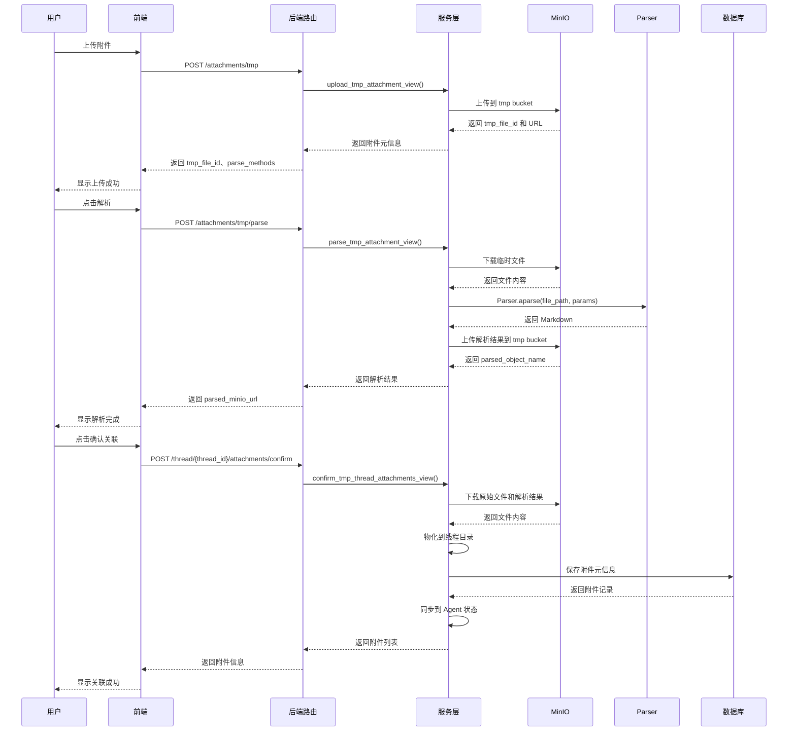
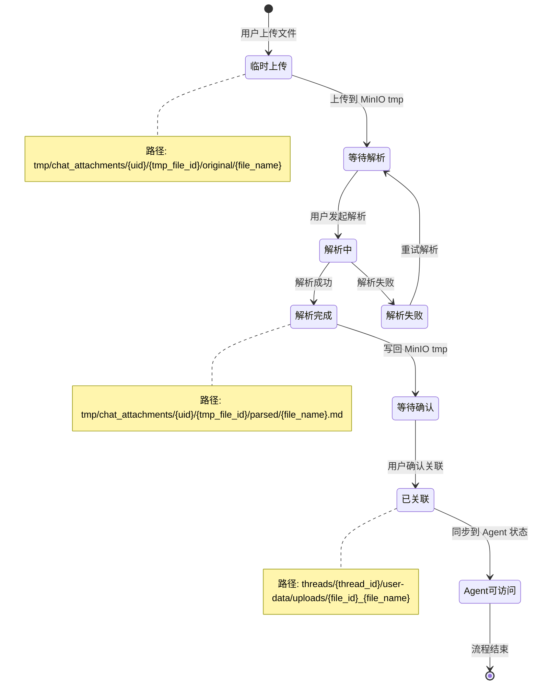

# 附件处理流程链路追踪

> **链路概览**：临时附件上传 → 异步解析 → MinIO存储 → 线程关联确认 → Agent访问

## 一、完整链路追踪

### 1.1 临时附件上传

**用户操作**：用户在对话界面上传附件（PDF、图片、文档等）

**代码路径**：
- 路由层：`backend/server/routers/chat_router.py`
- 服务层：`backend/package/starring/services/conversation_service.py`

**关键代码**（`chat_router.py:479-486`）：

```python
@chat.post("/attachments/tmp", response_model=TmpAttachmentResponse)
async def upload_tmp_attachment(file: UploadFile = File(...), current_user: User = Depends(get_required_user)):
    """上传附件到 MinIO tmp 桶，暂不关联线程。

    该接口用于在创建线程之前或对话中途上传附件。
    附件先存入临时桶，后续通过 confirm 接口正式关联到指定线程。
    """
    return await upload_tmp_attachment_view(file=file, current_uid=str(current_user.uid))
```

**服务层实现**（`conversation_service.py:519-567`）：

```python
async def upload_tmp_attachment_view(*, file: UploadFile, current_uid: str) -> dict:
    """上传附件到用户隔离的 MinIO tmp 路径。"""
    # 1. 文件名安全处理
    file_name = _safe_file_name(file.filename)

    # 2. 文件大小限制（5MB）
    file_content = await read_upload_with_limit(
        file,
        max_size_bytes=MAX_ATTACHMENT_SIZE_BYTES,
        too_large_message="附件过大，当前仅支持 5 MB 以内的文件",
    )

    # 3. 生成用户隔离的临时对象路径
    tmp_file_id, object_name = _make_tmp_attachment_object(str(current_uid), file_name)
    # object_name: "tmp/chat_attachments/{uid}/{tmp_file_id}/original/{file_name}"

    # 4. 上传到 MinIO
    minio_client = get_minio_client()
    bucket_name = _get_tmp_attachment_bucket()  # knowledgebases
    upload_result = await minio_client.aupload_file(
        bucket_name=bucket_name,
        object_name=object_name,
        data=file_content,
        content_type=file.content_type,
    )

    # 5. 判断是否支持解析
    suffix = Path(file_name).suffix.lower()
    if suffix == ".pdf":
        parse_methods = list(TMP_ATTACHMENT_PARSE_METHODS)
    elif suffix in TMP_ATTACHMENT_IMAGE_EXTENSIONS:
        parse_methods = list(TMP_ATTACHMENT_OCR_METHODS)
    else:
        parse_methods = []

    return {
        "tmp_file_id": tmp_file_id,
        "file_name": file_name,
        "bucket_name": upload_result.bucket_name,
        "object_name": upload_result.object_name,
        "minio_url": upload_result.url,
        "parse_supported": bool(parse_methods),
        "parse_methods": parse_methods,
    }
```

### 1.2 异步解析处理

**触发条件**：用户调用 `/attachments/tmp/parse` 接口，对临时附件进行解析（OCR、文档提取等）

**代码路径**：
- 路由层：`backend/server/routers/chat_router.py:489-505`
- 服务层：`backend/package/starring/services/conversation_service.py:570-614`
- 解析引擎：`backend/package/starring/knowledge/parser/unified.py`

**关键代码**（`conversation_service.py:570-614`）：

```python
async def parse_tmp_attachment_view(
    *,
    object_name: str,
    file_name: str,
    parse_method: str | None,
    bucket_name: str | None,
    current_uid: str,
) -> dict:
    """解析用户 tmp 附件并把 markdown 写回 tmp。"""
    minio_client = get_minio_client()

    # 1. 验证用户权限和路径合法性
    tmp_file_id, safe_name = _require_tmp_object_section(object_name, str(current_uid), "original")
    method = _normalize_parse_method(safe_name, parse_method)

    # 2. 调用 Parser 解析文件
    # source 格式: "minio://{bucket_name}/{object_name}"
    markdown = await Parser.aparse(_minio_source(bucket_name, object_name), params={"ocr_engine": method})

    # 3. 截断过长的 markdown
    markdown, truncated = _truncate_markdown(markdown)

    # 4. 将解析结果写回 MinIO tmp
    parsed_object_name = _make_tmp_parsed_object(str(current_uid), tmp_file_id, safe_name)
    # parsed_object_name: "tmp/chat_attachments/{uid}/{tmp_file_id}/parsed/{file_name}.md"
    upload_result = await minio_client.aupload_file(
        bucket_name=bucket_name,
        object_name=parsed_object_name,
        data=markdown.encode("utf-8"),
        content_type="text/markdown; charset=utf-8",
    )

    return {
        "tmp_file_id": tmp_file_id,
        "parsed_object_name": upload_result.object_name,
        "parsed_minio_url": upload_result.url,
        "parse_method": method,
        "status": "parsed",
        "truncated": truncated,
    }
```

**解析引擎核心逻辑**（`unified.py:362-523`）：

```python
async def _process_file_to_markdown_core(
    file_path: str, params: dict | None = None
) -> tuple[str, str | None, dict[str, Any]]:
    """将不同类型的文件转换为 markdown，支持本地文件和 MinIO 文件。"""

    # 支持 MinIO URL: minio://{bucket_name}/{object_name}
    if is_minio_url(file_path):
        bucket_name, object_name = parse_minio_url(file_path)
        minio_client = get_minio_client()
        file_content = await minio_client.adownload_file(bucket_name, object_name)
        # 下载到临时文件进行解析
        # ...

    # 根据文件类型选择解析器
    if file_ext == ".pdf":
        text = await parse_pdf_async(str(file_path_obj), params=params)
    elif file_ext in [".jpg", ".jpeg", ".png", ".bmp", ".tiff", ".tif"]:
        text = await parse_image_async(str(file_path_obj), params=params)
    elif file_ext == ".docx":
        # 优先使用 Docling，失败时降级到 python-docx
        if _check_docling_available():
            result = _convert_with_docling(file_path_obj, params=params)
        else:
            result = _convert_docx_with_python_docx(file_path_obj)
    # ... 其他格式
```

### 1.3 MinIO 存储层

**代码路径**：`backend/package/starring/storage/minio/`

**MinIO 客户端核心功能**（`client.py`）：

```python
class MinIOClient:
    """简化的 MinIO 客户端类"""

    # 知识库相关的 bucket 名称
    KB_BUCKETS = {
        "documents": "knowledgebases",  # 临时附件和知识库文档
        "parsed": "knowledgebases",     # 解析结果
        "images": "public",             # 公开访问的图片
    }

    async def aupload_file(
        self,
        bucket_name: str,
        object_name: str,
        data: bytes,
        content_type: str | None = None,
    ) -> UploadResult:
        """上传文件到 MinIO"""
        result = await asyncio.to_thread(
            self.upload_file,
            bucket_name=bucket_name,
            object_name=object_name,
            data=data,
            content_type=content_type
        )
        return result

    async def adownload_file(self, bucket_name: str, object_name: str) -> bytes:
        """异步下载文件"""
        response = await asyncio.to_thread(
            self.client.get_object,
            bucket_name=bucket_name,
            object_name=object_name
        )
        data = await asyncio.to_thread(response.read)
        response.close()
        return data
```

**临时附件路径设计**：

```
MinIO Bucket: knowledgebases
└── tmp/chat_attachments/{uid}/{tmp_file_id}/
    ├── original/{file_name}          # 原始文件
    └── parsed/{file_name}.md         # 解析后的 Markdown
```

### 1.4 线程关联确认

**触发条件**：用户调用 `/thread/{thread_id}/attachments/confirm` 接口，将临时附件正式关联到对话线程

**代码路径**：
- 路由层：`backend/server/routers/chat_router.py:508-524`
- 服务层：`backend/package/starring/services/conversation_service.py:617-718`

**关键代码**（`conversation_service.py:617-718`）：

```python
async def confirm_tmp_thread_attachments_view(
    *,
    thread_id: str,
    attachments: list[dict],
    db: AsyncSession,
    current_uid: str,
) -> dict:
    """将选中的 tmp 附件正式关联到对话线程。"""
    conv_repo = ConversationRepository(db)
    conversation = await require_user_conversation(conv_repo, thread_id, str(current_uid))
    minio_client = get_minio_client()

    prepared_items: list[dict] = []

    # 1. 从 MinIO tmp 下载文件内容
    for item in attachments:
        object_name = str(item.get("object_name") or "")
        tmp_file_id, file_name = _require_tmp_object_section(object_name, str(current_uid), "original")

        file_content = await minio_client.adownload_file(bucket_name, object_name)

        # 如果存在解析结果，也下载
        parsed_markdown = None
        parsed_object_name = str(item.get("parsed_object_name") or "")
        if parsed_object_name:
            parsed_bytes = await minio_client.adownload_file(bucket_name, parsed_object_name)
            parsed_markdown = parsed_bytes.decode("utf-8")

        prepared_items.append({
            "file_name": file_name,
            "file_content": file_content,
            "parsed_markdown": parsed_markdown,
            "truncated": bool(item.get("truncated")),
        })

    # 2. 物化附件到线程目录
    added_records: list[dict] = []
    for prepared in prepared_items:
        file_id = uuid.uuid4().hex
        materialized = _materialize_tmp_attachment_files(
            thread_id=thread_id,
            uid=str(conversation.uid),
            file_id=file_id,
            file_name=prepared["file_name"],
            file_content=prepared["file_content"],
            parsed_markdown=prepared["parsed_markdown"],
            truncated=prepared["truncated"],
        )

        # 构建附件记录
        attachment_record = {
            "file_id": file_id,
            "file_name": prepared["file_name"],
            "status": materialized["status"],  # "uploaded" 或 "parsed"
            "path": materialized["path"],  # 虚拟路径: /uploads/attachments/{file_name}.md
            "artifact_url": materialized["artifact_url"],  # 访问URL: /api/chat/thread/{thread_id}/artifacts/...
            "storage_path": materialized["storage_path"],  # 物理路径
        }
        added_records.append(attachment_record)

    # 3. 持久化到数据库
    await conv_repo.add_attachments(conversation.id, added_records)

    # 4. 同步到 Agent 状态
    all_attachments = await conv_repo.get_attachments(conversation.id)
    await _sync_thread_upload_state(
        thread_id=thread_id,
        uid=str(current_uid),
        agent_id=conversation.agent_id,
        backend_id=(conversation.extra_metadata or {}).get("backend_id"),
        attachments=all_attachments,
    )

    return {"attachments": [serialize_attachment(item) for item in added_records]}
```

**文件物化逻辑**（`conversation_service.py:353-404`）：

```python
def _materialize_tmp_attachment_files(
    *,
    thread_id: str,
    uid: str,
    file_id: str,
    file_name: str,
    file_content: bytes,
    parsed_markdown: str | None = None,
    truncated: bool = False,
) -> dict:
    """将 tmp 附件复制到线程目录，不主动删除 tmp 对象。"""
    ensure_thread_dirs(thread_id, uid)

    # 1. 存储原始文件到沙盒 uploads 目录
    storage_name = f"{file_id}_{file_name}"
    upload_virtual_path = _make_upload_virtual_path(storage_name)
    uploads_dir = sandbox_uploads_dir(thread_id)
    upload_actual_path = uploads_dir / Path(upload_virtual_path).name
    upload_actual_path.write_bytes(file_content)

    record = {
        "status": "uploaded",
        "path": upload_virtual_path,
        "artifact_url": _artifact_url(thread_id, upload_virtual_path),
        "storage_path": str(upload_actual_path),
    }

    # 2. 如果有解析结果，存储为 Markdown
    if parsed_markdown is None:
        return record

    markdown_virtual_path, markdown_host_path = _build_attachment_storage_path(
        uid=uid,
        thread_id=thread_id,
        file_name=storage_name,
    )
    markdown_host_path.write_text(parsed_markdown, encoding="utf-8")

    record.update({
        "status": "parsed",
        "path": markdown_virtual_path,
        "artifact_url": _artifact_url(thread_id, markdown_virtual_path),
        "storage_path": str(markdown_host_path),
        "markdown": parsed_markdown,
        "truncated": truncated,
    })
    return record
```

**线程目录结构**：

```
{save_dir}/threads/{thread_id}/
├── user-data/
│   ├── workspace/           # 用户工作区
│   ├── uploads/             # 上传文件
│   │   └── {file_id}_{file_name}    # 原始文件
│   └── outputs/             # Agent 输出
└── user-data/uploads/attachments/
    └── {file_name}.md       # 解析后的 Markdown
```

### 1.5 Agent 访问附件

**代码路径**：
- 沙盒路径解析：`backend/package/starring/agents/backends/sandbox/paths.py`
- 附件中间件：`backend/package/starring/agents/middlewares/attachment.py`

**沙盒路径映射**（`paths.py:113-150`）：

```python
def sandbox_uploads_dir(thread_id: str) -> Path:
    """返回线程 uploads 目录的宿主机路径"""
    return _thread_root_dir(thread_id) / UPLOADS_DIR_NAME

def resolve_virtual_path(thread_id: str, virtual_path: str) -> tuple[Path, Path]:
    """将虚拟路径解析为宿主机路径

    支持三种命名空间：
    - workspace/: 用户工作区
    - uploads/: 上传的附件
    - outputs/: Agent 输出
    """
    parts = virtual_path.lstrip("/").split("/")
    namespace = parts[0]

    if namespace == UPLOADS_DIR_NAME:
        base_dir = sandbox_uploads_dir(thread_id)
        target_path = base_dir.joinpath(*parts[1:]) if len(parts) > 1 else base_dir
        return base_dir.resolve(), target_path.resolve()
    # ...
```

**附件中间件注入**（`attachment.py:27-52`）：

```python
def _build_attachment_prompt(uploads: Sequence[dict]) -> str | None:
    """将附件信息注入到 Agent 提示词中"""
    if not uploads:
        return None

    valid_uploads: list[tuple[str, str]] = []
    for upload in uploads:
        path = upload.get("path")
        if not isinstance(path, str) or not path.strip():
            continue
        file_name = upload.get("file_name", "未知文件")
        valid_uploads.append((str(file_name), path))

    if not valid_uploads:
        return None

    upload_infos = [f"- {file_name}: {path}" for file_name, path in valid_uploads]
    lines = [
        "用户上传了以下文件：",
        "",
        *upload_infos,
        "",
        "你可以通过文件系统工具访问这些文件。",
    ]
    return "\n".join(lines)
```

**Agent 状态同步**（`conversation_service.py:250-275`）：

```python
async def _sync_thread_upload_state(
    *,
    thread_id: str,
    uid: str,
    agent_id: str,
    backend_id: str | None,
    attachments: list[dict],
) -> None:
    """将附件信息同步到 LangGraph 状态"""
    agent = agent_manager.get_agent(backend_id or agent_id)
    if not agent:
        return

    graph = await agent.get_graph()
    config = {"configurable": {"thread_id": thread_id, "uid": str(uid)}}

    # 更新 LangGraph 状态中的 uploads 字段
    await graph.aupdate_state(
        config=config,
        values={
            "uploads": _build_state_uploads(attachments),
        },
    )
```

## 二、设计亮点

### 2.1 临时与正式分离

**设计理念**：附件先上传到临时空间，用户确认后才正式关联到线程

**优势**：
- **避免垃圾数据**：用户上传后未使用的附件不会污染线程数据
- **支持预览验证**：上传后可以先解析、预览，确认无误后再关联
- **安全隔离**：临时附件按用户隔离（`tmp/chat_attachments/{uid}/`），防止越权访问
- **清理灵活**：可定期清理超过一定时间的临时附件，释放存储空间

**代码体现**：

```python
# 临时路径：tmp/chat_attachments/{uid}/{tmp_file_id}/original/{file_name}
object_name = _make_tmp_attachment_object(uid, file_name)

# 确认关联后，复制到线程目录
materialized = _materialize_tmp_attachment_files(
    thread_id=thread_id,
    uid=uid,
    file_content=file_content,
    parsed_markdown=parsed_markdown,
)
```

### 2.2 异步解析机制

**设计理念**：文件解析（OCR、文档提取）是耗时操作，采用异步处理避免阻塞请求

**优势**：
- **不阻塞上传**：上传接口快速返回，解析作为独立步骤
- **支持多种引擎**：用户可选择解析方式（rapid_ocr、mineru_ocr、deepseek_ocr等）
- **解析结果缓存**：解析结果存储在 MinIO，可重复访问
- **失败可重试**：解析失败不影响原始文件，用户可重新发起解析

**支持的解析方法**：

```python
TMP_ATTACHMENT_PARSE_METHODS = (
    "disable",           # 不解析
    "rapid_ocr",         # RapidOCR
    "mineru_ocr",        # MinerU
    "mineru_official",   # MinerU 官方版
    "pp_structure_v3_ocr",  # PaddleOCR
    "deepseek_ocr",      # DeepSeek OCR API
)
```

### 2.3 用户隔离与权限验证

**设计理念**：临时附件路径包含用户 ID，确保用户只能访问自己的附件

**路径格式**：`tmp/chat_attachments/{uid}/{tmp_file_id}/original/{file_name}`

**权限验证**（`conversation_service.py:181-208`）：

```python
def _parse_user_tmp_object(object_name: str, uid: str) -> tuple[str, str, str]:
    """解析并验证用户临时附件路径"""
    if not object_name or "\\" in object_name:
        raise HTTPException(status_code=400, detail="无效的临时附件路径")

    user_prefix = f"{TMP_ATTACHMENT_PREFIX}/{uid}/"
    if not object_name.startswith(user_prefix):
        raise HTTPException(status_code=403, detail="无权访问该临时附件")

    # 解析路径结构：tmp_file_id, section(original/parsed), file_name
    parts = object_name[len(user_prefix) :].split("/")
    if len(parts) != 3 or any(not part or part in {".", ".."} for part in parts):
        raise HTTPException(status_code=400, detail="无效的临时附件路径")

    return parts[0], parts[1], parts[2]
```

### 2.4 多格式解析器支持

**设计理念**：支持多种文档格式，优先使用专业解析器，失败时降级到基础解析器

**解析器优先级**：

| 文件格式 | 优先解析器 | 降级解析器 |
|---------|-----------|-----------|
| PDF | Docling / OCR | PyPDFLoader |
| DOCX | Docling | python-docx |
| XLSX | Docling | openpyxl |
| PPTX | Docling | python-pptx |
| 图片 | OCR 引擎 | - |
| HTML | markdownify | - |
| ZIP | 自定义解压 | - |

**降级机制**（`unified.py:417-425`）：

```python
elif file_ext == ".docx":
    if _check_docling_available():
        try:
            result = _convert_with_docling(file_path_obj, params=params)
        except Exception as e:
            logger.warning(f"Docling 解析 DOCX 失败，回退到 python-docx: {file_path_obj.name}, {e}")
            result = _convert_docx_with_python_docx(file_path_obj)
    else:
        result = _convert_docx_with_python_docx(file_path_obj)
```

### 2.5 虚拟路径与物理路径分离

**设计理念**：Agent 使用虚拟路径（`/uploads/...`），后端自动映射到物理路径

**优势**：
- **跨环境兼容**：物理路径变化不影响 Agent 代码
- **安全隔离**：Agent 无法访问宿主机真实路径
- **统一访问接口**：通过 `/artifacts/` 端点访问所有文件

**路径映射示例**：

```python
# 虚拟路径
path: "/uploads/attachments/report.md"

# 物理路径
storage_path: "{save_dir}/threads/{thread_id}/user-data/uploads/attachments/report.md"

# 访问 URL
artifact_url: "/api/chat/thread/{thread_id}/artifacts/uploads/attachments/report.md"
```

## 三、主要功能

### 3.1 附件上传方式

| 上传方式 | API 端点 | 存储位置 | 关联时机 | 适用场景 |
|---------|---------|---------|---------|---------|
| 临时上传 | `/attachments/tmp` | MinIO tmp | 手动确认 | 创建线程前上传、多文件批量上传 |
| 直接上传 | `/thread/{thread_id}/attachments` | 线程 uploads | 自动关联 | 已有线程添加附件 |

### 3.2 支持的文件类型

**文档类**：
- PDF（支持 OCR）
- DOCX / DOC
- XLSX / XLS
- PPTX
- TXT / MD
- HTML / HTM
- JSON / CSV
- ZIP（自动解压并提取内容）

**图片类**：
- JPG / JPEG
- PNG
- BMP
- TIFF / TIF

### 3.3 解析方式

**PDF 解析**：
- `disable`：仅提取文本（PyPDFLoader）
- `rapid_ocr`：RapidOCR 引擎
- `mineru_ocr`：MinerU OCR
- `pp_structure_v3_ocr`：PaddleOCR
- `deepseek_ocr`：DeepSeek OCR API

**图片解析**：
- 必须启用 OCR 才能提取文本
- 支持上述所有 OCR 引擎

### 3.4 文件大小限制

- 默认上限：5 MB
- Markdown 输出上限：32,000 字符（超出截断并提示）

### 3.5 附件状态管理

| 状态 | 说明 |
|------|------|
| `uploaded` | 已上传原始文件 |
| `parsed` | 已解析为 Markdown |

## 四、可改进之处

### 4.1 临时附件清理机制缺失

**问题**：当前代码未实现临时附件的自动清理机制，长期运行会导致 MinIO 存储空间累积。

**改进建议**：
- 增加 TTL 策略：临时附件超过 24 小时未确认则自动删除
- 实现 Cron 任务：定期扫描并清理过期临时附件
- 提供管理接口：管理员可手动触发清理

**代码位置**：`backend/package/starring/services/conversation_service.py`

### 4.2 文件大小限制配置不灵活

**问题**：文件大小限制硬编码在常量中（5 MB），不支持根据文件类型动态调整。

```python
MAX_ATTACHMENT_SIZE_BYTES = 5 * 1024 * 1024  # 5 MB
```

**改进建议**：
- 配置化：从环境变量或数据库读取限制配置
- 分类型限制：PDF 可允许更大（如 10 MB），图片限制更小（如 2 MB）
- 动态调整：根据系统负载动态调整限制

**代码位置**：`backend/package/starring/services/conversation_service.py:26-28`

### 4.3 解析失败处理不完善

**问题**：解析失败时仅返回错误，未提供降级方案或重试机制。

**改进建议**：
- 提供降级解析：OCR 失败时尝试基础文本提取
- 重试机制：支持前端重新发起解析请求
- 错误恢复：解析失败时保留原始文件，用户可切换解析引擎

**代码位置**：`backend/package/starring/knowledge/parser/unified.py:303-325`

### 4.4 附件删除未同步清理 MinIO

**问题**：删除附件时仅清理本地文件，临时附件在 MinIO 中仍然存在。

```python
# 删除附件时仅删除本地文件
if target_attachment:
    delete_candidates = {
        str(value).strip()
        for value in (
            target_attachment.get("storage_path"),
            target_attachment.get("original_storage_path"),
            target_attachment.get("markdown_storage_path"),
        )
        if isinstance(value, str) and value.strip()
    }
    for candidate in delete_candidates:
        file_path = Path(candidate)
        if file_path.exists():
            file_path.unlink()
```

**改进建议**：
- 同步删除 MinIO 临时文件
- 增加异步清理任务，定期检查并删除孤立文件

**代码位置**：`backend/package/starring/services/conversation_service.py:800-846`

### 4.5 大文件解析性能瓶颈

**问题**：大文件（如 100 页 PDF）解析可能耗时超过 HTTP 超时限制。

**改进建议**：
- 分片解析：大文件分片处理，避免单次请求超时
- 进度反馈：通过 WebSocket 或 SSE 推送解析进度
- 后台队列：将解析任务放入后台队列，避免阻塞用户请求

**代码位置**：`backend/package/starring/services/conversation_service.py:570-614`

### 4.6 缺少附件版本管理

**问题**：用户无法查看附件的历史版本，无法恢复误删的附件。

**改进建议**：
- 实现附件版本控制：保留历史版本，支持回滚
- 软删除机制：删除附件时标记为 "deleted"，支持恢复
- 变更历史：记录附件的创建、更新、删除操作

**代码位置**：`backend/package/starring/repositories/conversation_repository.py`

### 4.7 解析结果未持久化到数据库

**问题**：解析结果仅存储在文件系统，未持久化到数据库，不利于全文检索。

**改进建议**：
- 将 Markdown 内容存储到数据库的 `attachments` 表
- 支持全文检索：用户可通过关键词搜索附件内容
- 分离存储：大文件内容存文件，元信息存数据库

**代码位置**：`backend/package/starring/services/conversation_service.py:687-705`

## 五、代码路径索引

| 模块 | 文件路径 | 职责 |
|------|----------|------|
| 路由层 | `backend/server/routers/chat_router.py` | 附件上传、解析、确认、删除路由 |
| 服务层 | `backend/package/starring/services/conversation_service.py` | 附件上传、解析、确认、删除业务逻辑 |
| 存储层 | `backend/package/starring/storage/minio/client.py` | MinIO 客户端封装 |
| 存储层 | `backend/package/starring/storage/minio/utils.py` | MinIO 工具函数 |
| 解析引擎 | `backend/package/starring/knowledge/parser/unified.py` | 统一文件解析入口 |
| 解析引擎 | `backend/package/starring/knowledge/parser/factory.py` | 解析器工厂 |
| OCR 引擎 | `backend/package/starring/knowledge/parser/rapid_ocr.py` | RapidOCR 解析器 |
| OCR 引擎 | `backend/package/starring/knowledge/parser/mineru.py` | MinerU 解析器 |
| OCR 引擎 | `backend/package/starring/knowledge/parser/deepseek_ocr.py` | DeepSeek OCR 解析器 |
| 沙盒路径 | `backend/package/starring/agents/backends/sandbox/paths.py` | 虚拟路径解析、沙盒目录管理 |
| 附件中间件 | `backend/package/starring/agents/middlewares/attachment.py` | 附件提示词注入 |
| 数据访问 | `backend/package/starring/repositories/conversation_repository.py` | 附件元信息持久化 |

## 六、流程时序图



## 七、状态流转图

