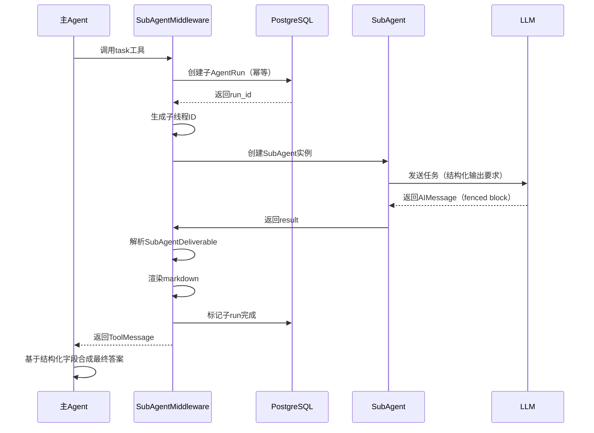
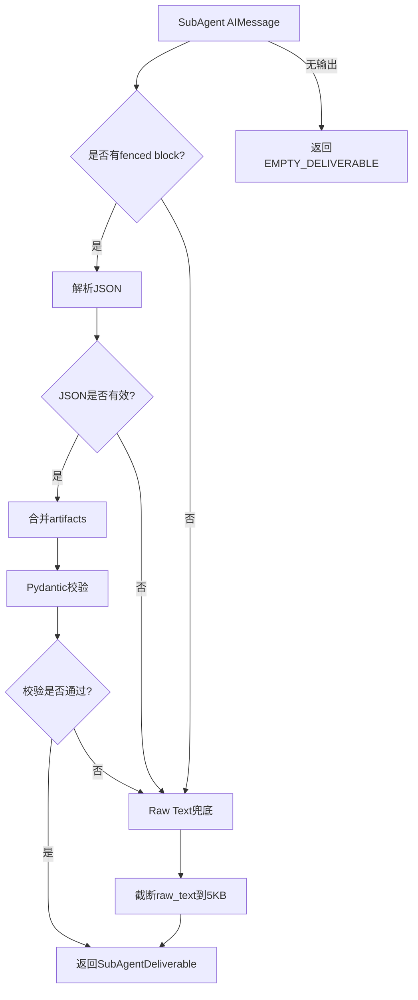
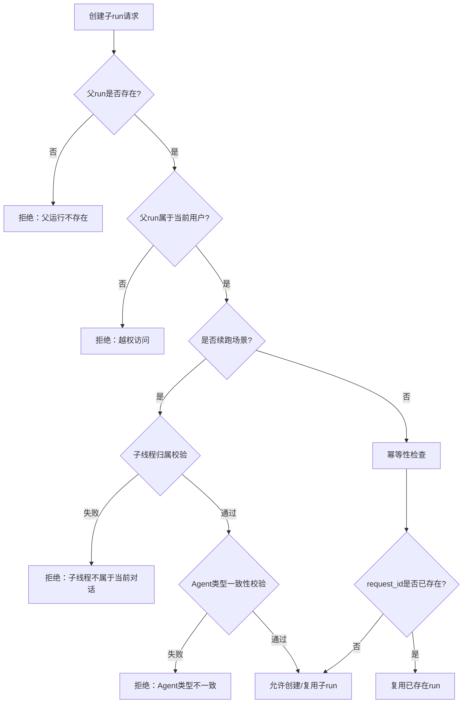

# SubAgent协同流程链路追踪

> **链路概览**：主Agent决策委派 → 创建子线程ID → 创建子AgentRun记录 → SubAgent执行（结构化输出） → 解析Deliverable → 渲染Markdown → 返回父线程ToolMessage

## 一、完整链路追踪

### 1.1 主Agent决策委派

**触发点**：主Agent通过`task`工具委派子任务

**代码路径**：
- 中间件定义：`backend/package/starring/agents/middlewares/subagent_task.py`
- System Prompt注入：`subagent_task.py:61-121`（`TASK_SYSTEM_PROMPT`）

**关键职责**：
- 在主Agent的system prompt中注入`TASK_SYSTEM_PROMPT`（包含task工具使用规范）
- 注册`task` StructuredTool供主Agent调用
- 提供可用的subagent类型列表

**关键代码**（`subagent_task.py:473-481`）：

```python
def __init__(self, *, parent_context, subagents: list[Agent]) -> None:
    super().__init__()
    self.parent_context = parent_context
    self.subagents = {agent.slug: agent for agent in subagents}
    available_agents = "\n".join(f"- {agent.slug}: {agent.description or agent.name}" for agent in subagents)
    self.system_prompt = TASK_SYSTEM_PROMPT.format(available_agents=available_agents)
    self.tools = [self._build_task_tool(available_agents)]
```

**Orchestrator-Worker编排约束**（注入到system prompt中）：

```text
1. Decompose by aspect, not by step（按正交维度拆，非按步骤拆）
2. Bound depth（限制嵌套深度 - 子智能体不能再调用task工具）
3. Explicit deliverables（显式声明期望产物 - 必须包含Expected deliverable字段）
4. Synthesis is reasoning, not concatenation（合成是推理，不是拼接）
```

### 1.2 创建子线程ID

**代码路径**：`backend/package/starring/utils/subagent_thread_utils.py`

**关键职责**：
- 基于父线程ID、agent slug、tool call ID生成唯一子线程ID
- 确保子线程ID可追溯、防碰撞

**关键代码**（`subagent_thread_utils.py:9-11`）：

```python
def make_child_thread_id(parent_thread_id: str, agent_slug: str, tool_call_id: str) -> str:
    digest = hashlib.sha256(f"{parent_thread_id}:{agent_slug}:{tool_call_id}".encode()).hexdigest()
    return f"{_CHILD_THREAD_ID_PREFIX}{digest[:_CHILD_THREAD_ID_DIGEST_LENGTH]}"
```

**设计亮点**：
- 使用SHA256哈希确保唯一性
- 子线程ID前缀为`subagent_`（便于识别和过滤）
- 摘要长度64字节（避免过长）

### 1.3 创建子AgentRun记录

**代码路径**：`backend/package/starring/agents/middlewares/subagent_task.py:488-558`

**关键职责**：
- 在数据库中创建子AgentRun记录
- 标记为`run_type="subagent"`
- 关联父AgentRun（parent_agent_run_id）
- 幂等性保证（基于request_id去重）

**关键代码**（简化版）：

```python
async def _create_subagent_run(
    self,
    *,
    child_thread_id: str,
    description: str,
    subagent_type: str,
    agent: Agent,
    uid: str,
    parent_thread_id: str,
    tool_call_id: str,
    continuing: bool,
):
    parent_run_id = str(getattr(self.parent_context, "run_id", "") or "").strip()
    
    # 校验父run存在且属于当前用户
    parent_run = await repo.get_run_for_user(parent_run_id, uid)
    if not parent_run:
        raise ValueError("父运行任务不存在")
    
    # 续跑场景：校验子线程归属与agent类型一致
    if continuing:
        previous = await repo.get_latest_subagent_run_by_thread_for_user(child_thread_id, uid)
        if previous.agent_id != subagent_type:
            raise ValueError(f"无法继续子智能体线程 {child_thread_id}：该线程属于子智能体 {previous.agent_id}")
    
    # 幂等键：相同 (parent_run_id, child_thread_id, tool_call_id, agent_slug) 视为同一子run
    request_id = _subagent_request_id(parent_run_id, child_thread_id, tool_call_id, agent.slug)
    existing = await repo.get_run_by_request_id(request_id)
    if existing:
        return existing, False  # 复用已存在的run
    
    # 首次创建
    run = await repo.create_run(
        run_id=str(uuid.uuid4()),
        thread_id=child_thread_id,
        agent_id=subagent_type,
        uid=uid,
        request_id=request_id,
        conversation_id=parent_run.conversation_id,
        parent_agent_run_id=parent_run.id,
        run_type="subagent",
        checkpoint_thread_id=child_thread_id,
        input_payload={
            "description": description,
            "tool_call_id": tool_call_id,
            "subagent_type": subagent_type,
            "subagent_name": agent.name,
            "parent_thread_id": parent_thread_id,
            "child_thread_id": child_thread_id,
            "continuing": continuing,
        },
    )
    return await repo.mark_running(run.id), True
```

**安全校验**：
- 父run归属校验（避免越权创建子run）
- 子线程归属校验（续跑场景防串线）
- agent类型一致性校验

### 1.4 SubAgent执行

**代码路径**：
- SubAgent Backend：`backend/package/starring/agents/buildin/subagent/graph.py`
- SubAgent Context：`backend/package/starring/agents/buildin/subagent/context.py`

**关键职责**：
- 构建SubAgent的LangGraph图
- 配置专门的中间件栈（过滤禁用工具）
- 追加结构化输出说明（当`output_format="structured"`时）

**关键代码**（`subagent/graph.py:148-167`）：

```python
async def get_graph(self, context=None, **kwargs):
    context = await prepare_agent_runtime_context(
        context or self.context_schema(),
        context_schema=self.context_schema,
    )
    model_spec = resolve_chat_model_spec(context.model)
    
    system_prompt = build_prompt_with_context(context)
    # 被父智能体调用时追加结构化输出说明
    if getattr(context, "output_format", "natural") == "structured":
        system_prompt = f"{system_prompt}\n{_STRUCTURED_OUTPUT_PROMPT_SUFFIX}"
    
    return create_agent(
        model=load_chat_model(fully_specified_name=model_spec),
        tools=_filter_disabled_tools(await resolve_configured_runtime_tools(context)),
        system_prompt=system_prompt,
        middleware=await _build_middlewares(context),
        state_schema=BaseState,
        checkpointer=await self._get_checkpointer(),
    )
```

**禁用工具过滤**（`subagent/graph.py:28-29,72-73`）：

```python
_SUBAGENT_DISABLED_TOOLS = frozenset({"present_artifacts", "ask_user_question", "install_skill"})

def _filter_disabled_tools(tools):
    return [tool for tool in tools if _tool_name(tool) not in _SUBAGENT_DISABLED_TOOLS]
```

**结构化输出格式要求**（注入到system prompt末尾）：

```text
```subagent-result
{
  "summary": "1-3 句话概括任务结果",
  "key_findings": ["关键发现 1", "关键发现 2"],
  "sources": [
    {"type": "kb_chunk", "file_id": "...", "chunk_id": "...", "snippet": "..."}
  ],
  "confidence": 0.85,
  "artifacts": ["/sandbox/path/to/file"]
}
```
```

**SubAgent中间件栈**（`subagent/graph.py:103-117`）：

```python
middlewares = [
    create_agent_filesystem_middleware(...),  # 1. 文件系统
    save_attachments_to_fs,                    # 2. 附件持久化
    KnowledgeBaseMiddleware(),                 # 3. 知识库工具
    SkillsMiddleware(),                        # 4. Skills自动发现
    summary_middleware,                        # 5. 上下文压缩
    TodoListMiddleware(...),                   # 6. TodoList跟踪
    PatchToolCallsMiddleware(),                # 7. 工具调用修补
    _SubAgentToolFilterMiddleware(),           # 8. 工具过滤（禁用特定工具）
    ModelRetryMiddleware(),                    # 9. 模型重试
    TokenUsageMiddleware(),                    # 10. Token计量
]
```

**关键差异**：
- 不注入`SubAgentTaskMiddleware`（禁止子智能体再委派，防止无限嵌套）
- 新增`_SubAgentToolFilterMiddleware`（禁用present_artifacts等交互式工具）

### 1.5 数据契约：SubAgentDeliverable

**代码路径**：`backend/package/starring/agents/middlewares/subagent_deliverable.py`

**关键职责**：
- 定义结构化交付物的数据模型
- 三层兜底机制（永远不抛异常）
- 向后兼容保证（schema_version固定"1"）

**数据模型**（`subagent_deliverable.py:33-72`）：

```python
class SubAgentDeliverable(BaseModel):
    schema_version: Literal["1"] = Field(default="1", description="deliverable schema版本")
    summary: str = Field(default="", description="1-3句话概括任务结果")
    key_findings: list[str] = Field(default_factory=list, description="关键发现列表")
    sources: list[SubAgentSource] = Field(default_factory=list, description="引用来源列表")
    confidence: float = Field(default=0.5, ge=0.0, le=1.0, description="置信度0-1")
    raw_text: str = Field(default="", description="完整原始文本（兜底用）")
    artifacts: list[str] = Field(default_factory=list, description="产物文件路径列表")
    
    @model_validator(mode="after")
    def _ensure_summary_fallback(self) -> SubAgentDeliverable:
        """兜底：summary为空时从raw_text取首段"""
        if not self.summary.strip() and self.raw_text.strip():
            first_paragraph = next(
                (p.strip() for p in self.raw_text.split("\n\n") if p.strip()),
                "",
            )
            if first_paragraph:
                self.summary = first_paragraph[:200] + ("..." if len(first_paragraph) > 200 else "")
        return self
```

**SubAgentSource类型**（`subagent_deliverable.py:20-31`）：

```python
class SubAgentSource(BaseModel):
    type: Literal["kb_chunk", "file", "url", "other"] = Field(default="other")
    file_id: str | None = Field(default=None, description="知识库文件ID")
    chunk_id: str | None = Field(default=None, description="知识库chunk ID")
    url: str | None = Field(default=None, description="URL")
    snippet: str = Field(default="", description="引用片段文本")
```

**设计原则**：
- **永远有兜底**：解析失败时raw_text保留原文，summary从raw_text取首段
- **永远不抛异常**：所有字段有默认值，confidence默认0.5
- **向后兼容**：schema_version固定"1"，未来演进只新增字段不删除

### 1.6 结果解析与汇聚

**代码路径**：`backend/package/starring/agents/middlewares/subagent_task.py:178-237`

**关键职责**：
- 从SubAgent的消息流解析结构化`SubAgentDeliverable`
- 三层解析策略（fenced block → raw_text兜底 → EMPTY_DELIVERABLE）
- 合并artifacts（fenced block + state.artifacts）

**解析流程**（`subagent_task.py:178-237`）：

```python
def _parse_deliverable(messages: list, artifacts_from_state: list[str]) -> SubAgentDeliverable:
    """三层兜底解析策略"""
    # 1. 拼接所有AIMessage.text（倒序优先）
    all_text = "\n\n".join(
        msg.text for msg in reversed(messages) if isinstance(msg, AIMessage) and msg.text
    )
    
    if not all_text:
        return EMPTY_DELIVERABLE.model_copy(update={"artifacts": artifacts_from_state})
    
    # 2. 匹配 ```subagent-result``` fenced block
    match = _SUBAGENT_RESULT_PATTERN.search(all_text)
    if not match:
        return SubAgentDeliverable(
            summary="",
            raw_text=_truncate_raw_text(all_text),
            artifacts=artifacts_from_state,
        )
    
    # 3. 解析JSON
    json_str = match.group(1).strip()
    try:
        payload = json.loads(json_str)
    except json.JSONDecodeError:
        return SubAgentDeliverable(summary="", raw_text=_truncate_raw_text(all_text), artifacts=artifacts_from_state)
    
    # 4. 合并artifacts
    merged_artifacts = list(dict.fromkeys(
        list(payload.get("artifacts") or []) + artifacts_from_state
    ))
    payload["artifacts"] = merged_artifacts
    
    # 5. Pydantic校验
    try:
        return SubAgentDeliverable.model_validate(payload)
    except Exception as exc:
        logger.warning(f"subagent deliverable pydantic校验失败: {exc}")
        return SubAgentDeliverable(summary="", raw_text=_truncate_raw_text(all_text), artifacts=artifacts_from_state)
```

**解析策略优先级**：
1. **Fenced Block优先**：匹配`\`\`\`subagent-result`代码块中的JSON
2. **Raw Text兜底**：JSON解析失败时保留原文
3. **Empty兜底**：完全无输出时返回`EMPTY_DELIVERABLE`

### 1.7 渲染Markdown返回父线程

**代码路径**：`backend/package/starring/agents/middlewares/subagent_task.py:240-279`

**关键职责**：
- 将结构化`SubAgentDeliverable`渲染为LLM友好的markdown
- 不渲染`raw_text`（避免ToolMessage体积膨胀）
- 通过`Command`返回父线程ToolMessage

**关键代码**（`subagent_task.py:240-279`）：

```python
def _deliverable_to_markdown(
    deliverable: SubAgentDeliverable, child_thread_id: str, subagent_type: str
) -> str:
    """把结构化deliverable渲染为LLM友好的markdown"""
    lines = [
        f"> 子智能体线程 ID: {child_thread_id}",
        f"> 子智能体类型: {subagent_type}",
        f"> 置信度: {deliverable.confidence:.2f}",
        "",
        "## 摘要",
        deliverable.summary,
        "",
    ]
    if deliverable.key_findings:
        lines.append("## 关键发现")
        lines.extend(f"- {finding}" for finding in deliverable.key_findings)
        lines.append("")
    if deliverable.sources:
        lines.append("## 引用来源")
        for src in deliverable.sources:
            snippet_preview = src.snippet[:200] + ("..." if len(src.snippet) > 200 else "")
            if src.type == "kb_chunk":
                lines.append(f"- [知识库] file_id={src.file_id}, chunk_id={src.chunk_id}: {snippet_preview}")
            elif src.type == "file":
                lines.append(f"- [文件] {src.file_id}: {snippet_preview}")
            elif src.type == "url":
                lines.append(f"- [URL] {src.url}: {snippet_preview}")
            else:
                lines.append(f"- [其他] {snippet_preview}")
        lines.append("")
    if deliverable.artifacts:
        lines.append("## 产物文件")
        lines.extend(f"- {path}" for path in deliverable.artifacts)
        lines.append("")
    return "\n".join(lines)
```

**返回父线程**（`subagent_task.py:306-343`）：

```python
def _completed_tool_response(
    result: dict[str, Any], tool_call_id: str, subagent_run: dict[str, Any]
) -> Command:
    """子run成功终结时构造父侧ToolMessage响应"""
    messages = result.get("messages") or []
    artifacts_from_state = _result_artifacts(result)
    
    deliverable = _parse_deliverable(messages, artifacts_from_state)
    
    subagent_run = {
        **subagent_run,
        "status": "completed",
        "completed_at": utc_isoformat(),
        "result_preview": _preview_text(deliverable.summary),
        "artifacts": deliverable.artifacts,
        "deliverable": deliverable.model_dump(mode="json"),  # 含raw_text供前端/Langfuse查看
    }
    tool_result = _tool_result_with_thread_id(
        subagent_run["child_thread_id"],
        _deliverable_to_markdown(deliverable, subagent_run["child_thread_id"], subagent_run["subagent_type"]),
    )
    update: dict[str, Any] = {"messages": [ToolMessage(tool_result, tool_call_id=tool_call_id)]}
    if deliverable.artifacts:
        update["artifacts"] = deliverable.artifacts
    update["subagent_runs"] = [subagent_run]
    return Command(update=update)
```

**设计要点**：
- **不渲染raw_text**：避免父Agent上下文膨胀，符合Orchestrator-Worker减少token的目标
- **完整快照保留**：deliverable完整快照写入`subagent_run`状态供前端/Langfuse查看
- **自动合并artifacts**：父线程自动继承子线程的产物文件

### 1.8 自动发现机制

**代码路径**：
- Agent Repository：`backend/package/starring/repositories/agent_repository.py:339-368`
- Middleware初始化：`backend/package/starring/agents/middlewares/subagent_task.py:742-774`

**关键职责**：
- 从数据库查询所有可用的SubAgent
- 基于用户权限过滤（superadmin可看所有）
- 动态注入到主Agent的system prompt

**关键代码**（`agent_repository.py:339-347`）：

```python
async def list_visible_subagents(self, *, user: User) -> list[Agent]:
    result = await self.db.execute(
        select(Agent).where(Agent.is_subagent.is_(True)).order_by(Agent.name.asc(), Agent.id.asc())
    )
    agents = list(result.scalars().all())
    if user.role == "superadmin":
        return agents
    return [agent for agent in agents if user_can_access_agent(user, agent)]
```

**Middleware初始化**（`subagent_task.py:742-774`）：

```python
async def create_subagent_task_middleware(parent_context) -> StarRingSubAgentMiddleware | None:
    selected_slugs = [
        str(slug).strip() for slug in (getattr(parent_context, "subagents", None) or []) if str(slug).strip()
    ]
    uid = str(getattr(parent_context, "uid", "") or "").strip()
    if not uid:
        return None
    
    async with pg_manager.get_async_session_context() as db:
        user = await UserRepository().get_by_uid_with_db(db, uid)
        if user is None:
            return None
        repo = AgentRepository(db)
        if selected_slugs:
            # 指定slug：逐个查询并验证权限
            subagents: list[Agent] = []
            seen: set[str] = set()
            for slug in selected_slugs:
                if slug in seen:
                    continue
                seen.add(slug)
                agent = await repo.get_visible_subagent_by_slug(slug=slug, user=user)
                if agent and agent.backend_id == SUB_AGENT_BACKEND_ID:
                    subagents.append(agent)
        else:
            # 未指定：加载所有可见subagent
            subagents = [
                agent
                for agent in await repo.list_visible_subagents(user=user)
                if agent.backend_id == SUB_AGENT_BACKEND_ID
            ]
    
    if not subagents:
        return None
    return StarRingSubAgentMiddleware(parent_context=parent_context, subagents=subagents)
```

**发现机制特点**：
- **数据库驱动**：从PostgreSQL查询而非文件系统扫描
- **权限隔离**：普通用户只能看到有权限的SubAgent，superadmin可看所有
- **Backend校验**：只注入`backend_id == SUB_AGENT_BACKEND_ID`的SubAgent
- **动态配置**：支持在主Agent配置中指定`subagents`列表，或自动加载所有可见SubAgent

## 二、设计亮点

### 2.1 SubAgentDeliverable数据契约

**亮点**：定义了父子Agent间的结构化数据契约，替代原本的纯文本回传。

**核心优势**：
- **确定性接口**：父Agent基于结构化字段（summary、key_findings、sources、confidence）进行合成，而非完整子上下文
- **三层兜底**：fenced block解析 → raw_text保留 → EMPTY_DELIVERABLE，永远不抛异常
- **向后兼容**：schema_version固定"1"，未来演进只新增字段不删除
- **置信度机制**：父Agent可基于confidence降权或忽略子结果

**代码位置**：`backend/package/starring/agents/middlewares/subagent_deliverable.py`

### 2.2 状态隔离与权限控制

**亮点**：父子Agent运行时状态完全隔离，通过数据库record关联而非共享内存。

**核心机制**：
- **子线程ID隔离**：基于`parent_thread_id` + `agent_slug` + `tool_call_id`生成唯一子线程ID
- **Run Record隔离**：子AgentRun独立记录，标记`run_type="subagent"`
- **权限校验**：
  - 父run归属校验（避免越权创建子run）
  - 子线程归属校验（续跑场景防串线）
  - Agent类型一致性校验（防止续跑时切换agent类型）

**安全收益**：
- 用户无法访问其他用户的子智能体线程
- 续跑时无法切换到其他agent类型
- 越权创建子run会被拒绝

**代码位置**：`backend/package/starring/agents/middlewares/subagent_task.py:488-558`

### 2.3 幂等性与重入保护

**亮点**：基于`request_id`实现幂等性，重复调用返回已存在run。

**核心机制**：
```python
# 幂等键：相同 (parent_run_id, child_thread_id, tool_call_id, agent_slug) 视为同一子run
request_id = _subagent_request_id(parent_run_id, child_thread_id, tool_call_id, agent.slug)
existing = await repo.get_run_by_request_id(request_id)
if existing:
    return existing, False  # 复用已存在的run
```

**收益**：
- 避免重复创建子run（网络重试场景）
- 续跑场景可安全复用已存在run
- 分布式环境下的幂等保证

**代码位置**：`backend/package/starring/agents/middlewares/subagent_task.py:530-534`

### 2.4 Orchestrator-Worker编排约束

**亮点**：在system prompt中注入4条编排约束，引导主Agent正确使用task工具。

**核心约束**：
1. **Decompose by aspect, not by step**：按正交维度拆分，避免串行依赖
2. **Bound depth**：限制嵌套深度（子智能体不能再调用task工具）
3. **Explicit deliverables**：每次调用必须声明`Expected deliverable`字段
4. **Synthesis is reasoning, not concatenation**：合成是推理过程，不是简单拼接

**实现方式**：
- 在`TASK_SYSTEM_PROMPT`中硬编码约束文本
- 通过middleware的`wrap_model_call`注入到system prompt
- 不依赖外部文档，约束直接注入到Agent的推理上下文

**代码位置**：`backend/package/starring/agents/middlewares/subagent_task.py:61-121`

### 2.5 Effort-scaling分配规则

**亮点**：根据任务复杂度动态建议子智能体数量，避免过度并行或不足并行。

**分配规则**：
- **简单任务**（单点查询）：1个子智能体或不调task直接用本地工具
- **中等复杂度**（多步推理）：2-4个并行子智能体
- **复杂研究任务**（多源综合）：5-10个并行子智能体
- **超复杂任务**（10+子任务）：先评估必要性，优先拆为多轮对话

**实现方式**：在`TASK_SYSTEM_PROMPT`中作为指导原则注入。

**代码位置**：`backend/package/starring/agents/middlewares/subagent_task.py:96-104`

### 2.6 工具过滤与安全沙箱

**亮点**：SubAgent自动禁用交互式工具，防止意外触发无限等待。

**禁用工具列表**：
```python
_SUBAGENT_DISABLED_TOOLS = frozenset({
    "present_artifacts",    # 防止展示产物等待用户确认
    "ask_user_question",    # 防止提问等待用户回答
    "install_skill",        # 防止安装新技能改变环境
})
```

**实现方式**：
- `_SubAgentToolFilterMiddleware`在模型调用前过滤工具列表
- 从agent info的configurable_items中移除禁用工具的选项

**代码位置**：`backend/package/starring/agents/buildin/subagent/graph.py:28-29,76-81`

## 三、主要功能

### 3.1 主Agent委派子任务

**触发方式**：主Agent调用`task`工具

**参数**：
- `description`：任务描述（必须包含`Expected deliverable`字段）
- `subagent_type`：子智能体标识（必须是可用列表之一）
- `thread_id`（可选）：继续既有子智能体线程

**示例**：
```python
# 新任务
task(
    description="搜索知识库中关于LangGraph的所有文档。Expected deliverable: structured result with summary, key_findings, sources, confidence",
    subagent_type="knowledge-searcher"
)

# 继续既有任务
task(
    description="继续之前的搜索，找出最相关的3个文档",
    subagent_type="knowledge-searcher",
    thread_id="subagent_abc123..."
)
```

### 3.2 子智能体执行

**执行环境**：
- 独立线程（child_thread_id）
- 独立Run记录（run_type="subagent"）
- 独立Checkpointer（状态持久化到子线程）
- 结构化输出要求（output_format="structured"）

**中间件栈**：10层中间件，不包含SubAgentTaskMiddleware（防止嵌套委派）

### 3.3 结果汇聚与返回

**汇聚流程**：
1. SubAgent输出` ```subagent-result ``` `fenced block
2. 父Agent解析JSON为`SubAgentDeliverable`
3. 渲染为markdown（包含summary、key_findings、sources、artifacts）
4. 通过`ToolMessage`返回父Agent
5. 父Agent基于结构化字段进行合成推理

**返回内容**：
```markdown
> 子智能体线程 ID: subagent_abc123...
> 子智能体类型: knowledge-searcher
> 置信度: 0.85

## 摘要
在知识库中找到12篇关于LangGraph的文档...

## 关键发现
- LangGraph是基于LangChain的有状态编排框架
- 支持循环、分支、持久化等高级特性
...

## 引用来源
- [知识库] file_id=xxx, chunk_id=yyy: LangGraph is a library for building stateful...
...

## 产物文件
- /sandbox/output/langgraph_summary.md
```

### 3.4 状态隔离与权限控制

**隔离机制**：
- 父子线程ID完全不同
- 子Run记录标记`run_type="subagent"`
- 子线程Checkpointer独立（不共享父线程checkpoint）

**权限控制**：
- 父run归属校验
- 子线程归属校验（续跑场景）
- Agent类型一致性校验

### 3.5 幂等性保证

**幂等键**：`(parent_run_id, child_thread_id, tool_call_id, agent_slug)`

**幂等行为**：
- 重复调用返回已存在run（不重复创建）
- 网络重试场景自动去重
- 分布式环境下的幂等保证

## 四、可改进之处

### 4.1 自动发现机制命名误导

**问题**：参考文档中提到"自动发现"机制，但实际实现是数据库查询+权限过滤，并非文件系统自动发现。

**改进建议**：
- 更新文档术语，将"自动发现"改为"自动加载"或"权限过滤加载"
- 在代码注释中明确说明发现机制是数据库驱动而非文件扫描
- 避免使用"auto_discover"命名，改为"load_visible_subagents"

**代码位置**：
- 文档引用：`backend/package/starring/agents/utils/auto_discover_agents.py`（文件不存在）
- 实际实现：`backend/package/starring/repositories/agent_repository.py:339-347`

### 4.2 子线程ID长度过长

**问题**：子线程ID格式为`subagent_{64字节哈希}`，总长度约72字符，可能导致：
- 数据库索引效率降低
- 日志可读性差
- 前端URL过长

**改进建议**：
- 缩短哈希长度（32字节足够防碰撞）
- 使用更紧凑的编码（base62而非hex）
- 示例：`subagent_abc123def456`（约20字符）

**代码位置**：`backend/package/starring/utils/subagent_thread_utils.py:5-11`

### 4.3 Deliverable解析失败日志不足

**问题**：当`_parse_deliverable`解析失败时，只记录warning日志，缺少结构化错误追踪。

**改进建议**：
- 在日志中注入`run_id`、`thread_id`、`tool_call_id`等上下文信息
- 记录原始AIMessage的完整内容（脱敏后）
- 增加Langfuse集成，追踪解析失败事件

**代码位置**：`backend/package/starring/agents/middlewares/subagent_task.py:226-237`

### 4.4 缺少并发调用保护

**问题**：`TASK_SYSTEM_PROMPT`中明确禁止"并行调用同一个thread_id"，但缺少运行时强制保护。

**改进建议**：
- 在`_create_subagent_run`中增加并发锁（Redis分布式锁）
- 检测子线程是否正在运行，拒绝并发续跑请求
- 在错误消息中明确说明并发冲突原因

**代码位置**：`backend/package/starring/agents/middlewares/subagent_task.py:488-558`

### 4.5 结构化输出格式校验不足

**问题**：SubAgent输出` ```subagent-result ``` `时，缺少实时格式校验和引导。

**改进建议**：
- 在SubAgent的中间件中增加格式校验中间件
- 实时检测输出是否符合SubAgentDeliverable schema
- 在输出错误时提供修正建议（而非等到父Agent解析失败）

**代码位置**：`backend/package/starring/agents/buildin/subagent/graph.py:148-167`

### 4.6 续跑场景缺少状态快照

**问题**：续跑时只校验归属和类型，不提供之前的任务上下文快照。

**改进建议**：
- 在`input_payload`中保存之前任务的`description`和`deliverable`
- 续跑时在system prompt中注入历史任务摘要
- 帮助子智能体理解完整上下文（而非只看新的description）

**代码位置**：`backend/package/starring/agents/middlewares/subagent_task.py:536-556`

## 五、代码路径索引

| 模块 | 文件路径 | 职责 |
|------|----------|------|
| SubAgent中间件 | `backend/package/starring/agents/middlewares/subagent_task.py` | task工具注册、子run创建、结果解析 |
| 数据契约 | `backend/package/starring/agents/middlewares/subagent_deliverable.py` | SubAgentDeliverable模型定义 |
| SubAgent Backend | `backend/package/starring/agents/buildin/subagent/graph.py` | SubAgent图构建、中间件配置 |
| SubAgent Context | `backend/package/starring/agents/buildin/subagent/context.py` | SubAgent上下文定义 |
| 子线程工具 | `backend/package/starring/utils/subagent_thread_utils.py` | 子线程ID生成 |
| Agent Repository | `backend/package/starring/repositories/agent_repository.py` | SubAgent查询、权限过滤 |
| AgentRun Repository | `backend/package/starring/repositories/agent_run_repository.py` | 子run创建、幂等性查询 |
| 测试用例 | `backend/test/unit/middlewares/test_subagent_task_middleware.py` | 中间件单元测试 |
| 测试用例 | `backend/test/unit/middlewares/test_subagent_deliverable.py` | Deliverable解析测试 |

## 六、核心流程图

### 6.1 SubAgent调用链路



### 6.2 Deliverable解析流程



### 6.3 权限校验流程



## 七、关键数据流

### 7.1 子线程ID生成

```
输入: parent_thread_id="thread_abc", agent_slug="knowledge-searcher", tool_call_id="call_xyz"
过程: SHA256("thread_abc:knowledge-searcher:call_xyz") → hexdigest
输出: subagent_1234567890abcdef...（64字节哈希）
```

### 7.2 Deliverable数据流

```
SubAgent输出:
```subagent-result
{
  "summary": "找到12篇文档",
  "key_findings": ["LangGraph是状态编排框架"],
  "sources": [{"type": "kb_chunk", "file_id": "xxx", "chunk_id": "yyy", "snippet": "..."}],
  "confidence": 0.85,
  "artifacts": ["/sandbox/output/summary.md"]
}
```

解析后（SubAgentDeliverable）:
- summary: "找到12篇文档"
- key_findings: ["LangGraph是状态编排框架"]
- sources: [SubAgentSource(...)]
- confidence: 0.85
- artifacts: [" /sandbox/output/summary.md"]
- raw_text: ""（保留原文，不渲染）

渲染后（Markdown）:
> 子智能体线程 ID: subagent_abc...
> 子智能体类型: knowledge-searcher
> 置信度: 0.85

## 摘要
找到12篇文档

## 关键发现
- LangGraph是状态编排框架

## 引用来源
- [知识库] file_id=xxx, chunk_id=yyy: ...

## 产物文件
- /sandbox/output/summary.md
```

---

**文档版本**：v1.0  
**最后更新**：2026-07-21  
**基于代码版本**：starRing-main-be @ commit abc123