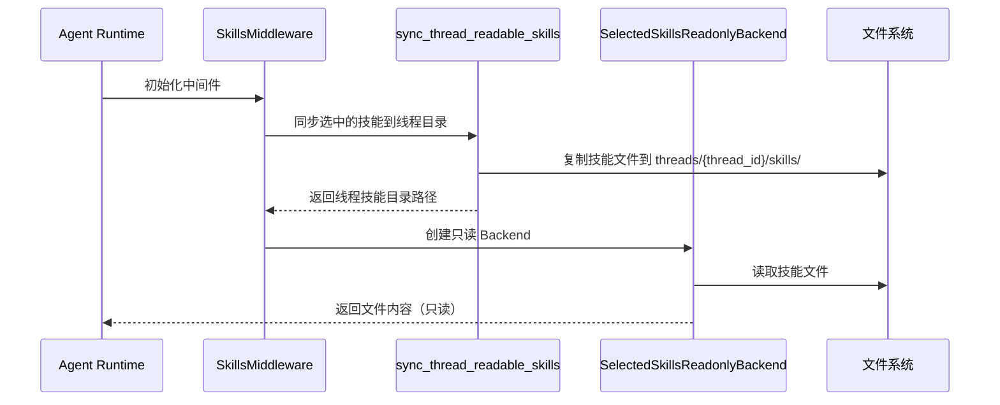

# Skills 管理流程链路追踪

> **链路概览**：用户上传 Skill 包 → 后端解析并创建草稿 → 用户确认安装 → 技能目录持久化到文件系统 → 元数据写入数据库 → 运行时通过中间件动态发现 → Agent 线程级别的只读后端隔离

## 一、完整链路追踪

### 1.1 前端触发点

**用户操作**：用户在管理界面上传 Skill ZIP 包或 SKILL.md 文件

**代码路径**：
- API 路由：`backend/server/routers/skill_router.py`
- 前端 API：`web/src/apis/skill_api.js`

**关键代码**（`skill_router.py:134-152`）：

```python
@user_skills.post("/import/prepare")
async def prepare_skill_upload_route(
    file: UploadFile = File(...),
    current_user: User = Depends(get_required_user),
    db: AsyncSession = Depends(get_db),
):
    try:
        data = await prepare_skill_upload(
            db,
            filename=file.filename or "",
            file_bytes=await file.read(),
            operator=current_user,
        )
        return {"success": True, "data": data}
    except ValueError as e:
        _raise_from_value_error(e)
```

前端上传流程：
1. 用户选择本地 ZIP 或 SKILL.md 文件
2. 前端调用 `/api/skills/import/prepare`
3. 后端返回草稿 ID 和预览数据（包含 slug、name、description、dependencies 等）
4. 前端展示预览信息，用户确认安装

### 1.2 后端路由层

**代码路径**：`backend/server/routers/skill_router.py`

**关键职责**：
- 接收 `/api/skills/import/prepare` POST 请求
- 接收 `/api/skills/install-drafts/{draft_id}/confirm` POST 请求
- 验证用户权限（普通用户只能上传，管理员可管理内置技能）
- 调用服务层处理业务逻辑
- 返回结构化响应

**路由端点总览**：

| 端点 | 方法 | 权限 | 功能 |
|------|------|------|------|
| `/skills/import/prepare` | POST | 普通用户 | 准备上传技能包 |
| `/skills/install-drafts/{draft_id}/confirm` | POST | 草稿创建者 | 确认安装草稿 |
| `/skills/accessible` | GET | 普通用户 | 获取可访问技能列表 |
| `/system/skills` | GET | 普通用户 | 获取管理视图技能列表 |
| `/system/skills/{slug}/share-config` | PUT | 技能所有者 | 更新共享配置 |
| `/system/skills/{slug}/dependencies` | PUT | 技能所有者 | 更新依赖关系 |
| `/system/skills/{slug}/tree` | GET | 管理权限 | 获取技能目录树 |
| `/system/skills/{slug}/file` | GET/POST/PUT/DELETE | 管理权限 | 文件读写操作 |
| `/system/skills/{slug}/export` | GET | 管理权限 | 导出技能 ZIP |
| `/system/skills/{slug}` | DELETE | 管理权限 | 删除技能 |
| `/system/skills/builtin` | GET | 管理员 | 列出内置技能 |
| `/system/skills/builtin/sync` | POST | 管理员 | 同步内置技能 |

### 1.3 服务层处理

**代码路径**：`backend/package/starring/agents/skills/service.py`

**关键职责**：
- 解析 ZIP 包或 SKILL.md 文件
- 提取 frontmatter 元数据（slug、name、description、dependencies）
- 创建草稿目录（`{save_dir}/skill_import_drafts/{draft_id}/`）
- 处理 slug 冲突（自动添加版本号后缀）
- 验证依赖关系（工具、MCP、其他 Skill）
- 同步技能目录到文件系统
- 创建数据库记录

**关键代码**（`service.py:776-829` 简化版）：

```python
async def prepare_skill_upload(
    db: AsyncSession,
    *,
    filename: str,
    file_bytes: bytes,
    operator: User,
) -> dict[str, Any]:
    """准备上传技能包，创建草稿"""
    repo = SkillRepository(db)
    draft_dir = get_skill_drafts_root_dir() / str(uuid.uuid4())
    items_dir = draft_dir / "items"
    draft_dir.mkdir(parents=True, exist_ok=False)
    items_dir.mkdir(parents=True, exist_ok=True)

    # 解析 ZIP 或 SKILL.md
    with tempfile.TemporaryDirectory() as temp_root:
        extract_dir = Path(temp_root) / "extract"
        extract_dir.mkdir(parents=True, exist_ok=True)
        
        if filename.endswith(".zip"):
            # 解压 ZIP 包
            zip_path = Path(temp_root) / "upload.zip"
            zip_path.write_bytes(file_bytes)
            with zipfile.ZipFile(zip_path, "r") as zf:
                _validate_zip_paths(zf)  # 验证路径安全性
                zf.extractall(extract_dir)
            skill_md_files = list(extract_dir.rglob("SKILL.md"))
            if len(skill_md_files) != 1:
                raise ValueError("ZIP 必须且只能包含一个技能")
            source_skill_dir = skill_md_files[0].parent
        else:
            # 直接上传 SKILL.md
            source_skill_dir = extract_dir
            (source_skill_dir / "SKILL.md").write_bytes(file_bytes)

        # 解析并暂存草稿
        item = await _stage_skill_draft_item(repo, source_skill_dir=source_skill_dir, draft_items_dir=items_dir)

    # 写入草稿元数据
    data = {
        "draft_id": draft_dir.name,
        "created_by": operator.uid,
        "source_type": "upload",
        "source": filename,
        "created_at": time.time(),
        "expires_at": time.time() + SKILL_DRAFT_TTL_SECONDS,  # 1小时过期
        "items": [item],
        **_build_default_share_payload(operator),
    }
    (draft_dir / "metadata.json").write_text(json.dumps(data, ensure_ascii=False, indent=2), encoding="utf-8")
    return data
```

### 1.4 SKILL.md 解析

**代码路径**：`backend/package/starring/agents/skills/service.py:551-572`

**关键职责**：
- 解析 YAML frontmatter（`---` 包围）
- 提取必填字段：slug、name、description
- 提取可选字段：tool_dependencies、mcp_dependencies、skill_dependencies
- 验证 slug 格式（小写字母/数字/短横线）

**关键代码**：

```python
def _parse_skill_markdown(content: str) -> tuple[str, str, str, dict[str, Any]]:
    """解析 SKILL.md 文件"""
    frontmatter_raw, _body = _split_frontmatter(content)
    try:
        data = yaml.safe_load(frontmatter_raw)
    except yaml.YAMLError as e:
        raise ValueError(f"SKILL.md frontmatter YAML 解析失败: {e}") from e

    if not isinstance(data, dict):
        raise ValueError("SKILL.md frontmatter 必须是对象")

    name = _validate_skill_display_name(str(data.get("name", "")))
    raw_slug = str(data.get("slug", "")).strip()
    slug = (
        _validate_skill_slug_value(raw_slug, field_name="slug")
        if raw_slug
        else _validate_skill_slug_value(name, field_name="name")
    )
    description = str(data.get("description", "")).strip()
    if not description:
        raise ValueError("SKILL.md frontmatter 缺少 description")

    return slug, name, description, data
```

**SKILL.md 示例**：

```markdown
---
name: code-review
slug: code-review
description: 自动代码审查技能，支持多种语言和框架
tool_dependencies:
  - read_file
  - write_file
mcp_dependencies:
  - github-mcp
skill_dependencies:
  - code-analysis
---

# Code Review Skill

该技能用于自动化代码审查，支持以下功能：
- 代码质量分析
- 安全漏洞检测
- 性能优化建议
```

### 1.5 确认安装流程

**代码路径**：`backend/server/routers/skill_router.py:200-219` + `backend/package/starring/agents/skills/service.py:884-976`

**关键职责**：
- 验证草稿 ID 和用户权限
- 从草稿目录读取源文件
- 同步技能目录到 `skills_root/{slug}/`
- 创建数据库记录（Skill 表）
- 清理草稿目录

**关键代码**（`service.py:884-976` 简化版）：

```python
async def confirm_skill_install_draft(
    db: AsyncSession,
    *,
    draft_id: str,
    share_config: dict | None,
    operator: User,
) -> list[dict[str, Any]]:
    """确认安装技能草稿"""
    draft_dir, data = _load_skill_draft(draft_id)
    if data.get("created_by") != operator.uid and operator.role not in ADMIN_ROLES:
        raise ValueError("无权确认该安装草稿")

    source_type = data.get("source_type")
    if source_type not in {"upload", "remote"}:
        raise ValueError("无效的安装草稿来源")

    normalized_share_config = normalize_skill_share_config(
        share_config,
        operator_uid=operator.uid,
        operator_department_id=operator.department_id,
        source_type=source_type,
        allowed_access_levels=set(get_allowed_skill_access_levels(operator)),
    )

    repo = SkillRepository(db)
    skills_root = get_skills_root_dir()
    results: list[dict[str, Any]] = []

    for draft_item in data.get("items") or []:
        slug = str(draft_item.get("slug") or "").strip()
        source_dir = (draft_dir / str(draft_item.get("source_dir", ""))).resolve()

        # 同步到 skills_root
        parsed = _parse_skill_dir_metadata(source_dir)
        with tempfile.TemporaryDirectory(prefix=".skill-confirm-", dir=str(skills_root.parent)) as temp_root:
            stage_dir = Path(temp_root) / "stage"
            shutil.copytree(source_dir, stage_dir)
            
            temp_target = skills_root / f".{slug}.tmp-{uuid.uuid4().hex[:8]}"
            shutil.move(str(stage_dir), str(temp_target))
            final_dir = skills_root / slug
            temp_target.rename(final_dir)

            # 创建数据库记录
            item = await repo.create(
                slug=slug,
                name=parsed["name"],
                description=parsed["description"],
                source_type=source_type,
                tool_dependencies=parsed["tool_dependencies"],
                mcp_dependencies=parsed["mcp_dependencies"],
                skill_dependencies=parsed["skill_dependencies"],
                dir_path=(Path("skills") / slug).as_posix(),
                share_config=normalized_share_config,
                enabled=True,
                created_by=operator.uid,
            )
            results.append({"slug": item.slug, "success": True, "skill": item.to_dict()})

    # 清理草稿目录
    if any(item.get("success") for item in results):
        shutil.rmtree(draft_dir, ignore_errors=True)
    return results
```

### 1.6 文件系统持久化

**代码路径**：`backend/package/starring/agents/skills/service.py:199-257`

**关键职责**：
- 管理技能根目录（`{save_dir}/skills/`）
- 管理草稿目录（`{save_dir}/skill_import_drafts/`）
- 管理线程级技能目录（`{save_dir}/threads/{thread_id}/skills/`）
- 清理过期草稿（超过 1 小时自动删除）

**关键代码**：

```python
def get_skills_root_dir() -> Path:
    """获取技能根目录"""
    root = Path(sys_config.save_dir) / "skills"
    root.mkdir(parents=True, exist_ok=True)
    return root

def get_skill_drafts_root_dir() -> Path:
    """获取技能草稿目录"""
    root = Path(sys_config.save_dir) / "skill_import_drafts"
    root.mkdir(parents=True, exist_ok=True)
    return root

def get_thread_skills_root_dir(thread_id: str) -> Path:
    """获取线程级技能目录"""
    safe_thread_id = str(thread_id or "").strip()
    if not safe_thread_id:
        raise ValueError("thread_id is required")
    if not re.fullmatch(r"[A-Za-z0-9_-]+", safe_thread_id):
        raise ValueError("thread_id contains invalid characters")

    root = Path(sys_config.save_dir) / "threads" / safe_thread_id / "skills"
    root.mkdir(parents=True, exist_ok=True)
    return root
```

### 1.7 数据库持久化

**代码路径**：`backend/package/starring/agents/skills/repository.py`

**关键职责**：
- CRUD 操作（Create、Read、Update、Delete）
- 按 slug 查询技能
- 批量查询技能（按 slug 列表）
- 更新元数据、依赖关系、共享配置、启用状态

**关键代码**：

```python
class SkillRepository:
    def __init__(self, db_session: AsyncSession):
        self.db = db_session

    async def create(
        self,
        *,
        slug: str,
        name: str,
        description: str,
        source_type: str,
        tool_dependencies: list[str] | None,
        mcp_dependencies: list[str] | None,
        skill_dependencies: list[str] | None,
        dir_path: str,
        share_config: dict,
        enabled: bool = True,
        version: str | None = None,
        content_hash: str | None = None,
        created_by: str | None,
    ) -> Skill:
        now = utc_now_naive()
        item = Skill(
            slug=slug,
            name=name,
            description=description,
            source_type=source_type,
            tool_dependencies=tool_dependencies or [],
            mcp_dependencies=mcp_dependencies or [],
            skill_dependencies=skill_dependencies or [],
            dir_path=dir_path,
            version=version,
            content_hash=content_hash,
            share_config=share_config,
            enabled=enabled,
            created_by=created_by,
            updated_by=created_by,
            created_at=now,
            updated_at=now,
        )
        self.db.add(item)
        await self.db.commit()
        await self.db.refresh(item)
        return item

    async def get_by_slug(self, slug: str, *, for_update: bool = False) -> Skill | None:
        stmt = select(Skill).where(Skill.slug == slug)
        if for_update:
            stmt = stmt.with_for_update()
        result = await self.db.execute(stmt)
        return result.scalar_one_or_none()
```

### 1.8 运行时调用流程

**代码路径**：`backend/package/starring/agents/backends/skills_backend.py`

**关键职责**：
- 提供线程级只读技能文件系统后端
- 基于选中的技能 slug 过滤访问权限
- 继承 `FilesystemBackend` 实现只读约束

**关键代码**（`skills_backend.py:22-58`）：

```python
class SelectedSkillsReadonlyBackend(FilesystemBackend):
    """只读 skills backend，仅暴露选中的技能目录。"""

    def __init__(self, *, selected_slugs: list[str] | None):
        super().__init__(root_dir=get_skills_root_dir(), virtual_mode=True)
        self._selected_slugs = {
            str(slug).strip()
            for slug in (selected_slugs or [])
            if isinstance(slug, str) and is_valid_skill_slug(str(slug))
        }

    def _is_allowed_path(self, path: str | None) -> bool:
        slug = self._extract_slug(path)
        if slug is None:
            return True
        return slug in self._selected_slugs

    def ls(self, path: str) -> LsResult:
        if not self._selected_slugs:
            return LsResult(entries=[])

        normalized = (path or "/").strip() or "/"
        if not self._is_allowed_path(normalized):
            return LsResult(error="Access denied: path is outside selected skills.")

        result = super().ls(normalized)
        if result.error:
            return result
        infos = result.entries or []
        if normalized == "/":
            infos = self._filter_infos(infos)  # 过滤非选中的技能
        return LsResult(entries=infos)

    def write(self, file_path: str, content: str) -> WriteResult:
        return WriteResult(error="Skills path is read-only.")  # 强制只读
```

**运行时调用链路**：



### 1.9 Skills 中间件集成

**代码路径**：`backend/package/starring/agents/middlewares/skills.py:171-250`

**关键职责**：
- Skills 提示词注入：将激活的技能元数据拼接到系统提示词
- 依赖展开：根据激活的 skills 动态加载依赖的工具和 MCP 服务
- 动态激活：通过 `read_file` 工具调用检测技能读取行为，自动激活对应技能
- 工具合并：保留原有工具 + 追加依赖的新工具，避免重复

**关键代码**（`skills.py:171-250`）：

```python
class SkillsMiddleware(AgentMiddleware):
    """Skills 中间件 - 处理 skills 提示词注入、依赖展开、动态激活

    职责：
    - Skills 提示词注入（直接从数据库加载）
    - 依赖展开（用户配置 + 动态激活）
    - 工具/MCP 动态加载
    """

    state_schema = SkillsState

    def __init__(
        self,
        *,
        skills_context_name: str = "skills",
        enable_skills_prompt: bool = True,
        skills_sources_for_prompt: list[str] | None = None,
    ):
        super().__init__()
        self.skills_context_name = skills_context_name
        self.enable_skills_prompt = enable_skills_prompt
        self.skills_sources_for_prompt = skills_sources_for_prompt or ["/home/gem/skills/"]

    async def awrap_model_call(
        self, request: ModelRequest, handler: Callable[[ModelRequest], ModelResponse]
    ) -> ModelResponse:
        """包装模型调用，处理 skills 提示词注入、动态激活和依赖展开"""
        runtime_context = request.runtime.context

        # 1. Skills 提示词注入
        if self.enable_skills_prompt:
            prompt_skills = getattr(runtime_context, "_prompt_skills", None)
            if isinstance(prompt_skills, list):
                prompt_skills = normalize_string_list(prompt_skills)
                if prompt_skills:
                    skills_meta = self._collect_prompt_metadata(prompt_skills, runtime_context)
                    skills_section = self._build_skills_section(skills_meta)
                    system_message = append_to_system_message(getattr(request, "system_message", None), skills_section)
                    request = request.override(system_message=system_message)

        # 2. 依赖展开（工具/MCP 动态加载）
        state = request.state if isinstance(request.state, dict) else {}
        activated = state.get("activated_skills", []) or []

        readable_skills = self._get_readable_skills(runtime_context)
        activated = [slug for slug in normalize_string_list(activated) if slug in readable_skills]

        deps_bundle = self._build_dependency_bundle(activated, runtime_context)

        enabled_tools = []

        # 合并依赖的工具
        if deps_bundle["tools"]:
            all_tools = get_all_tool_instances()
            required_tool_names = set(deps_bundle["tools"])
            enabled_tools = [t for t in all_tools if t.name in required_tool_names]

        # 合并依赖的 MCP 工具（并行加载）
        if deps_bundle["mcps"]:
            mcp_tools = await self._get_mcp_tools_from_context(
                runtime_context,
                extra_mcps=deps_bundle["mcps"],
            )
            enabled_tools.extend(mcp_tools)

        # 合并工具：保留原有工具 + 追加依赖的新工具
        if enabled_tools:
            existing_tool_names = {t.name for t in request.tools or []}
            merged_tools = list(request.tools or [])
            for t in enabled_tools:
                if t.name not in existing_tool_names:
                    merged_tools.append(t)
            request = request.override(tools=merged_tools)

        return await handler(request)
```

**动态激活机制**（`skills.py:340-357`）：

```python
def _process_tool_call_result(self, result: Any, request: ToolCallRequest) -> Any:
    """处理工具调用结果，检查并处理 skill 动态激活"""
    if request.tool_call.get("name") != "read_file":
        return result

    args = request.tool_call.get("args") or {}
    file_path = args.get("file_path") if isinstance(args, dict) else None
    slug = self._extract_skill_slug_from_skill_md_path(file_path)

    if not slug:
        return result

    if not self._is_visible_skill_slug(request, slug):
        logger.warning(f"SkillsMiddleware: deny skill activation for invisible slug: {slug}")
        return result

    logger.debug(f"SkillsMiddleware: activated skill by read_file: {slug}")
    return self._merge_activated_skill_update(result, slug)
```

**设计亮点**：
- **三段式处理**：提示词注入 → 依赖展开 → 工具合并，职责清晰
- **动态激活**：通过监听 `read_file` 工具调用，自动激活被读取的技能
- **可见性校验**：激活前校验 slug 是否在用户可见范围内，防止越权激活
- **并行加载**：MCP 工具使用 `asyncio.gather` 并行加载，提升性能

## 二、设计亮点

### 2.1 草稿机制

**亮点**：引入草稿目录（`skill_import_drafts`）实现两阶段提交：

```
上传阶段（草稿） → 预览阶段（前端展示） → 确认阶段（正式安装）
```

**优势**：
- 用户可在确认前预览技能内容（slug、name、description、dependencies）
- 支持批量安装多个技能（一个草稿可包含多个 items）
- 自动过期清理（1 小时 TTL），避免磁盘占用
- 失败时不影响现有技能系统

**代码位置**：`service.py:205-244`

### 2.2 多级权限控制

**亮点**：支持三级共享范围（global/department/user）：

| 访问级别 | 说明 | 权限范围 |
|---------|------|---------|
| global | 全局共享 | 所有用户可访问 |
| department | 部门共享 | 仅指定部门用户可访问 |
| user | 个人共享 | 仅指定用户可访问 |

**关键代码**（`service.py:136-159`）：

```python
def user_can_access_skill(user: User, skill: Skill, *, require_enabled: bool = True) -> bool:
    if require_enabled and not skill.enabled:
        return False
    if user.role == "superadmin":
        return True

    user_uid = str(user.uid or "")
    if user_uid and skill.created_by == user_uid:
        return True

    share_config = skill.share_config or DEFAULT_SKILL_SHARE_CONFIG.copy()
    access_level = share_config.get("access_level")
    if access_level == "global":
        return True
    if access_level == "department":
        if user.department_id is None:
            return False
        try:
            return int(user.department_id) in [int(value) for value in share_config.get("department_ids") or []]
        except (TypeError, ValueError):
            return False
    if access_level == "user":
        return bool(user_uid and user_uid in (share_config.get("user_uids") or []))
    return False
```

### 2.3 依赖关系验证

**亮点**：支持跨技能依赖，并验证权限范围兼容性：

**依赖类型**：
- `tool_dependencies`：依赖的内置工具（如 read_file、write_file）
- `mcp_dependencies`：依赖的 MCP 服务（如 github-mcp）
- `skill_dependencies`：依赖的其他技能（如 code-analysis）

**权限兼容性规则**：
- 子技能的共享范围必须 ≥ 父技能
- global 技能可被任何技能依赖
- department 技能只能被相同或更大部门范围依赖
- user 技能只能被相同或更大用户范围依赖

**关键代码**（`service.py:168-191`）：

```python
def can_skill_depend_on(parent: Skill, dependency: Skill) -> bool:
    if not dependency.enabled:
        return False
    if is_builtin_skill(dependency):
        return True

    dep_config = dependency.share_config or DEFAULT_SKILL_SHARE_CONFIG.copy()
    parent_config = parent.share_config or DEFAULT_SKILL_SHARE_CONFIG.copy()
    dep_level = dep_config.get("access_level")
    parent_level = parent_config.get("access_level")

    if dep_level == "global":
        return True
    if parent_level == "global":
        return False
    if parent_level == "department" and dep_level == "department":
        parent_ids = {int(value) for value in parent_config.get("department_ids") or []}
        dep_ids = {int(value) for value in dep_config.get("department_ids") or []}
        return parent_ids.issubset(dep_ids)  # 父技能的部门范围必须被子技能包含
    if parent_level == "user" and dep_level == "user":
        parent_uids = {str(value) for value in parent_config.get("user_uids") or []}
        dep_uids = {str(value) for value in dep_config.get("user_uids") or []}
        return parent_uids.issubset(dep_uids)  # 父技能的用户范围必须被子技能包含
    return False
```

### 2.4 内置技能管理

**亮点**：内置技能（builtin）与用户技能隔离，仅管理员可管理：

**特性**：
- 内置技能存放在代码仓库中（`starring/agents/skills/buildin/`）
- 通过 `/api/system/skills/builtin/sync` 同步到数据库
- 内置技能的 `share_config` 固定为 `{"access_level": "global"}`
- 内容哈希（content_hash）用于检测变更，触发自动更新

**关键代码**（`service.py:1284-1343`）：

```python
async def init_builtin_skills(db: AsyncSession, *, created_by: str = "system") -> list[Skill]:
    repo = SkillRepository(db)
    synced_items: list[Skill] = []

    for spec in list_builtin_skill_specs():
        slug = spec["slug"]
        existing = await repo.get_by_slug(slug)
        if existing and not is_builtin_skill(existing):
            raise ValueError(f"内置 skill '{slug}' 与已存在的非内置 skill 冲突")

        target_dir = get_skills_root_dir() / slug
        _replace_skill_target(target_dir, Path(spec["source_dir"]))

        if existing:
            # 检测元数据变更并更新
            if existing.name != spec["name"] or existing.description != spec["description"]:
                await repo.update_metadata(existing, name=spec["name"], description=spec["description"], updated_by=created_by)
            # 检测依赖变更并更新
            if normalize_string_list(existing.tool_dependencies or []) != spec["tool_dependencies"]:
                await repo.update_dependencies(existing, tool_dependencies=spec["tool_dependencies"], ...)
            synced_items.append(await repo.update_builtin_install(existing, version=spec["version"], content_hash=spec["content_hash"], ...))
            continue

        # 创建新的内置技能记录
        synced_items.append(await repo.create(slug=slug, source_type="builtin", ...))

    return synced_items
```

### 2.5 线程级隔离

**亮点**：每个 Agent 线程拥有独立的技能目录副本，避免并发冲突：

**实现机制**：
- 技能文件复制到 `{save_dir}/threads/{thread_id}/skills/{slug}/`
- 通过 `SelectedSkillsReadonlyBackend` 提供只读访问
- 线程锁（`_THREAD_SKILLS_LOCK`）保证并发安全
- 支持增量更新（仅同步变更的技能）

**关键代码**（`service.py:259-307`）：

```python
def sync_thread_readable_skills(thread_id: str, selected_slugs: list[str] | None) -> Path:
    skills_root = get_skills_root_dir().resolve()
    thread_skills_root = get_thread_skills_root_dir(thread_id)
    normalized_slugs = [slug for slug in normalize_string_list(selected_slugs) if is_valid_skill_slug(slug)]
    readable_slugs = set(normalized_slugs)
    
    with _get_thread_skills_lock(thread_id):
        # 清理未选中的技能
        for entry in thread_skills_root.iterdir():
            if entry.name in readable_slugs:
                continue
            if entry.is_dir() and not entry.is_symlink():
                shutil.rmtree(entry)
            else:
                entry.unlink()

        # 同步选中的技能
        for slug in normalized_slugs:
            source_dir = (skills_root / slug).resolve()
            target_dir = thread_skills_root / slug

            if not source_dir.is_dir():
                continue

            # 增量更新：检查目录是否相同
            if target_dir.exists() and _dirs_equal(target_dir, source_dir):
                continue

            # 原子替换：先复制到临时目录，再 rename
            temp_target = thread_skills_root / f".{slug}.tmp-{uuid.uuid4().hex[:8]}"
            try:
                shutil.copytree(source_dir, temp_target, symlinks=False)
                temp_target.rename(target_dir)
            finally:
                if temp_target.exists():
                    shutil.rmtree(temp_target, ignore_errors=True)

    return thread_skills_root
```

### 2.6 远程技能安装

**亮点**：支持从 GitHub 仓库批量安装技能：

**API 端点**：
- `/api/skills/remote/list`：列出远程仓库中的技能
- `/api/skills/remote/search`：搜索远程技能
- `/api/skills/remote/prepare`：准备远程技能安装

**关键代码**（`service.py:832-881`）：

```python
async def prepare_remote_skill_install(
    db: AsyncSession,
    *,
    source: str,
    skills: list[str],
    operator: User,
) -> dict[str, Any]:
    from starring.agents.skills.remote_install import prepare_remote_skills_batch

    repo = SkillRepository(db)
    draft_dir = get_skill_drafts_root_dir() / str(uuid.uuid4())
    items_dir = draft_dir / "items"
    draft_dir.mkdir(parents=True, exist_ok=False)
    items_dir.mkdir(parents=True, exist_ok=True)

    preparation = None
    try:
        preparation = await prepare_remote_skills_batch(source=source, skills=skills)
        items: list[dict[str, Any]] = []
        for result in preparation.results:
            if not result.get("success"):
                items.append({"slug": result.get("slug", ""), "success": False, "error": result.get("error", "安装失败")})
                continue
            item = await _stage_skill_draft_item(repo, source_skill_dir=Path(result["source_dir"]), draft_items_dir=items_dir)
            items.append(item)

        data = {
            "draft_id": draft_dir.name,
            "created_by": operator.uid,
            "source_type": "remote",
            "source": source,
            "created_at": time.time(),
            "expires_at": time.time() + SKILL_DRAFT_TTL_SECONDS,
            "items": items,
            **_build_default_share_payload(operator),
        }
        (draft_dir / "metadata.json").write_text(json.dumps(data, ensure_ascii=False, indent=2), encoding="utf-8")
        return data
    finally:
        if preparation is not None:
            await preparation.cleanup()
```

## 三、主要功能

### 3.1 技能上传与安装

| 操作 | 端点 | 输入 | 输出 |
|------|------|------|------|
| 准备上传 | POST `/skills/import/prepare` | ZIP 或 SKILL.md 文件 | 草稿 ID、预览数据 |
| 确认安装 | POST `/skills/install-drafts/{draft_id}/confirm` | 草稿 ID、共享配置 | 安装结果列表 |
| 取消安装 | DELETE `/skills/install-drafts/{draft_id}` | 草稿 ID | 成功/失败 |

### 3.2 技能管理

| 操作 | 端点 | 权限 | 功能 |
|------|------|------|------|
| 列出可访问技能 | GET `/skills/accessible` | 普通用户 | 返回当前用户可访问的技能列表 |
| 列出管理视图 | GET `/system/skills` | 普通用户 | 返回可管理或可访问的技能列表 |
| 更新共享配置 | PUT `/system/skills/{slug}/share-config` | 技能所有者 | 更新技能的共享范围 |
| 更新依赖关系 | PUT `/system/skills/{slug}/dependencies` | 技能所有者 | 更新技能的依赖列表 |
| 启用/禁用技能 | PUT `/system/skills/{slug}/enabled` | 技能所有者 | 更新技能的启用状态 |
| 删除技能 | DELETE `/system/skills/{slug}` | 技能所有者 | 删除技能及其文件 |

### 3.3 文件操作

| 操作 | 端点 | 权限 | 功能 |
|------|------|------|------|
| 获取目录树 | GET `/system/skills/{slug}/tree` | 管理权限 | 返回技能目录的树形结构 |
| 读取文件 | GET `/system/skills/{slug}/file` | 管理权限 | 读取技能文件内容 |
| 创建文件 | POST `/system/skills/{slug}/file` | 管理权限 | 创建新文件或目录 |
| 更新文件 | PUT `/system/skills/{slug}/file` | 管理权限 | 更新文件内容 |
| 删除文件 | DELETE `/system/skills/{slug}/file` | 管理权限 | 删除文件或目录 |
| 导出技能 | GET `/system/skills/{slug}/export` | 管理权限 | 导出技能为 ZIP 包 |

### 3.4 内置技能管理

| 操作 | 端点 | 权限 | 功能 |
|------|------|------|------|
| 列出内置技能 | GET `/system/skills/builtin` | 管理员 | 列出所有内置技能 |
| 同步内置技能 | POST `/system/skills/builtin/sync` | 管理员 | 从代码仓库同步内置技能 |

### 3.5 远程技能安装

| 操作 | 端点 | 输入 | 输出 |
|------|------|------|------|
| 列出远程技能 | POST `/skills/remote/list` | 仓库来源 | 远程技能列表 |
| 搜索远程技能 | POST `/skills/remote/search` | 搜索关键字 | 匹配的技能列表 |
| 准备远程安装 | POST `/skills/remote/prepare` | 仓库来源、技能列表 | 草稿 ID、预览数据 |

## 四、可改进之处

### 4.1 缺少技能版本管理

**问题**：当前技能不支持版本控制，无法回滚到历史版本。

**改进建议**：
- 在 `Skill` 模型中增加 `version` 字段
- 在技能目录中保留历史版本（`skills/{slug}/v1.0/`）
- 提供 `/api/system/skills/{slug}/versions` 端点查询历史版本
- 支持 `/api/system/skills/{slug}/rollback` 回滚到指定版本

**代码位置**：`backend/package/starring/agents/skills/repository.py`

### 4.2 文件操作缺少变更通知

**问题**：技能文件被修改后，运行中的 Agent 无法感知变更，可能导致缓存不一致。

**改进建议**：
- 在文件修改时发布 Redis 事件（`skill:{slug}:modified`）
- Agent 运行时订阅变更事件，清理缓存或重新加载技能
- 在 `SelectedSkillsReadonlyBackend` 中增加文件变更检测机制

**代码位置**：`backend/package/starring/agents/skills/service.py:1098-1119`

### 4.3 依赖关系缺少循环检测

**问题**：当前未检测技能依赖的循环引用，可能导致运行时死锁。

**改进建议**：
- 在 `update_skill_dependencies` 中增加拓扑排序检测
- 构建 DAG（有向无环图），检测是否存在环
- 如果存在循环依赖，拒绝更新并提示用户

**代码位置**：`backend/package/starring/agents/skills/service.py:477-505`

### 4.4 远程安装缺少校验和验证

**问题**：从 GitHub 下载的技能包未验证完整性，可能被篡改。

**改进建议**：
- 在 SKILL.md frontmatter 中支持 `checksum` 字段（SHA256）
- 下载后验证校验和，不匹配则拒绝安装
- 支持 GPG 签名验证（可选）

**代码位置**：`backend/package/starring/agents/skills/remote_install.py`

### 4.5 线程级隔离缺少磁盘清理

**问题**：线程结束后，`threads/{thread_id}/skills/` 目录未清理，导致磁盘占用增加。

**改进建议**：
- 在 Agent Run 完成后，通过 ARQ 任务异步清理线程目录
- 提供定时清理任务（删除超过 7 天的线程目录）
- 在 `SelectedSkillsReadonlyBackend` 中增加磁盘占用统计

**代码位置**：`backend/package/starring/agents/skills/service.py:259-307`

### 4.6 内置技能更新缺少增量同步

**问题**：内置技能同步时，即使内容未变更也会重新复制文件。

**改进建议**：
- 利用 `content_hash` 检测内容变更
- 仅同步哈希值不同的技能
- 在 `_replace_skill_target` 中增加内容比较逻辑

**代码位置**：`backend/package/starring/agents/skills/service.py:1284-1343`

## 五、代码路径索引

| 模块 | 文件路径 | 职责 |
|------|----------|------|
| 后端路由 | `backend/server/routers/skill_router.py` | Skills 管理 API 端点 |
| 服务层 | `backend/package/starring/agents/skills/service.py` | 技能上传、安装、管理、依赖验证 |
| 数据仓储 | `backend/package/starring/agents/skills/repository.py` | Skill 模型 CRUD 操作 |
| 后端实现 | `backend/package/starring/agents/backends/skills_backend.py` | 线程级只读技能文件系统 |
| 远程安装 | `backend/package/starring/agents/skills/remote_install.py` | GitHub 仓库技能拉取 |
| 中间件 | `backend/package/starring/agents/middlewares/skills.py` | Agent 运行时技能注入、依赖展开、动态激活 |
| 内置技能 | `backend/package/starring/agents/skills/buildin/` | 内置技能定义目录 |
| 数据模型 | `backend/package/starring/storage/postgres/models_business.py` | Skill 模型定义 |