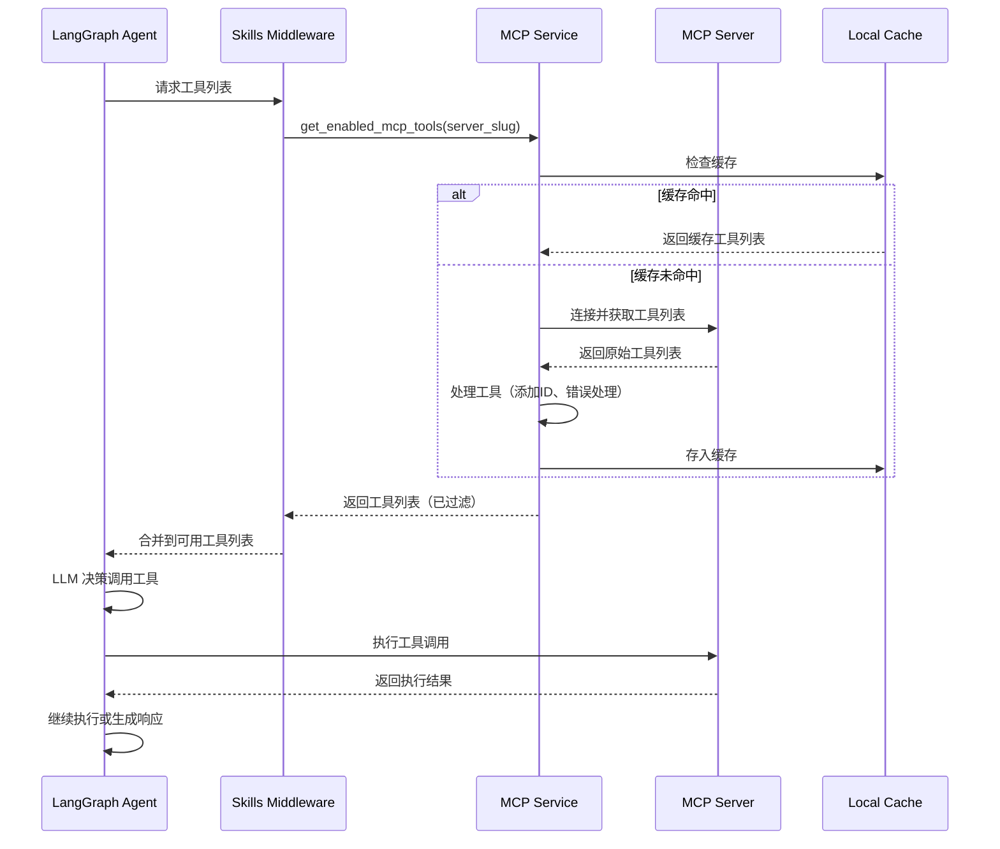
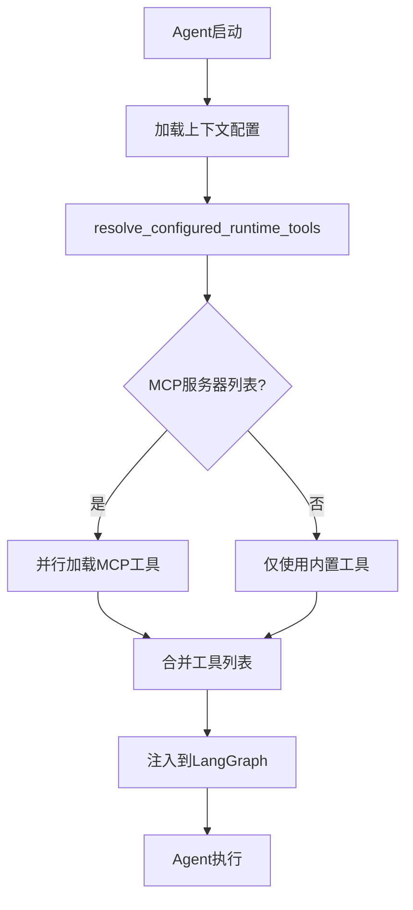

# MCP集成流程链路追踪

> **链路概览**：管理员创建MCP服务器配置 → 数据库持久化配置 → Agent运行时加载MCP工具 → LangGraph调用MCP工具 → 工具执行并返回结果 → 结果流式推送到前端

## 一、完整链路追踪

### 1.1 MCP服务器配置创建

**用户操作**：管理员在系统设置中添加新的 MCP 服务器配置

**代码路径**：
- 前端组件：`web/src/components/extensions/McpCardList.vue`、`McpDetailView.vue`、`McpFormModal.vue`
- API调用：`web/src/apis/mcp_api.js`
- 后端路由：`backend/server/routers/mcp_router.py`

**关键代码**（`mcp_router.py:115-157`）：

```python
@mcp.post("")
async def create_mcp_server_route(
    request: CreateMcpServerRequest,
    current_user: User = Depends(get_admin_user),
    db: AsyncSession = Depends(get_db),
):
    """创建新的 MCP 服务器"""
    # 校验传输类型
    valid_transports = ("sse", "streamable_http", "stdio")
    if request.transport not in valid_transports:
        raise HTTPException(status_code=400, detail=f"传输类型必须是 {', '.join(valid_transports)} 之一")

    # 根据传输类型校验必填字段
    if request.transport in ("sse", "streamable_http") and not request.url:
        raise HTTPException(status_code=400, detail=f"传输类型为 {request.transport} 时，url 必填")
    if request.transport == "stdio" and not request.command:
        raise HTTPException(status_code=400, detail="传输类型为 stdio 时，command 必填")

    server = await create_mcp_server(
        db,
        slug=request.slug,
        name=request.name,
        transport=request.transport,
        url=request.url,
        command=request.command,
        args=request.args,
        env=request.env,
        description=request.description,
        headers=request.headers,
        timeout=request.timeout,
        sse_read_timeout=request.sse_read_timeout,
        tags=request.tags,
        icon=request.icon,
        created_by=current_user.username,
    )
    return {"success": True, "data": server.to_dict()}
```

### 1.2 数据库持久化

**代码路径**：`backend/package/starring/agents/mcp/service.py` + `backend/package/starring/storage/postgres/models_business.py`

**关键职责**：
- 创建 MCPServer 记录并写入数据库
- 清除本地工具缓存以触发重新加载
- 记录操作日志

**数据模型**（`models_business.py:456-486`）：

```python
class MCPServer(Base):
    """MCP 服务器配置模型"""

    __tablename__ = "mcp_servers"

    id = Column(Integer, primary_key=True, autoincrement=True)
    slug = Column(String(100), nullable=False, unique=True, index=True, comment="稳定标识")
    name = Column(String(100), nullable=False, comment="展示名称")
    description = Column(String(500), nullable=True, comment="描述")

    # 连接配置
    transport = Column(String(20), nullable=False, comment="传输类型：sse/streamable_http/stdio")
    url = Column(String(500), nullable=True, comment="服务器 URL（sse/streamable_http）")
    command = Column(String(500), nullable=True, comment="命令（stdio）")
    args = Column(JSON, nullable=True, comment="命令参数数组（stdio）")
    env = Column(JSON, nullable=True, comment="环境变量（stdio）")
    headers = Column(JSON, nullable=True, comment="HTTP 请求头")
    timeout = Column(Integer, nullable=True, comment="HTTP 超时时间（秒）")
    sse_read_timeout = Column(Integer, nullable=True, comment="SSE 读取超时（秒）")

    # UI 增强字段
    tags = Column(JSON, nullable=True, comment="标签数组")
    icon = Column(String(50), nullable=True, comment="图标（emoji）")

    # 状态字段
    enabled = Column(Integer, nullable=False, default=1, comment="是否启用：1=是，0=否")
    disabled_tools = Column(JSON, nullable=True, comment="禁用的工具名称列表")
```

### 1.3 Agent运行时加载MCP工具

**代码路径**：`backend/package/starring/agents/toolkits/service.py` + `backend/package/starring/agents/middlewares/skills.py`

**关键职责**：
- 从数据库加载启用的 MCP 服务器配置
- 连接到 MCP 服务器发现所有工具
- 过滤禁用的工具
- 缓存工具列表

**关键代码**（`toolkits/service.py:97-133`）：

```python
async def resolve_configured_runtime_tools(context) -> list[Any]:
    from starring.agents.mcp.service import get_enabled_mcp_tools

    selected_tools = []
    selected_tool_names: set[str] = set()
    buildin_tools = {tool.name: tool for tool in get_tool_instances_by_category("buildin")}

    # 加载内置工具
    for tool_name in getattr(context, "tools", None) or []:
        if not isinstance(tool_name, str) or tool_name in selected_tool_names:
            continue
        tool = buildin_tools.get(tool_name)
        if tool is None:
            logger.warning(f"Configured buildin tool not found, skip: {tool_name}")
            continue
        selected_tools.append(tool)
        selected_tool_names.add(tool_name)

    # 加载 MCP 工具
    selected_mcp_servers: set[str] = set()
    for server_name in getattr(context, "mcps", None) or []:
        if not isinstance(server_name, str) or server_name in selected_mcp_servers:
            continue
        selected_mcp_servers.add(server_name)
        try:
            mcp_tools = await get_enabled_mcp_tools(server_name)
        except Exception as e:
            logger.warning(f"Failed to load configured MCP tools '{server_name}': {e}")
            continue
        if not mcp_tools:
            logger.warning(f"Configured MCP unavailable, skip: {server_name}")
            continue
        for tool in mcp_tools:
            if tool.name in selected_tool_names:
                continue
            selected_tools.append(tool)
            selected_tool_names.add(tool.name)

    return selected_tools
```

### 1.4 MCP工具发现与缓存

**代码路径**：`backend/package/starring/agents/mcp/service.py`

**关键职责**：
- 连接到 MCP 服务器（SSE/StreamableHTTP/stdio）
- 获取所有可用工具
- 为工具添加唯一标识符（`mcp__{server}__{tool}` 格式）
- 基于配置哈希实现智能缓存

**关键代码**（`mcp/service.py:197-298`）：

```python
async def get_mcp_tools(
    server_slug: str,
    additional_servers: dict[str, dict[str, Any]] | None = None,
    disabled_tools: list[str] = None,
    cache: bool = True,
    force_refresh: bool = False,
) -> list[Callable[..., Any]]:
    """Get MCP tools for a specific server.

    Architecture:
    1. Fetching: Connects to MCP server to get ALL tools.
    2. Caching: Stores the FULL, UNFILTERED list of tools in `_mcp_tools_cache`.
    3. Filtering: Filters the return value based on `disabled_tools` argument.
    """
    # 获取服务器配置
    server_config = await get_enabled_mcp_server_config(server_slug)
    if server_config is None:
        logger.warning(f"MCP server '{server_slug}' not found in database or disabled")
        return []

    # 基于配置内容生成缓存键（配置变化时自动失效）
    config_payload = json.dumps(server_config, sort_keys=True, ensure_ascii=True, separators=(",", ":"))
    config_hash = hashlib.sha256(config_payload.encode("utf-8")).hexdigest()[:16]
    cache_key = f"{server_slug}:{config_hash}"

    async with _mcp_lock:
        if not force_refresh and cache and cache_key in _mcp_tools_cache:
            all_processed_tools = _mcp_tools_cache[cache_key]

    if not all_processed_tools:
        # 连接 MCP 服务器获取工具
        client = await get_mcp_client({server_slug: client_config})
        if client is None:
            return []

        raw_tools = cast(list[Any], await client.get_tools())

        # 为每个工具添加唯一标识符
        server_cc = to_camel_case(server_slug)
        for tool in raw_tools:
            original_name = tool.name
            tool_cc = to_camel_case(original_name)
            unique_id = f"mcp__{server_cc}__{tool_cc}"

            if tool.metadata is None:
                tool.metadata = {}
            tool.metadata["id"] = unique_id
            # 开启错误处理，防止工具调用抛出 ToolException 时击穿服务
            tool.handle_tool_error = True
            all_processed_tools.append(tool)

        # 更新缓存
        if cache:
            async with _mcp_lock:
                _mcp_tools_cache[cache_key] = all_processed_tools

    # 应用工具过滤（仅影响返回值，不影响缓存）
    if disabled_tools:
        filtered_tools = [t for t in all_processed_tools if t.name not in disabled_tools]
        return filtered_tools

    return all_processed_tools
```

### 1.5 Skills中间件动态加载MCP工具

**代码路径**：`backend/package/starring/agents/middlewares/skills.py`

**关键职责**：
- 处理 Skills 依赖中的 MCP 工具需求
- 在 Agent 运行时动态加载 MCP 工具
- 支持并行加载多个 MCP 服务器的工具

**关键代码**（`skills.py:299-338`）：

```python
async def _get_mcp_tools_from_context(
    self,
    context,
    *,
    extra_mcps: list[str] | None = None,
) -> list:
    """从上下文配置中获取 MCP 工具列表"""
    import asyncio

    # MCP 工具（并行加载）
    mcps = getattr(context, "mcps", None) or []
    all_mcp_names: list[str] = []
    for server_name in mcps:
        if isinstance(server_name, str):
            all_mcp_names.append(server_name)
    for server_name in extra_mcps or []:
        if isinstance(server_name, str):
            all_mcp_names.append(server_name)

    # 去重
    unique_mcp_names = list(dict.fromkeys(all_mcp_names))

    async def load_mcp_tools(server_name: str) -> list:
        """加载单个 MCP 服务器的工具"""
        try:
            mcp_tools = await get_enabled_mcp_tools(server_name)
            if not mcp_tools:
                logger.warning(f"SkillsMiddleware: mcp dependency unavailable, skip: {server_name}")
            return mcp_tools
        except Exception as e:
            logger.warning(f"SkillsMiddleware: failed to load mcp dependency '{server_name}': {e}")
            return []

    # 并行加载所有 MCP 工具
    results = await asyncio.gather(*[load_mcp_tools(name) for name in unique_mcp_names])
    selected_tools = []
    for tools in results:
        selected_tools.extend(tools)

    return selected_tools
```

### 1.6 工具调用与结果返回

**执行流程**：



### 1.7 配置同步与缓存管理

**代码路径**：`backend/package/starring/agents/mcp/service.py`

**关键职责**：
- 启动时同步内置 MCP 服务器配置到数据库
- 配置更新时自动清除缓存
- 基于配置哈希的智能缓存失效

**关键代码**（`mcp/service.py:72-133`）：

```python
async def ensure_builtin_mcp_servers_in_db() -> None:
    """Ensure built-in MCP server definitions exist in the database."""
    async with pg_manager.get_async_session_context() as session:
        any_changed = False

        # 移除已退役的内置服务器
        for slug in _RETIRED_BUILTIN_MCP_SERVER_SLUGS:
            result = await session.execute(
                select(MCPServer).filter(MCPServer.slug == slug, MCPServer.created_by == "system")
            )
            retired = result.scalar_one_or_none()
            if retired:
                await session.delete(retired)
                clear_mcp_server_tools_cache(slug)
                any_changed = True

        # 同步内置服务器配置
        for slug, config in _DEFAULT_MCP_SERVERS.items():
            result = await session.execute(select(MCPServer).filter(MCPServer.slug == slug))
            existing = result.scalar_one_or_none()

            if not existing:
                # 新增内置服务器
                session.add(MCPServer(...))
                any_changed = True
                continue

            # 更新配置字段
            server_changed = False
            for field in _SYNCED_MCP_FIELDS:
                next_value = config.get(field)
                if getattr(existing, field) != next_value:
                    setattr(existing, field, next_value)
                    server_changed = True
            if server_changed:
                existing.updated_by = "system"
                any_changed = True

        if any_changed:
            await session.commit()
```

## 二、设计亮点

### 2.1 数据库驱动的配置管理

**亮点**：所有 MCP 服务器配置存储在数据库中，支持动态管理，无需重启服务：

```python
# 配置存储在数据库中
class MCPServer(Base):
    __tablename__ = "mcp_servers"
    slug = Column(String(100), unique=True, index=True)
    transport = Column(String(20), nullable=False)
    url = Column(String(500), nullable=True)
    command = Column(String(500), nullable=True)
    # ...
```

**优势**：
- 管理员可通过 UI 动态添加/删除/修改 MCP 服务器
- 配置变更实时生效（清除缓存后自动重新加载）
- 支持细粒度的权限控制（仅管理员可操作）

### 2.2 智能缓存机制

**亮点**：基于配置内容哈希的缓存键，配置变化时自动失效：

```python
# 基于完整配置内容生成哈希
config_payload = json.dumps(server_config, sort_keys=True, ensure_ascii=True)
config_hash = hashlib.sha256(config_payload.encode("utf-8")).hexdigest()[:16]
cache_key = f"{server_slug}:{config_hash}"
```

**优势**：
- 避免缓存键冲突（不同配置不会共享缓存）
- 配置更新后自动失效，无需手动清理
- 减少对 MCP 服务器的重复请求（命中缓存时直接返回）

### 2.3 工具隔离与唯一标识

**亮点**：为每个 MCP 工具生成全局唯一标识符：

```python
server_cc = to_camel_case(server_slug)
tool_cc = to_camel_case(original_name)
unique_id = f"mcp__{server_cc}__{tool_cc}"

tool.metadata["id"] = unique_id
```

**优势**：
- 防止不同服务器之间的工具名冲突
- 便于追踪工具来源（从哪个 MCP 服务器）
- 支持在 UI 中清晰展示工具层级关系

### 2.4 多传输协议支持

**亮点**：统一支持三种 MCP 传输协议：

| 传输类型 | 连接方式 | 适用场景 |
|---------|---------|---------|
| `sse` | Server-Sent Events | 远程 HTTP 服务器 |
| `streamable_http` | HTTP Streamable | 远程 HTTP 服务器 |
| `stdio` | 标准输入输出 | 本地进程（如 npx 命令） |

**配置示例**：

```python
# stdio 方式（本地进程）
{
    "transport": "stdio",
    "command": "npx",
    "args": ["-y", "@antv/mcp-server-chart"],
    "env": {"API_KEY": "xxx"}
}

# sse 方式（远程服务器）
{
    "transport": "sse",
    "url": "https://mcp-server.example.com/sse",
    "headers": {"Authorization": "Bearer xxx"}
}
```

### 2.5 工具级别的启用/禁用控制

**亮点**：支持在服务器级别和工具级别进行细粒度控制：

```python
# 服务器级别：enabled 字段控制整个服务器
enabled = Column(Integer, default=1, comment="是否启用：1=是，0=否")

# 工具级别：disabled_tools 列表控制单个工具
disabled_tools = Column(JSON, nullable=True, comment="禁用的工具名称列表")
```

**管理接口**：

```python
@mcp.put("/{slug}/tools/{tool_name}/toggle")
async def toggle_mcp_server_tool_route(slug: str, tool_name: str, ...):
    """切换单个工具的启用状态"""
    enabled, _ = await toggle_tool_enabled(db, slug, tool_name, current_user.username)
    return {
        "success": True,
        "tool_name": tool_name,
        "enabled": enabled,
        "message": f"工具 '{tool_name}' 已{'启用' if enabled else '禁用'}",
    }
```

### 2.6 Skills 动态依赖加载

**亮点**：Skills 中间件支持动态加载 MCP 工具：

```python
class SkillsMiddleware(AgentMiddleware):
    """Skills 中间件 - 处理 skills 提示词注入、依赖展开、动态激活"""

    async def awrap_model_call(self, request: ModelRequest, handler):
        # 1. 展开 Skills 依赖闭包
        deps_bundle = self._build_dependency_bundle(activated_skills, runtime_context)

        # 2. 加载依赖的 MCP 工具（并行）
        if deps_bundle["mcps"]:
            mcp_tools = await self._get_mcp_tools_from_context(
                runtime_context,
                extra_mcps=deps_bundle["mcps"],
            )
            enabled_tools.extend(mcp_tools)

        # 3. 合并工具列表
        request = request.override(tools=merged_tools)
        return await handler(request)
```

**优势**：
- Skills 可以声明对 MCP 工具的依赖
- Agent 运行时自动加载所需的 MCP 工具
- 支持并行加载多个 MCP 服务器（性能优化）

## 三、主要功能

### 3.1 MCP 服务器管理

| 功能 | API 端点 | 说明 |
|-----|---------|------|
| 获取服务器列表 | `GET /system/mcp-servers` | 普通用户获取脱敏信息，管理员获取完整配置 |
| 创建服务器 | `POST /system/mcp-servers` | 仅管理员可操作 |
| 更新服务器 | `PUT /system/mcp-servers/{slug}` | 仅管理员可操作 |
| 删除服务器 | `DELETE /system/mcp-servers/{slug}` | 仅管理员可操作，系统内置服务器不可删除 |
| 测试连接 | `POST /system/mcp-servers/{slug}/test` | 验证服务器连接并返回工具数量 |

### 3.2 工具管理

| 功能 | API 端点 | 说明 |
|-----|---------|------|
| 获取工具列表 | `GET /system/mcp-servers/{slug}/tools` | 返回所有工具及其参数信息 |
| 刷新工具列表 | `POST /system/mcp-servers/{slug}/tools/refresh` | 清除缓存并重新获取 |
| 切换工具状态 | `PUT /system/mcp-servers/{slug}/tools/{tool_name}/toggle` | 启用/禁用单个工具 |

### 3.3 Agent 集成

**配置方式**：在 Agent 的运行时上下文中指定 MCP 服务器：

```python
class AgentContext:
    mcps: list[str] = ["mcp-server-chart", "filesystem-mcp"]
    tools: list[str] = ["read_file", "web_search"]
```

**执行流程**：



### 3.4 内置 MCP 服务器

**自动同步**：系统启动时自动同步内置 MCP 服务器配置到数据库：

```python
_DEFAULT_MCP_SERVERS = {
    "mcp-server-chart": {
        "command": "npx",
        "args": ["-y", "@antv/mcp-server-chart"],
        "transport": "stdio",
        "description": "图表生成工具，支持生成各类图表（柱状图、折线图、饼图等）",
        "icon": "📊",
        "tags": ["内置", "图表"],
    },
}
```

## 四、可改进之处

### 4.1 缺少工具调用链路追踪

**问题**：当前缺少 MCP 工具调用的全链路追踪，难以追踪工具调用的来源、参数和结果。

**改进建议**：
- 在工具调用前后注入 request_id
- 记录工具调用的完整参数和返回结果
- 集成到 Langfuse 可观测性平台

**代码位置**：`backend/package/starring/agents/mcp/service.py`

### 4.2 工具缓存缺少过期时间

**问题**：当前工具缓存仅依赖配置哈希失效，缺少 TTL（Time-To-Live）机制，可能导致长时间运行时内存占用过高。

**改进建议**：
- 为缓存项添加创建时间和 TTL
- 定期清理过期缓存项
- 设置合理的默认 TTL（如 1 小时）

**代码位置**：`backend/package/starring/agents/mcp/service.py:33`

### 4.3 缺少 MCP 服务器健康检查

**问题**：当前仅在测试连接时验证 MCP 服务器可用性，缺少定期健康检查机制。

**改进建议**：
- 实现后台定时健康检查任务
- 标记不可用的 MCP 服务器（灰度显示）
- 自动重试失败的连接

**代码位置**：`backend/server/routers/mcp_router.py`

### 4.4 工具调用超时控制不足

**问题**：虽然支持配置 HTTP 超时，但缺少对单个工具调用的超时控制，可能导致工具卡死。

**改进建议**：
- 为每个工具调用设置默认超时时间（如 30 秒）
- 支持在工具配置中覆盖超时时间
- 超时后自动取消工具调用并返回错误

**代码位置**：`backend/package/starring/agents/mcp/service.py`

### 4.5 缺少工具调用次数限制

**问题**：当前缺少对 MCP 工具调用次数的限制，恶意用户可能通过大量调用耗尽资源。

**改进建议**：
- 实现用户级别的调用频率限制（Rate Limiting）
- 记录调用次数并设置配额
- 对超限调用返回 429 错误

**代码位置**：`backend/server/routers/mcp_router.py`

## 五、代码路径索引

| 模块 | 文件路径 | 职责 |
|------|----------|------|
| 后端路由 | `backend/server/routers/mcp_router.py` | MCP 服务器管理 API（CRUD、测试连接） |
| MCP 服务 | `backend/package/starring/agents/mcp/service.py` | MCP 工具加载、缓存管理、配置同步 |
| MCP Repository | `backend/package/starring/agents/mcp/repository.py` | MCP 服务器数据访问层 |
| 数据模型 | `backend/package/starring/storage/postgres/models_business.py` | MCPServer 数据库模型定义 |
| 工具服务 | `backend/package/starring/agents/toolkits/service.py` | 运行时工具加载（内置工具 + MCP 工具） |
| Skills 中间件 | `backend/package/starring/agents/middlewares/skills.py` | Skills 依赖中的 MCP 工具动态加载 |