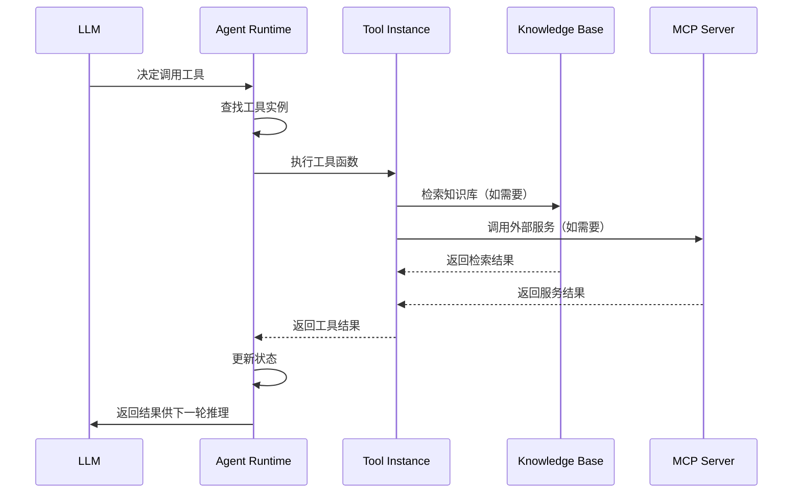

# 工具系统流程链路追踪

> **链路概览**：内置工具注册（装饰器收集）→ 工具服务层（延迟加载元数据）→ Agent 运行时（工具解析与挂载）→ 中间件栈（动态工具筛选）→ LLM 调用（工具执行）→ 结果处理（状态更新）

## 一、完整链路追踪

### 1.1 工具注册阶段

**核心机制**：使用装饰器自动收集工具实例并注册元数据

**代码路径**：
- 注册装饰器：`backend/package/starring/agents/toolkits/registry.py`
- 内置工具定义：`backend/package/starring/agents/toolkits/buildin/tools.py`
- 知识库工具：`backend/package/starring/agents/toolkits/kbs/tools.py`

**关键代码**（`registry.py:39-88`）：

```python
@dataclass
class ToolExtraMetadata:
    """附加元数据（用装饰器注册）"""
    category: str = ""  # 分类: buildin, knowledge, mysql, subagents, debug
    tags: list[str] = field(default_factory=list)
    display_name: str = ""  # 显示名称（给人看的名字）
    icon: str = ""
    config_guide: str = ""  # 配置说明

# 全局注册表: tool_name -> ToolExtraMetadata
_extra_registry: dict[str, ToolExtraMetadata] = {}

# 全局工具实例列表（由 @tool 装饰器自动收集）
_all_tool_instances: list = []

def tool(
    category: str = "",
    tags: list[str] = None,
    display_name: str = "",
    icon: str = "",
    config_guide: str = "",
    name_or_callable: str | Callable | None = None,
    description: str | None = None,
    args_schema: type | None = None,
    return_direct: bool = False,
):
    """基于 langchain.tool 的拓展装饰器，同时注册元数据"""
    from langchain.tools import tool as langchain_tool

    # 先应用 langchain tool 装饰器
    langchain_decorator = langchain_tool(
        name_or_callable=name_or_callable,
        description=description,
        args_schema=args_schema,
        return_direct=return_direct,
    )

    def decorator(func: Callable) -> Callable:
        # 应用 langchain 装饰器
        tool_obj = langchain_decorator(func)

        # 注册附加元数据
        tool_name = tool_obj.name
        _extra_registry[tool_name] = ToolExtraMetadata(
            category=category,
            tags=tags or [],
            display_name=display_name,
            icon=icon,
            config_guide=config_guide,
        )

        # 自动收集工具实例
        tool_obj.handle_tool_error = True
        _all_tool_instances.append(tool_obj)

        return tool_obj

    return decorator
```

**工具分类体系**：
- `buildin`：内置工具（搜索、提问、展示交付物）
- `knowledge`：知识库工具（检索、打开文档、思维导图）
- `debug`：调试工具
- 其他自定义分类

**示例：内置工具定义**（`buildin/tools.py:127-150`）：

```python
@tool(
    category="buildin",
    tags=["文件", "交付物"],
    display_name="展示交付物",
    description=PRESENT_ARTIFACTS_DESCRIPTION,
    args_schema=PresentArtifactsInput,
)
def present_artifacts(
    filepaths: list[str],
    runtime: ToolRuntime,
    tool_call_id: Annotated[str, InjectedToolCallId],
) -> Command:
    """登记当前线程 outputs 目录下的交付物文件，使前端在对话结束后展示给用户。"""
    try:
        normalized_paths = [_normalize_presented_artifact_path(filepath, runtime) for filepath in filepaths]
    except ValueError as exc:
        return Command(update={"messages": [ToolMessage(content=f"Error: {exc}", tool_call_id=tool_call_id)]})

    return Command(
        update={
            "artifacts": normalized_paths,
            "messages": [ToolMessage(content="已将交付物展示给用户", tool_call_id=tool_call_id)],
        }
    )
```

### 1.2 工具服务层

**关键职责**：
- 延迟加载工具元数据（首次调用时触发）
- 提供工具元数据查询接口
- 根据分类获取工具实例

**代码路径**：`backend/package/starring/agents/toolkits/service.py`

**关键代码**（`service.py:35-82`）：

```python
# 工具元数据缓存
_metadata_cache: list[dict] = []

def _ensure_metadata_loaded():
    """延迟加载工具元数据（首次调用时自动触发）"""
    global _metadata_cache

    if _metadata_cache:  # 已加载
        return

    from starring.agents.toolkits.registry import (
        get_all_extra_metadata,
        get_all_tool_instances,
    )

    # 获取所有工具实例
    all_tools = get_all_tool_instances()
    extra_meta = get_all_extra_metadata()

    for tool in all_tools:
        tool_name = tool.name
        runtime_info = _extract_tool_info(tool)

        # 合并附加元数据
        if tool_name in extra_meta:
            extra = extra_meta[tool_name]
            runtime_info["category"] = extra.category
            runtime_info["tags"] = extra.tags
            runtime_info["config_guide"] = extra.config_guide
            # display_name 优先级高于 tool.name
            if extra.display_name:
                runtime_info["name"] = extra.display_name
        else:
            # 未注册，设为默认分类
            runtime_info["category"] = "buildin"
            runtime_info["tags"] = []
            runtime_info["config_guide"] = ""

        _metadata_cache.append(runtime_info)

    logger.info(f"Tool service loaded {len(_metadata_cache)} tools (lazy load)")

def get_tool_metadata(category: str = None) -> list[dict]:
    """获取工具元数据列表（延迟加载）"""
    _ensure_metadata_loaded()

    if category:
        return [t for t in _metadata_cache if t.get("category") == category]
    return _metadata_cache
```

### 1.3 运行时工具解析

**关键职责**：
- 根据 Agent Context 配置解析需要的工具
- 加载内置工具和 MCP 工具
- 合并去重工具列表

**代码路径**：`backend/package/starring/agents/toolkits/service.py:97-133`

**关键代码**：

```python
async def resolve_configured_runtime_tools(context) -> list[Any]:
    """解析运行时配置的工具列表"""
    from starring.agents.mcp.service import get_enabled_mcp_tools

    selected_tools = []
    selected_tool_names: set[str] = set()
    buildin_tools = {tool.name: tool for tool in get_tool_instances_by_category("buildin")}

    # 1. 解析内置工具
    for tool_name in getattr(context, "tools", None) or []:
        if not isinstance(tool_name, str) or tool_name in selected_tool_names:
            continue
        tool = buildin_tools.get(tool_name)
        if tool is None:
            logger.warning(f"Configured buildin tool not found, skip: {tool_name}")
            continue
        selected_tools.append(tool)
        selected_tool_names.add(tool_name)

    # 2. 解析 MCP 工具
    selected_mcp_servers: set[str] = set()
    for server_name in getattr(context, "mcps", None) or []:
        if not isinstance(server_name, str) or server_name in selected_mcp_servers:
            continue
        selected_mcp_servers.add(server_name)
        try:
            mcp_tools = await get_enabled_mcp_tools(server_name)
        except Exception as e:
            logger.warning(f"Failed to load configured MCP tools '{server_name}': {e}")
            continue
        if not mcp_tools:
            logger.warning(f"Configured MCP unavailable, skip: {server_name}")
            continue
        for tool in mcp_tools:
            if tool.name in selected_tool_names:
                continue
            selected_tools.append(tool)
            selected_tool_names.add(tool.name)

    return selected_tools
```

### 1.4 Agent 图编译与工具挂载

**关键职责**：
- 编译 LangGraph 状态图
- 挂载工具列表到 Agent
- 配置中间件栈

**代码路径**：`backend/package/starring/agents/buildin/chatbot/graph.py:116-144`

**关键代码**：

```python
async def get_graph(self, context=None, **kwargs):
    """编译并返回 ChatbotAgent 的 LangGraph 图"""
    context = await prepare_agent_runtime_context(
        context or self.context_schema(),
        context_schema=self.context_schema,
    )

    # 使用 create_agent 创建智能体
    model_spec = resolve_chat_model_spec(context.model)
    system_prompt = build_prompt_with_context(context)

    graph = create_agent(
        model=load_chat_model(fully_specified_name=model_spec),
        tools=await resolve_configured_runtime_tools(context),  # 工具挂载
        system_prompt=system_prompt,
        middleware=await _build_middlewares(context),
        state_schema=ChatBotState,
        checkpointer=await self._get_checkpointer(),
    )

    return graph
```

### 1.5 中间件栈：动态工具筛选

**核心机制**：多层中间件按顺序包装模型调用，动态筛选和注入工具

**代码路径**：`backend/package/starring/agents/middlewares/`

**中间件执行顺序**（`chatbot/graph.py:41-99`）：

```python
# 外层中间件：文件系统（带 token 限流 eviction）+ 附件持久化
middlewares = [
    create_agent_filesystem_middleware(...),  # 1. 文件系统（带 token 限流）
    save_attachments_to_fs,                    # 2. 附件持久化
]
# 知识库中间件：显式关闭才不挂载（None 或 True 均挂载）
if getattr(context, "use_knowledge", None) is not False:
    middlewares.append(KnowledgeBaseMiddleware())  # 3. 知识库工具（条件挂载）
# Skills 工具自动发现
middlewares.append(SkillsMiddleware())        # 4. Skills 自动发现
# 子智能体 task 工具：未配置子智能体时返回 None 跳过
subagent_middleware = await create_subagent_task_middleware(context)
if subagent_middleware:
    middlewares.append(subagent_middleware)    # 5. 子智能体委派（条件挂载）
# 内层中间件
middlewares.extend([
    summary_middleware,                        # 6. 上下文压缩
    TodoListMiddleware(...),                   # 7. TodoList 跟踪
    *([PatchToolCallsMiddleware()] if PatchToolCallsMiddleware is not None else []),  # 8. 工具调用修补（条件挂载）
    ModelRetryMiddleware(max_retries=getattr(context, "model_retry_times", 2)),  # 9. 模型重试
    TokenUsageMiddleware(),                    # 10. Token 计量
])
```

**条件挂载机制**：
- **知识库中间件**：采用"显式关闭才不挂载"策略，`context.use_knowledge` 为 `None` 或 `True` 均挂载，仅 `False` 跳过
- **子智能体中间件**：未配置子智能体时 `create_subagent_task_middleware` 返回 `None`，跳过挂载
- **工具调用修补中间件**：`PatchToolCallsMiddleware` 可能因依赖缺失为 `None`，条件挂载

**知识库中间件**（`middlewares/knowledge_base.py:9-25`）：

```python
class KnowledgeBaseMiddleware(AgentMiddleware):
    """知识库中间件 - 提供通用知识库工具"""

    def __init__(self):
        super().__init__()
        # 预加载通用知识库工具
        self.kb_tools = get_common_kb_tools()
        self.tools = self.kb_tools
        logger.debug(f"Initialized KnowledgeBaseMiddleware with {len(self.kb_tools)} tools")
```

**Skills 中间件**（`middlewares/skills.py:171-250`）：

```python
class SkillsMiddleware(AgentMiddleware):
    """Skills 中间件 - 处理 skills 提示词注入、依赖展开、动态激活"""

    async def awrap_model_call(
        self, request: ModelRequest, handler: Callable[[ModelRequest], ModelResponse]
    ) -> ModelResponse:
        """包装模型调用，处理 skills 提示词注入、动态激活和依赖展开"""
        runtime_context = request.runtime.context

        # 1. Skills 提示词注入
        if self.enable_skills_prompt:
            prompt_skills = getattr(runtime_context, "_prompt_skills", None)
            if isinstance(prompt_skills, list):
                skills_meta = self._collect_prompt_metadata(prompt_skills, runtime_context)
                skills_section = self._build_skills_section(skills_meta)
                system_message = append_to_system_message(getattr(request, "system_message", None), skills_section)
                request = request.override(system_message=system_message)

        # 2. 依赖展开（工具/MCP 动态加载）
        state = request.state if isinstance(request.state, dict) else {}
        activated = state.get("activated_skills", []) or []

        deps_bundle = self._build_dependency_bundle(activated, runtime_context)

        enabled_tools = []

        # 合并依赖的工具
        if deps_bundle["tools"]:
            all_tools = get_all_tool_instances()
            required_tool_names = set(deps_bundle["tools"])
            enabled_tools = [t for t in all_tools if t.name in required_tool_names]

        # 合并依赖的 MCP 工具
        if deps_bundle["mcps"]:
            mcp_tools = await self._get_mcp_tools_from_context(
                runtime_context,
                extra_mcps=deps_bundle["mcps"],
            )
            enabled_tools.extend(mcp_tools)

        # 合并工具：保留原有工具 + 追加依赖的新工具
        if enabled_tools:
            existing_tool_names = {t.name for t in request.tools or []}
            merged_tools = list(request.tools or [])
            for t in enabled_tools:
                if t.name not in existing_tool_names:
                    merged_tools.append(t)
            request = request.override(tools=merged_tools)

        return await handler(request)
```

**动态工具中间件**（`middlewares/dynamic_tool.py:10-69`）：

```python
class DynamicToolMiddleware(AgentMiddleware):
    """动态工具选择中间件 - 支持 MCP 工具的动态加载和注册"""

    def __init__(self, base_tools: list[Any], mcp_servers: list[str] | None = None):
        super().__init__()
        self.tools: list[Any] = base_tools
        self._all_mcp_tools: dict[str, list[Any]] = {}  # 所有已加载的 MCP 工具
        self._mcp_servers = mcp_servers or []

    async def initialize_mcp_tools(self) -> None:
        """异步初始化：预加载所有可能用到的 MCP 工具"""
        for mcp_name in self._mcp_servers:
            if mcp_name not in self._all_mcp_tools:
                logger.info(f"Pre-loading MCP tools from: {mcp_name}")
                mcp_tools = await get_mcp_tools(mcp_name)
                self._all_mcp_tools[mcp_name] = mcp_tools
                # 将 MCP 工具注册到 middleware.tools
                self.tools.extend(mcp_tools)
                logger.info(f"Registered {len(mcp_tools)} tools from {mcp_name}")

    async def awrap_model_call(
        self, request: ModelRequest, handler: Callable[[ModelRequest], ModelResponse]
    ) -> ModelResponse:
        """根据配置动态选择工具（从已注册的工具中筛选）"""
        # 从 runtime context 获取配置
        selected_tools = request.runtime.context.tools
        selected_mcps = request.runtime.context.mcps

        enabled_tools = []

        # 根据配置筛选基础工具
        if selected_tools and isinstance(selected_tools, list) and len(selected_tools) > 0:
            enabled_tools = [tool for tool in self.tools if tool.name in selected_tools]

        # 根据配置筛选 MCP 工具（从已注册的工具中选择）
        if selected_mcps and isinstance(selected_mcps, list) and len(selected_mcps) > 0:
            for mcp in selected_mcps:
                if mcp in self._all_mcp_tools:
                    enabled_tools.extend(self._all_mcp_tools[mcp])

        # 更新 request 中的工具列表
        request = request.override(tools=enabled_tools)
        return await handler(request)
```

### 1.6 MCP 工具系统

**关键职责**：
- 管理 MCP 服务器配置（数据库持久化）
- 加载 MCP 工具并缓存
- 过滤禁用的工具

**代码路径**：`backend/package/starring/agents/mcp/service.py`

**关键代码**（`service.py:197-298`）：

```python
async def get_mcp_tools(
    server_slug: str,
    additional_servers: dict[str, dict[str, Any]] | None = None,
    disabled_tools: list[str] = None,
    cache: bool = True,
    force_refresh: bool = False,
) -> list[Callable[..., Any]]:
    """Get MCP tools for a specific server.

    Architecture:
    1. Fetching: Connects to MCP server to get ALL tools.
    2. Caching: Stores the FULL, UNFILTERED list of tools in `_mcp_tools_cache`.
    3. Filtering: Filters the return value based on `disabled_tools` argument.
    """
    if additional_servers and server_slug in additional_servers:
        server_config = additional_servers[server_slug]
    else:
        server_config = await get_enabled_mcp_server_config(server_slug)

    if server_config is None:
        logger.warning(f"MCP server '{server_slug}' not found in database or disabled")
        return []

    # 配置 hash 直接基于完整配置生成
    config_payload = json.dumps(server_config, sort_keys=True, ensure_ascii=True, separators=(",", ":"))
    config_hash = hashlib.sha256(config_payload.encode("utf-8")).hexdigest()[:16]
    cache_key = f"{server_slug}:{config_hash}"

    all_processed_tools: list[Callable[..., Any]] = []

    async with _mcp_lock:
        if not force_refresh and cache and cache_key in _mcp_tools_cache:
            all_processed_tools = _mcp_tools_cache[cache_key]

    if not all_processed_tools:
        try:
            client = await get_mcp_client({server_slug: client_config})
            if client is None:
                return []

            raw_tools = cast(list[Any], await client.get_tools())

            server_cc = to_camel_case(server_slug)
            for tool in raw_tools:
                original_name = tool.name
                tool_cc = to_camel_case(original_name)
                unique_id = f"mcp__{server_cc}__{tool_cc}"

                if tool.metadata is None:
                    tool.metadata = {}
                tool.metadata["id"] = unique_id
                tool.handle_tool_error = True
                all_processed_tools.append(tool)

            if cache:
                async with _mcp_lock:
                    _mcp_tools_cache[cache_key] = all_processed_tools

        except Exception as e:
            logger.exception(f"Failed to load tools from MCP server '{server_slug}': {e}")
            return []

    # 过滤禁用的工具
    if disabled_tools:
        filtered_tools = [t for t in all_processed_tools if t.name not in disabled_tools]
        return filtered_tools

    return all_processed_tools
```

### 1.7 工具调用执行

**关键职责**：
- LangGraph 执行工具节点
- 处理工具调用结果
- 更新 Agent 状态

**执行流程**：



### 1.8 前端工具管理

**关键职责**：
- 提供工具列表查询接口
- 提供工具选项接口（前端下拉框）

**代码路径**：`backend/server/routers/tool_router.py`

**关键代码**：

```python
@tools.get("")
async def list_tools(
    category: str = None,
    user: User = Depends(get_admin_user),
):
    """获取工具列表"""
    return {"success": True, "data": get_tool_metadata(category)}

@tools.get("/options")
async def get_tool_options(
    user: User = Depends(get_admin_user),
):
    """获取工具选项（前端下拉框用）"""
    all_tools = get_tool_metadata()
    return {"success": True, "data": [{"label": t["name"], "value": t["slug"]} for t in all_tools]}
```

## 二、设计亮点

### 2.1 装饰器驱动的工具注册

**亮点**：使用 `@tool` 装饰器自动收集工具实例，无需手动注册

**优势**：
- 开发体验好：只需在函数上添加装饰器
- 自动收集：工具实例自动加入全局列表
- 元数据统一：分类、标签、显示名称等元数据与工具定义在一起
- 类型安全：支持 Pydantic 模型定义参数结构

**代码示例**：

```python
@tool(
    category="knowledge",
    tags=["知识库"],
    display_name="知识库检索",
    args_schema=SearchInputSchema,
)
async def query_kb(kb_id: str, query_text: str, runtime: ToolRuntime = None) -> Any:
    """在指定知识库中检索内容"""
    # 工具实现
    pass
```

### 2.2 延迟加载元数据

**亮点**：工具元数据延迟加载，减少启动开销

**优势**：
- 快速启动：服务启动时不立即加载所有工具
- 按需加载：首次查询工具列表时才触发加载
- 性能优化：避免启动时阻塞

**实现**（`service.py:35-72`）：

```python
def _ensure_metadata_loaded():
    """延迟加载工具元数据（首次调用时自动触发）"""
    global _metadata_cache

    if _metadata_cache:  # 已加载
        return

    # 首次调用时加载
    all_tools = get_all_tool_instances()
    extra_meta = get_all_extra_metadata()

    for tool in all_tools:
        # 构建元数据
        runtime_info = _extract_tool_info(tool)
        # 合并附加元数据
        if tool_name in extra_meta:
            extra = extra_meta[tool_name]
            runtime_info["category"] = extra.category
            # ...

        _metadata_cache.append(runtime_info)
```

### 2.3 分层中间件架构

**亮点**：10 层中间件按职责分离，动态筛选和注入工具

**优势**：
- 职责清晰：每层中间件只负责一类功能
- 动态注入：Skills 中间件根据激活状态动态注入工具
- 可扩展：新增功能只需添加新中间件
- 可配置：中间件栈可根据 Context 动态构建

**中间件职责表**：

| 层级 | 中间件 | 职责 | 挂载条件 |
|------|--------|------|----------|
| 1 | 文件系统 | Token 限流、文件操作 | 始终挂载 |
| 2 | 附件持久化 | 保存上传文件 | 始终挂载 |
| 3 | 知识库工具 | 提供 KB 检索工具 | `use_knowledge != False` |
| 4 | Skills | 动态激活、依赖展开 | 始终挂载 |
| 5 | 子智能体 | 委派子任务 | 配置了子智能体时挂载 |
| 6 | 上下文压缩 | Token 超限压缩 | 始终挂载 |
| 7 | TodoList | 任务跟踪 | 始终挂载 |
| 8 | 工具调用修补 | 修复异常调用 | 依赖可用时挂载 |
| 9 | 模型重试 | 失败重试 | 始终挂载 |
| 10 | Token 计量 | 统计用量 | 始终挂载 |

### 2.4 MCP 工具缓存策略

**亮点**：基于配置哈希的智能缓存，配置变化自动失效

**优势**：
- 性能优化：避免重复加载 MCP 工具
- 自动失效：配置变化时缓存自动失效
- 细粒度控制：支持单服务器缓存清理

**实现**（`mcp/service.py:229-271`）：

```python
# 配置 hash 直接基于完整配置生成
config_payload = json.dumps(server_config, sort_keys=True, ensure_ascii=True, separators=(",", ":"))
config_hash = hashlib.sha256(config_payload.encode("utf-8")).hexdigest()[:16]
cache_key = f"{server_slug}:{config_hash}"

# 配置变化时 cache_key 变化，自动触发重建
if not force_refresh and cache and cache_key in _mcp_tools_cache:
    all_processed_tools = _mcp_tools_cache[cache_key]
```

### 2.5 工具依赖声明式管理

**亮点**：Skills 系统支持声明式依赖，自动展开依赖闭包

**优势**：
- 声明式：Skill 声明依赖的工具/MCP/Skill
- 自动展开：系统自动解析依赖闭包
- 循环检测：避免循环依赖
- 动态激活：运行时动态加载依赖

**实现**（`middlewares/skills.py:96-130`）：

```python
def expand_skill_closure(
    slugs: list[str] | None,
    dependency_map: dict[str, SkillDependencyNode],
) -> list[str]:
    """展开 skills 依赖闭包，返回包含所有依赖的列表"""
    ordered_roots = normalize_string_list(slugs)
    if not ordered_roots:
        return []

    result: list[str] = []
    seen: set[str] = set()

    def dfs(slug: str, stack: set[str]) -> None:
        if slug in stack:
            logger.warning(f"Cycle detected in skill dependencies, skip: {' -> '.join([*stack, slug])}")
            return
        if slug in seen:
            return

        node = dependency_map.get(slug)
        if not node:
            logger.warning(f"Skill dependency target not found in DB, skip: {slug}")
            return

        seen.add(slug)
        result.append(slug)
        next_stack = set(stack)
        next_stack.add(slug)
        for dep in node.get("skills", []):
            dfs(dep, next_stack)

    for root in ordered_roots:
        dfs(root, set())
    return result
```

## 三、主要功能

### 3.1 内置工具体系

| 工具名称 | 分类 | 功能 |
|----------|------|------|
| `tavily_search` | buildin | 网页搜索 |
| `present_artifacts` | buildin | 展示交付物 |
| `ask_user_question` | buildin | 向用户提问 |
| `install_skill` | buildin | 安装 Skill |

### 3.2 知识库工具体系

| 工具名称 | 功能 |
|----------|------|
| `list_kbs` | 列出用户可访问的知识库 |
| `get_mindmap` | 获取知识库思维导图 |
| `query_kb` | 在知识库中检索 |
| `open_kb_document` | 打开知识库文档 |
| `find_kb_document` | 在文档内定位关键词 |

### 3.3 MCP 工具体系

**内置 MCP 服务器**：
- `mcp-server-chart`：图表生成工具

**MCP 工具命名规范**：
```
mcp__{serverSlugCamelCase}__{toolNameCamelCase}
```

### 3.4 Skills 工具体系

**功能**：
- 声明式依赖管理
- 动态激活
- 提示词自动注入

## 四、可改进之处

### 4.1 工具元数据管理分散

**问题**：工具元数据分散在装饰器、注册表、服务层三个层级

**改进建议**：
- 统一元数据管理入口
- 减少数据冗余
- 增强元数据查询能力

**代码位置**：
- `backend/package/starring/agents/toolkits/registry.py`
- `backend/package/starring/agents/toolkits/service.py`

### 4.2 MCP 工具加载性能

**问题**：MCP 工具首次加载时需要连接外部服务，可能耗时较长

**改进建议**：
- 实现后台预加载机制
- 增加超时控制
- 提供加载状态反馈

**代码位置**：`backend/package/starring/agents/mcp/service.py:197-298`

### 4.3 工具调用可观测性不足

**问题**：缺少工具调用的全链路追踪，难以监控性能和排查问题

**改进建议**：
- 增加工具调用链路追踪
- 记录工具调用耗时
- 集成到 Langfuse 追踪系统

**代码位置**：`backend/package/starring/agents/toolkits/`

### 4.4 工具版本管理缺失

**问题**：缺少工具版本管理机制，无法处理工具升级导致的兼容性问题

**改进建议**：
- 引入工具版本号
- 支持多版本共存
- 提供版本迁移指南

**代码位置**：`backend/package/starring/agents/toolkits/registry.py`

### 4.5 工具权限控制粒度不足

**问题**：当前工具权限控制仅在 Agent 级别，缺少细粒度的工具级权限控制

**改进建议**：
- 实现工具级权限控制
- 支持基于角色的工具访问
- 增加工具调用审计日志

**代码位置**：`backend/server/routers/tool_router.py`

## 五、代码路径索引

| 模块 | 文件路径 | 职责 |
|------|----------|------|
| 工具注册装饰器 | `backend/package/starring/agents/toolkits/registry.py` | 工具装饰器、元数据注册、实例收集 |
| 工具服务层 | `backend/package/starring/agents/toolkits/service.py` | 元数据延迟加载、工具解析、分类查询 |
| 内置工具 | `backend/package/starring/agents/toolkits/buildin/tools.py` | 网页搜索、提问、交付物展示 |
| 知识库工具 | `backend/package/starring/agents/toolkits/kbs/tools.py` | KB 检索、文档打开、思维导图 |
| MCP 服务 | `backend/package/starring/agents/mcp/service.py` | MCP 服务器配置、工具加载、缓存管理 |
| 知识库中间件 | `backend/package/starring/agents/middlewares/knowledge_base.py` | KB 工具挂载 |
| Skills 中间件 | `backend/package/starring/agents/middlewares/skills.py` | Skills 依赖展开、动态激活 |
| 动态工具中间件 | `backend/package/starring/agents/middlewares/dynamic_tool.py` | MCP 工具动态筛选 |
| Agent 图编译 | `backend/package/starring/agents/buildin/chatbot/graph.py` | 工具挂载、中间件构建 |
| 工具路由 | `backend/server/routers/tool_router.py` | 工具列表查询、选项查询 |