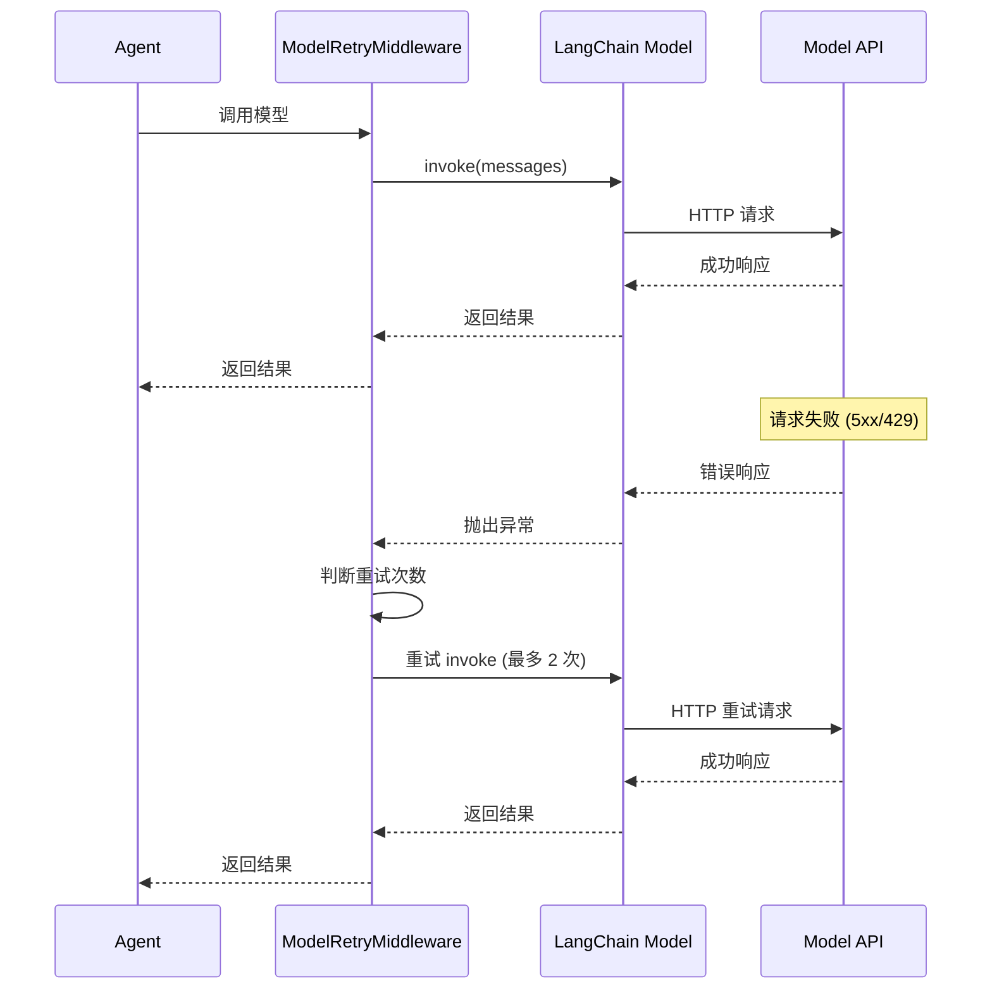

# 模型配置与调用流程链路追踪

> **链路概览**: 管理员配置 Provider → 数据持久化到 PostgreSQL → 加载到 Redis 缓存 → Agent 运行时从缓存读取 → 调用具体模型 API → 失败时自动重试

## 一、完整链路追踪

### 1.1 Provider 配置管理

**用户操作**: 管理员在系统设置中配置模型供应商

**代码路径**:
- 路由层: `backend/server/routers/model_provider_router.py`
- 服务层: `backend/package/starring/models/providers/service.py`
- 数据层: `backend/package/starring/models/providers/repository.py`

**关键代码** (`model_provider_router.py:77-98`):

```python
@model_providers.post("")
async def create_provider(
    payload: ModelProviderPayload,
    current_user: User = Depends(get_admin_user),
    db: AsyncSession = Depends(get_db),
):
    """创建独立模型供应商配置。"""
    try:
        provider = await create_provider_config(
            db,
            payload.model_dump(exclude_none=True),
            current_user.username,
        )
        await db.commit()
        await _refresh_model_cache()  # 刷新 Redis 缓存
        return {"success": True, "data": provider.to_dict()}
    except ValueError as e:
        raise HTTPException(status_code=400, detail=str(e))
```

**Provider 配置结构** (`ModelProviderPayload`):

```python
class ModelProviderPayload(BaseModel):
    provider_id: str | None = Field(None, description="供应商稳定标识")
    display_name: str | None = Field(None, description="展示名称")
    provider_type: str | None = Field(None, description="供应商适配类型,默认 openai")
    base_url: str | None = Field(None, description="API 基础 URL")
    api_key_env: str | None = Field(None, description="API Key 环境变量名")
    api_key: str | None = Field(None, description="直接配置的 API Key")
    capabilities: list[str] | None = Field(None, description="支持能力")
    enabled_models: list[dict[str, Any]] | None = Field(None, description="已启用模型配置")
```

### 1.2 配置验证与持久化

**代码路径**: `backend/package/starring/models/providers/service.py`

**关键职责**:
- 校验 provider_id 格式 (字母、数字、下划线、中划线)
- 规范化模型配置 (type、source、display_name)
- 校验 enabled_models 与 capabilities 一致性
- 持久化到 PostgreSQL

**关键代码** (`service.py:112-163`):

```python
def _normalize_payload(data: dict[str, Any], *, partial: bool = False) -> dict[str, Any]:
    payload = dict(data)

    # 1. 校验 provider_id 格式
    if not partial or "provider_id" in payload:
        provider_id = str(payload.get("provider_id") or "").strip()
        _validate_provider_id(provider_id)
        payload["provider_id"] = provider_id

    # 2. 校验 base_url 非空
    if not partial or "base_url" in payload:
        base_url = str(payload.get("base_url") or "").strip()
        if not base_url:
            raise ValueError("base_url 不能为空")
        payload["base_url"] = base_url

    # 3. 规范化字段 (capabilities、enabled_models、headers_json、extra_json)
    for field, default in _FIELD_DEFAULTS.items():
        if field in payload:
            normalizer = _FIELD_NORMALIZERS.get(field)
            payload[field] = normalizer(payload[field]) if normalizer else payload[field]
        elif not partial:
            payload[field] = default

    # 4. 校验 enabled_models 与 capabilities 一致性
    if "capabilities" in payload and "enabled_models" in payload:
        capabilities_set = set(payload.get("capabilities") or [])
        if capabilities_set:
            _validate_models_capabilities(payload.get("enabled_models"), capabilities_set)

    return payload
```

**模型配置规范化** (`service.py:40-70`):

```python
def _normalize_model_item(model: dict[str, Any]) -> dict[str, Any]:
    """规范化模型配置对象,校验运行所需字段。"""
    model_id = str(model.get("id") or "").strip()
    if not model_id:
        raise ValueError("模型 id 不能为空")

    model_type = str(model.get("type") or "unknown").strip()
    if model_type not in VALID_MODEL_TYPES:  # chat、embedding、rerank
        raise ValueError(f"启用模型 {model_id} 的 type 必须是 chat、embedding 或 rerank")

    source = str(model.get("source") or "remote").strip()
    if source not in VALID_MODEL_SOURCES:  # manual、remote
        raise ValueError(f"模型 {model_id} 的 source 必须是 manual 或 remote")

    normalized = dict(model)
    normalized["id"] = model_id
    normalized["type"] = model_type
    normalized["source"] = source
    normalized["display_name"] = str(model.get("display_name") or model.get("name") or model_id)

    # Embedding 模型专属字段
    if model_type == "embedding":
        dimension = model.get("dimension")
        if dimension not in (None, ""):
            normalized["dimension"] = int(dimension)
        batch_size = model.get("batch_size")
        if batch_size not in (None, ""):
            normalized["batch_size"] = int(batch_size)

    return normalized
```

### 1.3 Redis 缓存加载

**代码路径**: `backend/package/starring/models/providers/cache.py`

**关键职责**:
- 将 Provider 配置序列化到 Redis
- 提供 ModelInfo 只读对象供运行时使用
- 支持跨进程访问 (API、Worker、AsyncIO)
- 本地 TTL 缓存减少 Redis 访问

**关键代码** (`cache.py:82-127`):

```python
class ModelCache:
    """基于 Redis 的模型缓存,所有写入均走 Redis,保证跨进程一致。"""

    def __init__(self) -> None:
        self._redis = None
        self._local_cache: dict[str, ModelInfo] | None = None
        self._local_cache_at: float = 0.0

    def _load_cache(self) -> dict[str, ModelInfo]:
        now = time.monotonic()
        # 5 秒内使用本地缓存
        if self._local_cache is not None and (now - self._local_cache_at) < _CACHE_TTL_SECONDS:
            return self._local_cache

        r = self._get_redis()
        if r is None:
            return {}

        try:
            raw = r.get(REDIS_CACHE_KEY)
            if not raw:
                self._local_cache = {}
                self._local_cache_at = now
                return {}

            items = json.loads(raw)
            cache = {spec: ModelInfo.from_dict(data) for spec, data in items.items()}
            self._local_cache = cache
            self._local_cache_at = now
            return cache
        except Exception as e:
            logger.warning(f"Failed to load model cache from Redis: {e}")
            self._reset_redis()
            return {}
```

**缓存重建流程** (`cache.py:151-183`):

```python
def rebuild(self, providers: list[Any]) -> None:
    """从数据库重新构建缓存,写入 Redis。"""
    from starring.models.providers.service import resolve_api_key

    new_cache: dict[str, ModelInfo] = {}

    for provider in providers:
        if not provider.is_enabled:
            continue

        api_key = resolve_api_key(provider)

        for model in provider.enabled_models or []:
            model_type = model.get("type", "chat")
            base_url = model.get("base_url_override") or self._get_base_url_for_type(provider, model_type)

            info = ModelInfo(
                provider_id=provider.provider_id,
                model_id=model["id"],
                model_type=model_type,
                display_name=model.get("display_name", model["id"]),
                api_key=api_key or "",
                base_url=base_url,
                provider_type=provider.provider_type,
                headers=dict(provider.headers_json or {}),
                extra=dict(provider.extra_json or {}),
                dimension=model.get("dimension"),
                batch_size=model.get("batch_size", 40),
            )
            new_cache[info.spec] = info

    self._save_cache(new_cache)
    self._invalidate_local()
    logger.info(f"Model cache rebuilt: {len(new_cache)} models → Redis")
```

**ModelInfo 数据结构** (`cache.py:24-79`):

```python
@dataclass(frozen=True)
class ModelInfo:
    """不可变的模型信息,供运行时使用。"""

    provider_id: str
    model_id: str
    model_type: str  # chat / embedding / rerank
    display_name: str

    # 运行时配置
    api_key: str
    base_url: str
    provider_type: str  # openai / anthropic / gemini / openrouter

    # 可选配置
    headers: dict[str, str] = field(default_factory=dict)
    extra: dict[str, Any] = field(default_factory=dict)

    # Embedding 专属
    dimension: int | None = None
    batch_size: int = 40

    @property
    def spec(self) -> str:
        return f"{self.provider_id}:{self.model_id}"
```

### 1.4 Chat 模型调用

**代码路径**: `backend/package/starring/models/chat.py` + `backend/package/starring/agents/models.py`

**关键职责**:
- 从缓存读取模型配置
- 根据 provider_type 创建 LangChain 实例
- 提供统一的调用接口

**关键代码** (`agents/models.py:53-97`):

```python
def load_chat_model(fully_specified_name: str | None, **kwargs) -> BaseChatModel:
    fully_specified_name = resolve_chat_model_spec(fully_specified_name)

    info = model_cache.get_model_info(fully_specified_name)
    if not info:
        available_specs = model_cache.get_all_specs("chat")
        available_ids = [item.spec for item in available_specs[:10]]
        raise ValueError(
            f"Unknown model spec: '{fully_specified_name}'. "
            f"Available chat models ({len(available_specs)}): {available_ids}"
        )

    if info.model_type != "chat":
        raise ValueError(f"Model {fully_specified_name} is not a chat model (type={info.model_type})")

    api_key = info.api_key
    base_url = get_docker_safe_url(info.base_url)

    logger.debug(f"Loading model {fully_specified_name} with provider_type={info.provider_type}")

    # 根据 provider_type 选择 LangChain 适配器
    if info.provider_type == "anthropic":
        from langchain_anthropic import ChatAnthropic

        return ChatAnthropic(
            model=info.model_id,
            api_key=SecretStr(api_key),
            base_url=base_url,
            **kwargs,
        )

    if info.provider_type == "gemini":
        from langchain_google_genai import ChatGoogleGenerativeAI

        return ChatGoogleGenerativeAI(
            model=info.model_id,
            google_api_key=SecretStr(api_key),
            **kwargs,
        )

    # 默认使用 OpenAI 兼容适配器
    return _ToolCallChunkFixChatOpenAI(
        model=info.model_id,
        api_key=SecretStr(api_key),
        base_url=base_url,
        stream_usage=True,
        **kwargs,
    )
```

### 1.5 Embedding 模型调用与重试

**代码路径**: `backend/package/starring/models/embed.py`

**关键职责**:
- 批量编码文本向量
- 支持速率限制重试 (429)
- 支持瞬时故障重试 (500/502/503/504)
- 自动提取 Retry-After 头部

**重试策略** (`embed.py:13-16`):

```python
EMBEDDING_RATE_LIMIT_MAX_RETRIES = 10      # 速率限制最多重试 10 次
EMBEDDING_TRANSIENT_MAX_RETRIES = 2        # 瞬时故障最多重试 2 次
EMBEDDING_RETRY_MAX_DELAY_SECONDS = 10.0   # 最大重试延迟 10 秒
EMBEDDING_RETRYABLE_STATUS_CODES = {429, 500, 502, 503, 504}  # 可重试状态码
```

**重试逻辑** (`embed.py:132-170`):

```python
def _prepare_retry(
    self,
    message: list[str] | str,
    *,
    retry_index: int,
    response=None,
    error: Exception | None = None,
) -> tuple[int, float] | None:
    status_code = getattr(response, "status_code", None)
    response_text = str(getattr(response, "text", "") or "")
    messages = [message] if isinstance(message, str) else message

    # 400 错误不重试,记录详细日志
    if status_code == 400 and response is not None:
        logger.warning(
            "Embedding request returned 400 Bad Request: "
            f"model={self.model}, base_url={self.base_url}, input_count={len(messages)}, "
            f"input_lengths={[len(item) for item in messages]}, body={response_text[:2000]}"
        )

    # 根据状态码决定重试次数
    if status_code == 429:
        max_retries = EMBEDDING_RATE_LIMIT_MAX_RETRIES
    elif status_code in EMBEDDING_RETRYABLE_STATUS_CODES or status_code is None:
        max_retries = EMBEDDING_TRANSIENT_MAX_RETRIES
    else:
        max_retries = 0

    # 超过重试次数返回 None
    if retry_index >= max_retries:
        return None

    # 计算下次重试延迟
    next_retry_index = retry_index + 1
    retry_after = response.headers.get("Retry-After") if response is not None else None
    delay = self._retry_delay_seconds(next_retry_index, retry_after)

    reason = f"status={status_code}" if status_code is not None else f"error={type(error).__name__}"
    logger.warning(
        "Retrying embedding request: "
        f"{reason}, model={self.model}, base_url={self.base_url}, "
        f"retry={next_retry_index}/{max_retries}, delay={delay:.1f}s, "
        f"input_count={len(messages)}, body={response_text[:1000]}"
    )
    return next_retry_index, delay
```

**同步编码重试** (`embed.py:178-199`):

```python
def encode(self, message: list[str] | str) -> list[list[float]]:
    payload = self.build_payload(message)
    retry_index = 0
    while True:
        try:
            response = requests.post(self.base_url, json=payload, headers=self.headers, timeout=60)
            response.raise_for_status()
            return self._extract_embeddings(response.json())
        except requests.RequestException as e:
            retry = self._prepare_retry(
                message,
                retry_index=retry_index,
                response=getattr(e, "response", None),
                error=e,
            )
            if retry:
                retry_index, delay = retry
                time.sleep(delay)
                continue

            logger.error(f"Embedding request failed: {e}, {payload}")
            raise ValueError(f"Embedding request failed: {e}")
```

### 1.6 Chat 模型重试中间件

**代码路径**: `backend/package/starring/agents/buildin/chatbot/graph.py`

**关键职责**:
- 通过 LangChain 的 `ModelRetryMiddleware` 实现重试
- 默认重试 2 次
- 支持配置重试次数

**关键代码** (`graph.py:95`):

```python
from langchain.agents.middleware import ModelRetryMiddleware

middlewares = [
    # ... 其他中间件
    ModelRetryMiddleware(max_retries=getattr(context, "model_retry_times", 2)),
]
```

**重试中间件流程**:



### 1.7 内置 Provider 模板

**代码路径**: `backend/package/starring/models/providers/builtin.py`

**关键职责**:
- 定义系统内置的 Provider 配置模板
- 启动时自动补全缺失的内置 Provider
- 不覆盖管理员已编辑的配置

**内置 Provider 列表**:
- OpenAI
- DeepSeek
- Alibaba DashScope (阿里云)
- ZhipuAI (智谱)
- Xiaomi MiMo (小米)
- Moonshot AI (月之暗面)
- MiniMax
- OpenRouter
- SiliconFlow (硅基流动)

**关键代码** (`builtin.py:172-218`):

```python
{
    "provider_id": "siliconflow-cn",
    "display_name": "SiliconFlow",
    "base_url": "https://api.siliconflow.cn/v1",
    "embedding_base_url": "https://api.siliconflow.cn/v1/embeddings",
    "rerank_base_url": "https://api.siliconflow.cn/v1/rerank",
    "api_key_env": "SILICONFLOW_API_KEY",
    "capabilities": ["chat", "embedding", "rerank"],
    "models_endpoint": "https://api.siliconflow.cn/v1/models?sub_type=chat",
    "embedding_models_endpoint": "https://api.siliconflow.cn/v1/models?sub_type=embedding",
    "rerank_models_endpoint": "https://api.siliconflow.cn/v1/models?sub_type=reranker",
    "enabled_models": [
        {"id": "deepseek-ai/DeepSeek-V4-Flash", "type": "chat", "display_name": "deepseek-ai/DeepSeek-V4-Flash"},
        {"id": "Pro/MiniMaxAI/MiniMax-M2.5", "type": "chat", "display_name": "Pro/MiniMaxAI/MiniMax-M2.5"},
        {"id": "Pro/BAAI/bge-m3", "type": "embedding", "display_name": "Pro/BAAI/bge-m3", "dimension": 1024},
        {"id": "Pro/BAAI/bge-reranker-v2-m3", "type": "rerank", "display_name": "Pro/BAAI/bge-reranker-v2-m3"},
    ],
},
```

### 1.8 远程模型列表拉取

**代码路径**: `backend/package/starring/models/providers/service.py`

**关键职责**:
- 实时从 Provider API 拉取可用模型列表
- 不落库,仅用于前端展示
- 支持 Chat、Embedding、Rerank 三类模型

**关键代码** (`service.py:333-369`):

```python
async def fetch_remote_models(provider: ModelProvider) -> list[dict[str, Any]]:
    """按 provider 配置实时拉取远端模型列表,不落库。"""
    headers = dict(provider.headers_json or {})
    api_key = resolve_api_key(provider)
    if api_key:
        headers.setdefault("Authorization", f"Bearer {api_key}")

    capabilities = set(provider.capabilities or [])
    endpoint_specs = [
        (provider.models_endpoint, "chat"),
    ]
    if "embedding" in capabilities:
        endpoint_specs.append((provider.embedding_models_endpoint, "embedding"))
    if "rerank" in capabilities and provider.rerank_models_endpoint:
        endpoint_specs.append((provider.rerank_models_endpoint, "rerank"))

    seen_ids: set[tuple[str, str]] = set()
    models: list[dict[str, Any]] = []
    async with httpx.AsyncClient(timeout=40.0) as client:
        results = await asyncio.gather(
            *[
                _fetch_models_from_endpoint(client, provider, headers, endpoint, model_type)
                for endpoint, model_type in endpoint_specs
            ]
        )
        for fetched_models in results:
            for model in fetched_models:
                model_key = (model["id"], model["type"])
                if model_key in seen_ids:
                    continue
                seen_ids.add(model_key)
                models.append(model)
    return models
```

## 二、设计亮点

### 2.1 三层缓存架构

**亮点**: 将模型配置拆分为 **数据库 → Redis → 本地缓存**,平衡一致性与性能:

| 层级 | 存储位置 | 访问延迟 | 数据一致性 | 适用场景 |
|------|----------|----------|------------|----------|
| 数据库 | PostgreSQL | ~10ms | 强一致 | 配置写入、持久化 |
| Redis 缓存 | Redis | ~1ms | 最终一致 | 跨进程读取 |
| 本地缓存 | 进程内存 | ~0.1ms | 5 秒 TTL | 高频读取 |

**优势**:
- 本地缓存减少 Redis 访问 (5 秒内)
- Redis 保证跨进程一致性 (API、Worker、AsyncIO)
- 数据库提供持久化保障

### 2.2 Spec 规范化命名

**亮点**: 使用 `provider_id:model_id` 作为模型唯一标识:

```python
spec = f"{self.provider_id}:{self.model_id}"
# 示例: siliconflow-cn:deepseek-ai/DeepSeek-V4-Flash
```

**优势**:
- 避免 provider 之间模型 ID 冲突
- 支持 model_id 包含斜杠等特殊字符
- 便于前端模型选择器分组展示

### 2.3 双 API Key 配置方式

**亮点**: 支持环境变量与直接配置两种方式:

```python
def resolve_api_key(provider: ModelProvider) -> str | None:
    """解析 provider 的 API Key,优先直接配置,其次从环境变量读取。"""
    if provider.api_key:
        return provider.api_key  # 直接配置优先
    if provider.api_key_env:
        return os.getenv(provider.api_key_env)  # 环境变量其次
    return None
```

**优势**:
- 生产环境使用环境变量 (安全)
- 开发测试直接配置 (便捷)
- 支持不同环境不同配置

### 2.4 Embedding 智能重试策略

**亮点**: 根据错误类型采用不同重试策略:

| 错误类型 | 状态码 | 最大重试次数 | 重试延迟 |
|---------|--------|--------------|----------|
| 速率限制 | 429 | 10 次 | Retry-After 或指数退避 |
| 服务端故障 | 500/502/503/504 | 2 次 | 指数退避 (1s/2s) |
| 客户端错误 | 400/401/403 | 不重试 | - |

**优势**:
- 速率限制多重试 (避免短暂限流)
- 服务端故障少重试 (快速失败)
- 客户端错误不重试 (记录详细日志)

### 2.5 多类型模型统一抽象

**亮点**: 对 Chat、Embedding、Rerank 三类模型提供统一接口:

```python
# Chat 模型
model = select_model(model_spec="siliconflow-cn:deepseek-ai/DeepSeek-V4-Flash")
response = await model.call(messages, stream=False)

# Embedding 模型
embedding_model = select_embedding_model("siliconflow-cn:Pro/BAAI/bge-m3")
embeddings = await embedding_model.aencode(texts)

# Rerank 模型
reranker = get_reranker("siliconflow-cn:Pro/BAAI/bge-reranker-v2-m3")
scores = await reranker.acompute_score([query, documents])
```

**优势**:
- 统一的 spec 格式
- 统一的缓存查询
- 统一的配置管理

### 2.6 Provider 能力声明

**亮点**: 通过 `capabilities` 声明 Provider 支持的能力:

```python
"capabilities": ["chat", "embedding", "rerank"]
```

**优势**:
- 前端按能力展示 Provider
- 防止配置不支持的模型类型
- 支持多模型类型 Provider (如 SiliconFlow)

## 三、主要功能

### 3.1 Provider 配置管理

- 创建、更新、删除 Provider 配置
- 校验配置完整性 (provider_id、base_url、enabled_models)
- 检查凭证配置状态 (API Key 是否有效)

### 3.2 模型列表管理

- 实时拉取远端模型列表 (不落库)
- 手动配置模型列表 (manual source)
- 按 Provider 分组展示模型

### 3.3 模型调用

- Chat 模型调用 (支持流式)
- Embedding 模型批量编码 (支持重试)
- Rerank 模型重排序

### 3.4 连接测试

- 测试单个模型连接状态
- 自动识别模型类型 (Chat/Embedding/Rerank)
- 返回详细错误信息

### 3.5 缓存管理

- 强制刷新模型缓存
- 启动时自动加载内置 Provider
- 配置变更时自动更新缓存

## 四、可改进之处

### 4.1 缺少 Provider 健康检查

**问题**: 当前仅在创建/更新时检查凭证状态,没有定期健康检查机制。

**改进建议**:
- 添加后台定时任务,定期检查 Provider 连接状态
- 在前端展示 Provider 健康状态 (正常/异常/未知)
- 异常时自动告警,避免运行时才发现问题

**代码位置**: `backend/package/starring/models/providers/service.py`

### 4.2 Embedding 重试配置硬编码

**问题**: 重试策略硬编码在代码中,无法根据 Provider 动态调整:

```python
EMBEDDING_RATE_LIMIT_MAX_RETRIES = 10  # 硬编码
EMBEDDING_TRANSIENT_MAX_RETRIES = 2    # 硬编码
```

**改进建议**:
- 在 Provider 配置中增加重试策略字段:
  ```python
  "retry_policy": {
      "rate_limit_max_retries": 10,
      "transient_max_retries": 2,
      "max_delay_seconds": 10.0
  }
  ```
- 不同 Provider 可配置不同策略

**代码位置**: `backend/package/starring/models/embed.py`

### 4.3 缺少模型调用监控

**问题**: 当前仅记录日志,缺少结构化的监控指标 (延迟、成功率、Token 消耗)。

**改进建议**:
- 集成 Prometheus 指标:
  - 模型调用延迟分布
  - 模型调用成功率
  - Token 消耗统计
- 集成 Langfuse 追踪 (已在部分模块集成)
- 提供监控仪表盘

**代码位置**: `backend/package/starring/models/chat.py`

### 4.4 Provider 配置版本管理缺失

**问题**: Provider 配置更新后直接覆盖,无法回滚到历史版本。

**改进建议**:
- 增加 `provider_configs_history` 表,记录每次变更
- 支持查看历史配置
- 支持一键回滚到指定版本

**代码位置**: `backend/package/starring/models/providers/repository.py`

### 4.5 本地缓存 TTL 硬编码

**问题**: 本地缓存 TTL 固定为 5 秒,无法根据负载调整:

```python
_CACHE_TTL_SECONDS = 5  # 硬编码
```

**改进建议**:
- 支持环境变量配置 TTL:
  ```python
  _CACHE_TTL_SECONDS = int(os.getenv("MODEL_CACHE_TTL_SECONDS", "5"))
  ```
- 高负载场景可延长 TTL (10-30 秒)
- 低负载场景可缩短 TTL (1-2 秒)

**代码位置**: `backend/package/starring/models/providers/cache.py`

## 五、代码路径索引

| 模块 | 文件路径 | 职责 |
|------|----------|------|
| 路由层 | `backend/server/routers/model_provider_router.py` | Provider CRUD、模型列表、缓存刷新 |
| 服务层 | `backend/package/starring/models/providers/service.py` | 配置验证、规范化、远程模型拉取 |
| 数据层 | `backend/package/starring/models/providers/repository.py` | 数据库 CRUD 操作 |
| 缓存层 | `backend/package/starring/models/providers/cache.py` | Redis 缓存管理、ModelInfo 对象 |
| 内置配置 | `backend/package/starring/models/providers/builtin.py` | 内置 Provider 模板定义 |
| Chat 模型 | `backend/package/starring/models/chat.py` | Chat 模型选择与调用封装 |
| Chat 模型加载 | `backend/package/starring/agents/models.py` | LangChain 模型实例化、provider_type 适配 |
| Embedding 模型 | `backend/package/starring/models/embed.py` | Embedding 模型批量编码、重试机制 |
| Rerank 模型 | `backend/package/starring/models/rerank.py` | Rerank 模型重排序 |
| 测试路由 | `backend/test/unit/server/test_model_provider_router.py` | Provider 路由单元测试 |
| 测试服务 | `backend/test/unit/services/test_model_provider_service.py` | Provider 服务单元测试 |
| 测试缓存 | `backend/test/unit/services/test_model_cache.py` | 缓存单元测试 |
| 集成测试 | `backend/test/integration/services/test_model_provider_runtime_connectivity.py` | Provider 连接性集成测试 |