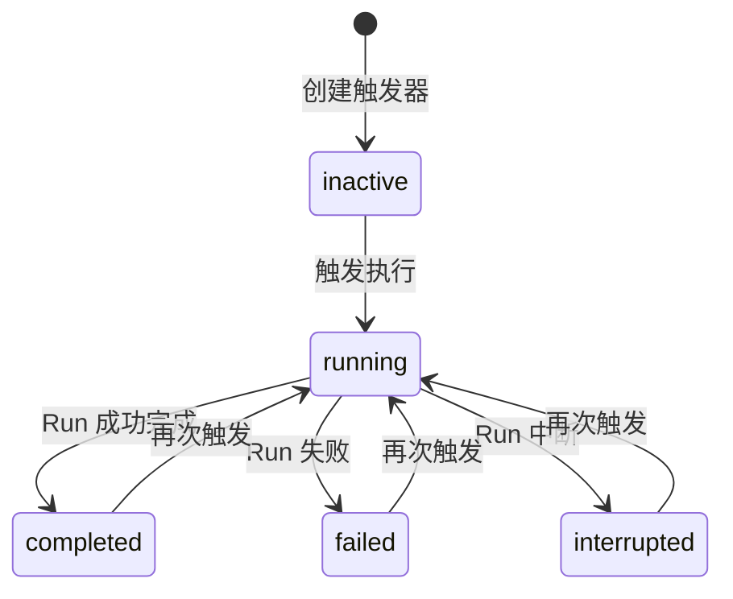
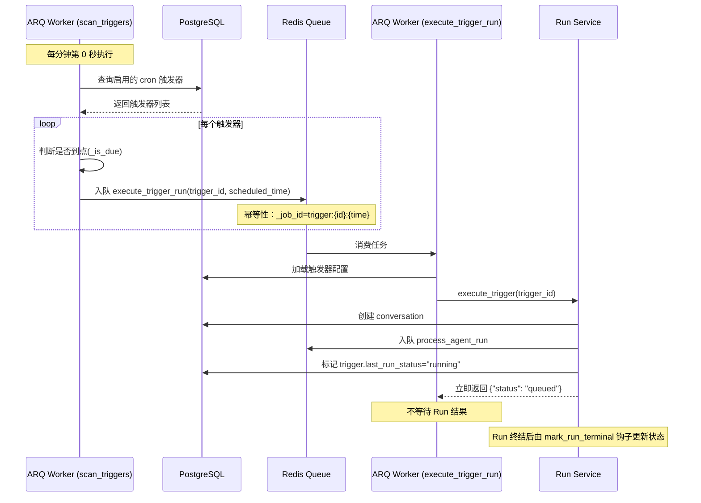
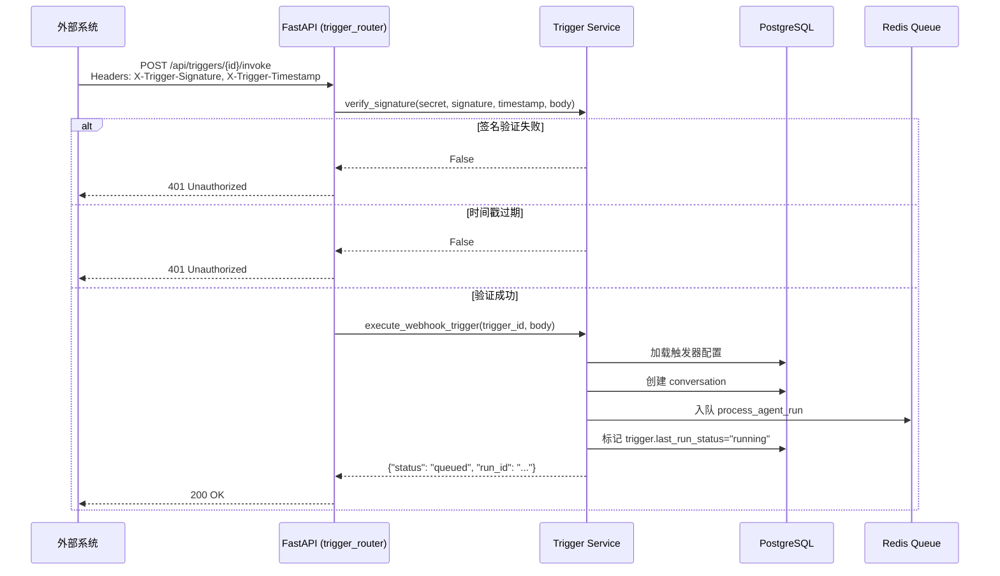

# 触发器管理流程链路追踪

> **链路概览**：用户创建触发器 → 触发器持久化到数据库 → Cron/Webhook 触发 → 创建 Agent Run → ARQ Worker 执行 → 状态更新反馈

## 一、完整链路追踪

### 1.1 前端触发点（创建触发器）

**用户操作**：用户在触发器管理界面配置触发器参数并提交创建

**代码路径**：
- 前端组件：`web/src/views/TriggerManagementView.vue`
- API调用：`web/src/apis/trigger.js`

**关键代码**（`trigger.js`）：

```javascript
createTrigger: (data) =>
  apiPost('/api/triggers', {
    name: data.name,
    desc: data.desc,
    trigger_type: data.trigger_type,  // "cron" 或 "webhook"
    agent_id: data.agent_id,
    config: data.config,              // cron_expr/timezone 或 secret
    input_query: data.input_query,
    is_active: data.is_active
  }),
```

### 1.2 后端路由层（创建触发器）

**代码路径**：`backend/server/routers/trigger_router.py`

**关键职责**：
- 接收 `/api/triggers` POST 请求
- 验证触发器类型和配置合法性
- 自动生成 webhook secret
- 创建 Trigger 记录并写入数据库
- 返回完整 secret（仅首次返回）

**关键代码**（`trigger_router.py:88-118`）：

```python
@trigger_router.post("")
async def create_trigger(
    payload: TriggerCreate,
    current_user: User = Depends(get_required_user),
    db: AsyncSession = Depends(get_db),
):
    """创建触发器。webhook 类型自动生成 32 字节 hex secret。"""
    _validate_trigger_type(payload.trigger_type)
    config = dict(payload.config or {})
    if payload.trigger_type == "cron":
        _validate_cron_config(config)
        config.setdefault("timezone", "Asia/Shanghai")
    elif payload.trigger_type == "webhook":
        # 自动生成 secret（调用方无需传）
        config["secret"] = config.get("secret") or generate_secret()

    trigger = Trigger(
        id=str(uuid.uuid4()),
        name=payload.name,
        desc=payload.desc,
        trigger_type=payload.trigger_type,
        agent_id=payload.agent_id,
        uid=str(current_user.uid),
        config=config,
        input_query=payload.input_query,
        is_active=payload.is_active,
    )
    await TriggerRepository(db).create(trigger)
    # 创建后首次返回完整 secret（include_secret=True）
    return {"trigger": trigger.to_dict(include_secret=True)}
```

### 1.3 Cron 触发器：定时扫描

**代码路径**：`backend/package/starring/services/trigger/cron_scan.py`

**关键职责**：
- WorkerSettings 注册 cron_jobs，每分钟第 0 秒执行 scan_triggers
- 扫描 triggers 表，找出所有启用的 cron 触发器
- 判断触发器是否到点（基于 cron_expr 和 timezone）
- 到点的触发器入队到 ARQ（幂等性保证）

**关键代码**（`cron_scan.py:38-71`）：

```python
async def scan_triggers(ctx: dict) -> None:
    """ARQ cron 元任务入口：每分钟扫描 triggers 表，到点的触发器入队执行。

    幂等性：相同 (trigger_id, scheduled_time) 维度只入队一次（ARQ _job_id 去重）。
    """
    del ctx
    now_utc = utc_now_naive()

    async with pg_manager.get_async_session_context() as session:
        triggers = await TriggerRepository(session).list_active_cron_triggers()
        if not triggers:
            return

        # 归一化到分钟级（避免秒级抖动导致同一分钟多次入队）
        scheduled_time = now_utc.replace(second=0, microsecond=0)
        scheduled_time_iso = scheduled_time.isoformat()

        enqueued_count = 0
        for trigger in triggers:
            if not _is_due(trigger, now_utc):
                continue
            try:
                await _enqueue_trigger_run(trigger, scheduled_time_iso)
                enqueued_count += 1
            except Exception as e:
                logger.exception(
                    f"Failed to enqueue trigger {trigger.id} for {scheduled_time_iso}: {e}"
                )

        if enqueued_count > 0:
            logger.info(f"scan_triggers: enqueued {enqueued_count} trigger(s) for {scheduled_time_iso}")
```

**关键代码**（`cron_scan.py:73-124` - 判断是否到点）：

```python
def _is_due(trigger: Trigger, now_utc: datetime) -> bool:
    """判断触发器是否在当前 UTC 分钟到点（按 config.timezone 解析 cron_expr）。

    算法：
    1. 把 now_utc 转为用户配置时区的本地时间
    2. 归一化到分钟（去掉秒和微秒）
    3. 用 croniter 从「上一分钟」开始算 next，判断 next 是否等于当前分钟
    """
    if not _CRON_DEPS_AVAILABLE:
        return False

    config = trigger.config or {}
    cron_expr = config.get("cron_expr")
    if not cron_expr:
        return False

    timezone_name = config.get("timezone") or "Asia/Shanghai"
    try:
        tz = pytz.timezone(timezone_name)
    except Exception as e:
        logger.warning(
            f"Invalid timezone={timezone_name} for trigger={trigger.id}: {e}"
        )
        return False

    # 把 UTC naive 当作 UTC，转为用户时区本地时间，再归一化到分钟
    now_local = now_utc.replace(tzinfo=timezone.utc).astimezone(tz)
    now_local_minute = now_local.replace(second=0, microsecond=0)

    try:
        cron = croniter(cron_expr, now_local_minute - timedelta(minutes=1))
        next_time = cron.get_next(datetime)
        next_time_minute = next_time.replace(second=0, microsecond=0)
        return next_time_minute.replace(tzinfo=None) == now_local_minute.replace(tzinfo=None)
    except Exception as e:
        logger.warning(
            f"Invalid cron_expr={cron_expr!r} for trigger={trigger.id}: {e}"
        )
        return False
```

### 1.4 ARQ Worker：执行触发器

**代码路径**：`backend/package/starring/services/run_worker.py`

**关键职责**：
- 注册 execute_trigger_run 函数到 WorkerSettings
- 消费 ARQ 队列中的触发器任务
- 调用 trigger_service.execute_trigger
- 非阻塞执行（立即返回，不等待 run 结果）

**关键代码**（`run_worker.py:604-616`）：

```python
async def execute_trigger_run(ctx: dict, trigger_id: str, scheduled_time_iso: str) -> dict:
    """ARQ 任务入口：执行到点的触发器。

    与 process_agent_run 同级注册在 WorkerSettings.functions 中，
    由 scan_triggers 元任务 enqueue 触发。
    """
    from starring.services.trigger.service import execute_trigger

    del ctx
    return await execute_trigger(
        trigger_id=trigger_id, scheduled_time_iso=scheduled_time_iso
    )
```

**关键代码**（`run_worker.py:618-644` - WorkerSettings 配置）：

```python
class WorkerSettings:
    """ARQ worker 配置入口，由 ``arq worker`` 进程读取。"""
    functions = [process_agent_run, execute_trigger_run]
    max_tries = 2
    retry_jobs = True
    job_timeout = 3600
    keep_result = 60
    on_startup = _worker_startup
    on_shutdown = _worker_shutdown

    # cron_jobs：注册每分钟扫描 triggers 表的元任务（方案 C）
    cron_jobs: list = []
    try:
        from arq.cron import cron as _arq_cron
        # 每分钟第 0 秒执行 scan_triggers
        cron_jobs = [_arq_cron(scan_triggers, hour=None, minute=None, second={0})]
    except Exception:
        cron_jobs = []
```

### 1.5 触发器执行服务（通用入口）

**代码路径**：`backend/package/starring/services/trigger/service.py`

**关键职责**：
- 提供统一执行入口：execute_trigger（cron）和 execute_webhook_trigger（webhook）
- 创建独立的 conversation（每次触发独立 thread）
- 调用 create_run 入队 Agent Run
- 更新触发器状态为 running
- 立即返回，不阻塞等待 run 结果

**关键代码**（`service.py:92-155`）：

```python
async def _do_execute_trigger(
    db: AsyncSession, trigger: "Trigger", payload: dict | None = None
) -> dict:
    """通用执行路径（非阻塞）：创建 conversation → create_run → 标记 running → 立即返回。

    不阻塞等待 run 结果——run 终结后由 mark_run_terminal 钩子异步更新 Trigger.last_run_status。
    原因：若调用 await_agent_run_result 会占满 ARQ worker 并发槽，阻塞普通 chat run。
    """
    try:
        # 1. 创建 conversation（每次触发独立 thread）
        conv_repo = ConversationRepository(db)
        scheduled_time = (payload or {}).get("scheduled_time") or utc_now_naive().isoformat()
        title = f"[{trigger.trigger_type}] {trigger.name} {scheduled_time}"
        conversation = await conv_repo.create_conversation(
            uid=trigger.uid, agent_id=trigger.agent_id, title=title,
        )

        # 2. 调 create_run（service 层 enqueue ARQ 任务后立即返回）
        run_response = await create_run(
            query=trigger.input_query or _default_query(trigger, payload),
            agent_id=trigger.agent_id,
            thread_id=conversation.thread_id,
            meta={
                "source": trigger.trigger_type,  # "cron" or "webhook"
                "trigger_id": trigger.id,
                "trigger_name": trigger.name,
            },
            image_content=None,
            current_uid=trigger.uid,
            db=db,
        )
        run_id = run_response["run_id"]

        # 3. 更新触发器状态为 running
        await TriggerRepository(db).mark_running(trigger.id, run_id)

        # 4. 立即返回，不等待 run 结果
        return {
            "status": "queued",
            "run_id": run_id,
            "trigger_id": trigger.id,
            "thread_id": conversation.thread_id,
        }

    except HTTPException as e:
        logger.warning(
            f"Trigger {trigger.id} failed: status={e.status_code} detail={e.detail}"
        )
        await TriggerRepository(db).mark_finished(trigger.id, "failed", None)
        return {
            "status": "failed",
            "trigger_id": trigger.id,
            "error": {"detail": str(e.detail), "code": e.status_code},
        }
    except Exception as e:
        logger.exception(f"Trigger {trigger.id} unexpected error: {e}")
        await TriggerRepository(db).mark_finished(trigger.id, "failed", None)
        return {
            "status": "failed",
            "trigger_id": trigger.id,
            "error": {"detail": str(e)},
        }
```

### 1.6 Webhook 触发器：HTTP 调用

**代码路径**：`backend/server/routers/trigger_router.py` + `backend/package/starring/services/trigger/webhook.py`

**关键职责**：
- 接收 POST `/api/triggers/{trigger_id}/invoke` 请求
- HMAC-SHA256 签名验证（防篡改）
- 时间戳防重放（5 分钟窗口）
- 验证成功后调用 execute_webhook_trigger

**关键代码**（`trigger_router.py:269-284`）：

```python
@trigger_router.post("/{trigger_id}/invoke")
async def invoke_trigger(trigger_id: str, request: Request):
    """webhook 触发器调用入口。

    鉴权：HMAC-SHA256 签名（X-Trigger-Signature）+ 时间戳（X-Trigger-Timestamp，5 分钟内有效）。
    不走 get_required_user，公开可访问。
    """
    body = await request.body()
    signature = request.headers.get("X-Trigger-Signature", "")
    timestamp = request.headers.get("X-Trigger-Timestamp", "")
    return await execute_webhook_trigger(
        trigger_id=trigger_id,
        body=body,
        signature=signature,
        timestamp=timestamp,
    )
```

**关键代码**（`webhook.py:32-57` - 签名验证）：

```python
def verify_signature(secret: str, signature: str, timestamp: str, body: bytes) -> bool:
    """校验签名 + 时间戳防重放。

    Args:
        secret: 触发器配置中的 webhook secret
        signature: 请求头 X-Trigger-Signature 的 hex 摘要
        timestamp: 请求头 X-Trigger-Timestamp 的 Unix 时间戳字符串
        body: 请求体原始字节

    Returns:
        True 表示校验通过；False 表示签名错误或时间戳过期
    """
    if not secret or not signature or not timestamp:
        return False

    # 防重放：时间戳必须是数字且在 5 分钟窗口内
    try:
        ts = int(timestamp)
    except ValueError:
        return False
    if abs(time.time() - ts) > SIGNATURE_TOLERANCE_SECONDS:
        return False

    expected = compute_signature(secret, timestamp, body)
    # 使用常量时间比较而非 == ：防止攻击者通过响应耗时差异逐字节爆破签名（timing attack）
    return hmac.compare_digest(expected, signature)
```

### 1.7 状态持久化与更新

**代码路径**：`backend/package/starring/repositories/trigger_repository.py` + `backend/package/starring/services/run_worker.py`

**关键职责**：
- 触发器状态机：inactive → running → completed/failed/interrupted
- Run 完成后通过 mark_run_terminal 钩子异步更新 Trigger 状态
- 幂等保护：仅当 last_run_id == run_id 时才更新

**关键代码**（`trigger_repository.py:84-95` - 标记 running）：

```python
async def mark_running(self, trigger_id: str, run_id: str) -> None:
    """标记触发器进入 running 状态（不递增 run_count，run_count 在终结时递增）。"""
    await self.db.execute(
        update(Trigger)
        .where(Trigger.id == trigger_id)
        .values(
            last_run_id=run_id,
            last_run_at=utc_now_naive(),
            last_run_status="running",
        )
    )
    await self.db.commit()
```

**关键代码**（`run_worker.py:168-194` - Run 完成钩子）：

```python
async def mark_run_terminal(run_id: str, status: str, error_type: str | None = None, error_message: str | None = None):
    async with pg_manager.get_async_session_context() as db:
        repo = AgentRunRepository(db)
        await repo.set_terminal_status(run_id, status=status, error_type=error_type, error_message=error_message)
        # 触发器状态钩子：若 run 来自触发器，更新对应 Trigger 的 last_run_status
        await _update_trigger_status_if_any(db, run_id, status)


async def _update_trigger_status_if_any(db, run_id: str, status: str) -> None:
    """若 AgentRun.input_payload.trigger_id 存在，更新对应 Trigger 的 last_run_status。

    幂等保护：TriggerRepository.mark_finished_if_current 仅当 last_run_id == run_id 时才更新，
    避免旧 run 终结覆盖新 run 的状态。普通 chat run（input_payload 无 trigger_id）立即 return。
    """
    from starring.repositories.trigger_repository import TriggerRepository

    run = await AgentRunRepository(db).get_run(run_id)
    if not run:
        return
    trigger_id = (run.input_payload or {}).get("trigger_id")
    if not trigger_id:
        return
    try:
        await TriggerRepository(db).mark_finished_if_current(trigger_id, run_id, status)
    except Exception as e:
        logger.warning(f"Failed to update trigger status for run {run_id}: {e}")
```

**关键代码**（`trigger_repository.py:111-128` - 幂等更新）：

```python
async def mark_finished_if_current(
    self, trigger_id: str, run_id: str, status: str
) -> None:
    """幂等保护：仅当 trigger.last_run_id == run_id 时才更新。

    用途：mark_run_terminal 钩子调用，避免旧 run 终结覆盖新 run 的状态。
    注意：run_count 也在此时递增（仅当成功更新时）。
    """
    await self.db.execute(
        update(Trigger)
        .where(and_(Trigger.id == trigger_id, Trigger.last_run_id == run_id))
        .values(
            last_run_status=status,
            run_count=Trigger.run_count + 1,
            updated_at=utc_now_naive(),
        )
    )
    await self.db.commit()
```

### 1.8 执行历史查询

**代码路径**：`backend/server/routers/trigger_router.py`

**关键职责**：
- 查询触发器执行历史（关联 AgentRun）
- 按时间倒序排列
- 支持分页

**关键代码**（`trigger_router.py:234-262`）：

```python
@trigger_router.get("/{trigger_id}/runs")
async def list_trigger_runs(
    trigger_id: str,
    offset: int = Query(0, ge=0),
    limit: int = Query(20, ge=1, le=100),
    current_user: User = Depends(get_required_user),
    db: AsyncSession = Depends(get_db),
):
    """查看触发器执行历史。查 AgentRun.input_payload->>'trigger_id' = trigger_id。

    鉴权：先校验 trigger 归属当前用户，再查 runs（runs 的 uid 已与 trigger.uid 一致）。
    """
    repo = TriggerRepository(db)
    trigger = await repo.get_for_user(trigger_id, str(current_user.uid))
    if not trigger:
        raise HTTPException(status_code=404, detail="触发器不存在或无权访问")

    # JSONB 字段查询：input_payload ->> 'trigger_id' == trigger_id
    stmt = (
        select(AgentRun)
        .where(AgentRun.input_payload["trigger_id"].as_string() == trigger_id)
        .order_by(AgentRun.created_at.desc())
        .offset(offset)
        .limit(limit)
    )
    result = await db.execute(stmt)
    runs = result.scalars().all()
    return {"runs": [run.to_dict() for run in runs]}
```

## 二、设计亮点

### 2.1 非阻塞执行架构

**亮点**：触发器执行采用「入队即返回」模式，避免占用 ARQ worker 并发槽：

```
触发器到点 → enqueue execute_trigger_run → 创建 Run → 立即返回
                                      ↓
                               ARQ Worker 消费 → 执行 Agent → 状态更新
```

**优势**：
- 不阻塞 cron 扫描任务（每分钟必须执行完）
- 不影响普通 chat run 的并发执行
- 故障隔离：触发器失败不影响其他任务

**代码位置**：`backend/package/starring/services/trigger/service.py:92-155`

### 2.2 幂等性保障

**亮点**：通过 ARQ _job_id 和数据库幂等更新双重保障：

1. **入队幂等**：相同 `(trigger_id, scheduled_time)` 只入队一次
   ```python
   job_id = f"trigger:{trigger.id}:{scheduled_time_iso}"
   await queue.enqueue_job(..., _job_id=job_id)
   ```

2. **状态更新幂等**：仅当 `last_run_id == run_id` 时才更新
   ```python
   update(Trigger).where(and_(
       Trigger.id == trigger_id,
       Trigger.last_run_id == run_id
   ))
   ```

**优势**：
- 防止重复触发（同一分钟多次入队）
- 避免旧 run 状态覆盖新 run（并发场景）
- 保证 run_count 准确性

**代码位置**：`backend/package/starring/services/trigger/cron_scan.py:127-140`

### 2.3 HMAC 签名防重放

**亮点**：Webhook 触发器采用业界标准的安全机制：

- **签名算法**：HMAC-SHA256(secret, timestamp + "." + body)
- **防重放**：时间戳超过 5 分钟窗口拒绝
- **防时序攻击**：使用 `hmac.compare_digest` 而非 `==`

**关键代码**：

```python
def verify_signature(secret: str, signature: str, timestamp: str, body: bytes) -> bool:
    # 防重放：时间戳必须是数字且在 5 分钟窗口内
    ts = int(timestamp)
    if abs(time.time() - ts) > SIGNATURE_TOLERANCE_SECONDS:
        return False

    expected = compute_signature(secret, timestamp, body)
    # 使用常量时间比较而非 == ：防止攻击者通过响应耗时差异逐字节爆破签名
    return hmac.compare_digest(expected, signature)
```

**优势**：
- 防止请求篡改（签名验证）
- 防止重放攻击（时间戳窗口）
- 防止时序攻击（常量时间比较）

**代码位置**：`backend/package/starring/services/trigger/webhook.py:32-57`

### 2.4 Secret 自动生成与轮换

**亮点**：Webhook secret 生命周期管理完善：

1. **自动生成**：创建触发器时自动生成 32 字节 hex secret
2. **脱敏返回**：查询时不显示完整 secret（仅前 8 位）
3. **首次返回**：创建后首次返回完整 secret（唯一机会）
4. **安全轮换**：提供 `/rotate-secret` 接口重新生成

**关键代码**：

```python
# 创建时自动生成
if payload.trigger_type == "webhook":
    config["secret"] = config.get("secret") or generate_secret()

# 轮换接口
@trigger_router.post("/{trigger_id}/rotate-secret")
async def rotate_secret(trigger_id: str, ...):
    new_secret = generate_secret()
    config["secret"] = new_secret
    updated = await repo.update_fields(trigger, fields={"config": config})
    return {"trigger": updated.to_dict(include_secret=True)}
```

**优势**：
- 用户无需管理 secret 生成逻辑
- 支持定期轮换（安全最佳实践）
- 脱敏展示避免泄露

**代码位置**：`backend/server/routers/trigger_router.py:212-232`

### 2.5 时区感知的 Cron 调度

**亮点**：支持用户配置时区，精准判断 cron 触发时机：

```python
# 1. 把 UTC 转为用户配置时区的本地时间
now_local = now_utc.replace(tzinfo=timezone.utc).astimezone(tz)

# 2. 归一化到分钟级
now_local_minute = now_local.replace(second=0, microsecond=0)

# 3. 从「上一分钟」计算下次执行时间（避免跳过当前分钟）
cron = croniter(cron_expr, now_local_minute - timedelta(minutes=1))
next_time = cron.get_next(datetime)

# 4. 判断是否在当前分钟到点
return next_time_minute.replace(tzinfo=None) == now_local_minute.replace(tzinfo=None)
```

**优势**：
- 支持多时区部署（不同地区用户配置本地时区）
- 避免 croniter 基准时间问题（从上一分钟算 next）
- 精确到分钟级（归一化避免秒级抖动）

**代码位置**：`backend/package/starring/services/trigger/cron_scan.py:73-124`

## 三、主要功能

### 3.1 触发器类型对比

| 触发器类型 | 触发方式 | 执行入口 | 鉴权方式 | 适用场景 |
|------------|----------|----------|----------|----------|
| Cron | ARQ cron 元任务扫描 | `execute_trigger_run` | 无（内部调度） | 定时任务、周期性巡检 |
| Webhook | HTTP POST 调用 | `execute_webhook_trigger` | HMAC-SHA256 签名 | 外部系统触发、事件驱动 |

### 3.2 触发器管理 API

| API | 功能 | 鉴权 |
|-----|------|------|
| `POST /api/triggers` | 创建触发器 | 用户鉴权（get_required_user） |
| `GET /api/triggers` | 列出触发器（分页+过滤） | 用户鉴权 |
| `GET /api/triggers/{id}` | 获取触发器详情（含完整 secret） | 用户鉴权（仅创建者） |
| `PATCH /api/triggers/{id}` | 更新触发器配置 | 用户鉴权（仅创建者） |
| `DELETE /api/triggers/{id}` | 删除触发器 | 用户鉴权（仅创建者） |
| `POST /api/triggers/{id}/rotate-secret` | 轮换 webhook secret | 用户鉴权（仅创建者） |
| `GET /api/triggers/{id}/runs` | 查看执行历史 | 用户鉴权（仅创建者） |
| `POST /api/triggers/{id}/invoke` | Webhook 调用入口 | HMAC 签名（无用户鉴权） |

### 3.3 触发器状态机



**状态字段**：
- `last_run_status`：上次执行状态（running/completed/failed/interrupted）
- `last_run_id`：上次执行的 AgentRun ID
- `last_run_at`：上次执行时间
- `run_count`：累计执行次数

### 3.4 触发器配置示例

**Cron 触发器**：
```json
{
  "name": "每日数据同步",
  "trigger_type": "cron",
  "agent_id": "data-sync-agent",
  "config": {
    "cron_expr": "0 2 * * *",
    "timezone": "Asia/Shanghai"
  },
  "input_query": "执行每日数据同步任务",
  "is_active": true
}
```

**Webhook 触发器**：
```json
{
  "name": "订单事件触发",
  "trigger_type": "webhook",
  "agent_id": "order-processor",
  "config": {
    "secret": "a1b2c3d4..."  // 自动生成
  },
  "input_query": "处理订单事件",
  "is_active": true
}
```

## 四、可改进之处

### 4.1 缺少触发器执行失败通知

**问题**：触发器执行失败后，用户无法及时感知（需要主动查询执行历史）。

**改进建议**：
- 增加通知配置：失败时发送邮件/短信/webhook 通知
- 提供通知模板：支持自定义通知内容
- 增加重试策略：可配置失败后自动重试次数

**代码位置**：`backend/package/starring/services/trigger/service.py:136-154`

### 4.2 Webhook IP 白名单未实现

**问题**：config 中的 `allowed_ips` 字段已预留但未实现校验逻辑。

**改进建议**：
```python
# 在 verify_signature 前增加 IP 校验
def verify_client_ip(trigger: Trigger, client_ip: str) -> bool:
    allowed_ips = (trigger.config or {}).get("allowed_ips", [])
    if not allowed_ips:
        return True  # 未配置则不限制
    return client_ip in allowed_ips
```

**代码位置**：`backend/package/starring/services/trigger/webhook.py`

### 4.3 Cron 表达式缺少可视化编辑器

**问题**：前端用户需要手动输入 cron 表达式，易错且不友好。

**改进建议**：
- 前端增加 cron 表达式可视化编辑器（类似 crontab.guru）
- 提供常用模板：每日/每周/每月快捷选项
- 实时预览下次执行时间

**代码位置**：`web/src/views/TriggerManagement.vue`（前端）

### 4.4 触发器缺少执行日志

**问题**：触发器执行仅记录 Run ID，缺少详细的执行日志（如入队时间、开始时间、耗时）。

**改进建议**：
- 增加 `trigger_executions` 表记录每次执行的详细信息
- 字段：trigger_id, run_id, scheduled_time, enqueued_at, started_at, finished_at, duration_ms
- 提供执行统计分析：成功率、平均耗时、失败原因分布

**代码位置**：`backend/package/starring/storage/postgres/models_business.py:811-863`

### 4.5 缺少触发器并发控制

**问题**：若触发器执行时间超过调度间隔，可能导致并发执行（如 cron 每分钟触发，但执行需 2 分钟）。

**改进建议**：
```python
# 在 execute_trigger 前检查是否有运行中的任务
async def _check_concurrent_run(trigger_id: str, db: AsyncSession) -> bool:
    trigger = await TriggerRepository(db).get(trigger_id)
    if trigger.last_run_status == "running":
        # 检查是否超过合理时间（如 2 小时）
        if trigger.last_run_at and (utc_now_naive() - trigger.last_run_at).total_seconds() > 7200:
            logger.warning(f"Trigger {trigger_id} has running task for >2h, force allow new run")
            return False
        return True  # 阻止新任务
    return False
```

**代码位置**：`backend/package/starring/services/trigger/service.py:38-56`

### 4.6 Webhook 缺少请求体大小限制

**问题**：恶意用户可能发送超大请求体导致内存溢出。

**改进建议**：
```python
# 在 invoke_trigger 中限制请求体大小
@trigger_router.post("/{trigger_id}/invoke")
async def invoke_trigger(trigger_id: str, request: Request):
    # 限制请求体大小（如 10MB）
    MAX_BODY_SIZE = 10 * 1024 * 1024
    body = await request.body()
    if len(body) > MAX_BODY_SIZE:
        raise HTTPException(status_code=413, detail="Request body too large")
    ...
```

**代码位置**：`backend/server/routers/trigger_router.py:269-284`

## 五、代码路径索引

| 模块 | 文件路径 | 职责 |
|------|----------|------|
| 路由层 | `backend/server/routers/trigger_router.py` | 触发器管理 API + webhook invoke 入口 |
| 服务层 | `backend/package/starring/services/trigger/service.py` | 触发器执行服务（通用入口） |
| 服务层 | `backend/package/starring/services/trigger/webhook.py` | Webhook 签名生成与验证 |
| 服务层 | `backend/package/starring/services/trigger/cron_scan.py` | Cron 触发器扫描元任务 |
| 基类 | `backend/package/starring/services/trigger/base.py` | 触发器抽象基类 |
| Worker | `backend/package/starring/services/run_worker.py` | ARQ Worker 配置与 execute_trigger_run |
| Repository | `backend/package/starring/repositories/trigger_repository.py` | 触发器数据访问层 |
| 数据模型 | `backend/package/starring/storage/postgres/models_business.py:811-863` | Trigger 表定义 |
| 前端组件 | `web/src/views/TriggerManagementView.vue` | 触发器管理界面 |
| 前端API | `web/src/apis/trigger.js` | 触发器 API 封装 |

## 六、流程图

### 6.1 Cron 触发器完整流程



### 6.2 Webhook 触发器完整流程

