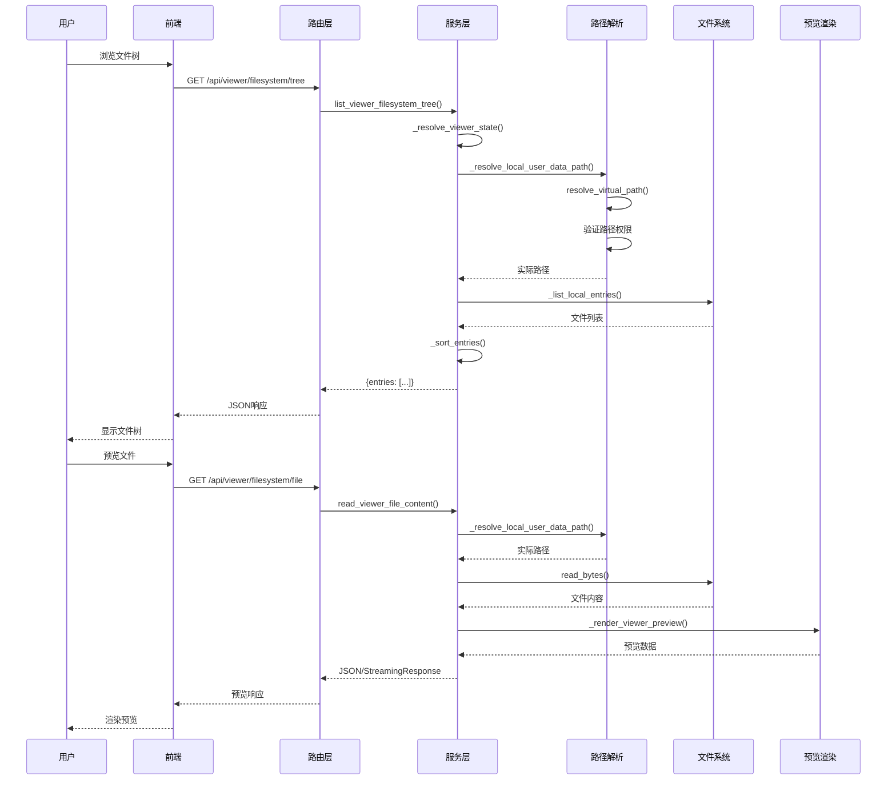

# 文件系统操作流程链路追踪

> **链路概览**：用户在前端触发文件操作 → 后端路由层接收请求 → 服务层解析虚拟路径 → 权限验证与路径映射 → 执行文件操作（浏览/预览/下载/上传/删除） → 返回结果

## 一、完整链路追踪

### 1.1 前端触发点

**用户操作**：用户在文件浏览器组件中进行文件浏览、预览、上传、下载、删除等操作

**代码路径**：
- 前端组件：文件浏览器UI组件
- API调用：`web/src/apis/viewer_filesystem.js`（通过 `/api/viewer/filesystem/*` 端点调用）

**关键端点**：

```
GET  /api/viewer/filesystem/tree        # 浏览文件树
GET  /api/viewer/filesystem/file        # 预览文件内容
GET  /api/viewer/filesystem/download    # 下载文件
POST /api/viewer/filesystem/upload      # 上传文件
POST /api/viewer/filesystem/directory   # 创建目录
DELETE /api/viewer/filesystem/file      # 删除文件/目录
```

### 1.2 后端路由层

**代码路径**：`backend/server/routers/filesystem_router.py`

**关键职责**：
- 接收 `/api/viewer/filesystem/*` 请求
- 验证用户身份（`get_required_user`）
- 参数解析与验证
- 委托服务层处理业务逻辑

**关键代码**（简化版）：

```python
@filesystem_router.get("/tree", response_model=dict)
async def get_viewer_tree(
    thread_id: str = Query(..., description="线程 ID"),
    path: str = Query("/", description="目录路径"),
    current_user: User = Depends(get_required_user),
    db: AsyncSession = Depends(get_db),
):
    return await list_viewer_filesystem_tree(
        thread_id=thread_id,
        path=path,
        current_user=current_user,
        db=db,
    )
```

### 1.3 服务层核心处理

**代码路径**：`backend/package/starring/services/viewer_filesystem_service.py`

**关键职责**：
- 虚拟路径解析与权限验证
- 区分不同的文件命名空间（user-data、skills、workspace）
- 执行实际的文件系统操作
- 文件预览渲染（文本、图片、PDF等）

**核心函数调用链**：

```
list_viewer_filesystem_tree()      # 浏览文件树
  ↓
_resolve_viewer_state()           # 解析运行时上下文
  ↓
_is_user_data_path()              # 判断路径命名空间
  ↓
_resolve_local_user_data_path()    # 路径解析与权限验证
  ↓
_list_local_entries()              # 列出目录内容
```

### 1.4 虚拟路径系统

**代码路径**：`backend/package/starring/agents/backends/sandbox/paths.py`

**关键概念**：

**虚拟命名空间**：
- `/home/gem/user-data/` - 用户数据目录（每个线程独立）
- `/home/gem/user-data/workspace/` - 用户工作区（跨线程共享）
- `/home/gem/skills/` - Skills 只读目录
- `/home/gem/kbs/` - 知识库目录（Viewer 不可见）

**路径映射函数**：

```python
def sandbox_user_data_dir(thread_id: str) -> Path:
    """返回线程级别的用户数据目录"""
    return _thread_root_dir(thread_id)

def sandbox_workspace_dir(thread_id: str, uid: str) -> Path:
    """返回用户级别的工作区目录（跨线程共享）"""
    return _global_user_data_dir(uid) / WORKSPACE_DIR_NAME
```

**路径解析流程**：

```python
def _resolve_local_user_data_path(thread_id: str, uid: str, path: str) -> Path:
    """解析虚拟路径到实际文件系统路径"""
    try:
        actual_path = resolve_virtual_path(thread_id, path, uid=uid)
    except ValueError as exc:
        if "path traversal" in str(exc):
            raise HTTPException(status_code=403, detail="Access denied") from exc
        raise

    # 验证路径在允许的范围内
    resolved_path = actual_path.resolve()
    user_data_root = sandbox_user_data_dir(thread_id).resolve()
    workspace_root = sandbox_workspace_dir(thread_id, uid).resolve()

    if not (resolved_path.is_relative_to(user_data_root) or
            resolved_path.is_relative_to(workspace_root)):
        raise HTTPException(status_code=403, detail="Access denied")

    return resolved_path
```

### 1.5 权限验证机制

**多层权限检查**：

1. **身份验证**：通过 `get_required_user` 验证用户登录状态
2. **路径规范化**：防止路径遍历攻击（`..`、符号链接）
3. **命名空间隔离**：只允许访问 user-data 和 skills 命名空间
4. **根目录保护**：禁止删除 `/workspace`、`/uploads`、`/outputs` 等根目录
5. **写入权限控制**：只允许在 workspace 目录下创建/上传/删除

**关键代码**（`viewer_filesystem_service.py:480-484`）：

```python
if not _is_user_data_path(normalized_path):
    raise HTTPException(status_code=400, detail="当前路径不支持删除")
if normalized_path in _PROTECTED_USER_DATA_ROOTS:
    raise HTTPException(status_code=400, detail="当前目录不允许删除")
```

### 1.6 文件预览系统

**代码路径**：`backend/package/starring/services/file_preview.py`

**支持的预览类型**：

| 文件类型 | 预览方式 | 支持格式 |
|---------|---------|---------|
| Markdown | 文本渲染 | .md, .markdown, .mdx |
| 文本文件 | 文本渲染 | .txt, .json, .py, .js 等 |
| 图片 | 流式响应 | .png, .jpg, .gif, .svg 等 |
| PDF | 流式响应 | .pdf |
| Office | PDF转换后预览 | .docx, .pptx |

**预览流程**：

```python
def _render_viewer_preview(path: str, raw_content: bytes) -> dict | StreamingResponse:
    # 1. 检查文件大小限制（30MB）
    if len(raw_content) > MAX_BINARY_PREVIEW_SIZE_BYTES:
        return _preview_too_large_payload()

    # 2. 渲染预览负载
    payload = render_preview_payload(path, raw_content)

    # 3. 对于二进制类型（图片、PDF），返回流式响应
    if is_binary_preview_type(payload["preview_type"]) and payload["supported"]:
        return _preview_binary_response(path, raw_content, payload["preview_type"])

    # 4. 对于文本类型，返回 JSON 负载
    return payload
```

### 1.7 Workspace 服务层

**代码路径**：`backend/package/starring/services/workspace_service.py`

**关键职责**：
- 提供工作区目录的CRUD操作
- 用户级别的文件隔离
- 虚拟路径与实际路径映射

**核心函数**：

```python
async def list_workspace_tree(
    *, path: str, recursive: bool = False,
    files_only: bool = False, current_user: User
) -> dict:
    """列出工作区目录树"""
    root = _workspace_root(current_user)
    target = _resolve_workspace_path(current_user, path)

    if not target.exists():
        return {"entries": []}

    if not target.is_dir():
        raise HTTPException(status_code=400, detail="当前路径不是目录")

    entries = await asyncio.to_thread(
        _list_directory, root, target,
        recursive=recursive, files_only=files_only
    )
    return {"entries": entries}
```

### 1.8 文件操作执行流程

#### 1.8.1 浏览文件树

```python
async def list_viewer_filesystem_tree(
    *, thread_id: str, path: str,
    current_user: User, db: AsyncSession,
) -> dict:
    # 1. 解析运行时上下文（Skills、沙箱配置）
    sandbox_backend, skills_backend, selected_skills = await _resolve_viewer_state(...)

    # 2. 根据命名空间处理
    if _is_user_data_path(normalized_path):
        # 处理 user-data 命名空间
        if _is_workspace_path(normalized_path):
            # workspace 调用 workspace_service
            response = await list_workspace_tree(...)
        else:
            # 其他 user-data 目录直接读取本地文件系统
            actual_path = _resolve_local_user_data_path(...)
            entries = await asyncio.to_thread(_list_local_entries, ...)

    elif _is_skills_path(normalized_path):
        # Skills 命名空间通过 backend.ls() 获取
        result = await asyncio.to_thread(skills_backend.ls, ...)

    return {"entries": _sort_entries(entries)}
```

#### 1.8.2 预览文件

```python
async def read_viewer_file_content(...) -> dict | StreamingResponse:
    # 1. 验证权限
    sandbox_backend, skills_backend, _ = await _resolve_viewer_state(...)

    # 2. 根据命名空间读取文件
    if _is_user_data_path(normalized_path):
        if _is_workspace_path(normalized_path):
            # workspace 文件
            return await read_workspace_file_content_response(...)
        else:
            # 其他 user-data 文件
            actual_path = _resolve_local_user_data_path(...)
            raw_content = await asyncio.to_thread(actual_path.read_bytes)

    elif _is_skills_path(normalized_path):
        # Skills 文件通过 backend 下载
        responses = await asyncio.to_thread(
            skills_backend.download_files, [_strip_skills_prefix(normalized_path)]
        )
        raw_content = responses[0].content

    # 3. 渲染预览
    return _render_viewer_preview(normalized_path, raw_content)
```

#### 1.8.3 上传文件

```python
async def upload_viewer_files(...) -> dict:
    # 1. 验证权限（只允许 workspace）
    if not _is_workspace_path(normalized_parent):
        raise HTTPException(status_code=400, detail="当前路径不支持写入")

    # 2. 调用 workspace_service 上传
    response = await upload_workspace_files_entry(
        parent_path=_workspace_relative_path(normalized_parent),
        files=files,
        current_user=current_user,
    )

    # 3. 转换响应格式
    return _viewer_response_from_workspace_response(response)
```

#### 1.8.4 删除文件/目录

```python
async def delete_viewer_file(...) -> dict:
    # 1. 验证权限
    if not _is_user_data_path(normalized_path):
        raise HTTPException(status_code=400, detail="当前路径不支持删除")

    # 2. 保护根目录
    if normalized_path in _PROTECTED_USER_DATA_ROOTS:
        raise HTTPException(status_code=400, detail="当前目录不允许删除")

    # 3. 执行删除
    if _is_workspace_path(normalized_path):
        await delete_workspace_path(...)
    else:
        actual_path = _resolve_local_user_data_path(...)
        if actual_path.is_dir():
            await asyncio.to_thread(shutil.rmtree, actual_path)
        else:
            await asyncio.to_thread(actual_path.unlink)

    return {"success": True, "path": normalized_path}
```

### 1.9 数据流向图



## 二、设计亮点

### 2.1 三层命名空间隔离

**亮点**：通过虚拟路径系统实现三种不同的文件命名空间，职责清晰：

| 命名空间 | 路径前缀 | 特性 | 用途 |
|---------|---------|------|------|
| user-data | `/home/gem/user-data/` | 线程级别隔离 | 上传文件、输出文件 |
| workspace | `/home/gem/user-data/workspace/` | 用户级别共享 | 工作区文件 |
| skills | `/home/gem/skills/` | 只读访问 | Skills 文件 |

**优势**：
- 线程隔离：每个线程的 uploads/outputs 目录独立
- 用户共享：workspace 目录在同一用户的所有线程间共享
- 权限隔离：skills 目录只读，防止用户误删

### 2.2 双层权限验证机制

**亮点**：结合虚拟路径验证和文件系统权限检查：

```python
# 第一层：虚拟路径验证
if not _is_user_data_path(normalized_path):
    raise HTTPException(status_code=400, detail="Access denied")

# 第二层：实际路径解析与检查
actual_path = _resolve_local_user_data_path(thread_id, uid, normalized_path)
resolved_path = actual_path.resolve()

if not (resolved_path.is_relative_to(user_data_root) or
        resolved_path.is_relative_to(workspace_root)):
    raise HTTPException(status_code=403, detail="Access denied")
```

**优势**：
- 防止路径遍历攻击（`..`、符号链接）
- 确保路径在允许的命名空间内
- 文件系统级别的二次验证

### 2.3 智能文件预览系统

**亮点**：根据文件类型自动选择最合适的预览方式：

- **文本文件**：渲染为 Markdown（支持语法高亮）
- **图片文件**：流式响应，支持缩放和懒加载
- **PDF文件**：流式响应，前端内嵌显示
- **Office文件**：自动转换为 PDF 后预览
- **大文件**：返回预览提示（>30MB）

**优势**：
- 减少前端渲染负担
- 支持丰富的文件类型
- 自动处理大文件场景

### 2.4 异步文件操作

**亮点**：所有文件系统操作都使用 `asyncio.to_thread` 异步执行：

```python
# 异步读取文件内容
raw_content = await asyncio.to_thread(actual_path.read_bytes)

# 异步列出目录
entries = await asyncio.to_thread(_list_local_entries, thread_id, uid, actual_path)

# 异步删除目录
await asyncio.to_thread(shutil.rmtree, actual_path)
```

**优势**：
- 避免阻塞事件循环
- 支持并发文件操作
- 提升响应性能

### 2.5 写入权限精细控制

**亮点**：根据路径类型动态判断写入权限：

```python
# 只允许在 workspace 目录下写入
if not _is_workspace_path(normalized_parent):
    raise HTTPException(status_code=400, detail="当前路径不支持写入")

# 保护系统根目录
_PROTECTED_USER_DATA_ROOTS = frozenset({
    USER_DATA_PATH,
    VIRTUAL_PATH_WORKSPACE,
    VIRTUAL_PATH_UPLOADS,
    VIRTUAL_PATH_OUTPUTS,
})
```

**优势**：
- 防止用户删除系统目录
- 明确写入边界，降低误操作风险
- 符合最小权限原则

## 三、主要功能

### 3.1 文件浏览

- **支持路径**：user-data、workspace、skills 命名空间
- **返回数据**：文件名、路径、大小、修改时间、是否目录
- **排序规则**：文件夹优先，然后按名称字母排序

### 3.2 文件预览

- **文本预览**：支持 Markdown 渲染、代码高亮
- **图片预览**：支持 PNG、JPG、GIF、SVG 等格式
- **PDF预览**：内嵌显示，支持缩放
- **Office预览**：自动转换 DOCX、PPTX 为 PDF
- **大小限制**：超过 30MB 的文件返回提示

### 3.3 文件下载

- **响应格式**：`Content-Disposition: attachment`
- **文件名编码**：UTF-8 编码，支持中文文件名
- **媒体类型**：自动检测 MIME 类型

### 3.4 文件上传

- **支持路径**：只允许 workspace 目录
- **文件数量**：单次最多上传 50 个文件
- **文件大小**：遵循全局上传限制
- **冲突处理**：同名文件拒绝覆盖

### 3.5 目录操作

- **创建目录**：只允许在 workspace 下创建
- **删除目录**：递归删除，保护根目录
- **命名验证**：禁止特殊字符和路径分隔符

## 四、可改进之处

### 4.1 前端 API 文件分散

**问题**：文件系统 API 封装在 `web/src/apis/viewer_filesystem.js` 中，但部分文件操作逻辑可能分散在多个前端组件中，未完全集中管理。

**改进建议**：
- 统一在 `viewer_filesystem.js` 中集中管理所有文件系统相关 API：`getTree`、`getFile`、`downloadFile`、`uploadFiles`
- 保持与后端路由命名一致
- 提供完整的 TypeScript 类型定义（如使用 TS）

**相关代码**：`web/src/apis/viewer_filesystem.js`

### 4.2 文件预览缓存缺失

**问题**：每次预览文件都需要重新读取和渲染，频繁预览同一文件时性能较差。

**改进建议**：
- 在服务端添加预览结果缓存（Redis）
- 根据文件路径和修改时间生成缓存键
- 设置合理的缓存过期时间（如 5 分钟）

**代码位置**：`backend/package/starring/services/file_preview.py`

### 4.3 大文件下载优化不足

**问题**：当前下载大文件时一次性读取整个文件内容到内存，可能占用大量内存。

**改进建议**：
- 使用分块读取和流式响应
- 支持断点续传（Range 请求）
- 添加下载进度追踪

**代码位置**：`backend/package/starring/services/viewer_filesystem_service.py:397-461`

### 4.4 文件权限审计缺失

**问题**：当前缺少文件操作的审计日志，难以追踪谁在何时删除了哪些文件。

**改进建议**：
- 在删除文件时记录审计日志（用户ID、文件路径、时间戳）
- 将审计日志写入数据库或日志系统
- 提供管理界面查看文件操作历史

**代码位置**：`backend/package/starring/services/viewer_filesystem_service.py:463-502`

### 4.5 Skills 文件系统性能问题

**问题**：Skills 目录通过 backend.ls() 获取，可能涉及容器内部文件系统访问，性能较差。

**改进建议**：
- 对 Skills 文件树建立索引缓存
- 使用异步加载和懒加载策略
- 考虑将 Skills 文件预编译到共享存储

**代码位置**：`backend/package/starring/agents/backends/skills_backend.py`

### 4.6 文件冲突处理不够友好

**问题**：上传/创建目录时遇到同名文件，直接返回 400 错误，用户体验不佳。

**改进建议**：
- 提供重命名建议（如 `file (1).txt`）
- 支持强制覆盖选项（需要用户明确确认）
- 返回更详细的错误信息（已存在的文件类型）

**代码位置**：`backend/package/starring/services/workspace_service.py:119-127`

## 五、代码路径索引

| 模块 | 文件路径 | 职责 |
|------|----------|------|
| 路由层 | `backend/server/routers/filesystem_router.py` | 文件系统API端点定义 |
| 服务层 | `backend/package/starring/services/viewer_filesystem_service.py` | 核心文件系统操作逻辑 |
| Workspace服务 | `backend/package/starring/services/workspace_service.py` | 工作区文件操作 |
| 文件预览 | `backend/package/starring/services/file_preview.py` | 文件预览渲染 |
| 路径解析 | `backend/package/starring/agents/backends/sandbox/paths.py` | 虚拟路径映射 |
| 沙箱后端 | `backend/package/starring/agents/backends/sandbox/__init__.py` | 沙箱文件系统配置 |
| Skills后端 | `backend/package/starring/agents/backends/skills_backend.py` | Skills 文件系统访问 |
| 集成测试 | `backend/test/integration/api/test_viewer_filesystem_router.py` | API集成测试 |
| 安全测试 | `backend/test/integration/api/test_viewer_filesystem_security.py` | 权限安全测试 |
| E2E测试 | `backend/test/e2e/test_viewer_filesystem_e2e.py` | 端到端测试 |