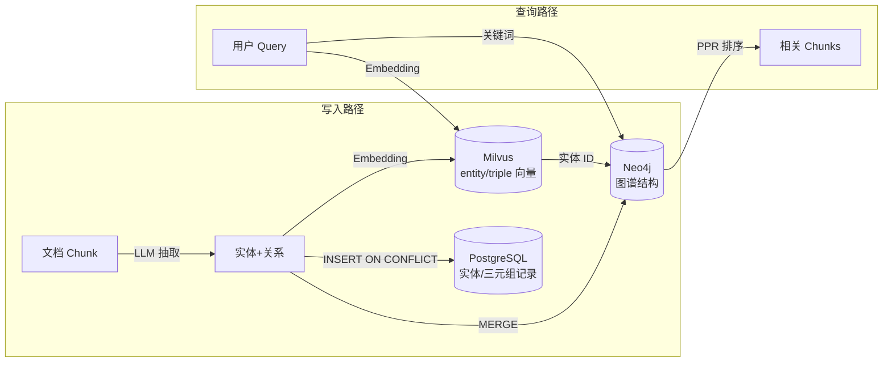

# LightRAG 集成

> 本文档剖析 LightRAG 在 StarRing 项目中的角色定位、实际集成状态与自研图谱能力的设计考量。

## 1. LightRAG 是什么

[LightRAG](https://github.com/HKUDS/LightRAG) 是香港大学数据科学实验室开源的轻量级 RAG 框架，核心特性包括：

- **图谱模式（Graph Mode）**：将文档内容抽取为实体-关系图，支持多跳推理和结构化检索
- **向量模式（Naive Mode）**：传统的向量检索，无图谱增强
- **深度融合**：同一查询可同时获得图谱上下文和向量检索结果，通过 LLM 融合生成最终回答
- **增量更新**：支持对已有图谱增量插入新文档，无需全量重建

LightRAG 的核心优势是将**知识图谱构建**与**向量检索**在框架层面深度融合，用户无需分别管理图谱和向量两个系统。

## 2. 在项目中的角色

### 架构声明

项目 `pyproject.toml` 的描述中明确声明：

> "基于 LangGraph v1 + Vue.js + FastAPI + **LightRAG** 架构构建"

### 实际集成状态

**LightRAG 作为独立知识库类型尚未落地。** 当前状态：

| 维度 | 状态 | 证据 |
|------|------|------|
| pip 依赖 | **未安装** | `backend/package/pyproject.toml` 的 dependencies 中无 `lightrag` |
| import 引用 | **无引用** | 全量搜索 `backend/` 目录，无任何 `import lightrag` 或 `from lightrag` |
| 知识库类型 | **显式不支持** | `kb_type="lightrag"` 创建知识库返回 400 错误 |
| 测试覆盖 | **已断言不支持** | `test_knowledge_router.py::test_create_lightrag_knowledge_base_is_unsupported` |

测试代码（`backend/test/integration/api/test_knowledge_router.py:666`）：

```python
async def test_create_lightrag_knowledge_base_is_unsupported(test_client, admin_headers):
    response = await test_client.post(
        "/api/knowledge/databases",
        json={"kb_type": "lightrag", ...},
    )
    assert response.status_code == 400
    assert "Unsupported knowledge base type: lightrag" in response.json()["detail"]
```

### 设计决策：自研图谱能力 vs 集成 LightRAG

项目选择了**自研知识图谱能力**而非直接集成 LightRAG，核心考量：

1. **可控性**：自研抽取器可精确控制 Schema 约束、实体归一化、增量更新策略
2. **存储解耦**：LightRAG 内部管理向量+图谱存储，而 StarRing 需要将图谱数据分布在 Milvus + Neo4j + PostgreSQL 三个系统中，以复用已有的存储基础设施和权限体系
3. **检索融合自主性**：StarRing 的混合检索（向量+BM25+图PPR）和 RRF 融合排序是定制化实现，LightRAG 的检索策略无法直接满足
4. **Agent 集成**：知识库通过 LangGraph 工具（`query_kb` / `find_kb_document`）暴露给 Agent，需要与中间件体系深度整合

## 3. 核心机制（自研实现）

StarRing 的自研图谱能力覆盖了 LightRAG 的核心功能面，实现路径如下：

### 3.1 实体与关系抽取

| 能力 | StarRing 实现 | 代码路径 |
|------|--------------|----------|
| LLM 抽取 | `LLMGraphExtractor` — 发送 Prompt 到 LLM，解析返回 JSON | `backend/package/starring/knowledge/graphs/extractors/llm.py` |
| Schema 约束 | 用户自定义实体类型/关系类型，注入抽取 Prompt | 同上，`_build_prompt()` 方法 |
| 结果归一化 | `normalize_extraction_result()` — 标准化 LLM 输出格式 | `backend/package/starring/knowledge/graphs/extractors/__init__.py` |
| 抽取器工厂 | `GraphExtractorFactory` — 注册+创建抽取器 | `backend/package/starring/knowledge/graphs/extractors/factory.py` |

抽取 Prompt 模板（`LLMGraphExtractor`）：

```
请从下面文本中抽取实体和实体关系，返回严格 JSON
{
  "relations": [
    {
      "source": {"text": "实体文本", "label": "实体类型", "attributes": [...]},
      "target": {"text": "实体文本", "label": "实体类型", "attributes": [...]},
      "text": "关系显示文本",
      "label": "关系类型"
    }
  ]
}
```

### 3.2 图谱构建

构建流程在 `MilvusGraphService.build_pending_chunks()` 中实现（`backend/package/starring/knowledge/graphs/milvus_graph_service.py`）：

```
while 还有待处理的 chunk:
    从 DB 取出 batch_size 个 graph_indexed=false 的 chunk
    启动 worker_count 个并发 worker:
        ① LLM 抽取 → extractor.extract(chunk.content)
        ② 写入 Neo4j → MERGE Chunk/Entity/Relation 节点与边
        ③ 同步 PostgreSQL → INSERT ON CONFLICT 实体/三元组记录
        ④ 向量化存入 Milvus → entity/triple 集合（含 BM25 稀疏索引）
        ⑤ 标记完成 → graph_indexed=true
```

关键设计：
- **并发控制**：`asyncio.Lock` 串行化 Neo4j + PG + Milvus 写入，避免并发冲突
- **结果缓存**：chunk.extraction_result 缓存抽取结果，支持断点续建
- **ID 稳定性**：`entity_id = hash(kb_id:normalized_name:label)`，同名实体自动归一化

### 3.3 查询模式

| 查询模式 | 实现 | 代码路径 |
|----------|------|----------|
| 关键词搜索 | Cypher `CONTAINS` 匹配节点名称 | `MilvusGraphService.query_nodes()` |
| 种子子图扩散 | 从种子实体出发，1-2 跳扩展子图 | `MilvusGraphService.query_seed_subgraph()` |
| PPR 图检索 | Personalized PageRank 排序 chunk 节点 | `MilvusGraphService.query_and_rank_chunks_by_ppr()` |

### 3.4 三存储协作



| 存储 | 图谱写入内容 | 图谱查询作用 |
|------|-------------|-------------|
| **Neo4j** | Chunk/Entity/Relation 节点与 MENTIONS/RELATION 边 | 子图扩散、关键词搜索、PPR 图遍历 |
| **PostgreSQL** | entity / entity_mention / triple / triple_mention 表 | 记录级管理、文件删除时清理孤儿引用 |
| **Milvus** | `{kb_id}_entity` + `{kb_id}_triple` 集合 | 实体/三元组向量检索、BM25 稀疏匹配 |

## 4. 代码实现索引

| 模块 | 文件路径 | 职责 |
|------|----------|------|
| 图谱服务 | `backend/package/starring/knowledge/graphs/milvus_graph_service.py` | 图谱构建/查询/删除的主入口 |
| 图向量存储 | `backend/package/starring/knowledge/graphs/milvus_graph_vector_store.py` | Milvus 中实体/三元组集合的 CRUD |
| Cypher 工具 | `backend/package/starring/knowledge/graphs/graph_utils.py` | Cypher 模板、ID 计算、实体归一化 |
| LLM 抽取器 | `backend/package/starring/knowledge/graphs/extractors/llm.py` | LLM 驱动的实体/关系抽取 |
| 抽取器基类 | `backend/package/starring/knowledge/graphs/extractors/base.py` | 抽取器抽象接口 |
| 抽取器工厂 | `backend/package/starring/knowledge/graphs/extractors/factory.py` | 抽取器注册与创建 |
| Neo4j 连接 | `backend/package/starring/storage/neo4j/manager.py` | Neo4j 连接池与读写封装 |
| 图谱 Repository | `backend/package/starring/repositories/knowledge_graph_repository.py` | PostgreSQL 中图谱记录的 CRUD |
| Chunk Repository | `backend/package/starring/repositories/knowledge_chunk_repository.py` | chunk 级图谱状态管理 |
| 知识库中间件 | `backend/package/starring/agents/middlewares/knowledge_base.py` | Agent 运行时挂载知识库工具 |
| KB 工具 | `backend/package/starring/agents/toolkits/kbs/tools.py` | `query_kb` / `list_kbs` 等工具定义 |
| 路由层 | `backend/server/routers/graph_router.py` | 图谱配置/构建/查询 HTTP 接口 |

## 5. 与 Milvus / Neo4j 的协作关系

StarRing 的图谱能力是**自研三存储协同方案**，与 LightRAG 的区别：

| 维度 | LightRAG | StarRing 自研 |
|------|----------|--------------|
| 图谱存储 | 内部管理（通常 KV 存储） | **Neo4j** — 生产级图数据库，支持 Cypher 灵活查询 |
| 向量存储 | 内部管理 | **Milvus** — 支持 BM25 稀疏索引 + 向量混合检索 |
| 元数据 | 内部管理 | **PostgreSQL** — 与业务表同库，支持 SQL 联查和事务 |
| 检索融合 | 框架内封闭 | **RRF + PPR** — 可配置权重，与纯向量检索无缝混搭 |
| 权限控制 | 无 | 复用 StarRing 知识库权限体系（global/department/user） |
| 增量更新 | 支持 | 支持（chunk 级 `graph_indexed` 标记 + 断点续建） |
| 文档删除 | 有限 | 完整支持（孤儿实体检测 + 三存储级联清理） |

**关键差异**：LightRAG 是"框架内一站式"方案，存储不可替换；StarRing 是"三存储解耦"方案，每个存储可独立扩展、替换和运维。

## 6. 简历写法建议

### 推荐写法

> 设计并实现基于 LLM 的知识图谱构建与检索系统，采用 Neo4j + Milvus + PostgreSQL 三存储协同架构：通过 LLM 抽取实体与关系，写入 Neo4j 图谱结构，同步向量化至 Milvus 支持混合检索，元数据持久化至 PostgreSQL 实现级联清理；检索阶段融合向量检索、BM25 全文检索与 Personalized PageRank 图扩散排序，支持增量构建和断点续建。

### 面试要点

1. **为什么不用 LightRAG 直接集成？** → 存储解耦、权限复用、检索策略定制
2. **三存储如何保证一致性？** → 写入锁串行化 + 逻辑删除 + 孤儿引用清理
3. **PPR 图检索的原理？** → 种子实体初始化 personalization vector，在子图上运行 Personalized PageRank，按 chunk 节点的 PR 值排序
4. **增量构建如何实现？** → chunk 级 `graph_indexed` 标记，重启后从未索引 chunk 继续构建
5. **Entity ID 如何保证稳定？** → `hash(kb_id + normalized_name + label)`，同名同类型实体自动归一化

### 不推荐写法

- ~~"集成了 LightRAG 框架实现知识图谱"~~ → 实际未集成，面试会暴露
- ~~"使用 LightRAG 做图谱增强 RAG"~~ → 项目是自研图谱能力
