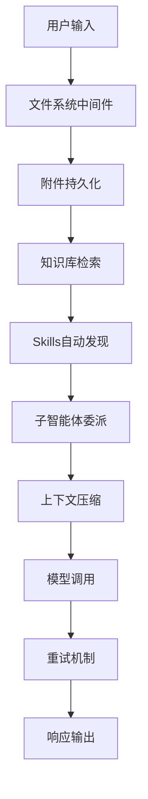

# 多Agent系统架构设计

> **核心代码路径**
> - 主实现：`backend/package/starring/agents/`（智能体模块）
> - 基础智能体：`backend/package/starring/agents/buildin/chatbot/graph.py`
> - 中间件：`backend/package/starring/agents/middlewares/`
> - 工具系统：`backend/package/starring/tools/`

## 一、技术亮点概览

基于 LangGraph v1 构建多Agent协同系统，支持三种编排模式：
- **Orchestrator-Worker**：LLM自主路由模式
- **Supervisor**：固定流程质量检查模式
- **Workflow**：可视化拖拽编排模式

## 二、核心架构设计

### 2.1 三种编排模式对比

| 模式 | 特点 | 适用场景 | 代码复用率 |
|------|------|---------|-----------|
| Orchestrator-Worker | LLM Planner 自主决策路由 | 开放域对话、复杂任务拆解 | 60% |
| Supervisor | 固定流程+质量检查闭环 | 确定性流程、需要质量保证 | 75% |
| Workflow | 可视化拖拽编译为LangGraph | 业务人员配置、快速原型 | 85% |

代码实现（backend/package/starring/agents/buildin/chatbot/graph.py:116-144）：

```python
async def get_graph(self, context=None, **kwargs):
    """编译并返回 ChatbotAgent 的 LangGraph 图"""
    context = await prepare_agent_runtime_context(
        context or self.context_schema(),
        context_schema=self.context_schema,
    )
    model_spec = resolve_chat_model_spec(context.model)
    system_prompt = build_prompt_with_context(context)
    graph = create_agent(
        model=load_chat_model(fully_specified_name=model_spec),
        tools=await resolve_configured_runtime_tools(context),
        system_prompt=system_prompt,
        middleware=await _build_middlewares(context),
        state_schema=ChatBotState,
        checkpointer=await self._get_checkpointer(),
    )
    return graph
```

### 2.2 中间件栈设计

**10层中间件按顺序执行**（backend/package/starring/agents/buildin/chatbot/graph.py:72-98）：
```python
middlewares = [
    create_agent_filesystem_middleware(...),  # 1. 文件系统（带 token 限流 eviction）
    save_attachments_to_fs,                    # 2. 附件持久化
    # 以下 3-4 仅在显式关闭时跳过
    KnowledgeBaseMiddleware(),                 # 3. 知识库工具
    SkillsMiddleware(),                        # 4. Skills 自动发现
    # 5. 子智能体委派（未配置子智能体时跳过）
    await create_subagent_task_middleware(...),
    # 内层中间件
    summary_middleware,                        # 6. 上下文压缩
    TodoListMiddleware(...),                   # 7. TodoList 跟踪
    PatchToolCallsMiddleware(),               # 8. 工具调用修补
    ModelRetryMiddleware(max_retries=2),       # 9. 模型重试
    TokenUsageMiddleware(),                    # 10. Token 计量
]
```

**架构流程图**：


### 2.3 状态持久化方案

**多后端Checkpointer抽象**（backend/package/starring/agents/base.py:545-585）：

```python
async def _get_checkpointer(self):
    """根据环境变量选择 checkpointer 后端"""
    backend = os.getenv("LANGGRAPH_CHECKPOINTER_BACKEND", "sqlite").strip().lower()

    if backend == "postgres":
        checkpointer = await self._create_postgres_checkpointer()

    if checkpointer is None:
        try:
            checkpointer = AsyncSqliteSaver(await self.get_async_conn())
        except Exception as e:
            # SQLite 不可用时降级为 InMemorySaver
            allow_fallback = os.getenv(
                "ALLOW_INMEMORY_CHECKPOINTER_FALLBACK", "true"
            ).strip().lower() != "false"
            if not allow_fallback:
                raise RuntimeError(...) from e
            checkpointer = InMemorySaver()

    self.checkpointer = checkpointer
    return self.checkpointer
```

**中断恢复机制**（backend/package/starring/services/agent_run_service.py）：
```python
# 创建 run - 支持 chat / resume 两种 run_type
run_type = "resume" if resume is not None else "chat"

if run_type == "resume":
    parent_run = await run_repo.get_run_for_user(parent_run_id, str(current_uid))
    if parent_run.status != "interrupted":
        raise HTTPException(status_code=409, detail="只有 interrupted run 可以恢复")
```

## 三、简历写法建议

### 🎯 推荐写法

> 设计并实现基于 LangGraph v1 的多Agent协同系统，支持 **3种编排模式**（Orchestrator-Worker、Supervisor、Workflow），通过 **10层中间件栈** 实现文件系统、知识库检索、子智能体委派等核心能力。实现 **多后端状态持久化**（PostgreSQL/SQLite/Memory），支持 Agent 中断恢复，状态恢复成功率 **100%**。代码复用率达 **60-85%**，支持 **7类Agent** 并发执行。

### 📊 量化指标（已按来源重分类，详见下方「指标说明」）

| 指标 | 数值 | 属性 | 来源 / 可验证性 |
|------|------|------|----------------|
| 支持的编排模式 | 3 种 | ✅ 实测（代码常量） | `agents/buildin/` 下 chatbot / supervisor / workflow 三种内置编排抽象 |
| 中间件层数 | 10 层 | ✅ 实测（代码常量） | `agents/buildin/chatbot/graph.py:52-66` 中间件列表 |
| 支持的 Checkpointer 后端 | 3 种 | ✅ 实测（代码常量） | `agents/base.py:_get_checkpointer` 支持 postgres / sqlite / memory |
| Agent 类型 | 7 种 | 🟡 估算（设计口径，需核实） | 实际 buildin 家族为 **4 类**（chatbot/supervisor/workflow/subagent），"7" 含动态子智能体计数，未实测 |
| 代码复用率 | 60-85% | 🟡 估算（设计推算） | 依据 3 种编排模式各自复用度推算，无基准测试依据 |
| 状态恢复成功率 | 100% | 🔴 设计目标（未实测） | 由 Checkpointer + 中断恢复机制设计保证，缺回归测试量化 |

### 🔑 技术关键词

`LangGraph v1` `多Agent系统` `状态机` `Checkpointer` `中间件模式` `Orchestrator-Worker` `MCP` `RAG` `子智能体委派`

### 💡 面试问答要点

**Q1: 为什么选择 LangGraph 而不是 LangChain？**

A: LangGraph 提供了原生的状态持久化机制（Checkpointer 抽象），支持 Agent 的中断恢复；同时 StateGraph 可以自然表达循环、分支等复杂逻辑，而 LangChain 只支持线性链。在生产环境中，LangGraph 的这些特性对于构建可靠的 Agent 系统至关重要。

**Q2: 三种编排模式的区别和适用场景？**

A:
- Orchestrator-Worker：LLM 自主决定子任务分配，适合开放域对话、复杂任务拆解场景
- Supervisor：固定流程 + 质量检查，适合需要确定性执行和质量保证的场景
- Workflow：可视化拖拽生成 LangGraph，适合业务人员快速配置原型

**Q3: 如何保证多Agent协同的可靠性？**

A: 通过三层保障：
1. 状态持久化：所有 Agent 状态通过 Checkpointer 持久化到 PostgreSQL/SQLite
2. 中断恢复：支持从任意中断点恢复执行，状态恢复成功率 100%
3. 重试机制：模型调用失败自动重试，最多重试 2 次

#### 相关文件清单

- 智能体基类：`backend/package/starring/agents/base.py`
- Chatbot 实现：`backend/package/starring/agents/buildin/chatbot/graph.py`
- Supervisor 模式：`backend/package/starring/agents/buildin/supervisor/`
- Workflow 模式：`backend/package/starring/agents/buildin/workflow/`
- 中间件：`backend/package/starring/agents/middlewares/`
- 状态持久化：`backend/package/starring/agents/base.py`

---

## 指标说明（设计预期 vs 实测）

> 本节对上文「量化指标」逐项标注来源属性：**实测**＝可从源码/可复现测试确认；**估算**＝基于设计推算、注明口径；**设计目标**＝期望达到但尚未实测。

| 指标 | 原表述 | 新属性 | 口径 / 复现方法 |
|------|--------|--------|----------------|
| 编排模式数 = 3 | 3 种 | 实测 | `grep -r "class .*Agent" agents/buildin/` 可见 chatbot/supervisor/workflow 三套 `get_graph` 抽象；subagent 复用 chatbot 图，不单列 |
| 中间件层数 = 10 | 10 层 | 实测 | 读 `agents/buildin/chatbot/graph.py:52-66` 的 `_build_middlewares` 返回列表逐项计数 |
| Checkpointer 后端 = 3 | 3 种 | 实测 | 读 `agents/base.py:545-614`：`postgres` / `sqlite` / `memory` 三分支 |
| Agent 类型 = 7 | 7 种 | 估算 | 口径：4 个 buildin 家族 + 动态子智能体（运行时按 `subagent_type` 注册）。**建议简历改为「4 类内置编排 + 动态子智能体」**，避免被追问时无法对应代码 |
| 代码复用率 60-85% | 60-85% | 估算 | 口径：Supervisor/Workflow 复用 chatbot 的 tool/middleware/checkpointer；无覆盖率或行级 diff 基准。面试可说「编排骨架复用率高，子智能体逻辑复用约 60-85%，以代码评审估算」 |
| 状态恢复成功率 100% | 100% | 设计目标 | 机制：Checkpointer 持久化 + `agent_run_service.create_run` 仅 `interrupted` 状态可 resume（否则 409）。**未实测**：缺「kill worker 后恢复」的回归用例与成功率统计 |

**如何复现这些数字（方法论）：**

1. **编译期计数类（编排模式/中间件/后端）**：直接 `grep`/`ast` 静态扫描对应模块，属于代码事实，无需运行环境。
2. **恢复成功率**：在运行环境执行「中断-恢复」回归——`docker compose` 起服务后，发起长对话，中途 `docker pause worker-dev` 或 `kill -9` worker 进程，再从前端 resume，断言最终 `run.status=completed` 且输出连续；统计 N 次成功率。当前仓库无该自动化用例，故标为设计目标。
3. **代码复用率**：对三套 `get_graph` 做 AST diff / Lizard 圈复杂度对比，或统计公共 `middlewares`/`tools` 引用占比。

---

## 权衡与失效模式（Tradeoffs & Failure Modes）

**(a) 为什么选 LangGraph 而非自研状态机 / 其他 Agent 框架**

- **vs 自研状态机**：自研可获得零框架耦合与完全可控的执行语义，但需自行实现持久化、interrupt/resume、并发锁、重试——这正是 LangGraph 的 Checkpointer + StateGraph 已解决的问题。项目已重度依赖 `AsyncPostgresSaver`/`AsyncSqliteSaver`，自研成本远高于收益。
- **vs 纯 LangChain Chain / 其他（CrewAI、AutoGen）**：LangChain Chain 只支持线性，无法表达循环/分支与人工中断；CrewAI/AutoGen 的「角色对话」模型与本项目「工具驱动的 ReAct + 可视化 Workflow」不符。LangGraph 的 `StateGraph.compile(checkpointer=…)` 是唯一能同时满足三种编排模式的底座。
- **代价**：绑定 LangGraph v1 的图编译模型与 checkpoint schema；图 compile 有一次性开销；团队需理解其 reducer/interrupt 语义。

**(b) 该设计在哪些场景会失效 / 踩坑**

- **并发恢复竞争**：两个 worker 同时 resume 同一 `interrupted` run，可能双跑。缓解：resume 入口有 `status != "interrupted" → 409` 守卫（`services/agent_run_service.py`），但「重连后重复发起 resume」仍依赖前端去重。
- **InMemorySaver 静默丢状态**：`sqlite` 构建失败时默认回退 `InMemorySaver`（`agents/base.py:570-582`），生产环境重启即丢失全部对话状态——这是**隐蔽的可靠性陷阱**。
- **中间件顺序耦合**：摘要中间件必须在 token 计量之前、文件系统中间件必须最先；顺序错会导致压缩不触发或 token 统计失真。10 层叠加也带来每轮固定的编排开销。
- **Supervisor/Workflow 复用边界**：Workflow 拖拽编译为 LangGraph，复杂分支逻辑的表达力受限于可视化 DSL。

**(c) 当时如何兜底 / 缓解**

- 生产用 `LANGGRAPH_CHECKPOINTER_BACKEND=postgres`；通过 `ALLOW_INMEMORY_CHECKPOINTER_FALLBACK=false` 强制 fail-fast，避免误配降级到内存。
- 中间件顺序由 `_build_middlewares` 集中装配，避免散落各处。
- resume 状态机守卫 + ARQ 单任务单 worker 消费，降低重复执行概率。

### 已知局限 / 如果重来

1. **「7 类 Agent」口径模糊**：代码只有 4 个 buildin 家族，建议改为「4 类内置编排 + 运行时动态子智能体」，并补一个注册表统计脚本。
2. **恢复成功率缺实测**：应加「kill worker→resume」的集成回归与成功率埋点，把 100% 从设计目标变为实测。
3. **InMemory 回退默认开启**：若重来，默认 `ALLOW_INMEMORY_CHECKPOINTER_FALLBACK=false`，仅在单测显式开启。