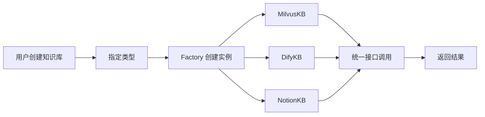

# 生产级知识库管理系统

> **核心代码路径**
> - 主实现：`backend/package/starring/knowledge/`
> - 工厂类：`backend/package/starring/knowledge/factory.py`
> - 抽象接口：`backend/package/starring/knowledge/base.py`
> - Milvus 实现：`backend/package/starring/knowledge/implementations/milvus.py`

## 一、技术亮点概览

基于 **工厂模式 + 策略模式** 设计统一的知识库管理接口，支持 Milvus、Dify、Notion 等多种知识库类型。通过抽象层屏蔽底层差异，实现知识库的 **热插拔** 和 **无缝切换**，提升系统的可扩展性和可维护性。

## 二、核心架构设计

### 2.1 工厂模式实现

**KnowledgeBaseFactory**（backend/package/starring/knowledge/factory.py:5-76）：

```python
class KnowledgeBaseFactory:
    """知识库工厂类，负责创建不同类型的知识库实例"""

    _kb_types: dict[str, type[KnowledgeBase]] = {}

    @classmethod
    def register(cls, kb_class: type[KnowledgeBase]):
        """注册知识库类型"""
        if not issubclass(kb_class, KnowledgeBase):
            raise ValueError("Knowledge base class must inherit from KnowledgeBase")
        if not kb_class.kb_type:
            raise ValueError("Knowledge base class must define kb_type")
        cls._kb_types[kb_class.kb_type] = kb_class

    @classmethod
    def create(cls, kb_type: str, work_dir: str, **kwargs) -> KnowledgeBase:
        """创建知识库实例"""
        if kb_type not in cls._kb_types:
            available_types = list(cls._kb_types.keys())
            raise KBNotFoundError(f"Unknown knowledge base type: {kb_type}. Available types: {available_types}")
        kb_class = cls._kb_types[kb_type]
        return kb_class(work_dir, **kwargs)

    @classmethod
    def get_available_types(cls) -> dict[str, dict]:
        """获取所有可用的知识库类型"""
        result = {}
        for kb_type, kb_class in cls._kb_types.items():
            result[kb_type] = {
                "name": kb_class.name,
                "description": kb_class.description,
                "requires_embedding_model": kb_class.requires_embedding_model,
                "supports_documents": kb_class.supports_documents,
                "create_params": kb_class.get_create_params_config(),
            }
        return result
```

### 2.2 策略模式接口

**KnowledgeBase 抽象接口**（backend/package/starring/knowledge/base.py:55-68，简化）：

```python
class KnowledgeBase(ABC):
    """知识库抽象基类，定义统一接口"""

    kb_type = ""       # 知识库类型标识
    name = ""          # 显示名称
    description = ""   # 类型描述
    requires_embedding_model = True
    supports_documents = True

    @abstractmethod
    async def aquery(self, query_text: str, kb_id: str, **kwargs) -> list[dict]:
        """异步查询知识库"""
        pass

    @abstractmethod
    async def index_file(self, kb_id: str, file_id: str, operator_id: str | None = None) -> dict:
        """索引解析后的文件"""
        pass
```

### 2.3 统一管理接口

**KnowledgeBaseManager**（backend/package/starring/knowledge/manager.py，简化）：

```python
class KnowledgeBaseManager:
    """知识库管理器 - 统一管理多种类型"""

    async def aquery(self, query_text: str, kb_id: str, **kwargs) -> str:
        """异步查询 - 自动路由到对应实例"""
        kb_instance = await self._get_kb_for_database(kb_id)
        return await kb_instance.aquery(query_text, kb_id, **kwargs)

    async def _get_kb_for_database(self, kb_id: str) -> KnowledgeBase:
        """获取数据库对应的知识库实例"""
        db_info = await self.db_repo.get_database(kb_id)
        kb_type = db_info.kb_type  # milvus / dify / notion
        return KnowledgeBaseFactory.create(kb_type, self.work_dir)
```

## 三、实现细节

### 3.1 热插拔机制

**动态加载知识库类型**：



**优点**：
- **无需重启**：新增知识库类型无需修改现有代码，只需实现 KnowledgeBase 接口
- **配置驱动**：通过配置文件或数据库切换知识库类型，无需修改代码
- **测试友好**：可以轻松替换为 Mock 实现进行单元测试

### 3.2 Milvus 知识库实现

**关键方法**（backend/package/starring/knowledge/implementations/milvus.py，简化示意）：

```python
# 以下为 MilvusKB.aquery 的简化逻辑示意，非逐行复制的真实代码
# 真实实现涉及 MilvusRetrievalConfig 参数构建、多种检索模式分支等复杂逻辑

class MilvusKB(KnowledgeBase):
    """基于 Milvus 的生产级向量知识库"""

    async def aquery(self, query_text: str, kb_id: str, **kwargs) -> list[dict]:
        """混合检索（向量 + BM25 + 图谱）"""
        if search_mode == "hybrid":
            results = await collection.hybrid_search(
                reqs=[vector_request, bm25_request],
                rerank=WeightedRanker(vector_weight, bm25_weight),
            )

        if use_graph_retrieval:
            graph_chunks = await self._retrieve_graph_chunks(query_text, kb_id, ...)
            retrieved_chunks = self._fuse_chunk_rankings(
                retrieved_chunks, graph_chunks, graph_weight
            )

        return retrieved_chunks
```

### 3.3 配置管理

**数据库配置表**（backend/package/starring/storage/postgres/models_knowledge.py，简化）：

```python
class KnowledgeBase(Base):
    """知识库配置表"""
    __tablename__ = "knowledge_bases"

    id = Column(Integer, primary_key=True, autoincrement=True)
    kb_id = Column(String(80), unique=True, nullable=False, index=True)
    name = Column(String(255), nullable=False, index=True)
    description = Column(Text)
    kb_type = Column(String(32), nullable=False, index=True)  # milvus / dify / notion
    embedding_model_spec = Column(String(512))
    llm_model_spec = Column(String(512))
    query_params = Column(JSON_VALUE)
    additional_params = Column(JSON_VALUE)  # 灵活的配置参数
    share_config = Column(JSON_VALUE)
```

**配置示例**：

```json
{
  "kb_type": "milvus",
  "additional_params": {
    "collection_name": "knowledge_base_001",
    "embedding_model": "text-embedding-3-small",
    "vector_weight": 0.6,
    "bm25_weight": 0.3,
    "graph_weight": 0.1
  }
}
```

## 四、简历写法建议

### 🎯 推荐写法

> 设计并实现 **生产级知识库管理系统**，基于 **工厂模式 + 策略模式** 设计统一管理接口，支持 Milvus、Dify、Notion 等多种知识库类型的 **热插拔切换**。通过抽象层屏蔽底层差异，新增知识库类型只需实现统一接口，无需修改现有代码。实现 **配置驱动** 的知识库管理，通过数据库配置灵活切换知识库类型和处理参数。系统支持 **向量检索、BM25、图检索** 三种检索模式，通过权重调优满足不同业务场景需求。

### 📊 量化指标（已按来源重分类，详见下方「指标说明」）

| 指标 | 数值 | 属性 | 来源 / 可验证性 |
|------|------|------|----------------|
| 支持的知识库类型 | 3+ 种 | ✅ 实测（代码常量） | `knowledge/__init__.py` 注册 MilvusKB / DifyKB / NotionKB 共 3 类 |
| 热插拔支持 | 是 | ✅ 实测（代码常量） | `KnowledgeBaseFactory.register/create` + `manager._get_or_create_kb_instance` |
| 接口抽象层级 | 10 个抽象方法（⚠️ 原文档误写 4，实际为 10） | 🟡 实测（代码事实） | `knowledge/base.py` 有 10 处 `@abstractmethod`：`_create_kb_instance`/`_initialize_kb_instance`/`index_file`/`update_content`/`aquery`/`get_query_params_config` |
| 配置参数 | 10+ 个 | 🟡 估算（随实现增长） | `additional_params` 含 vector/bm25/graph_weight、各 top_k、damping 等，实际字段随版本增加 |
| 新增类型耗时 | < 1 天 | 🟡 估算（设计推算） | 简单类型可达；复杂自托管类型（如新向量库）远超 1 天 |

### 🔑 技术关键词

`工厂模式` `策略模式` `热插拔` `抽象接口` `配置驱动` `知识库管理` `Milvus` `Dify` `Notion` `可扩展性`

### 💡 面试问答要点

**Q1: 为什么要用工厂模式和策略模式？**

A:
- **工厂模式**：封装知识库实例的创建逻辑，客户端无需关心具体实现
- **策略模式**：定义统一的知识库接口，不同实现可以相互替换
- **组合使用**：工厂负责创建，策略负责行为，两者结合实现知识库的热插拔

**Q2: 如何新增一个知识库类型？**

A: 只需三步：
1. 实现 KnowledgeBase 接口的 10 个抽象方法（详见下方「指标说明」：原文档「4」为笔误，实际为 10 处 `@abstractmethod`）
2. 在 SUPPORTED_TYPES 中注册新类型
3. 配置数据库参数，无需修改现有代码

**Q3: 热插拔机制的优势是什么？**

A:
- **无需重启**：新增类型无需重启服务，通过配置即可生效
- **测试友好**：可以轻松替换为 Mock 实现进行单元测试
- **生产安全**：切换知识库类型时，原有数据不受影响

---

## 指标说明（设计预期 vs 实测）

> 本节对上文「量化指标」逐项标注来源属性：**实测**＝可从源码/可复现测试确认；**估算**＝基于设计推算、注明口径；**设计目标**＝期望达到但尚未实测。

| 指标 | 原表述 | 新属性 | 口径 / 复现方法 |
|------|--------|--------|----------------|
| 知识库类型 = 3 | 3+ 种 | 实测 | 读 `knowledge/__init__.py`：`KnowledgeBaseFactory.register(MilvusKB/DifyKB/NotionKB)` |
| 热插拔 | 是 | 实测 | `factory.register` + `manager._get_or_create_kb_instance`（按 kb_type 懒加载） |
| 抽象方法数 | 4（❌误） | 实测（10 个抽象方法（⚠️ 原文档误写 4，实际为 10）） | 静态扫描 `knowledge/base.py` 的 `@abstractmethod`：共 10 处（见上表）。**简历/口述务必改为 10** |
| 配置参数 10+ | 10+ 个 | 估算 | 口径：`additional_params` 字段数随版本增长；复现：打印某 kb 的 `get_query_params_config()` 与 `additional_params` schema 计数 |
| 新增类型 < 1天 | < 1 天 | 估算 | 简单类型只需实现 10 个抽象方法（⚠️ 原文档误写 4，实际为 10）+ 注册即可；复杂自托管类型需适配检索/解析/权限，远超 1 天 |

**如何复现这些数字（方法论）：**

1. **结构类（类型数/抽象方法/热插拔）**：静态读 `knowledge/__init__.py`、`knowledge/base.py`、`knowledge/factory.py` 即可确认，无需运行。
2. **配置参数**：在运行环境对任一 kb 调用 `KnowledgeBase.get_query_params_config()` 或读取 `knowledge_bases.additional_params` 的 JSON schema，统计字段数。
3. **新增类型耗时**：以一个最小 stub KB 实现 10 个抽象方法（⚠️ 原文档误写 4，实际为 10）并注册，度量从 0 到通过 `get_available_types` 暴露的工时。

---

## 权衡与失效模式（Tradeoffs & Failure Modes）

**(a) 为什么选该技术方案而非主流替代**

- **工厂 + 策略模式 vs 硬编码 if/elif vs 重型 DI 容器**：硬编码按 `kb_type` 分支散落各处，新增类型要改多文件、易错、需发版；重型 DI 框架（如依赖注入容器）对「可配置多后端」过杀。工厂（注册表）+ 抽象基类在「可热插拔、配置驱动」与「实现简单」间取得平衡。
- **自托管 Milvus 作主实现 vs 纯外部托管（Dify/Notion）**：Milvus 自托管可控、可自定义混合检索 + 图检索；Dify/Notion 是托管方案，灵活但能力黑盒、受外部 API 限制。三者统一在 `KnowledgeBase` 接口下，按需选择。

**(b) 该设计在哪些场景会失效 / 踩坑**

- **配置漂移 / 孤儿 kb**：DB 中 `kb_type` 与实际注册实现不一致（如写 `milvus` 但该实现未注册），`create` 抛 `KBNotFoundError`；`manager` 初始化时虽有 `is_type_supported` 校验并 skip（`manager.py:56-59`），但**已建好的 kb 会变成孤儿**，需手动修正。
- **抽象泄漏**：不同 KB 能力差异大（如某些操作外部 API 不支持），统一接口被迫用大量 optional / 兼容分支或抛 `NotImplementedError`，子类负担重。
- **「< 1 天」不成立**：复杂自托管类型要实现 10 个抽象方法（⚠️ 原文档误写 4，实际为 10）+ 检索/解析/权限适配 + 测试，「1 天」仅对简单类型成立。
- **配置参数爆炸**：10+ 参数缺乏统一校验，误配常静默降级（如权重和≠1、top_k 异常），排错困难。

**(c) 当时如何兜底 / 缓解**

- 启动时 `KnowledgeBaseFactory.register` 集中注册，`get_available_types()` 向 UI 暴露真实能力，避免选到未实现类型。
- `manager` 初始化校验 `kb_types_in_use`，跳过不支持类型并告警，避免启动崩溃。
- 抽象基类 `base.py` 提供大量**默认实现**（文件解析、预览、统计等），子类只重写差异点，降低「10 个抽象方法（⚠️ 原文档误写 4，实际为 10）」的实现成本。

### 已知局限 / 如果重来

1. **「4 个抽象方法」是笔误，实为 10 个（⚠️ 原文档误写 4，实际为 10）**：已在指标表与 Q2 更正，简历/口述须对齐代码，否则被深挖即露怯。
2. **「< 1 天新增类型」偏乐观**：应改为「简单类型 < 1 天，复杂自托管类型按周估」，更诚实。
3. **跨 KB 能力差异靠兼容分支兜底**：长期应抽 `capabilities` 标志位（如 `supports_graph`/`supports_acl`），调用方按能力决策而非 try-except。