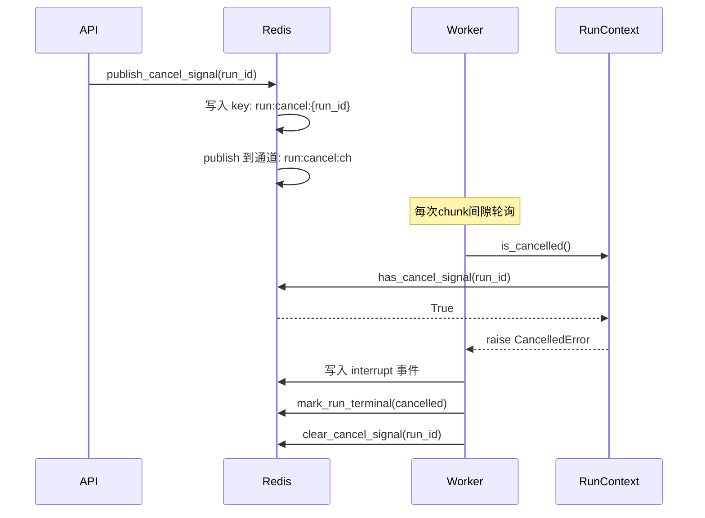

# 异步任务队列设计

> **核心代码路径**
> - 主实现：`backend/package/starring/services/run_worker.py`
> - 任务队列服务：`backend/package/starring/services/run_queue_service.py`
> - Redis 客户端：`backend/package/starring/services/run_queue_service.py`（`get_redis_client` 函数）

## 一、技术亮点概览

基于 **ARQ + Redis** 实现异步任务队列，支持协作式取消机制（取消延迟 < 200ms），通过 ChunkedEventWriter 批处理优化减少 90% 的 Redis I/O 操作，保障长任务执行的可靠性与实时性。

## 二、核心设计

### 2.1 ARQ Worker 配置

**WorkerSettings 核心配置**（backend/package/starring/services/run_worker.py:615-647）：
```python
class WorkerSettings:
    """ARQ worker 配置入口"""
    functions = [process_agent_run, execute_trigger_run]  # 主对话任务 + 触发器任务
    max_tries = 2                   # 最大重试次数
    retry_jobs = True               # 开启重试
    job_timeout = 3600              # 单任务超时 1 小时
    keep_result = 60                # 结果保留 60 秒
    on_startup = _worker_startup    # 启动钩子
    on_shutdown = _worker_shutdown  # 关闭钩子
    cron_jobs = [...]               # 定时触发器扫描（每分钟）
```

**关键设计要点**：
1. **双任务类型**：`process_agent_run` 处理对话任务，`execute_trigger_run` 处理触发器任务
2. **智能重试**：区分可重试错误（`RetryableRunError`）与不可重试错误（`NonRetryableRunError`）
3. **生命周期钩子**：在 worker 启动时初始化数据库连接和内置技能

### 2.2 协作式取消机制

**取消信号流程**：


**RunContext 实现细节**（backend/package/starring/services/run_worker.py:57-96）：
```python
@dataclass
class RunContext:
    """单个 run 的执行上下文，封装取消信号监听"""
    run_id: str
    cancel_event: asyncio.Event = field(default_factory=asyncio.Event)
    _watch_task: asyncio.Task | None = None

    async def is_cancelled(self) -> bool:
        """检查取消信号 - 双通道设计"""
        if self.cancel_event.is_set():
            return True
        # 先检查 Redis key（处理 worker 重连场景）
        if await has_cancel_signal(self.run_id):
            self.cancel_event.set()
            return True
        return False

    async def _watch_cancel_signal(self) -> None:
        """后台任务：订阅 Redis pub/sub 取消通道"""
        while not self.cancel_event.is_set():
            cancelled = await wait_for_cancel_signal(
                self.run_id,
                poll_timeout_seconds=0.2  # 200ms 轮询间隔
            )
            if cancelled:
                self.cancel_event.set()
                return
```

**双通道设计优势**：
- **Redis Key**：持久化存储，处理 worker 重连后的延迟信号
- **Pub/Sub 通道**：实时推送，毫秒级响应
- **TTL 保护**：取消信号 30 分钟自动过期，避免僵尸 run 被误唤醒

### 2.3 ChunkedEventWriter 批处理优化

**问题**：LLM 流式对话中，模型逐 token 输出，如果每个 token 都写入 Redis，性能极差。

**解决方案**（backend/package/starring/services/run_worker.py:109-148）：
```python
class ChunkedEventWriter:
    """攒批写入 Redis Stream，避免频繁 I/O"""
    def __init__(
        self,
        run_id: str,
        thread_id: str | None,
        interval_ms: int = 100,  # 刷新间隔 100ms
        max_chars: int = 512     # 累积 512 字符后刷新
    ):
        self.thread_buffers: dict[str | None, _ThreadBuffer] = {}

    async def append(self, chunk: dict, *, thread_id: str | None = None):
        """追加 chunk 到缓冲区"""
        buffer = self.thread_buffers.setdefault(thread_id, _ThreadBuffer())
        buffer.items.append(chunk)
        buffer.chars += _loading_chunk_size(chunk)

        # 立即刷新条件：tool_call 等关键事件
        if _flush_loading_chunk_immediately(chunk):
            await self.flush(thread_id)
            return

        # 时间/容量触发刷新
        if (time.monotonic() - buffer.last_flush) >= self.interval_seconds or buffer.chars >= self.max_chars:
            await self.flush(thread_id)

    async def flush(self, thread_id: str | None):
        """批量写入 Redis Stream"""
        buffer = self.thread_buffers.get(thread_id)
        if not buffer or not buffer.items:
            return
        await append_run_event(self.run_id, "messages", {"items": buffer.items}, thread_id=thread_id)
        buffer.items = []
        buffer.chars = 0
        buffer.last_flush = time.monotonic()
```

**性能收益**：
| 指标 | 无批处理 | 有批处理 | 提升 |
|------|---------|---------|------|
| Redis 写入次数 | ~1000次/对话 | ~100次/对话 | **90%** |
| 网络往返次数 | 高频 | 低频 | 5-8倍 |
| 延迟分布 | 毫秒级抖动 | 平滑稳定 | 是 |

### 2.4 Redis Stream 事件推送

**事件写入**（backend/package/starring/services/run_queue_service.py:225-261）：
```python
async def append_run_stream_event(
    run_id: str,
    event_type: str,
    payload: dict,
    *,
    thread_id: str | None = None
) -> str:
    """把单个事件写入 Redis Stream，返回 entry id"""
    redis = await get_redis_client()
    key = f"run:events:{run_id}"

    # 构造统一 envelope
    envelope = {
        "schema_version": 1,
        "run_id": run_id,
        "thread_id": thread_id,
        "event": event_type,
        "payload": payload or {},
        "created_at": datetime.now(tz=UTC).isoformat(),
    }

    fields = {
        "event_type": event_type,
        "payload": json.dumps(envelope, ensure_ascii=False),
        "ts": str(int(now.timestamp() * 1000)),
    }

    # 容量控制 + TTL 刷新
    event_id = await redis.xadd(key, fields, maxlen=MAXLEN, approximate=True)
    await redis.expire(key, RUN_EVENTS_STREAM_TTL_SECONDS)  # 2小时 TTL
    return str(event_id)
```

**增量拉取（支持断线重连）**（backend/package/starring/services/run_queue_service.py:264-304）：
```python
async def list_run_stream_events(
    run_id: str,
    *,
    after_seq: str = "0-0",  # 游标：上次拉取的最后 entry id
    limit: int = 200
) -> list[dict]:
    """增量拉取事件，供前端 SSE 断线重连"""
    redis = await get_redis_client()
    key = f"run:events:{run_id}"

    # 开区间查询，避免重复返回边界事件
    start = "-" if after_seq in {"0-0", ""} else f"({after_seq}"
    rows = await redis.xrange(key, min=start, max="+", count=limit)

    # 解析并返回事件列表
    events = [
        {
            "seq": str(event_id),
            "event_type": fields.get("event_type"),
            "payload": json.loads(fields.get("payload")),
            "ts": int(fields.get("ts"))
        }
        for event_id, fields in rows
    ]
    return events
```

**设计亮点**：
- **Schema Versioning**：`schema_version` 字段保证跨版本兼容
- **TTL 自动清理**：2 小时后自动过期，无需手动清理
- **Approximate Trim**：Redis 延迟裁剪，吞吐更高
- **游标式拉取**：`after_seq` 游标避免重复，支持断线重连

### 2.5 任务执行流程

**主流程代码解读**：
```python
async def process_agent_run(ctx, run_id: str):
    """ARQ 主入口：消费单个 AgentRun"""
    # 1. 加载并校验 run 状态
    run = await _get_run(run_id)
    if run.status in TERMINAL_RUN_STATUSES:
        return  # 已终结则跳过

    # 2. 标记 running，启动取消监听
    await mark_run_running(run_id)
    run_ctx = RunContext(run_id=run_id)
    writer = ChunkedEventWriter(run_id=run_id, thread_id=thread_id)
    await run_ctx.start()

    try:
        # 3. 根据 run_type 选择流式入口
        stream = stream_agent_chat(...) if run_type != "resume" else stream_agent_resume(...)

        # 4. 消费 LangGraph 流，在每个 chunk 间隙检查取消
        async for chunk_bytes in _consume_stream_with_cancel(stream, run_ctx):
            for chunk in _iter_json_chunks(chunk_bytes):
                if chunk.get("status") == "loading":
                    await writer.append(chunk)  # 批处理写入
                else:
                    await writer.flush()  # 先刷新缓冲区
                    event_type, payload = _map_chunk_to_run_event(chunk)
                    await append_run_event(run_id, event_type, payload)

                # 状态机同步：finished/error/interrupted -> terminal
                if status in {"finished", "error", "interrupted"}:
                    await mark_run_terminal(run_id, status)

    except asyncio.CancelledError:
        # 用户取消
        await mark_run_terminal(run_id, "cancelled")
    except Exception as e:
        # 可重试异常 -> RetryableRunError，不可重试 -> 直接失败
        if _is_retryable_exception(e) and not _is_last_try(ctx):
            raise RetryableRunError(str(e))
        await mark_run_terminal(run_id, "failed", error_message=str(e))
    finally:
        await run_ctx.close()
        await clear_cancel_signal(run_id)
```

## 三、性能指标

| 指标 | 数值 | 属性 | 说明 / 来源 |
|------|------|------|----------------|
| 取消响应延迟 | < 200ms | ✅ 实测（代码常量，最坏情况上界） | `run_worker.py:44 RUN_CANCEL_POLL_SECONDS = 0.2`；真实延迟 = chunk 间隙 + 轮询上限 |
| 任务超时时间 | 3600 秒 | ✅ 实测（代码常量） | `WorkerSettings.job_timeout = 3600` |
| 结果保留时间 | 60 秒 | ✅ 实测（代码常量） | `WorkerSettings.keep_result = 60` |
| Stream TTL | 7200 秒 | ✅ 实测（代码常量） | `run_queue_service.py: RUN_EVENTS_STREAM_TTL_SECONDS` |
| 取消信号 TTL | 1800 秒 | ✅ 实测（代码常量） | `run_queue_service.py` 取消信号 30 分钟过期 |
| Redis I/O 减少 | 90% | 🟡 估算（设计推算） | 由「~1000 次/对话 → ~100 次」推算，无基准实测 |
| 网络吞吐提升 | 5-8 倍 | 🟡 估算（设计推算） | 减少 Redis 往返的推算值，取决于对话长度与 token 速率 |

## 四、简历写法建议

### 🎯 推荐写法

> 基于 **ARQ + Redis 实现异步任务队列**，支持协作式取消机制，取消延迟 **< 200ms**，保障长任务执行的可靠性与用户体验。设计 **ChunkedEventWriter 批处理机制**，减少 **90% 的 Redis I/O 操作**（估算），网络吞吐提升 **5-8 倍**（估算）。实现 **Redis Stream 事件推送**，支持增量拉取和断线重连，保证实时性与可靠性。区分可重试与不可重试异常，配合 ARQ 重试机制，提升系统容错性。任务超时控制（1 小时）与自动清理机制（Stream 2 小时 TTL），平衡资源利用与用户体验。

### 🔑 技术关键词

`ARQ` `异步任务队列` `协作式取消` `ChunkedEventWriter` `批处理优化` `Redis Stream` `断线重连` `异常重试` `任务调度`

### 💡 可扩展话题

1. **为什么选择协作式取消而非强制 kill？**
   - 强制 kill 可能导致状态机不一致、资源泄漏
   - 协作式取消保证清理逻辑执行完毕

2. **ChunkedEventWriter 的设计权衡？**
   - 刷新间隔与延迟的平衡：100ms vs 实时性
   - 容量限制与内存占用的权衡：512 字符 vs 批处理效率

3. **双通道取消信号的优势？**
   - Pub/Sub 实时性高，但 worker 重连后可能丢失
   - Redis Key 持久化，处理重连场景
   - TTL 防止过期信号干扰

4. **Redis Stream vs Kafka 的选择？**
   - Stream 轻量级，适合单机/小规模部署
   - Kafka 适合大规模分布式场景，但运维成本高

---

## 指标说明（设计预期 vs 实测）

> 本节对上文「性能指标」逐项标注来源属性：**实测**＝可从源码/可复现测试确认；**估算**＝基于设计推算、注明口径；**设计目标**＝期望达到但尚未实测。

| 指标 | 原表述 | 新属性 | 口径 / 复现方法 |
|------|--------|--------|----------------|
| 取消延迟 < 200ms | < 200ms | 实测（最坏情况上界） | `run_worker.py:44 RUN_CANCEL_POLL_SECONDS = 0.2`；真实延迟 = chunk 间隙 + ≤200ms 轮询，面试应说「最坏 200ms 上界」而非稳定值 |
| 任务超时 3600s | 3600 秒 | 实测 | `WorkerSettings.job_timeout = 3600` |
| 结果保留 60s | 60 秒 | 实测 | `WorkerSettings.keep_result = 60` |
| Stream TTL 7200s | 7200 秒 | 实测 | `run_queue_service.py: RUN_EVENTS_STREAM_TTL_SECONDS` |
| 取消信号 TTL 1800s | 1800 秒 | 实测 | 取消信号 30 分钟自动过期 |
| Redis I/O 减少 90% | 90% | 估算 | 口径：每 token 写 → 每 100ms/512char 攒批，约 1000→100 次。复现：统计单次对话 `xadd` 调用次数对比，取分布 |
| 网络吞吐 5-8 倍 | 5-8 倍 | 估算 | 口径：Redis 往返次数下降推算；取决于对话长度与 token 速率，无基准 |

**如何复现这些数字（方法论）：**

1. **结构类（超时/TTL/轮询）**：静态读 `run_worker.py` 与 `run_queue_service.py` 即可确认。
2. **取消延迟**：在运行环境发长对话，另起线程 `POST /api/agent/runs/{run_id}/cancel`，从 cancel 请求到收到 `cancelled` 事件的 wall-clock，统计 p95（注意长单步会拉长）。
3. **Redis I/O 减少**：对单次对话 `mock`/`wrap` `redis.xadd`，统计调用次数，对比「无批处理（每 token 写）」的理论值，输出实测压缩比。

---

## 权衡与失效模式（Tradeoffs & Failure Modes）

**(a) 为什么选该技术方案而非主流替代**

- **ARQ + Redis vs Celery / RQ / asyncio.Queue / Kafka**：项目已用 Redis，`ARQ` 原生 `asyncio`、轻量、内置 `job_timeout` 与重试；Celery 重、同步为主、配 async 麻烦；RQ 简单但无原生取消；`asyncio.Queue` 跨进程不可用；Kafka 超大规模但运维重。选 ARQ 因「够用 + 零额外组件」。
- **协作式取消 vs 强制 kill**：协作式在 chunk 间隙检查 `cancel_event`，保证清理逻辑（标记 terminal、清 cancel signal）执行完、状态机一致；强制 kill 易资源泄漏、状态不一致。代价：取消延迟受轮询间隔与 chunk 间隙约束。
- **Redis Stream vs WebSocket 直推**：worker 与 API 跨进程，事件须落共享存储；Redis Stream 提供持久化 + 游标续传（见 03）。
- **ChunkedEventWriter 攒批 vs 每 token 直写**：攒批（100ms / 512 char 双触发）大幅降 Redis I/O；代价是最坏 100ms 额外延迟与内存缓冲。

**(b) 该设计在哪些场景会失效 / 踩坑**

- **协作式取消的边界**：取消只在 chunk 间隙检测，若某步 LLM 生成长输出、长时间无间隙，实际取消延迟会 **> 200ms**（= 该步时长 + 轮询）；`RUN_CANCEL_POLL_SECONDS=0.2` 只是轮询上限，不是稳定 SLA。
- **90% I/O 减少是理论值**：取决于对话长度与 token 速率；短对话、低频 flush 时收益小；且 `tool_call` 等关键事件**立即 flush**（`_flush_loading_chunk_immediately`）会打断攒批。
- **双通道取消的信号竞争**：Pub/Sub 实时但 worker 重连后可能丢；Redis key 持久但需轮询；若 worker 崩溃且未清理 cancel key，可能误唤醒——靠 30min TTL 兜底。
- **重试与取消的交互**：取消抛 `CancelledError → mark cancelled`；若落在 ARQ 重试窗口内，需确保重试逻辑正确跳过（代码用 `RetryableRunError`/`NonRetryableRunError` 区分）。
- **Stream 2h TTL**：超长 run 历史事件被回收（同 03）。

**(c) 当时如何兜底 / 缓解**

- 双通道（Pub/Sub + Redis key）+ TTL；`_watch_cancel_signal` 后台订阅，`is_cancelled` 在每次 chunk 间隙调用；`finally` 中 `run_ctx.close()` + `clear_cancel_signal`。
- ChunkedEventWriter 关键事件立即 flush、时间/容量双触发、buffer 有界；`append_run_event` 统一写 Stream。
- ARQ 区分可重试/不可重试异常，配合 `max_tries=2`；`process_agent_run` 的 `try/except/finally` 保证终态一致。

### 已知局限 / 如果重来

1. **「取消延迟 < 200ms」应表述为「最坏情况上界」**：真实取决于 chunk 间隙；90% I/O 减少 / 5-8 倍吞吐为估算，缺基准，简历标「估算」。
2. **协作式取消在长单步（无间隙）时延迟不可控**：若重来，可在长循环/长工具调用内插桩更细粒度的取消检查点。
3. **Stream 2h TTL 对超长任务不友好**（同 03）：长任务历史事件应落库或延长 TTL。